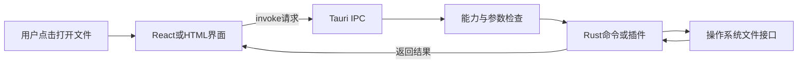
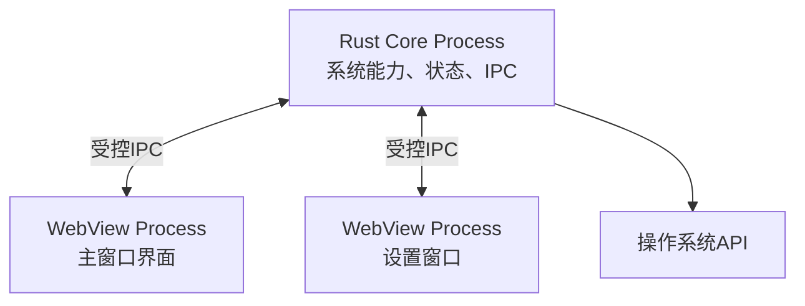
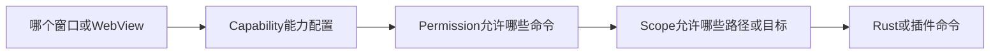
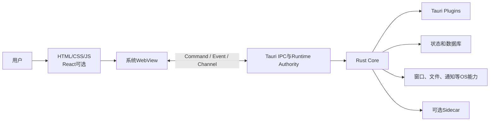

# Tauri跨平台桌面应用架构

> [!summary] 一句话解释
> **Tauri 是一个用 Web 技术制作界面、用 Rust 实现原生核心和系统能力的跨平台应用框架；它通常复用操作系统自带的 WebView，因此安装包往往比把 Chromium 一起打包的 Electron 小。**

Tauri 不是英文缩写，而是项目名称。它主要用于开发 Windows、macOS 和 Linux 桌面应用；Tauri 2 也把 Android 和 iOS 纳入了支持范围，但具体插件是否支持移动端仍需单独检查。

---

## 一、先用“商场前台和后台机房”理解 Tauri

可以把一个 Tauri 应用想成一座商场：

- **WebView（网页视图）**是顾客看到的前台和展示区；
- HTML、CSS、JavaScript、React 等负责前台长什么样、按钮怎样响应；
- **Rust Core（Rust 核心）**是有权接触文件、数据库、窗口和操作系统的后台机房；
- **IPC（Inter-Process Communication，进程间通信）**是前台向后台提交的受控工单；
- **Capability / Permission / Scope（能力、权限、作用域）**规定哪个前台窗口可以申请什么能力，以及允许操作哪些对象。

例如用户点击“打开文件”：



这里的关键不是“网页直接获得了电脑权限”，而是：**网页提出请求，受信任的 Rust 代码决定能否执行。**

---

## 二、Tauri 解决什么问题

普通网页擅长制作跨平台界面，但浏览器为了安全，不允许网页随意：

- 读取任意本地文件；
- 创建系统托盘和原生菜单；
- 控制应用窗口；
- 调用本地数据库；
- 运行本机程序；
- 注册全局快捷键；
- 打包成常见桌面安装程序并自动更新。

传统原生开发能够使用这些功能，但 Windows、macOS、Linux 的开发技术和 API 有很多差异。

Tauri 在中间搭了一座桥：

```text
Web开发方式制作界面
          +
Rust和插件调用本机能力
          +
Tauri负责窗口、IPC、权限、打包等通用工作
```

所以，如果团队已经有 React、Vue、Svelte 或普通 HTML 页面，可以继续复用前端知识，再通过 Rust 或 Tauri 插件补上桌面能力。

---

## 三、Tauri 由哪几层组成

### 1. 前端界面层

前端运行在 [[WebView]] 中，可以使用：

- HTML：界面结构；
- CSS：样式和布局；
- JavaScript 或 [[TypeScript与JavaScript|TypeScript]]：交互逻辑；
- [[React组件化前端开发|React]]、Vue、Svelte、Solid 等框架；
- Vite 等前端开发和构建工具。

Tauri 是 **frontend agnostic（前端无关）** 的：它不强制使用 React。普通 HTML、CSS、JavaScript 也可以制作 Tauri 应用。

### 2. 系统 WebView

WebView 是操作系统提供的、可嵌入应用窗口的网页渲染组件。Tauri 桌面端当前主要使用：

| 平台 | Tauri 使用的 WebView |
|---|---|
| Windows | Microsoft Edge WebView2 |
| macOS | WKWebView |
| Linux | WebKitGTK |

Tauri 通常不会把一整套 Chromium 浏览器内核塞进每个应用，而是在运行时使用系统 WebView。这是它安装包通常较小的重要原因。

但这也带来代价：不同平台的 WebView 版本、CSS 行为、媒体能力和系统集成可能不同，所以仍然需要跨平台测试。

### 3. Tauri IPC 桥梁

**IPC（Inter-Process Communication，进程间通信）**是不同进程之间交换请求和数据的机制。

前端通常通过 `invoke()` 调用 Rust 命令，也可以使用事件和 Channel：

- **Command + invoke**：一次请求对应一次结果，像调用函数或请求 API；
- **Event（事件）**：松耦合地通知“某件事发生了”，适合状态变化广播；
- **Channel（通道）**：连续传输数据，适合进度、流式内容或较大数据流。

IPC 是一条 **trust boundary（信任边界）**。前端传来的文件路径、网址、命令参数和用户身份都不能盲目信任。

### 4. Rust 核心层

核心进程使用 [[常见编程语言及其用途#Rust：高性能与内存安全|Rust]] 编写，通常负责：

- 创建窗口、菜单、托盘和通知；
- 管理数据库连接、配置等全局状态；
- 访问文件系统和操作系统 API；
- 完成性能敏感或安全敏感的业务逻辑；
- 注册供前端调用的命令；
- 加载插件并管理应用生命周期；
- 统一接收、检查和分发 IPC 请求。

这里经常被口语化地称为“Rust 后端”，但它不一定是通过 HTTP 对外提供服务的 Web 后端。更准确的说法是：**它是运行在用户电脑上的原生核心层。**

### 5. TAO 和 WRY

Tauri 底层还维护两个重要 Rust 库：

- **TAO**：负责跨平台窗口创建、事件循环、菜单和托盘等；
- **WRY**：负责封装各平台 WebView，让上层以较统一的方式创建和控制网页视图。

可以粗略理解为：

```text
Tauri：应用框架、IPC、配置、权限、打包、插件
  ├─ TAO：窗口和事件循环
  └─ WRY：WebView抽象
```

普通应用开发者通常直接使用 Tauri，不需要自己调用 TAO 和 WRY。

---

## 四、Tauri 的进程模型

Tauri 采用多进程架构：

- 一个 Core Process（核心进程）管理应用生命周期和系统能力；
- 一个或多个 WebView Process（网页视图进程）渲染 HTML、CSS 和 JavaScript；
- 核心进程统一路由 IPC。



多进程能提供一定隔离：某个网页视图崩溃不一定等于整个核心逻辑都崩溃；耗时操作也可以避免直接阻塞界面。

> [!warning] 不要把“多进程”理解成固定的进程数量
> WebView 的实际进程拆分受 Windows、macOS、Linux 及其 WebView 实现影响。任务管理器里看到几个进程，不应只靠一句“Tauri 是多进程”来猜。

---

## 五、前端怎样调用 Rust

下面是一个最小的“问候”示例。

### Rust 端：定义并登记命令

```rust
#[tauri::command]
fn greet(name: String) -> Result<String, String> {
    let clean_name = name.trim();

    if clean_name.is_empty() {
        return Err("名字不能为空".into());
    }

    Ok(format!("你好，{clean_name}！"))
}

pub fn run() {
    tauri::Builder::default()
        .invoke_handler(tauri::generate_handler![greet])
        .run(tauri::generate_context!())
        .expect("Tauri应用启动失败");
}
```

这段代码做了三件事：

1. `#[tauri::command]` 把 Rust 函数声明成 Tauri 命令；
2. 函数检查名字是否为空；
3. `generate_handler![greet]` 把命令登记到 IPC 处理器。

### TypeScript 端：发起调用

```ts
import { invoke } from '@tauri-apps/api/core'

const message = await invoke<string>('greet', { name: '小明' })
console.log(message)
```

数据流是：

```text
TypeScript对象
→ IPC序列化
→ Rust参数反序列化
→ 执行greet
→ 序列化Result
→ Promise成功或失败
```

`invoke()` 返回 Promise，所以前端可以用 `await` 等待结果。Rust 参数通常需要能够被 Serde 反序列化，返回值需要能够被序列化。

这个调用看起来像普通函数，但实际上跨越了进程和信任边界，因此要考虑：

- 参数是否合法；
- 调用者是否有权限；
- 文件路径是否越界；
- 操作是否可能阻塞；
- 错误怎样安全返回；
- 大量数据是否适合用 JSON 往返传输。

---

## 六、Capability、Permission、Scope 是什么

Tauri 2 使用 ACL 思路限制 WebView 可以调用哪些核心或插件能力。这里的 **ACL（Access Control List，访问控制列表）** 是 Tauri 应用内部的授权规则，不等同于 [[Windows ACL与NTFS权限|Windows NTFS ACL]]。

### Capability：给哪个窗口发哪组通行证

Capability（能力配置）把一组权限授予指定窗口或 WebView。例如：

- 主窗口允许读取某个资料目录；
- 设置窗口只允许读取和保存设置；
- 登录窗口不允许使用 Shell；
- 本地内容可以调用命令，远程页面不允许调用。

Capability 文件通常放在：

```text
src-tauri/capabilities/
```

### Permission：允许或拒绝哪项命令

Permission（权限）描述某条命令是否可以被前端访问。例如“允许读取文件”或“拒绝启动进程”。插件命令默认是否开放、默认权限包含什么，必须查看该插件的权限说明，不能只因为安装了插件就猜测。

### Scope：把允许范围继续缩小

Scope（作用域）限制命令能够操作的具体对象。例如：

```text
允许：用户文档目录下的 *.md
拒绝：用户文档目录下的 secret 文件夹
```

这比单纯的“允许读取文件”更安全。

### 三者的关系



> [!important] 权限配置不是输入校验的替代品
> Rust 命令本身仍要检查参数、路径、身份和业务规则。Rust 核心及插件代码通常拥有真实系统权限，一旦受信任代码写错，Tauri 不会自动替你消除所有风险。

---

## 七、Tauri 插件是什么

Tauri Core 刻意不把所有功能都塞进核心，而是通过插件增加能力。常见插件可能提供：

- 文件系统；
- 系统对话框；
- Shell 和外部程序；
- HTTP 请求；
- 剪贴板；
- 全局快捷键；
- 通知；
- 本地存储或数据库；
- 自动更新。

插件通常包含：

```text
Rust crate：真正调用原生能力
可选的npm包：给JavaScript/TypeScript提供易用API
权限定义：声明哪些命令能够被前端调用
平台实现：桌面端Rust，以及移动端可能使用Kotlin或Swift
```

插件分为官方插件、社区插件和团队自建插件。选择社区插件时要检查：

- 是否持续维护；
- 支持哪些平台；
- 要求开放哪些权限；
- Rust 和 npm 依赖是否可信；
- 是否会访问网络、文件或启动外部进程；
- 是否与当前 Tauri 大版本兼容。

Tauri 的插件化和 [[DeepSeek Harness、Everything is a Plugin与Cordis|Everything is a Plugin]] 不是同一套体系。两者都使用“核心较小、能力可插拔”的思想，但服务的对象、插件接口、生命周期和安全模型不同。

---

## 八、Sidecar 是什么

**[[Sidecar边车程序与辅助进程|Sidecar（边车程序）]]**是随 Tauri 应用一起打包的外部可执行文件。它在独立进程中为主程序提供辅助能力，可以用 Rust、Python、Go、Java 或其他语言开发。

例如团队已有一个 Python 数据处理程序：

```text
Tauri主程序
├─ WebView界面
├─ Rust核心
└─ Python打包出的数据处理程序.exe  ← sidecar
```

这样用户不必自己安装 Python，也能使用原有程序。

Tauri 通过 `bundle.externalBin` 把 Sidecar 放入安装包，再由 Shell 插件的 `Command.sidecar()` 启动它。`execute()` 适合等待短任务完成；`spawn()` 适合需要持续收发数据的长驻进程。Tauri 2 还要求在 Capability 中只开放所需的 `shell:allow-execute` 或 `shell:allow-spawn` 权限。

Sidecar 不一定监听网络端口。主程序可以通过命令参数、stdin/stdout 管道、Named Pipe、Unix Socket 或本地 HTTP 与它通信。

它的主要代价是：

- 每个平台、CPU 架构可能需要不同二进制文件；
- 安装包会变大；
- 要设计通信协议、超时和版本兼容；
- 需要校验参数，防止命令注入；
- 需要处理进程启动、退出、崩溃和日志；
- 需要一起签名、更新和做供应链审查。

因此，“用了 Tauri”并不代表整个应用只能用 Rust。详细的通信方式、Python 打包、端口选择、生命周期和安全检查参见 [[Sidecar边车程序与辅助进程]]。

---

## 九、Tauri 与 Electron 的区别

[[Electron桌面应用架构|Electron]] 和 Tauri 都能用 Web 技术制作桌面界面，但核心路线不同：

| 维度 | Tauri | Electron |
|---|---|---|
| 界面 | HTML/CSS/JS 运行在系统 WebView | HTML/CSS/JS 运行在随应用分发的 Chromium |
| 原生核心 | 主要使用 Rust 和 Tauri 插件 | 主要使用 Node.js 和 Electron API |
| 网页运行时 | 通常复用系统组件 | 通常把特定 Chromium 一起打包 |
| 包体积 | 通常较小，但取决于依赖、资源和 sidecar | 通常较大，因为包含 Chromium 和 Node.js |
| 跨平台一致性 | 受不同系统 WebView 差异影响 | Chromium 版本由应用控制，通常更一致 |
| 本机能力边界 | 通过 IPC、Capability、Permission、Scope 显式暴露 | 通过 Main、Preload、contextBridge、IPC 隔离 |
| 开发语言门槛 | Web 技术之外，深入原生逻辑通常要学 Rust | 熟悉 JavaScript/TypeScript 和 Node.js 即可完成很多功能 |
| Node.js 生态 | 不能把所有 Node 包直接当浏览器代码使用 | 主进程可直接利用大量 Node.js 包 |
| 更新 Web 内核 | 更多依赖操作系统更新 WebView | 跟随应用升级 Electron/Chromium |

### 什么时候更适合 Tauri

- 很在意安装包体积；
- 团队愿意使用 Rust；
- 希望明确缩小前端可访问的系统能力；
- 界面主要是标准 Web UI；
- 原生核心对性能、内存安全或可控性有较高要求。

### 什么时候更适合 Electron

- 团队主要是 JavaScript/TypeScript 开发者；
- 大量依赖 Node.js 生态；
- 更重视各平台使用同一 Chromium 版本；
- 已有成熟的 Electron 代码、工具链和运维经验；
- 包体积不是首要问题。

> [!note] 结论不是“Tauri 一定比 Electron 好”
> Tauri 把一部分成本从“携带浏览器内核”换成了“处理系统 WebView 差异、Rust 编译、原生依赖和跨平台测试”。选择框架要看团队、产品和交付要求。

---

## 十、Tauri、React、Rust、WebView 到底是什么关系

这几个名称经常一起出现，但它们不在同一层：

| 名称 | 它是什么 | 在 Tauri 中负责什么 |
|---|---|---|
| React | JavaScript 用户界面库 | 可选的前端组件和状态组织方式 |
| HTML/CSS/JS | Web 基础技术 | 描述和运行界面 |
| WebView | 系统网页显示组件 | 真正渲染前端界面 |
| Rust | 编程语言 | 编写原生核心、命令和插件 |
| Tauri | 跨平台应用框架 | 把窗口、WebView、Rust、IPC、权限和打包组织起来 |

所以：

```text
React不是Tauri
Tauri也不是React的插件
Rust不负责自动绘制React界面
WebView不等于完整浏览器
```

一个常见组合是：

```text
React + TypeScript + Vite  → 前端界面
Tauri API + IPC            → 前后端桥梁
Rust + Tauri Plugins       → 本机能力
WebView                    → 显示界面
```

---

## 十一、典型项目目录

一个常见项目大致如下：

```text
my-app/
├─ src/                         # React/Vue/普通Web前端代码
├─ public/                      # 前端静态资源
├─ package.json                 # npm/pnpm依赖和脚本
├─ vite.config.ts               # Vite配置（如果使用Vite）
└─ src-tauri/
   ├─ Cargo.toml                # Rust依赖和包信息
   ├─ tauri.conf.json           # 应用、窗口、构建、打包等配置
   ├─ capabilities/             # Tauri 2能力与权限配置
   ├─ icons/                    # 应用图标
   └─ src/
      ├─ main.rs                # 桌面程序入口
      └─ lib.rs                 # Builder、命令、插件和共享启动逻辑
```

需要记住两半：

```text
项目根目录的Web部分 → 界面
src-tauri/              → Rust原生应用部分
```

---

## 十二、开发和打包流程

### 开发阶段

如果使用 React + TypeScript + Vite，通常需要：

- Rust 工具链；
- 当前平台的系统开发依赖；
- Node.js；
- npm、pnpm 或其他包管理器；
- Tauri CLI。

常见开发命令：

```powershell
pnpm tauri dev
```

它通常会启动前端开发服务器、编译 Rust 核心并打开桌面窗口。前端改动可以利用 Vite 的 [[Webpack与HMR#HMR 是什么|HMR]] 快速反馈；Rust 改动需要重新编译相关代码，体验和只替换网页模块的 HMR 不完全相同。

### 发布阶段

常见构建命令：

```powershell
pnpm tauri build
```

Tauri 会把前端静态资源、Rust 程序、配置和必要资源打成平台制品，例如 Windows 的 MSI 或 NSIS 安装程序。

跨平台并不等于“一台 Windows 电脑无条件生成所有平台的正式安装包”。代码签名、系统 SDK、原生依赖和商店规则通常要求分别使用合适的平台或 CI 构建机。

### 签名和更新

正式分发还要考虑 [[软件供应链：代码签名、SBOM与发布门禁|代码签名]]：

- Windows 签名用于证明发布者身份，并减少 SmartScreen 不受信任警告；
- macOS 通常涉及签名和 notarization（公证）；
- 自动更新插件要验证更新包签名；
- 更新私钥必须妥善保存，不能提交到 Git 仓库。

Tauri 官方更新器要求验证更新签名，这和操作系统对应用安装包的代码签名有关联，但不是完全同一件事。

---

## 十三、Tauri 为什么经常说“体积小”

Electron 通常随应用带上 Chromium 和 Node.js；Tauri 通常使用操作系统已有的 WebView，并把 Rust 代码编译成本机程序，所以最小应用可能明显更小。

但“更小”必须看完整交付物：

```text
实际大小
= Rust可执行文件
+ 前端资源和图片
+ Rust依赖和插件
+ 原生动态库
+ sidecar外部程序
+ 安装器开销
+ 某些平台需要的WebView运行时处理
```

因此不能用某个“Hello World”数字保证真实产品的大小。

另一个容易忽略的事实是：WebView 并没有消失，而是已经由操作系统安装和维护。Tauri 应用本身少带了一份，不等于电脑上完全没有这部分运行时。

---

## 十四、安全重点

### 1. 把 WebView 当成较低信任区域

界面可能受到 XSS（Cross-Site Scripting，跨站脚本）等 Web 漏洞影响。不要把密码、私钥和长期凭据直接放在前端代码里。

### 2. 尽量使用本地打包资源

直接加载远程网页或 CDN 脚本，会把远程内容供应方也带进信任边界。远程页面一旦被篡改，可能尝试调用暴露给它的本机能力。

### 3. 配置 CSP

**CSP（Content Security Policy，内容安全策略）**限制网页能从哪些来源加载脚本、样式、图片和网络内容，有助于降低 XSS 的影响。CSP 应根据应用实际需要尽量收紧。

### 4. 最小权限

只给指定窗口开放真正需要的命令和路径：

```text
需要读取文档目录
≠ 允许读取整块磁盘

需要启动一个固定sidecar
≠ 允许执行任意Shell命令
```

### 5. 所有跨边界参数都要检查

特别注意：

- `..` 等路径穿越；
- Shell 参数拼接；
- 任意 URL 和自定义协议；
- 超大输入导致内存或性能问题；
- 重复调用带来的副作用；
- 窗口、来源和用户身份是否匹配。

### 6. 依赖也属于攻击面

Rust crate、npm 包、Tauri 插件、sidecar 和 CI 发布流程都属于 [[软件供应链：代码签名、SBOM与发布门禁|软件供应链]]。Tauri 的安全设计不能自动保证第三方依赖和业务代码绝对安全。

---

## 十五、性能上要注意什么

- 不要在核心线程中执行长时间同步计算；
- 文件、网络和数据库操作优先使用合适的异步方式；
- 不要通过 IPC 高频传递大量 JSON；
- 流式或大块二进制数据考虑 Channel 或专门的数据路径；
- 前端卡顿仍需检查 React 渲染、DOM 数量、CSS 和 WebView 性能；
- Rust 很快不代表整个应用自动很快，架构、IO、算法和界面仍然重要；
- 多窗口会增加 WebView、内存和状态同步成本。

Tauri 可以用 `manage()` 和 `tauri::State` 管理数据库连接、配置等共享状态。共享可变状态仍需要正确的并发同步，不能因为 Rust 有内存安全就忽略业务层竞争条件。

---

## 十六、适合做什么

Tauri 常见于：

- Markdown 编辑器和知识管理工具；
- 开发者工具；
- 本地文件管理和批处理工具；
- 数据库客户端；
- 下载器和同步工具；
- 带系统托盘的常驻工具；
- 已有 Web 前端、又需要桌面能力的产品；
- 需要调用本地 Rust、Python 或其他 sidecar 的应用。

它未必最适合：

- 强依赖统一 Chromium 特性的复杂浏览器类产品；
- 团队完全不愿维护 Rust 和原生构建环境；
- 需要非常原生、平台定制化 UI 的应用；
- 游戏或重度 3D 图形应用；
- 大量依赖只能在 Node.js 主进程工作的现有方案。

---

## 十七、常见误区

### 误区 1：Tauri 是一种编程语言

不是。Tauri 是框架；Rust、JavaScript、TypeScript 才是编程语言。

### 误区 2：Tauri 就是 Rust 版 React

不是。React 组织界面组件，Tauri 把 Web 界面和本机应用能力连接起来。两者可以组合，也可以不用 React。

### 误区 3：Tauri 完全不需要浏览器内核

不准确。它仍需要 WebView 渲染网页，只是通常复用系统提供的 WebView，不随每个应用重复打包完整 Chromium。

### 误区 4：包更小，所以内存、速度和开发成本一定全面更优

不一定。真实表现取决于界面、插件、Rust 代码、数据量、WebView、sidecar 和平台差异。

### 误区 5：Rust 天生安全，所以 Tauri 应用不会有漏洞

Rust 主要帮助减少内存安全问题，但不会自动消除 XSS、权限过宽、路径穿越、命令注入、业务越权和供应链问题。

### 误区 6：前端可以直接调用任意 Rust 函数

不是。函数需要注册成命令，并通过 Tauri IPC 和相应授权边界调用；输入还必须由命令再次验证。

### 误区 7：跨平台就是写一次、永远不用测试其他系统

不是。WebView、文件路径、窗口行为、权限、签名、安装器和插件支持都可能存在平台差异。

### 误区 8：Tauri 的 Capability 等于 Windows UAC

不是。Capability 是应用内部限制 WebView 能调用什么；[[Windows UAC与管理员权限提升|UAC]] 决定 Windows 进程何时用提升后的管理员令牌运行。两层可以同时存在。

---

## 十八、给初学者的学习顺序

1. 先学 [[HTML]] 和 [[CSS]]，能做一个静态页面；
2. 学 JavaScript/TypeScript，理解变量、函数、Promise、模块；
3. 学 [[React组件化前端开发|React]] 或先用普通 Web 前端；
4. 理解 [[WebView]]、[[进程、线程、多进程与多线程|进程]] 和 IPC；
5. 学 Rust 的所有权、`Result`、结构体、模块和异步基础；
6. 创建最小 Tauri 项目，只做一个 `greet` 命令；
7. 再做文件选择、保存设置、本地数据库和多窗口；
8. 最后学习 Capability、CSP、签名、更新和跨平台 CI。

适合初学者的第一个练习：

```text
“本地 Markdown 便签”

界面：输入标题和正文
Rust：只允许把文件保存到指定笔记目录
IPC：save_note(title, body)
权限：不开放任意Shell，不允许任意路径
结果：界面显示保存成功或失败
```

这个练习能同时理解前端、IPC、Rust、文件系统和最小权限。

---

## 十九、一张图记住 Tauri



最重要的边界是：

```text
Web界面负责展示和交互
Rust核心负责受信任的本机能力
IPC和权限系统负责控制二者怎样连接
```

---

## 二十、关联概念

- [[WebView]]：Tauri 界面实际运行的网页容器。
- [[Electron桌面应用架构]]：另一条主流 Web 桌面应用路线。
- [[React组件化前端开发]]：Tauri 可选的前端界面库。
- [[TypeScript与JavaScript]]：常见前端语言。
- [[常见编程语言及其用途#Rust：高性能与内存安全|Rust]]：Tauri 原生核心常用语言。
- [[Node.js与pnpm]]：安装前端依赖、运行 Tauri CLI 和项目脚本的常见工具。
- [[Webpack与HMR]]：理解前端构建和开发时快速更新。
- [[进程、线程、多进程与多线程]]：理解 Core 与 WebView 进程。
- [[SDK与API]]：理解 Tauri API、插件 API 和操作系统 API。
- [[Windows ACL与NTFS权限]]：区分操作系统文件 ACL 与 Tauri 应用 ACL。
- [[Windows UAC与管理员权限提升]]：区分应用内部授权与进程管理员权限。
- [[软件供应链：代码签名、SBOM与发布门禁]]：理解安装包签名、依赖和发布安全。

---

## 参考资料

以下内容于 **2026-08-29** 按 Tauri 2 官方文档核对：

- [Tauri Architecture](https://v2.tauri.app/concept/architecture/)
- [Tauri Process Model](https://v2.tauri.app/concept/process-model/)
- [Inter-Process Communication](https://v2.tauri.app/concept/inter-process-communication/)
- [Calling Rust from the Frontend](https://v2.tauri.app/develop/calling-rust/)
- [Capabilities](https://v2.tauri.app/security/capabilities/)
- [Permissions](https://v2.tauri.app/security/permissions/)
- [Runtime Authority](https://v2.tauri.app/security/runtime-authority/)
- [Content Security Policy](https://v2.tauri.app/security/csp/)
- [Create a Project](https://v2.tauri.app/start/create-project/)
- [Prerequisites](https://v2.tauri.app/start/prerequisites/)
- [Plugin Development](https://v2.tauri.app/develop/plugins/)
- [Embedding External Binaries / Sidecar](https://v2.tauri.app/develop/sidecar/)
- [Distribute](https://v2.tauri.app/distribute/)
- [Updater](https://v2.tauri.app/plugin/updater/)
