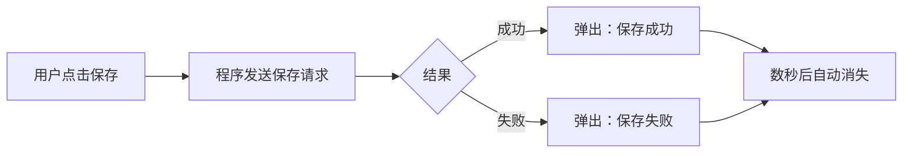

# Toast 提示

## 一句话解释

开发者说“**弹个 Toast**”，通常是指：在界面的角落、顶部或底部短暂显示一条小提示，过一会儿自动消失，而且一般不阻止用户继续操作。

可以把它想象成烤面包机里的面包轻轻弹出来：出现一下，引起注意，然后离开。

## 常见例子

- “保存成功”
- “链接已复制”
- “消息发送中”
- “网络连接失败，请稍后重试”

伪代码可能长这样：

```javascript
toast.success("保存成功")
toast.error("上传失败")
```

这里的 `toast` 通常来自某个 UI 组件库。不同框架写法不同，但产品需求“弹个 Toast”的含义基本相同。

## 它在交互流程中的位置



Toast 是**结果反馈**，不是实际的保存逻辑。即使 Toast 显示“保存成功”，也应该以服务器或程序真实返回的成功结果为依据。

## Toast 和其他提示组件的区别

| 组件 | 是否阻挡操作 | 是否自动消失 | 适合场景 |
|---|---:|---:|---|
| Toast | 通常不阻挡 | 通常会 | 短小、低风险的结果反馈 |
| Snackbar | 通常不阻挡 | 常会 | 带“撤销”等简单操作的反馈 |
| Dialog/Modal 对话框 | 会 | 通常不会 | 需要确认、填写或作出重要决定 |
| Notification 系统通知 | 不一定 | 进入通知中心 | 应用在后台时的重要消息 |
| Tooltip 工具提示 | 不阻挡 | 移开鼠标常消失 | 解释按钮或图标的含义 |
| Alert 页面警告 | 视设计而定 | 通常保留 | 需要持续可见的重要问题 |

## 什么时候适合用 Toast

- 操作结果很简单；
- 用户不需要立即作出决定；
- 提示消失后不会造成严重损失；
- 页面本身仍能清楚显示最终状态。

## 什么时候不应该只用 Toast

- 删除账户、付款失败等重要信息；
- 用户必须阅读很长的说明；
- 用户需要点击按钮解决问题；
- 表单字段填写错误，需要明确指出是哪一项；
- 提示消失后用户就再也找不到错误原因。

重要信息应使用表单错误、持续警告或对话框。Toast 适合“轻反馈”，不适合承载关键流程。

## 初学者容易忽略的细节

- 文案要短，最好一眼读完。
- 不要同时弹出很多条，避免堆叠遮挡。
- 不要只靠红色或绿色表达成功与失败，要配合文字或图标。
- 自动消失时间不能短到无法阅读。
- 要考虑屏幕阅读器等无障碍功能。
- 如果失败可以重试或撤销，Snackbar 往往比纯 Toast 更合适。

## 和其他笔记的关系

- Toast 的颜色、位置和动画可以由 [[CSS]] 控制。
- 是否显示 Toast、显示哪条文字，属于 [[渲染逻辑]] 和交互逻辑的一部分。
- Toast 可能根据 [[SDK与API|API]] 请求的成功或失败结果出现。

## 参考资料

- [Android Developers：Toasts overview](https://developer.android.com/guide/topics/ui/notifiers/toasts)
