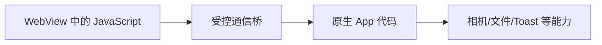

# WebView

## 一句话解释

**WebView** 是嵌入手机或桌面应用内部的网页显示组件。它像应用里放置的一个“简化浏览器窗口”，可以加载和显示 [[HTML]]、[[CSS]] 和 JavaScript，但通常没有完整浏览器的地址栏、标签页和导航界面。

## 一个常见场景

某个 App 打开“用户协议”时，没有跳到 Chrome 或 Safari，而是在 App 自己的页面中显示网页。这块显示网页的区域就可能是 WebView。

```text
原生 App 界面
├── 顶部原生导航栏
└── WebView
    └── 加载用户协议网页
```

WebView 可以加载：

- 互联网上的网页 URL；
- 打包在 App 内部的本地 HTML；
- 程序动态生成的 HTML 字符串。

## WebView 与浏览器的区别

| 维度 | 完整浏览器 | WebView |
|---|---|---|
| 所在位置 | 独立应用 | 嵌入另一个应用内部 |
| 地址栏/标签页 | 通常有 | 通常没有，需要宿主 App 自己实现 |
| 网页渲染 | 有完整浏览器引擎 | 使用平台提供的 Web 渲染组件 |
| 导航控制 | 浏览器负责 | 宿主 App 可以拦截和决定 |
| 与本机功能通信 | 受浏览器安全模型限制 | 可通过受控 Bridge 与原生代码通信 |
| 安全责任 | 浏览器和网站共同承担 | 宿主 App 还要正确配置 WebView |

WebView 不是在页面中嵌入另一个页面的 `<iframe>`。`iframe` 发生在网页内部；WebView 是原生 App 中嵌入 Web 内容。

## WebView、原生界面和混合应用

### 原生界面

使用 Android、iOS 或 Windows 原生 UI 组件构建。通常能得到更自然的平台体验和更直接的设备能力访问。

### WebView 界面

使用 Web 技术开发页面，再放入 App。Web 开发人员可以复用 HTML/CSS/JavaScript 代码。

### Hybrid App（混合应用）

一部分使用原生组件，一部分使用 WebView。也可能整个主要界面都由 WebView 渲染，再通过桥接访问相机、文件等原生功能。

## 为什么使用 WebView

- 在 App 中显示帮助、协议、活动页等频繁更新的内容；
- 复用已有网站或 Web 前端；
- 多个平台共享部分界面代码；
- 快速迭代无需修改全部原生界面；
- 在原生功能周围嵌入复杂的 Web 内容。

## WebView 的代价

- 性能和内存占用可能不如精心实现的原生界面；
- 页面与原生组件的视觉和手势可能不一致；
- 返回键、文件上传、权限、弹窗等行为需要额外处理；
- 不同系统版本的 WebView 能力可能不同；
- 网络不好时远程页面可能加载失败；
- Web 与原生之间的调试更复杂；
- 配置错误会带来明显安全风险。

## JavaScript Bridge 是什么

网页里的 JavaScript 默认不能随意调用原生 App 的内部功能。为了让两边通信，可以建立受控的 **Bridge（桥）**：



例如网页调用：

```javascript
AppBridge.showToast("保存成功")
```

宿主 App 收到调用后，再用原生能力弹出 [[Toast提示]]。

Bridge 必须把“允许调用哪些方法、允许哪些网页调用、传入数据怎样验证”定义清楚。

## 重要安全问题

WebView 同时连接了“网络网页”和“原生 App 权限”，因此安全边界非常重要：

- 优先加载可信的 [[TCP、HTTP、HTTPS与WebSocket|HTTPS]] 页面；
- 对允许访问的域名使用白名单；
- 不要把强大的原生方法暴露给不可信网页；
- 对 Bridge 的方法和参数做严格校验；
- 外部链接通常交给系统浏览器打开；
- 谨慎启用 JavaScript、文件访问、摄像头和定位权限；
- 不忽略 TLS 证书错误；
- 防止不可信 HTML 注入和跨站脚本攻击；
- 对登录 Cookie、Token 和本地存储进行安全设计。

Android 官方明确警告：把 JavaScript 接口暴露给不可信 HTML，可能让攻击者调用宿主 App 的原生代码。

## 与 Electron、React Native 的区别

- **Electron**：用 Chromium 和 Node.js 构建整个桌面应用，通常不只是页面里的一小块 WebView。
- **React Native**：React 代码主要驱动原生 UI 组件，不等于把网页塞进 WebView。
- **WebView**：具体的内嵌 Web 内容容器。

不同框架内部实现可能变化，不能仅凭“界面用 JavaScript 写”就判断它一定是 WebView。

## 和其他概念的关系

- WebView 加载并解析 [[HTML]]、[[CSS]] 和 JavaScript。
- 远程页面通常通过 [[TCP、HTTP、HTTPS与WebSocket|HTTPS]] 加载。
- 页面请求后端数据时会使用 [[SDK与API|API]]。
- 实时聊天页面可以建立 [[TCP、HTTP、HTTPS与WebSocket|WebSocket]] 连接。
- 页面内容最终仍要经过 [[渲染逻辑]]。

## 参考资料

- [Android Developers：Build web apps in WebView](https://developer.android.com/develop/ui/views/layout/webapps/webview)
- [Microsoft Edge WebView2 文档](https://learn.microsoft.com/en-us/microsoft-edge/webview2/)
