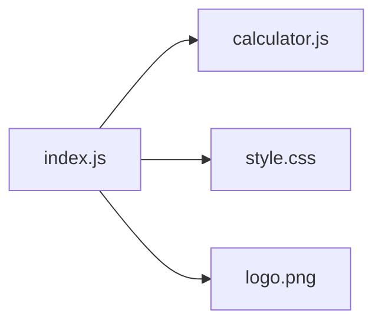
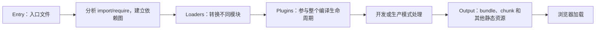
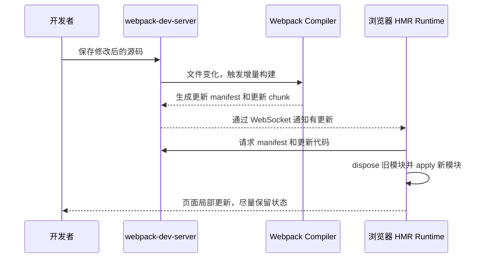

 
# Webpack 与 HMR

> [!summary] 一句话解释
> **Webpack 是把项目中的 JavaScript、CSS、图片等模块分析、转换并组织成浏览器可使用资源的模块打包器；HMR 是开发时只替换发生变化的模块，而尽量不刷新整个页面的热更新机制。**

二者经常一起出现，但不是同一个东西：

```text
Webpack：负责构建项目
HMR：利用构建结果快速更新正在运行的页面
```

## 先理解 Module（模块）

**Module（模块）**可以理解为一个职责相对独立、可被其他代码引用的文件或代码单元。

例如：

```text
src/
├── index.js       页面入口
├── calculator.js  计算功能
├── style.css      页面样式
└── logo.png       图片资源
```

`index.js` 可能引用其他文件：

```js
import { add } from './calculator.js'
import './style.css'
import logo from './logo.png'
```

这些 `import` 形成依赖关系：



当项目有几百、几千个文件时，需要工具统一分析、转换、优化和输出它们。Webpack 就是解决这类问题的构建工具之一。

---

## Webpack 是什么

**Webpack** 通常读作“韦伯派克”。官方将它定义为现代 JavaScript 应用的 **Static Module Bundler（静态模块打包器）**。

这里几个词分别表示：

- **Static（静态分析）**：构建时分析代码中的 `import`、`require` 等依赖声明，不是等用户点击按钮后才从头分析整个项目；
- **Module（模块）**：JavaScript、CSS、图片等参与项目依赖关系的代码或资源；
- **Bundler（打包器）**：把依赖处理并输出为一个或多个可部署资源。

Webpack 不是编程语言，也不是前端框架。它通常作为开发依赖运行在 [[Node.js与pnpm|Node.js]] 环境中。

## 生活类比：搬家打包

把开发项目想成准备搬家的房间：

- 源代码、样式和图片是房间里的物品；
- `import` 是“这些物品属于哪套设备”的关系；
- Webpack 像专业打包团队；
- Loader 像清洗、折叠、转换物品的工位；
- Plugin 像管理整个打包流程的主管；
- Bundle/Chunk 是最后装好的箱子；
- 浏览器是收货并使用这些箱子的人。

Webpack 不只是“把所有文件压缩成一个文件”。它会根据配置输出一个或多个 bundle/chunk，还可以进行代码分割和按需加载。

## Webpack 的基本工作流程



### 第一步：找到入口

**Entry（入口）**告诉 Webpack 从哪个模块开始分析，例如：

```js
entry: './src/index.js'
```

### 第二步：建立依赖图

Webpack 阅读入口中的导入关系，再继续分析被导入模块的依赖，最终形成 **Dependency Graph（依赖图）**。

### 第三步：转换模块

Webpack 根据规则调用 Loader，把不同源码转换成构建流程能够处理的模块。

### 第四步：执行插件

插件可以介入编译生命周期，处理 HTML 生成、资源管理、环境变量注入、构建进度和优化等更广泛任务。

### 第五步：输出资源

Webpack 把构建结果输出到 `dist` 等目录，供浏览器或服务器部署。

---

## Webpack 的核心概念

### 1. Entry（入口）

依赖分析的起点。一个应用可以有一个或多个入口。

### 2. Output（输出）

指定构建结果放在哪里、叫什么名字，例如 `dist/main.js`。

### 3. Dependency Graph（依赖图）

记录模块之间的引用关系。Webpack 根据它判断项目需要哪些代码和资源。

### 4. Bundle 与 Chunk

- **Bundle（打包产物）**：构建后供浏览器加载的资源包；
- **Chunk（代码块）**：Webpack 内部组织和拆分输出的一组模块，可能对应入口、动态导入或公共依赖。

初学时可以把二者都理解成“构建后形成的代码包”，以后再学习它们在 Webpack 内部的精确区别。

### 5. Loader（加载器/转换器）

Loader 对某类模块的源码做转换。例如：

- 把 TypeScript 转成 JavaScript；
- 解析 CSS 导入；
- 把某些资源转成数据 URL；
- 调用 Babel 转换新语法。

```js
module: {
  rules: [
    { test: /\.css$/, use: ['style-loader', 'css-loader'] }
  ]
}
```

- `test`：哪些文件匹配该规则；
- `use`：依次使用哪些 Loader。

### 6. Plugin（插件）

Plugin 参与更广泛的编译生命周期。例如：

- 生成 HTML；
- 清理输出目录；
- 注入环境变量；
- 分析包体积；
- 优化资源；
- 提供 HMR 支持。

Webpack Plugin 通常通过编译器提供的 Hook 接入不同构建阶段。这与 [[DI容器、Pi与轻量钩子方案|应用内 Hook]] 的思想相通：Webpack 在“编译开始”“生成资源”等位置暴露扩展点，插件注册回调。

### Loader 和 Plugin 的区别

| Loader | Plugin |
|---|---|
| 主要针对模块内容做转换 | 可以参与整个编译生命周期 |
| 常按文件类型匹配 | 常处理全局构建任务 |
| 例如把 TypeScript 转为 JavaScript | 例如生成 HTML、分析资源、注入变量 |

简单记忆：**Loader 更像流水线工位，Plugin 更像能介入全厂流程的主管。**

### 7. Mode（模式）

常见值：

- `development`：为开发体验配置内置优化；
- `production`：启用适合生产发布的内置优化；
- `none`：不启用二者对应的默认优化。

HMR 主要用于开发模式，不是用户访问生产网站时的常规更新方式。

### 8. Source Map（源码映射）

构建后的代码可能与源文件差异很大。Source Map 帮助浏览器开发者工具把错误位置映射回原始源码，方便调试。

## 一个简化配置

```js
export default {
  mode: 'development',
  entry: './src/index.js',

  output: {
    filename: 'bundle.js'
  },

  module: {
    rules: [
      {
        test: /\.css$/,
        use: ['style-loader', 'css-loader']
      }
    ]
  },

  devServer: {
    hot: true
  }
}
```

逐块解释：

1. 使用开发模式；
2. 从 `src/index.js` 开始建立依赖图；
3. 输出主要文件 `bundle.js`；
4. CSS 文件由 `css-loader` 和 `style-loader` 处理；
5. 开发服务器启用 HMR。

这是概念示例，不代表可以直接复制到任何项目。项目还需要安装对应依赖，配置文件也可能采用 CommonJS、ESM、TypeScript 或框架生成的形式。

---

## HMR 是什么

**HMR** 是 **Hot Module Replacement（热模块替换）** 的缩写，读作“H-M-R”。

它表示：**应用正在运行时，替换、增加或移除发生变化的模块，尽量不完整刷新整个页面。**

例如你正在填写一个很长的表单：

```text
姓名：已填写
地址：已填写
商品：已选择
```

这时开发者只修改按钮颜色：

- 完整刷新可能让表单状态丢失；
- HMR 可以只更新 CSS，尽量保留页面状态。

## HMR 的生活类比

普通整页刷新像“为了换一个灯泡，把整套房子断电并让所有人离开后重进”。

HMR 像“房子继续使用，只把坏灯泡换掉”。但如果改动的是总电箱或房屋结构，仍可能需要整体重启。

## Webpack HMR 的工作流程



更细一点：

1. 开发服务器监听文件变化；
2. Webpack 重新编译受影响的内容；
3. 编译器产生更新 manifest 和一个或多个更新 chunk；
4. `webpack-dev-server` 通过 WebSocket 告诉浏览器“有新版本”；
5. 浏览器中的 HMR runtime 下载更新；
6. 旧模块执行清理逻辑；
7. 新模块被应用，接收更新的模块重新执行必要逻辑。

这里同时用到了 [[TCP、HTTP、HTTPS与WebSocket|HTTP 与 WebSocket]]：WebSocket 适合持续通知，更新 manifest/chunk 可以通过 HTTP 获取。

## 为什么不能保证永远不刷新

HMR 需要某个模块或它的父模块知道怎样接受更新。

如果更新可以在合适的 **HMR Boundary（热更新边界）** 被接受：

```text
修改模块 → 找到接受更新的边界 → 替换相关模块
```

如果更新一路向上传播到应用入口，仍没有模块能够处理，HMR 可能失败或由开发服务器退回完整刷新。

CSS 通常较容易热替换，因为旧样式可以被新样式替换。JavaScript 状态、事件监听器和组件生命周期更复杂，通常需要框架或专门 Loader/Plugin 配合。

## HMR 能保留什么状态

HMR 的目标是尽量保留应用状态，但不是保证所有状态永远保留。

是否保留取决于：

- 改的是 CSS、普通函数还是组件结构；
- 模块有没有接受和清理更新；
- 使用的框架是否提供 Fast Refresh 等集成；
- 更新是否改变模块导出或组件身份；
- 是否出现编译错误或运行错误。

所以“启用了 HMR”不等于“无论改什么，页面状态都不会丢”。

## HMR、Live Reload 和 Watch Mode

| 机制 | 文件变化后做什么 | 页面状态 |
|---|---|---|
| Watch Mode（监听构建） | 重新构建文件，但不一定通知浏览器 | 取决于其他工具 |
| Live Reload（实时重载） | 让浏览器完整刷新页面 | 通常丢失页面内临时状态 |
| HMR（热模块替换） | 尽量只替换变化模块 | 有机会保留状态 |

Webpack Dev Server 的 `hot: true` 会优先尝试 HMR；如果无法处理，可以退回页面刷新。`hot: 'only'` 则不使用整页刷新作为失败回退。

截至 2026-08-16，Webpack 官方文档说明：从 `webpack-dev-server` v4 开始，HMR 默认启用，并会自动应用所需的 `HotModuleReplacementPlugin`。旧教程中手工添加这个插件的步骤，未必适用于当前配置。

---

## Webpack、Node.js 和 pnpm 的关系

Webpack 通常作为 Node.js 项目的开发依赖安装：

```text
pnpm：安装和管理 webpack 等依赖
Node.js：运行 webpack 命令和构建代码
Webpack：分析并构建前端模块
浏览器：加载构建结果，并在开发时运行 HMR runtime
```

项目的 `package.json` 可能包含：

```json
{
  "scripts": {
    "dev": "webpack serve",
    "build": "webpack --mode production"
  }
}
```

运行：

```text
pnpm run dev
```

流程是：

```text
Shell 启动 pnpm
→ pnpm 找到 dev 脚本
→ Node.js 运行 webpack-dev-server
→ Webpack 构建源码
→ 浏览器打开开发页面并建立 HMR 连接
```

参见 [[Node.js与pnpm]] 和 [[CMD、Bash与PowerShell]]。

## Webpack 今天还有什么作用

现代浏览器已经支持 ESM（ECMAScript Modules），但大型项目仍可能需要构建工具处理：

- npm/pnpm 依赖；
- TypeScript、JSX 和新语法转换；
- CSS、图片和字体资源；
- 代码分割和懒加载；
- 文件哈希和长期缓存；
- 压缩与生产优化；
- 开发服务器、错误提示和 HMR；
- 旧项目兼容和复杂定制。

Webpack 不是唯一选择。Vite、Rollup、esbuild、Rspack、Parcel 等也能承担部分或全部构建职责。很多框架已经把构建工具封装起来，开发者未必直接编写 Webpack 配置。

初学者应先掌握“模块、依赖图、转换、打包、开发服务器、热更新”这些共通概念，再决定是否深入某个工具的配置。

## HMR 与 Cordis 的 HMR 是一回事吗

二者都包含“运行中替换代码而尽量不整体重启”的思想，但所在层次和目标不同：

- Webpack HMR 主要服务于前端开发，把新编译的模块送进浏览器应用；
- [[DeepSeek Harness、Everything is a Plugin与Cordis|Cordis]] 关注动态插件、配置、依赖和可逆副作用的重新组合；
- Webpack 关心模块更新边界和构建产物；
- Cordis 更强调插件卸载时清理服务、监听器和其他 effect。

不能因为都叫 HMR，就认为它们的 API、边界和实现完全相同。

## 常见误区

### 误区 1：Webpack 是前端框架

不是。React、Vue 等属于 UI 框架/库；Webpack 是构建和打包工具。

### 误区 2：Webpack 只能把所有代码合成一个文件

不是。它可以输出多个 bundle/chunk，并支持代码分割和动态加载。

### 误区 3：Webpack 与 Babel、TypeScript 是同一个东西

不是。Webpack 负责依赖图和构建组织；Babel、TypeScript 编译器负责特定语法转换或类型检查。Webpack 可以通过 Loader 调用它们。

### 误区 4：HMR 就是自动保存代码

不是。编辑器负责保存；文件监听器发现变化；Webpack 重新构建；HMR 再把更新应用到运行中的页面。

### 误区 5：HMR 一定保留所有状态

不是。只有更新被正确接受且状态边界合适时才可能保留。

### 误区 6：开发页面能跑，生产构建就一定没问题

开发与生产可能使用不同模式、优化、环境变量和资源路径。发布前仍要运行并检查生产构建。

### 误区 7：所有新项目都必须自己配置 Webpack

不是。项目可能使用其他构建工具，也可能由框架替你生成和维护配置。

## 学习建议

1. 先理解 JavaScript `import`/`export`；
2. 理解 [[Node.js与pnpm|Node.js、package.json 和 pnpm script]]；
3. 用两个 JavaScript 文件观察依赖图；
4. 学习 Entry、Output、Loader、Plugin 和 Mode；
5. 对比整页刷新与 CSS HMR；
6. 再研究代码分割、缓存、Tree Shaking 和框架 Fast Refresh；
7. 最后才需要编写复杂 Webpack Plugin。

## 关联概念

- [[HTML]]、[[CSS]]：Webpack 构建后生成或组织浏览器加载的页面资源。
- [[渲染逻辑]]：HMR 更新模块后，框架或浏览器重新计算并更新界面。
- [[TypeScript与JavaScript]]：Webpack 可通过 Loader 或其他工具链处理 TypeScript 源码。
- [[Node.js与pnpm]]：Webpack 通常由 Node.js 运行并由 pnpm 管理。
- [[TCP、HTTP、HTTPS与WebSocket]]：开发服务器通过网络向浏览器提供资源和更新通知。
- [[DI容器、Pi与轻量钩子方案]]：Webpack Plugin 通过编译器 Hook 扩展构建过程。
- [[DeepSeek Harness、Everything is a Plugin与Cordis]]：对比前端 HMR 与插件元框架的热重载。

## 参考资料

- [Webpack 官方核心概念](https://webpack.js.org/concepts/)
- [Webpack 官方 HMR 概念](https://webpack.js.org/concepts/hot-module-replacement/)
- [Webpack 官方 HMR 指南](https://webpack.js.org/guides/hot-module-replacement/)
- [Webpack Dev Server：devServer.hot](https://webpack.js.org/configuration/dev-server/#devserverhot)
- [Webpack 官方 Loaders 概念](https://webpack.js.org/concepts/loaders/)
- [Webpack 官方 Plugins 概念](https://webpack.js.org/concepts/plugins/)
