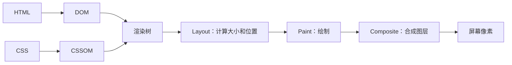

# 渲染逻辑

## 一句话解释

“**渲染逻辑**”不是一个只对应某项技术的严格专有名词。开发者通常用它表示：程序根据当前数据和状态，决定**显示什么、怎样显示、何时更新界面**的规则。

## 两层含义要分清

### 第一层：应用程序的显示规则

例如购物车页面：

- 没有商品时显示“购物车为空”；
- 有商品时显示商品列表；
- 正在加载时显示转圈动画；
- 请求失败时显示错误提示；
- 保存成功后显示 [[Toast提示]]。

这就是业务层面的渲染逻辑。伪代码如下：

```javascript
if (loading) {
  return "正在加载"
}

if (error) {
  return "加载失败"
}

if (items.length === 0) {
  return "购物车为空"
}

return "商品列表"
```

### 第二层：浏览器把代码画成像素的过程

从底层看，浏览器会把 [[HTML]] 与 [[CSS]] 等资源转换成页面，大致经历：



- **DOM**：HTML 内容的树形结构。
- **CSSOM**：[[CSS]] 规则形成的结构。
- **Render Tree**：只包含需要显示的内容及其样式。
- **Layout**：计算每个元素的位置和尺寸，也常叫 reflow（回流）。
- **Paint**：绘制文字、背景、边框等。
- **Composite**：把不同图层组合成最终画面。

## 为什么页面会“重新渲染”

常见原因有：

- 用户点击按钮，状态发生变化；
- [[SDK与API|API]] 返回了新数据；
- 输入框内容变化；
- 浏览器窗口尺寸变化；
- 定时器、动画或实时消息更新；
- 代码修改了 DOM 或 CSS class。

“重新渲染”不一定代表整张页面全部重画。现代浏览器和前端框架会尽量只处理真正变化的部分。

## 服务端渲染与客户端渲染

### 服务端渲染（SSR）

**SSR = Server-Side Rendering，服务端渲染**，读 S-S-R。

服务器先根据数据生成 HTML，再发送给浏览器。[[Django]] 的模板系统可以完成这种渲染。

```text
请求页面 → Django 查询数据 → 套入模板 → 返回 HTML → 浏览器显示
```

### 客户端渲染（CSR）

**CSR = Client-Side Rendering，客户端渲染**，读 C-S-R。

浏览器先加载 JavaScript，JavaScript 再请求数据并生成界面。React、Vue 等前端框架常用于这种方式。

```text
加载网页外壳 → JavaScript 请求数据 → 根据数据生成界面
```

### 静态生成（SSG）

**SSG = Static Site Generation，静态站点生成**，读 S-S-G。

在构建网站时提前生成 HTML，用户访问时直接发送现成文件。适合内容更新不频繁的文档、博客等。

现实项目可以混合使用这些方式，不必把它们看作非此即彼。

## 先显示一部分，耗时内容之后再补，叫什么

**从用户看到的效果说，通常叫“渐进式渲染”；如果网页另外发请求取回剩余数据，常叫“异步加载”；如果服务器在尚未结束的一次响应里陆续发送页面内容，则更具体地叫“流式渲染”。只凭“先显示、后补齐”，不能确定唯一实现。**

先理解“渲染”就是让内容变成屏幕上的画面；“加载”是获取需要的数据或资源。两者相关，但不是同一件事。

### 不看代码，用餐厅上菜理解

你点了三个菜，凉菜很快做好，蒸鱼需要更久。餐厅可以先上凉菜，让你先吃，不用等鱼做好才把整桌菜一起端来。

网站也可以这样做。比如打开一个课程页面，以下时间只是教学假设：

1. **0.2 秒**：先显示课程标题、简介和导航。
2. **1 秒**：评论准备好了，补到评论区域。
3. **3 秒**：较慢的统计数据准备好了，再补到统计区域。

慢的区域暂时显示“正在加载”，其他内容已经可以阅读。**重点不是故意让某些内容慢，而是不让它们拖住整个页面。** 整页不必刷新，但哪些区域可点击，还取决于对应交互代码是否准备好。

### 几个相近词，分别强调什么

| 名称 | 用途与含义 | 直观例子 |
| --- | --- | --- |
| 渐进式渲染（Progressive Rendering） | 内容分阶段显示，强调呈现策略 | 先看正文，评论之后补上 |
| 异步加载（Asynchronous Loading） | 发起获取任务后，不让界面一直停着等它；完成后再更新 | 页面已显示，继续请求评论数据 |
| 流式渲染（Streaming Rendering） | 服务器分批发送页面内容，浏览器陆续呈现 | 页面框架先到，慢区域稍后到 |
| 懒加载（Lazy Loading） | 暂不需要的资源推迟到需要时才开始加载 | 快滚到下方图片时才下载它 |
| 骨架屏（Skeleton Screen） | 用接近最终布局的灰色块等占位，强调等待时的样子 | 头像和文字暂时显示成灰色轮廓 |

这些不是互斥的五种产品，一个网站可以组合使用。**“慢的内容晚显示”不一定是懒加载：它也可能从一开始就已经在加载，只是还没完成。** 懒加载的定义参考 [MDN 官方说明](https://developer.mozilla.org/en-US/docs/Web/Performance/Guides/Lazy_loading)。

### 如果网页另外请求数据：Ajax

**Ajax = Asynchronous JavaScript and XML，异步 JavaScript 和 XML**，近似读“诶贾克斯”。其中 **XML = Extensible Markup Language，可扩展标记语言**，读 X-M-L，是一种数据表示格式；名字里虽然有 XML，实际交换数据不一定采用这种格式。

这里先只记住用途：**网页可以继续向服务器取数据，再更新其中一块，不必重新打开整张网页。** 现代网站可以用浏览器的 `fetch` 等能力实现这种请求方式。[MDN：Ajax](https://developer.mozilla.org/en-US/docs/Glossary/AJAX)

### 如果服务器分块送来页面：流式渲染与 BigPipe

你说的“先返回一部分，耗时的在后台处理，完成后再返回”，如果是在描述服务器怎样返回页面，很可能指这一类方案。

**BigPipe** 近似读“比格派普”，字面意思是“大管道”，是 Facebook 曾介绍的一种经典方案：把页面拆成多个小区域，先发页面框架和占位结构，各区域准备好后陆续发送，由浏览器补到对应位置。它是具体方案名称，不能把所有异步加载都叫 BigPipe。[Facebook 原始技术介绍，2010 年](https://engineering.fb.com/2010/06/04/web/bigpipe-pipelining-web-pages-for-high-performance/)

现代 React 也有流式服务端渲染能力，可配合 **Suspense（表示等待，近似读“瑟斯彭斯”）**：慢区域先显示占位内容，准备好后替换。它需要支持的框架或数据来源配合，不是给任意网络请求套一个 Suspense 就自动生效。相关背景见 [[React组件化前端开发]]。[React 流式渲染](https://react.dev/reference/react-dom/server/renderToPipeableStream)、[Suspense 官方说明](https://react.dev/reference/react/Suspense)

这里“再返回”通常是**继续发送尚未结束的响应正文**，不是同一个请求已经完整结束后，再凭空返回第二个独立响应。若第一次响应已结束，后续数据就需要其他请求或通信渠道。也可以对照 [[SSE与流式响应]] 理解“分批到达”；**SSE = Server-Sent Events，服务器发送事件**，读 S-S-E，是一种文本事件推送技术，但流式页面不等于一定使用 SSE。

### 容易误解的地方

- **先看到一些内容，不等于所有内容都算完了**，也不等于所有按钮已经能用。
- **后台加载不等于一定新开了后台线程**。它可能是网络请求仍在进行，或服务器仍在处理。浏览器中一大段耗时计算仍可能卡住界面。
- **渐进显示不保证总耗时变短**。它常改善的是“多久能先看到有用内容”；慢任务本身仍要优化。
- **占位不代表结果已经成功**。每个慢区域都要处理失败、超时和重试，尽量不要让布局突然大幅跳动。
- **仅看到页面逐步出现，无法确定具体框架**。要准确识别，还需要原文术语、实现说明或网络请求情况。

初学时先记：**异步加载是在讲怎样获取，渐进式渲染是在讲怎样显示；服务器分批送页面叫流式渲染，等需要时才开始取叫懒加载。**

### 如果说的是 Celery：这是后台任务执行，不是页面加载技术

如果“先返回、慢的后台做完再返回”指的是先收到“任务已受理”，后台花较长时间生成报表、处理视频等，之后再查询或通知结果，那么对应的是 [[Celery分布式任务队列|Celery 等后台任务队列]]。Celery 不在浏览器里负责画页面，也不会自动把任务返回值变成页面内容；网站还需连接结果查询或通知与界面更新。后台任务执行与渐进显示可以配合，但属于不同职责。

## 渲染逻辑和业务逻辑的区别

- **业务逻辑**：例如订单是否允许退款、库存是否足够。
- **渲染逻辑**：根据退款结果或库存状态，页面应该显示什么。

两者相关但不应完全混在一起。否则界面代码会同时负责核心规则和视觉展示，难以测试和维护。

## 常见问题

### 页面数据变了，界面为什么没变

可能是程序没有更新框架所追踪的 state（状态），或直接修改了旧对象，导致框架不知道需要重新渲染。

### 页面为什么闪烁或卡顿

可能是频繁更新状态、反复测量布局、一次渲染大量节点、加载资源阻塞，或主线程执行了耗时任务。

### `display: none` 的元素还会渲染吗

它仍可能存在于 DOM 中，但不会进入可见的渲染树，也不会占据布局空间。

## 初学建议

先理解“**状态 → 界面**”这条因果关系，再学习某个前端框架。不要一开始就把 React/Vue 的术语等同于浏览器渲染原理；框架负责组织更新，最终仍由浏览器完成布局和绘制。

## 参考资料

- [MDN：Critical rendering path](https://developer.mozilla.org/en-US/docs/Web/Performance/Guides/Critical_rendering_path)
- [MDN：Ajax](https://developer.mozilla.org/en-US/docs/Glossary/AJAX)
- [MDN：Lazy loading](https://developer.mozilla.org/en-US/docs/Web/Performance/Guides/Lazy_loading)
- [Facebook：BigPipe 原始介绍](https://engineering.fb.com/2010/06/04/web/bigpipe-pipelining-web-pages-for-high-performance/)
- [React：流式服务端渲染](https://react.dev/reference/react-dom/server/renderToPipeableStream)
- [React：Suspense](https://react.dev/reference/react/Suspense)

“先显示一部分、之后补齐”相关术语与资料核对日期：2026-09-24；未据此认定某个具体网站的内部实现。
