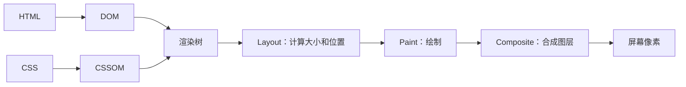

# 渲染逻辑

## 一句话解释

“**渲染逻辑**”不是一个只对应某项技术的严格专有名词。开发者通常用它表示：程序根据当前数据和状态，决定**显示什么、怎样显示、何时更新界面**的规则。

## 两层含义要分清

### 第一层：应用程序的显示规则

例如购物车页面：

- 没有商品时显示“购物车为空”；
- 有商品时显示商品列表；
- 正在加载时显示转圈动画；
- 请求失败时显示错误提示；
- 保存成功后显示 [[Toast提示]]。

这就是业务层面的渲染逻辑。伪代码如下：

```javascript
if (loading) {
  return "正在加载"
}

if (error) {
  return "加载失败"
}

if (items.length === 0) {
  return "购物车为空"
}

return "商品列表"
```

### 第二层：浏览器把代码画成像素的过程

从底层看，浏览器大致经历：



- **DOM**：HTML 内容的树形结构。
- **CSSOM**：[[CSS]] 规则形成的结构。
- **Render Tree**：只包含需要显示的内容及其样式。
- **Layout**：计算每个元素的位置和尺寸，也常叫 reflow（回流）。
- **Paint**：绘制文字、背景、边框等。
- **Composite**：把不同图层组合成最终画面。

## 为什么页面会“重新渲染”

常见原因有：

- 用户点击按钮，状态发生变化；
- [[SDK与API|API]] 返回了新数据；
- 输入框内容变化；
- 浏览器窗口尺寸变化；
- 定时器、动画或实时消息更新；
- 代码修改了 DOM 或 CSS class。

“重新渲染”不一定代表整张页面全部重画。现代浏览器和前端框架会尽量只处理真正变化的部分。

## 服务端渲染与客户端渲染

### 服务端渲染（SSR）

服务器先根据数据生成 HTML，再发送给浏览器。[[Django]] 的模板系统可以完成这种渲染。

```text
请求页面 → Django 查询数据 → 套入模板 → 返回 HTML → 浏览器显示
```

### 客户端渲染（CSR）

浏览器先加载 JavaScript，JavaScript 再请求数据并生成界面。React、Vue 等前端框架常用于这种方式。

```text
加载网页外壳 → JavaScript 请求数据 → 根据数据生成界面
```

### 静态生成（SSG）

在构建网站时提前生成 HTML，用户访问时直接发送现成文件。适合内容更新不频繁的文档、博客等。

现实项目可以混合使用这些方式，不必把它们看作非此即彼。

## 渲染逻辑和业务逻辑的区别

- **业务逻辑**：例如订单是否允许退款、库存是否足够。
- **渲染逻辑**：根据退款结果或库存状态，页面应该显示什么。

两者相关但不应完全混在一起。否则界面代码会同时负责核心规则和视觉展示，难以测试和维护。

## 常见问题

### 页面数据变了，界面为什么没变

可能是程序没有更新框架所追踪的 state（状态），或直接修改了旧对象，导致框架不知道需要重新渲染。

### 页面为什么闪烁或卡顿

可能是频繁更新状态、反复测量布局、一次渲染大量节点、加载资源阻塞，或主线程执行了耗时任务。

### `display: none` 的元素还会渲染吗

它仍可能存在于 DOM 中，但不会进入可见的渲染树，也不会占据布局空间。

## 初学建议

先理解“**状态 → 界面**”这条因果关系，再学习某个前端框架。不要一开始就把 React/Vue 的术语等同于浏览器渲染原理；框架负责组织更新，最终仍由浏览器完成布局和绘制。

## 参考资料

- [MDN：Critical rendering path](https://developer.mozilla.org/en-US/docs/Web/Performance/Guides/Critical_rendering_path)
