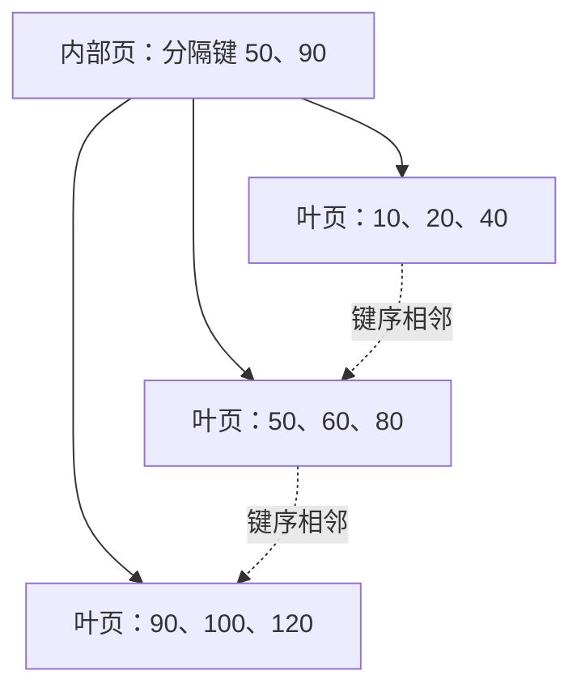

# B+ 树与数据库索引原理

> [!summary] 一句话解释
> 常见有序索引用多路平衡树把大量键值组织成少数几层页面，让数据库先定位一小段数据，再按需读取，而不用每次翻完整张表。

索引像字典目录：查“某人 8 月的订单”时，按预先排好的客户和日期定位。代价是新订单进来时，目录也必须更新。

## 从磁盘、页到树：为什么不是一行一行读

数据库通常以 Page（页）为重要存储和缓存单位，一页包含多条记录或索引项。读一个字段不代表存储设备只搬运那几个字节。

**I/O = Input/Output（输入/输出，读作 I-O）**，这里主要指内存与存储等之间的数据读写。减少需要访问的页、提高缓存命中，往往比减少少量比较更重要。

假设每个内部节点能分出约 200 个方向，两层分支可指向约 40000 个叶页；每页再存许多记录。数字只是说明高扇出的量级，真实容量受页大小、键宽、行宽、填充率等影响，不是“所有三层索引固定存几千万行”。

## B 树、B+ 树不是二叉树

B-tree（B 树，读作 B-tree）是多路平衡搜索树家族；B+ tree（B+ 树，读作 B-plus-tree）是其中一种常见设计。**B 不是 Binary 的意思，不要理解成每个节点只有两个孩子。**

教材中的典型区别：B 树内部和叶节点都可携带数据条目；B+ 树把数据条目放在叶层，内部节点重点保存分隔键和子节点引用，叶节点按键序相连。

数据库官方文档常统称 B-tree，而实际实现带有叶链、并发分裂等扩展。阅读时先看实际结构，不要只用名称争论“这个是不是纯教材 B+ 树”。

这是概念示意，不是某数据库实际页字节布局。

## 等值查找与范围扫描

找 60：从根比较分隔键，去中间叶页，在页内定位 60，再获取所需记录。

找 40～100：先定位到 40 所在叶页，再沿相邻叶页向后扫描，直到越过 100。范围查询不需要对每个值从根重新找一遍。

树高约随数据量对数增长，但一次查询总成本还包括返回行数、取表数据、版本可见性检查和网络传输。查询要返回半张表时，索引不保证比顺序扫描便宜。

叶链的相邻是逻辑键序相邻，不代表所有页在硬盘上永远物理连续。

## 聚簇索引、二级索引与回表

**以 MySQL InnoDB 为例**：

- 聚簇索引的叶层存放行数据，通常按主键组织。
- 二级索引保存索引键及主键值，通过主键再定位完整行。
- 如果二级索引里不够回答查询，再去聚簇索引取其他字段，常被叫作“回表”。

例如索引 `(customer_id, paid_day)` 找到客户 1 的订单主键后，若还需要索引未包含的其他列，可能需要再取完整记录。

PostgreSQL 通常是堆表加独立索引，索引叶条目指向表记录位置，不是“所有二级索引都拿主键再查一棵聚簇树”。SQLite 普通 rowid 表和 WITHOUT ROWID 表的布局也有区别。不能把 InnoDB 的回表路线当成所有数据库的统一实现。

## 覆盖索引：需要的字段已经在目录里

覆盖索引不是固定的一种树，而是“这个索引包含这条查询所需字段”的关系。它可能减少访问完整表记录。

PostgreSQL 的 Index Only Scan（仅索引扫描）还受可见性信息影响：即使字段齐全，也可能需要访问堆表确认可见性。InnoDB 也可能因版本检查等访问聚簇记录。因此“覆盖了就绝不会碰表”过于绝对。

为了覆盖所有 SELECT 字段而造超宽索引，会吃空间、降低页容量并增加写入成本。查询只取必要列，也是优化的一部分。

## 联合索引为什么讲顺序

索引 `(customer_id, paid_day, order_id)` 像电话簿先按姓、再按名排序：先把同一客户放一起，客户内部按日期、订单号排列。

因此 `customer_id = 1`，再限定日期范围，很自然地落到连续一段。只有 `paid_day` 条件时，同一日期分散在各个客户区域，定位通常没那么直接。

这就是“最左前缀”的主要直觉。但“少了第一列就绝对不能用索引”不是通用真理：优化器可能扫描索引、组合其他索引或使用特定版本支持的跳跃扫描。是否值得用，见实际执行计划。

遇到范围条件后，后续列未必还能同样有效地缩小一个连续区间，但仍可能参与过滤、排序或覆盖。应分析完整查询，而不是背“一遇范围后面全失效”。

## 插入、更新时树会做什么

先找到目标叶页，插入索引项。页满时可能分裂，父页增加分隔入口；父页再满可能继续向上分裂。删除或版本淘汰则需要相应清理，不保证文件立刻缩小。

索引列变化可能要删除旧项、插入新项，还涉及日志、并发保护和版本保留。因此索引越多，写入维护工作通常越多。

较短、稳定的主键有助于控制 InnoDB 二级索引大小；顺序主键常改善插入局部性，但也可能形成右侧热点。**UUID = Universally Unique Identifier（通用唯一标识符，读作 U-U-I-D）** 具有分布式生成等用途，不同 UUID 版本的有序性不同，不能简单说“任何 UUID 都不适合数据库”。

## 不只有 B+ 树

| 结构或索引思路 | 适合的方向 | 边界 |
|---|---|---|
| 有序 B-tree 家族 | 等值、范围、排序 | 维护有序结构有成本 |
| Hash，哈希 | 等值定位 | 通常不能靠哈希顺序完成大小范围查询 |
| 倒排索引 | 词项或元素反查文档集合 | 不是普通金额排序索引的替代品 |
| BRIN | 大表中与物理位置相关的范围摘要 | 粗粒度过滤，需要再检查候选数据 |
| LSM-tree | 倾向批量、顺序写入的存储设计 | 后台合并带来读写和空间放大权衡 |

**BRIN = Block Range Index（块范围索引，读作 B-R-I-N）**，是 PostgreSQL 的一种索引；**LSM = Log-Structured Merge（日志结构合并，读作 L-S-M）**，并不意味着给普通 PostgreSQL 表建默认索引就是建 LSM 树。

## 与事务、锁、优化的关系

索引缩小搜索范围，可能减少写语句触及的记录和锁范围；但不能代替事务。唯一索引能防重复，也可能让重复键写入等待。旧版本和索引清理互相影响，长事务可能拖累索引性能。

学习建议：画一个两层有序树，手动查等值与区间；再写出 `(客户, 日期)` 的实际排序列表，观察只有日期条件时为什么不能直接只取一段。之后去 [[SQL索引、执行计划与性能优化]] 看计划与验证。

关联：[[Index的常见含义]]、[[关系型数据库设计：建模、约束与范式]]、[[SQL事务、锁与并发一致性]]。

## 参考资料

核对日期：2026-09-08。

- [PostgreSQL：B-tree 实现与叶页结构](https://www.postgresql.org/docs/current/btree.html)
- [MySQL 8.4：聚簇与二级索引](https://dev.mysql.com/doc/refman/8.4/en/innodb-index-types.html)
- [MySQL 8.4：InnoDB 索引物理结构](https://dev.mysql.com/doc/refman/8.4/en/innodb-physical-structure.html)
- [PostgreSQL：多列索引](https://www.postgresql.org/docs/current/indexes-multicolumn.html)
- [PostgreSQL：仅索引扫描与覆盖索引](https://www.postgresql.org/docs/current/indexes-index-only-scans.html)
- [PostgreSQL：索引类型](https://www.postgresql.org/docs/current/indexes-types.html)
- [SQLite：文件格式](https://www.sqlite.org/fileformat2.html)
