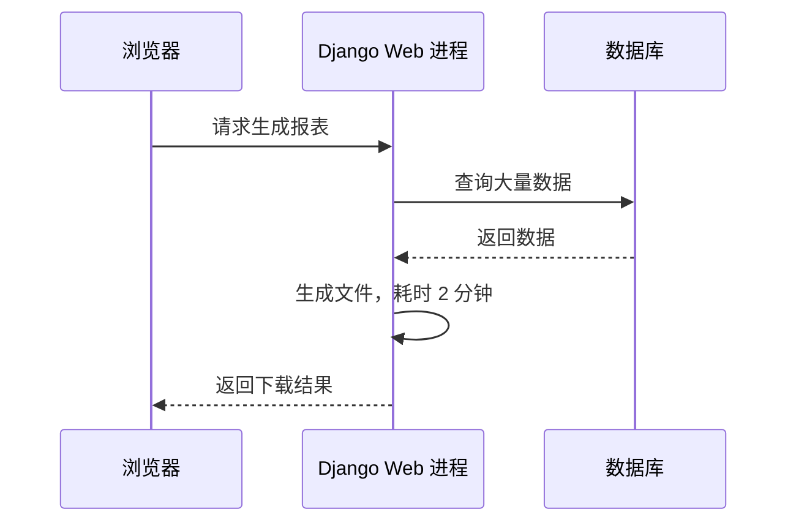
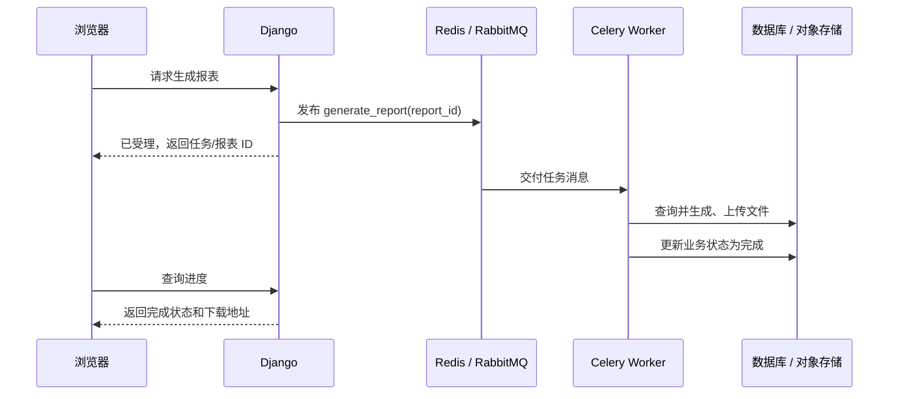
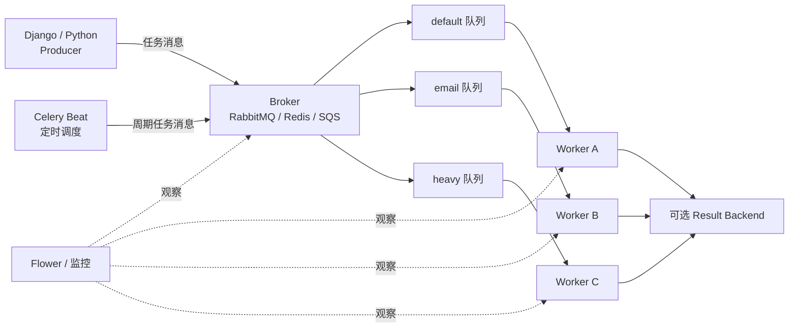
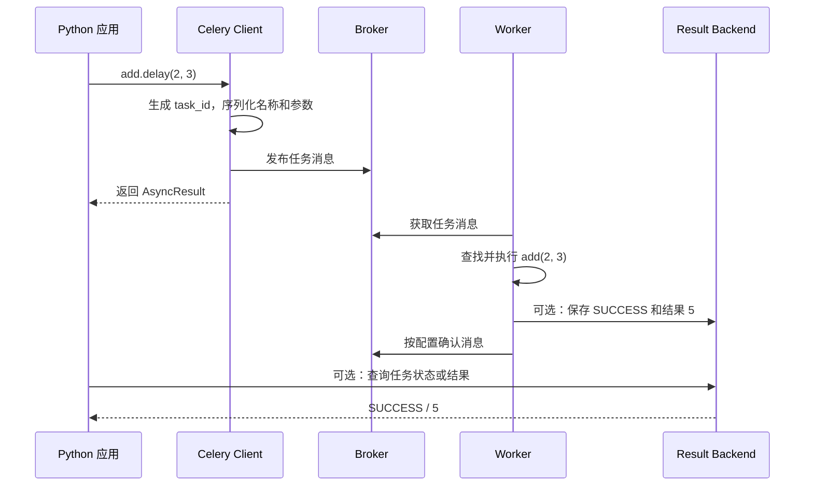
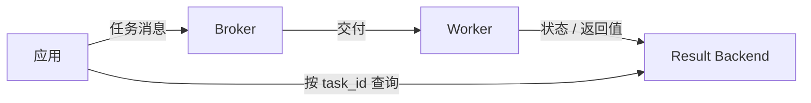
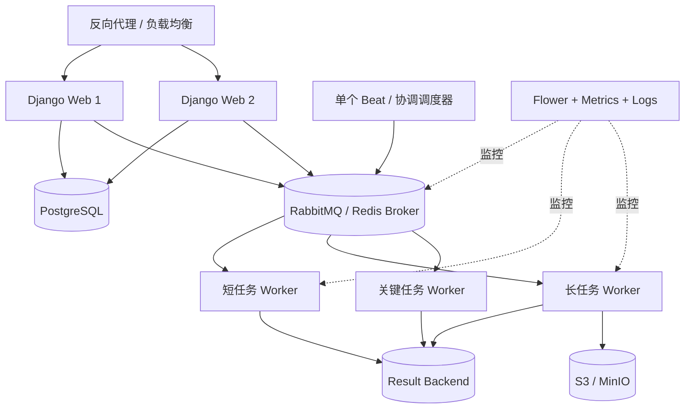
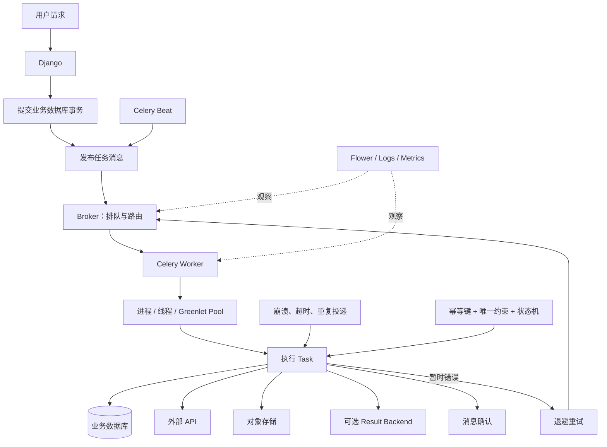

# Celery 分布式任务队列

> [!summary] 一句话结论
> **Celery（读作“赛勒瑞”）是 Python 生态中的分布式任务队列：Web 程序把耗时或可延后执行的工作封装成 Task，通过 Broker 发送消息，独立 Celery Worker 在后台取出并执行；它能解耦请求与工作、横向扩容和重试，但不提供“绝对只执行一次”，生产任务必须设计超时、幂等、监控和故障恢复。**

最短记忆：

```text
Django / Python 程序：发布任务
Broker：暂存并转发任务消息
Celery Worker：真正执行任务
Result Backend：可选，保存状态和返回结果
Celery Beat：按时间发布任务
Flower：监控 Worker 和任务
```

---

## 一、为什么需要 Celery

假设用户在网站点击“生成年度报表”。这个工作需要：

1. 查询大量数据；
2. 生成 Excel 或 PDF；
3. 上传到对象存储；
4. 发送完成通知。

### 全部放在 Web 请求里执行



可能出现：

- 浏览器或网关超时；
- 一个 Web Worker 被长时间占用；
- 用户重复点击；
- 报表失败后没有统一重试；
- 同时十个报表拖慢正常网页请求；
- Web 服务重启时任务中断。

### 使用 Celery 后



用户很快得到“已经受理”，耗时工作由后台 Worker 完成。

### 生活类比：餐厅后厨

| Celery 概念 | 餐厅类比 |
|---|---|
| Web 应用 / Producer | 前台服务员接单 |
| Task | 菜单上的一道制作任务 |
| Broker | 挂单板或出单机 |
| Queue | 不同工位的待做订单队列 |
| Worker | 后厨厨师 |
| Result Backend | 订单状态系统 |
| Beat | 定时自动下单器 |
| Flower | 后厨监控大屏 |

服务员把订单放上出单系统，不需要站在灶台边等待厨师做完。

---

## 二、Celery 到底是什么、不是什么

Celery 官方把它描述为分布式任务队列，重点是实时处理，同时支持任务调度。

### Celery 是什么

- Python 库和 Worker 运行系统；
- 用消息在客户端和 Worker 间分发任务；
- 可以在一台或多台机器运行；
- 可以并发执行多个任务；
- 支持重试、路由、定时发布和工作流组合；
- 可以配合 Django、Flask、FastAPI 或普通 Python 程序。

### Celery 不是什么

- 不是 Django 内置模块；
- 不是 Redis 或 RabbitMQ；
- 不是数据库；
- 不是 Web 服务器；
- 不是 `async/await` 的同义词；
- 不是简单线程池；
- 不是保证任务绝对只执行一次的系统；
- 不是完整的长期业务流程引擎；
- 不是把任意不可信 Python 代码安全隔离执行的沙箱。

Celery 本身需要消息传输系统，通常叫 Broker。

---

## 三、Celery 的核心组件



### 1. Producer / Client：任务发布者

**Producer（生产者）**是创建并发送任务消息的程序，例如：

- Django View；
- API 服务；
- 管理命令；
- 另一个 Celery Task；
- Celery Beat；
- 普通 Python 脚本。

发布者通常不执行任务函数本身，而是序列化任务名称、参数和选项后发给 Broker。

### 2. Task：任务

**Task（任务）**是可以由 Worker 调用的已注册 Python 函数或任务类。

例如：

```python
from celery import shared_task

@shared_task
def add(x, y):
    return x + y
```

`@shared_task` 把函数注册为 Celery 任务，但定义它并不会自动启动 Worker。

### 3. Broker：消息代理

**Broker（Message Broker，消息代理）**位于发布者和 Worker 中间，负责：

- 接收任务消息；
- 把消息放入队列；
- 按路由交给合适的 Worker；
- 处理确认和重新投递等消息语义。

Celery 稳定支持的常见 Broker 包括 RabbitMQ 和 Redis，也支持其他传输方案；具体能力并不完全相同。

### 4. Queue：队列

**Queue（队列）**保存等待 Worker 消费的任务消息。

可以设置：

- 默认队列；
- 邮件队列；
- 图片处理队列；
- CPU 密集队列；
- 高优先级队列。

不同 Worker 可以只消费指定队列。

### 5. Worker：任务执行者

**Worker（工作进程）**持续监听队列：

```text
从 Broker 获取消息
→ 找到对应任务函数
→ 反序列化参数
→ 执行任务
→ 确认、重试或记录失败
→ 可选地写入结果
```

可以启动多个 Worker，部署在同一台或不同机器上，实现横向扩容。

### 6. Result Backend：结果后端

**Result Backend（结果后端）**可选地保存：

- 任务状态；
- 返回值；
- 异常信息；
- 重试状态。

常见选择包括 Redis、数据库和 RPC backend 等。

结果后端不是 Broker 的同义词：

```text
Broker：任务执行前，传递任务消息
Result Backend：任务执行中/后，保存状态和结果
```

Celery 默认不启用结果后端。如果不需要调用者查询返回值，可以让任务 `ignore_result=True`，减少存储和网络开销。

### 7. Celery Beat：定时发布者

**Celery Beat** 是调度器。它按照间隔或 crontab 规则向 Broker 发布任务，但真正执行任务的仍然是 Worker。

### 8. Flower：监控界面

**Flower** 是 Celery 常用的实时 Web 监控工具，可以观察 Worker、任务状态、运行时间和队列等信息，也提供部分远程管理能力。

---

## 四、一次任务调用内部发生什么

假设代码调用：

```python
result = add.delay(2, 3)
```

大致流程是：



### `.delay()` 做了什么

`.delay()` 是常用快捷调用方式，大致等价于使用默认选项的 `apply_async()`。

它不会：

- 在当前 Django 进程里新建神奇线程；
- 保证 Worker 已启动；
- 保证 Broker 可用；
- 等待任务真正完成；
- 自动让重复任务只执行一次。

### `AsyncResult` 是什么

`delay()` 通常返回 **AsyncResult（异步结果句柄）**，其中包含 task ID，并可在配置 Result Backend 后查询状态和结果。

它是“任务凭证”，不是任务返回值本身。

```python
task_result = add.delay(2, 3)

print(task_result.id)       # 任务 ID
print(task_result.status)   # 例如 PENDING / SUCCESS
```

在 Web 请求里马上调用 `task_result.get()` 等待任务，常常会把异步任务重新变成同步等待，失去主要价值。

---

## 五、最小 Celery 示例

### 1. 定义应用和任务

```python
# tasks.py
from celery import Celery

app = Celery(
    "demo",
    broker="redis://localhost:6379/0",
    backend="redis://localhost:6379/1",
)

@app.task
def add(x, y):
    return x + y
```

解释：

- `demo` 是 Celery 应用名称；
- Redis 逻辑库 0 在示例中承担 Broker；
- Redis 逻辑库 1 在示例中承担 Result Backend；
- 两个 URL 指向同一个 Redis 实例也可以，但两个角色在逻辑上仍不同；
- 生产环境还需要认证、TLS、持久化、容量和高可用配置。

### 2. 启动 Worker

```bash
celery -A tasks worker --loglevel=INFO
```

- `-A tasks`：从 `tasks` 模块寻找 Celery app；
- `worker`：启动任务 Worker；
- `--loglevel=INFO`：显示常用运行日志。

### 3. 发布任务

```python
from tasks import add

job = add.delay(2, 3)
print(job.id)
```

只有 Broker 和 Worker 都正常运行，任务才会被真正消费和执行。

> [!warning] Windows 平台
> 截至 2026-08-23 核对的 Celery 5.6 稳定文档，Celery 项目明确不支持原生 Microsoft Windows。Windows 初学者应优先在 WSL2、Docker 或 Linux 虚拟机中运行 Broker 与 Worker，不要把原生 Windows 上“偶尔跑通”当作受支持的生产部署。

---

## 六、Celery 怎样与 Django 配合

Django 负责接收 Web 请求、执行业务逻辑和访问数据库；Celery 负责执行独立后台任务。

### 典型项目结构

```text
proj/
├── manage.py
├── proj/
│   ├── __init__.py
│   ├── celery.py
│   ├── settings.py
│   └── urls.py
└── users/
    ├── tasks.py
    ├── models.py
    └── views.py
```

### `proj/celery.py`

```python
import os
from celery import Celery

os.environ.setdefault("DJANGO_SETTINGS_MODULE", "proj.settings")

app = Celery("proj")
app.config_from_object("django.conf:settings", namespace="CELERY")
app.autodiscover_tasks()
```

解释：

- 指定 Django settings；
- 创建 Celery app；
- 读取 `CELERY_` 前缀配置；
- 从已安装 Django app 中发现 `tasks.py`。

### `proj/__init__.py`

```python
from .celery import app as celery_app

__all__ = ("celery_app",)
```

这样 Django 启动时会加载 Celery app，让 `@shared_task` 使用正确应用。

### Django 设置

```python
CELERY_BROKER_URL = "redis://localhost:6379/0"
CELERY_RESULT_BACKEND = "redis://localhost:6379/1"
CELERY_TASK_SERIALIZER = "json"
CELERY_ACCEPT_CONTENT = ["json"]
CELERY_RESULT_SERIALIZER = "json"
CELERY_TIMEZONE = "Asia/Shanghai"
```

示例配置不等于完整生产配置。

### 定义 Django 任务

```python
# users/tasks.py
from celery import shared_task

@shared_task
def send_welcome_email(user_id):
    # 根据 user_id 查询用户，再发送邮件
    ...
```

### 在 View 中发布

```python
send_welcome_email.delay(user.id)
```

应该传 `user.id` 等简单数据，而不是直接传 Django Model 实例。

---

## 七、Django 数据库事务与 Celery 的竞态

这是非常常见且重要的问题。

假设 Django 正在创建用户：

```python
user = User.objects.create(username="alice")
send_welcome_email.delay(user.pk)
```

可能出现：

```text
Django 创建用户，但数据库事务还没有提交
→ 任务消息已经进入 Broker
→ 空闲 Worker 立刻收到任务
→ Worker 查询 user.pk
→ 数据库中暂时看不到未提交记录
→ 任务报 User.DoesNotExist
```

### 解决方式：提交后再发布

```python
from django.db import transaction

transaction.on_commit(
    lambda: send_welcome_email.delay(user.pk)
)
```

Celery 5.4 起为 Django 提供了快捷方式：

```python
send_welcome_email.delay_on_commit(user.pk)
```

它会等 Django 事务成功提交后再向 Broker 发布任务。

注意：`delay_on_commit()` 调用时任务尚未发布，因此不会立即返回 task ID。如果确实需要 task ID，要根据业务设计选择 `delay()` 和 `transaction.on_commit()` 的组合。

### 更深一层：数据库提交成功但 Broker 发布失败

即使使用 `on_commit`，仍可能发生：

```text
数据库提交成功
→ 正准备向 Broker 发布
→ 网络或 Broker 故障
→ 任务没有发出去
```

对不能丢的关键业务，可以研究 **Transactional Outbox（事务性发件箱）**：在同一数据库事务中先写入一条待发布事件，再由可靠发布程序投递到 Broker，并记录投递状态。

---

## 八、Broker 与 Result Backend 的区别

这是 Celery 初学者最容易混淆的地方。



| 维度 | Broker | Result Backend |
|---|---|---|
| 主要时间 | 任务执行前 | 任务执行中和执行后 |
| 主要内容 | 任务名、参数、路由和选项 | 状态、返回值、异常和元数据 |
| 是否必需 | Celery 分发任务通常需要 | 可选 |
| 常见选择 | RabbitMQ、Redis、SQS | Redis、数据库、RPC 等 |
| 数据保留 | 通常消息确认后移除 | 按过期和清理策略保留 |

### Redis 可以同时承担两个角色吗

可以，但要分别理解和配置：

```text
Redis 作为 Broker：保存等待消费的任务消息
Redis 作为 Backend：按 task ID 保存状态和结果
```

生产环境需要考虑：

- 内存容量；
- 持久化；
- 淘汰策略；
- 高可用；
- Broker 和普通缓存是否相互影响；
- Result 过期和清理；
- 大消息是否阻塞 Redis。

Redis 官方笔记详见 [[Redis缓存与分布式协调]]。

### RabbitMQ 是什么角色

RabbitMQ 是专门的消息 Broker，擅长队列、路由、确认和消息投递。它通常不作为通用长期结果数据库；Celery 可以另外使用 Redis 或关系数据库保存结果。

---

## 九、Celery 和 `async/await` 有什么区别

### `async/await`

Python `asyncio` 主要解决同一个进程中大量 I/O 等待的并发组织问题：

```text
一个服务进程
→ 等数据库
→ 等网络
→ 等文件
→ 等待期间运行其他协程
```

### Celery

Celery 把工作发送到独立进程或机器：

```text
Web 进程发布消息
→ 独立 Worker 进程执行
→ 可以部署在另一台机器
```

### 对比

| 维度 | `async/await` | Celery |
|---|---|---|
| 边界 | 通常同一进程事件循环 | 独立 Worker 进程或机器 |
| 是否需要 Broker | 不需要 | 通常需要 |
| 任务能否跨机器 | 不能仅靠 `asyncio` | 可以 |
| 进程重启后的排队 | 默认没有持久任务队列 | 取决于 Broker 与配置 |
| 适合 | 请求内并发 I/O | 后台、延迟、可分发任务 |
| 返回方式 | `await` 得到结果 | task ID、Backend、回调或业务状态 |

二者可以组合：Web 请求内部使用 `async/await`，耗时且可延迟的工作发送给 Celery。

---

## 十、Celery 和线程、多进程有什么区别

Celery Worker 内部仍然需要某种并发执行池。

### 默认 prefork

Celery 默认常使用 **prefork（预派生多进程池）**：Worker 主进程创建多个子进程执行任务。

```text
Celery Worker 主进程
├── Pool 子进程 1
├── Pool 子进程 2
├── Pool 子进程 3
└── Pool 子进程 4
```

这与 [[进程、线程、多进程与多线程]] 中的多进程概念一致。

### 常见并发池

| Pool | 大意 | 适用与注意 |
|---|---|---|
| prefork | 多进程，默认 | CPU 密集和大多数通用场景的起点 |
| threads | 多线程 | I/O 场景可用，但受 Python GIL 和库线程安全影响 |
| gevent | Greenlet 协作式并发 | 大量兼容的 I/O 任务，需要理解 monkey patch 和功能限制 |
| eventlet | Greenlet 协作式并发 | I/O 场景，部分库不兼容，某些 Celery 功能受限 |
| solo | 主线程串行执行 | 调试或特殊场景，不并发 |

Celery 5.6 官方文档建议一般从默认 prefork 开始，除非任务特征明确需要其他模型；切换池可能使 `soft_timeout`、`max_tasks_per_child` 等功能不可用。

### Celery 不是“绕过 GIL 的魔法”

prefork 通过多个 Python 进程利用多个 CPU 核心，每个进程有自己的解释器和内存。

但 CPU 密集任务仍然消耗真实 CPU。增加 Worker 数超过机器能力会造成竞争、内存压力和上下文切换，不会无限提速。

---

## 十一、重试不等于可靠，也不等于幂等

Celery 可以显式或自动重试可恢复错误。

### 自动重试示例

```python
from celery import shared_task
import requests

@shared_task(
    autoretry_for=(requests.Timeout,),
    retry_backoff=True,
    retry_jitter=True,
    max_retries=5,
)
def notify_webhook(url, payload):
    response = requests.post(url, json=payload, timeout=10)
    response.raise_for_status()
```

解释：

- 只对明确的暂时性超时自动重试；
- `retry_backoff` 逐渐拉长等待时间；
- `retry_jitter` 加入随机抖动，避免大量任务同时重试；
- `max_retries` 限制次数；
- HTTP 请求必须设置超时。

不要无脑对所有 `Exception` 永久重试。代码 Bug、参数错误和永久性业务拒绝不会因为多试几次自动变好。

### 为什么任务可能重复执行

分布式系统可能出现：

```text
Worker 已经完成外部付款
→ 正准备确认任务消息
→ Worker 或网络断开
→ Broker 不知道任务是否完成
→ 消息被重新投递
→ 新 Worker 再次执行
```

系统无法仅凭断开的网络区分：

- 任务根本没执行；
- 任务执行了一半；
- 任务全部成功，只是确认丢了。

因此 Celery 不提供普遍的 Exactly Once（严格恰好一次）业务效果保证。

### `acks_late`

默认早确认和 `acks_late=True` 是故障取舍：

- 早确认：任务开始前后较早确认；Worker 后续崩溃时可能不再投递；
- 晚确认：任务执行后确认；Worker 中途崩溃时更可能重新投递，但任务可能重复执行。

Celery 官方文档明确指出，开启晚确认时任务可能被执行多次，因此任务必须幂等。

---

## 十二、怎样设计幂等 Celery Task

**Idempotency（幂等性）**表示同一个业务请求重复执行，最终业务效果不会重复叠加。

详见 [[状态机与幂等性]]。

### 错误示例：每次都扣款

```python
@shared_task
def charge(order_id):
    payment_gateway.charge(order_id)
```

如果任务重复投递，可能重复扣款。

### 更稳妥的思路

```text
为业务操作生成唯一 idempotency_key
→ 数据库用唯一约束记录处理状态
→ 检查是否已经成功
→ 调用外部系统时也传幂等键
→ 原子地记录成功结果
→ 重复任务读取已有结果并返回
```

概念示例：

```python
@shared_task
def charge_order(order_id):
    order = Order.objects.get(pk=order_id)

    if order.payment_status == "paid":
        return order.payment_reference

    reference = payment_gateway.charge(
        amount=order.amount,
        idempotency_key=f"order:{order.id}:charge",
    )

    mark_order_paid_once(order.id, reference)
    return reference
```

真实支付流程还要处理数据库与外部支付系统之间无法自动形成一个事务的问题，可能需要状态机、对账、补偿和人工处理。

### 常见幂等手段

- 数据库唯一约束；
- 业务幂等键；
- 状态机限制合法转换；
- 条件更新，例如只允许 `pending → paid`；
- Outbox/Inbox 表；
- 外部 API 提供的 idempotency key；
- 处理记录和结果缓存；
- 对账与补偿任务。

Redis 锁可以减少并发，但不能单独替代业务幂等：锁可能过期、Worker 可能崩溃，外部副作用仍需去重。

---

## 十三、应该给 Task 传什么参数

### 推荐传简单、稳定的引用

```python
generate_report.delay(report_id)
send_email.delay(user_id, template_name)
resize_image.delay(image_object_key)
```

Worker 再根据 ID 从数据库或对象存储获取数据。

### 不建议直接传

- Django Model 实例；
- 数据库连接；
- 打开的文件对象；
- 很大的图片或视频字节；
- 函数和复杂 Python 对象；
- 私钥、密码、访问令牌；
- 无法稳定 JSON 序列化的对象。

原因：

- 消息需要序列化；
- Worker 可能使用不同代码版本；
- 大消息会堵塞 Broker；
- 参数可能被日志和监控记录；
- 对象在任务执行时可能已经过期；
- Pickle 等序列化格式可能带来代码执行风险。

大文件应先保存到 [[S3与MinIO对象存储|对象存储]]，任务消息只传 Object Key 或数据库 ID。

### 传 ID 也有竞态

任务真正运行时：

- 对象可能已经删除；
- 状态可能已经变化；
- 用户可能撤销了操作；
- 权限可能变化。

因此任务要重新读取并验证当前状态，不要假设发布时的世界永远不变。

---

## 十四、任务状态与 Result Backend

常见状态包括：

| 状态 | 大意 |
|---|---|
| PENDING | 尚无已知结果，也可能 task ID 不存在或 Backend 未记录 |
| RECEIVED | Worker 已接收，需要启用相应事件 |
| STARTED | 已开始，需要开启 started 跟踪 |
| RETRY | 正在等待重试 |
| SUCCESS | 执行成功 |
| FAILURE | 执行失败 |
| REVOKED | 被撤销，不再计划执行 |

### PENDING 不一定表示“正在排队”

如果 Result Backend 没有这个 task ID 的记录，也可能显示 PENDING。因此不能只根据 PENDING 判断消息一定还在 Broker。

### 不要永久保存所有结果

返回值和异常信息会占用存储。应设计：

- 哪些 Task 需要结果；
- Result 过期时间；
- 谁清理旧数据；
- 是否包含敏感信息；
- 是否应该把业务状态存进自己的数据库，而不是只依赖 Celery Backend。

对“生成报表”这类业务，通常应该在业务表中保存：

```text
report_id
status: pending/running/succeeded/failed
progress
output_key
error_code
created_at / finished_at
```

Celery task ID 是执行层标识，不应自动代替业务对象 ID。

---

## 十五、定时任务：Beat、countdown 和 ETA

### `countdown`

```python
send_reminder.apply_async(args=[user_id], countdown=60)
```

表示大约 60 秒后执行，适合较短延迟。

### `eta`

可以指定预计执行时间。

但 Celery 官方文档提醒：使用 ETA/countdown 安排很久以后的大量任务时，Worker 会提前取走并把任务保留在内存中，可能增加内存占用；不同 Broker 的 visibility timeout 等行为也可能造成重复投递。

长时间未来计划不应简单堆积大量 countdown 任务。

### Celery Beat

Beat 适合周期性发布：

- 每五分钟检查超时订单；
- 每晚生成日报；
- 每周清理过期记录；
- 每小时同步第三方数据。

```python
from celery.schedules import crontab

CELERY_BEAT_SCHEDULE = {
    "daily-report": {
        "task": "reports.tasks.generate_daily_report",
        "schedule": crontab(hour=2, minute=0),
    }
}
```

### 为什么只能有一个调度者

同一份 Beat Schedule 如果同时启动两个独立调度器：

```text
Beat A 到点发布任务
Beat B 也到点发布同一任务
→ 周期任务可能执行两次
```

Celery 官方要求同一 schedule 同一时刻确保只有一个调度器，除非使用能协调去重的专门方案。

Beat 只负责“到点发消息”，任务本身仍应幂等，因为重复发布、人工补跑和故障恢复都可能发生。

### django-celery-beat

`django-celery-beat` 可以把周期计划保存在 Django 数据库，并通过 Django Admin 管理。

它解决计划的动态管理，不自动解决每个任务的业务幂等。

---

## 十六、队列、路由与优先级

不要让所有任务挤在一个队列。

假设：

- 邮件任务 100 毫秒；
- 视频转码任务 30 分钟；
- 支付回调需要尽快处理。

全部进入同一队列可能造成：

```text
大量视频任务排在前面
→ 邮件和支付任务长期等待
```

### 按性质分队列

```python
CELERY_TASK_ROUTES = {
    "emails.tasks.*": {"queue": "emails"},
    "media.tasks.*": {"queue": "media"},
    "payments.tasks.*": {"queue": "critical"},
}
```

启动指定 Worker：

```bash
celery -A proj worker -Q emails --loglevel=INFO
celery -A proj worker -Q media --loglevel=INFO
celery -A proj worker -Q critical --loglevel=INFO
```

### 分队列的好处

- 长任务不堵住短任务；
- CPU 密集与 I/O 密集 Worker 可使用不同并发配置；
- 可以分别扩容；
- 可以限制敏感任务只在特定机器执行；
- 更容易设置监控和告警。

### 优先级不是绝对实时保证

Broker 对优先级的支持不同。已经被 Worker 预取或正在执行的低优先任务，不一定能被后来任务抢占。

严格关键任务更适合独立队列和独立 Worker，而不是只设置一个数字优先级。

---

## 十七、Prefetch 是什么

**Prefetch（预取）**表示 Worker 可以提前从 Broker 保留尚未开始执行的消息。

优点：

- 短任务可以减少每次等待 Broker 的延迟；
- 提高吞吐。

问题：

- 一个 Worker 可能提前拿走很多长任务；
- 其他空闲 Worker 没任务可拿；
- 消息在 Worker 内存等待；
- 分配不公平。

Celery 的预取数通常与并发槽数和 `worker_prefetch_multiplier` 相关。

### 长短任务混合怎么办

官方优化指南建议把长任务和短任务路由到不同 Worker，并分别配置。

```text
short 队列 → 高吞吐短任务 Worker
long 队列  → 低预取、受控并发 Worker
```

不要看到队列慢就盲目增加并发；先看任务运行时、CPU、内存、外部数据库连接和队列长度。

---

## 十八、Canvas：任务工作流

Celery Canvas 提供组合任务的原语。

### Chain：串行链

```text
任务 A 完成
→ 把结果交给任务 B
→ B 完成后调用 C
```

```python
workflow = fetch_data.s() | transform.s() | save_result.s()
workflow.delay()
```

### Group：并行组

```text
任务 A ─┐
任务 B ─┼─ 同时执行
任务 C ─┘
```

```python
from celery import group

group(resize_image.s(image_id, size) for size in SIZES).delay()
```

### Chord：并行后汇总

```text
并行任务 A ─┐
并行任务 B ─┼─ 全部完成 → 汇总任务 D
并行任务 C ─┘
```

Chord 依赖 Result Backend 和特定后端能力；组内任务不能随意忽略结果。

### 工作流不是万能业务引擎

持续数天、包含人工审批、版本迁移、强状态可视化和复杂补偿的业务流程，可能需要专门 Workflow Engine（工作流引擎），而不是无限嵌套 Celery Task。

---

## 十九、失败场景要怎样理解

### 1. Broker 不可用

发布任务可能立即失败或重试连接。Web 应用要决定：

- 返回错误；
- 降级；
- 写 Outbox 稍后投递；
- 是否允许丢弃非关键任务。

### 2. Worker 全部停止

持久队列中的任务通常继续等待，但具体取决于 Broker、队列持久化和消息 delivery mode。

恢复 Worker 后才能继续处理。

### 3. Task 抛出异常

可能进入 FAILURE 或根据策略进入 RETRY。要区分：

- 暂时故障；
- 永久业务错误；
- 程序 Bug；
- 非预期进程崩溃。

### 4. Worker 执行中崩溃

任务是否重新投递取决于确认时机、Worker 丢失策略和 Broker 行为。必须按“可能重复，也可能需要补偿”的现实设计。

### 5. Result Backend 故障

任务可能已经成功产生业务效果，但结果状态没有成功保存。不能看到 PENDING 就自动再做一遍不可逆操作。

### 6. 外部 API 超时

超时只表示调用者没有及时得到响应，不证明对方没有完成操作。

例如支付接口超时后，应先按幂等键查询或对账，而不是直接再次扣款。

### 7. 部署期间代码版本不一致

发布者发送了新任务名或新参数，旧 Worker 可能不认识。滚动发布需要兼容窗口、任务版本策略和正确的启动顺序。

---

## 二十、超时、限流和取消

### 1. 网络超时

每次外部 I/O 都应设置合理连接和读取超时。

一个永久等待的 HTTP 请求可以长期占住 Worker 并发槽。

### 2. Soft / Hard Time Limit

Celery 可以设置软、硬任务时间限制：

- Soft Time Limit：抛出异常，让任务尝试清理；
- Hard Time Limit：强制终止执行进程。

强制终止不等于回滚外部副作用。任务可能已经发送邮件、写入一半数据或调用了第三方系统。

不同并发池对这些能力的支持不同。

### 3. Rate Limit

Rate Limit（速率限制）可以限制某类任务的处理速率，例如保护第三方 API。

但 Celery 的任务速率限制和全局业务配额不是完全相同的问题。多个 Worker、多个地区和第三方限制可能需要集中限流方案。

### 4. Revoke：撤销

撤销通常阻止尚未开始的任务被执行。对已经运行的任务进行 terminate 风险较高：

- 可能只做了一半；
- 资源没有清理；
- 外部副作用已经发生。

对可取消长任务，最好在业务数据中记录 cancel_requested，并让任务在安全检查点主动停止。

---

## 二十一、怎样监控 Celery

只看“Worker 进程还在”远远不够。

### 必看指标

- 各队列长度；
- 最老消息等待时间；
- 发布到开始的排队延迟；
- 任务运行时间分布；
- 成功、失败、重试和超时数量；
- 活跃 Worker 数量；
- Worker 心跳；
- Broker 连接和磁盘/内存；
- Result Backend 容量；
- Worker CPU 和内存；
- 业务积压，例如待生成报表数量。

### 为什么队列长度重要

如果每分钟进入 100 个任务，Worker 每分钟只能完成 80 个：

```text
每分钟净增加 20 个
→ 队列持续增长
→ 延迟越来越大
→ 最终内存、磁盘或业务 SLA 失控
```

这叫 **Backpressure（背压）**问题：下游处理速度低于上游生产速度。

解决不一定只是增加 Worker，还可能需要：

- 限制生产速率；
- 批处理；
- 优化任务；
- 分队列；
- 扩容数据库和外部依赖；
- 拒绝低优先级任务；
- 给任务设置过期时间。

### Flower

运行示例：

```bash
celery -A proj flower
```

Flower 默认可提供实时任务和 Worker 观察。生产中必须为监控界面配置认证和网络访问控制，不能直接暴露到互联网。

---

## 二十二、安全边界

Celery Worker 会根据消息调用本地注册的任务代码，因此 Broker 是重要安全边界。

### 安全原则

- Broker 不直接暴露到公网；
- 使用强认证、网络隔离和 TLS；
- Worker 使用低权限系统用户；
- 限制 Worker 能访问的数据库、文件和云凭据；
- 默认使用 JSON 等安全边界更清晰的序列化；
- 不接受来自不可信来源的 Pickle 消息；
- 任务参数不携带密码、私钥和敏感原文；
- 日志和 Flower 中隐藏敏感参数；
- 对任务代码和依赖做供应链管理；
- 对危险任务单独队列、单独身份和单独 Worker；
- 设置资源、超时和网络出口限制。

### 为什么 Pickle 危险

Python Pickle 可以表示复杂对象，但反序列化恶意 Pickle 可能执行代码。Celery 默认只接受 JSON；如果开启 Pickle，必须确保不可信方无法向 Broker 发送消息。

### Celery 不是沙箱

Worker 执行的是部署在机器上的 Python 代码，通常拥有该 Worker 系统用户的全部权限。

不要把用户提交的任意 Python 文本包装成 Celery Task 执行。任务队列解决分发问题，不提供容器级或虚拟机级安全隔离。

---

## 二十三、生产部署由哪些服务组成

典型 Django + Celery 系统可能包含：



需要独立管理：

- Django Web 进程；
- Broker；
- 一个或多个 Celery Worker；
- 可选 Result Backend；
- 可选 Beat；
- 监控、日志和告警；
- 数据库和对象存储。

开发时在终端启动 Worker，不代表生产中可以一直依赖一个手工打开的窗口。生产部署通常使用 systemd、容器编排或其他进程管理方案保证自动启动和故障重启。

---

## 二十四、什么时候适合用 Celery

### 适合

- 发送邮件、短信和通知；
- 生成报表、PDF、Excel；
- 图片缩放、视频转码；
- 导入和导出大量数据；
- 调用较慢的第三方 API；
- Webhook 发送与重试；
- AI 推理或批处理任务；
- 定期同步数据；
- 清理过期数据；
- 可拆分到多 Worker 的 Python 后台工作；
- 需要按队列独立扩容的任务。

### 不一定需要

- 任务只有几毫秒并且请求必须立即得到结果；
- 一个简单脚本用系统定时器就足够；
- 只需要单进程内部的短 I/O 并发；
- 团队不是 Python 生态；
- 需要超高吞吐事件日志流，更适合 Kafka/Pulsar 等流平台；
- 需要持续数月、包含复杂人工审批的持久工作流；
- 业务要求严格的 Exactly Once，却没有幂等和对账设计；
- 只是为了“架构看起来高级”。

### Celery 的成本

引入后需要额外维护：

- Broker；
- Worker 部署；
- 结果存储；
- 队列监控；
- 重试和幂等；
- 代码版本兼容；
- 任务积压和容量规划；
- 分布式故障排查。

如果任务量很小，可以先使用简单方案，再根据真实需求升级。

---

## 二十五、常见误区

### 误区 1：调用 `.delay()` 就保证任务完成

错误。Broker、Worker、任务代码、外部服务和 Result Backend 都可能故障。

### 误区 2：Celery 就是 Redis

错误。Celery 是任务系统；Redis 可以担任 Broker 或 Result Backend，也可做普通缓存。

### 误区 3：Broker 和 Result Backend 是一回事

错误。一个传递待执行任务，一个保存执行状态和结果。

### 误区 4：异步任务等于 Python `async/await`

错误。Celery 通过独立 Worker 和消息系统分发任务；`asyncio` 主要组织进程内 I/O 并发。

### 误区 5：开启重试就不会丢任务

错误。发布失败、早确认后崩溃、持久化配置和永久错误仍需处理。

### 误区 6：任务只会执行一次

错误。网络中断、Worker 崩溃和晚确认都可能造成重复执行。

### 误区 7：加 Redis 锁就已经幂等

错误。锁可能过期或失效，外部副作用仍需要业务幂等键、唯一约束和状态记录。

### 误区 8：可以把 Django Model 直接传给任务

不推荐。应传稳定 ID，任务运行时重新查询并验证当前状态。

### 误区 9：可以把视频直接塞进 Broker

不推荐。大文件放对象存储，消息只传引用。

### 误区 10：Beat 会执行任务

错误。Beat 只按时间发布消息，Worker 才执行。

### 误区 11：多启动 Worker 就一定更快

错误。数据库、CPU、内存、网络和第三方 API 都可能成为瓶颈。

### 误区 12：任务取消等于事务回滚

错误。已经发生的邮件、付款或外部 API 调用不会因进程被杀自动撤销。

### 误区 13：Celery 原生支持 Windows 生产运行

错误。截至核对日期，Celery 5.6 官方明确不支持 Microsoft Windows，应使用受支持的 Linux 环境。

### 误区 14：结果显示 PENDING 就代表任务还在队列

错误。PENDING 也可能表示 Backend 没有该 task ID 的记录。

---

## 二十六、初学者学习路线

### 第 1 步：先理解同步请求

理解：

- HTTP 请求与响应；
- Django View；
- Web Worker 为什么不能无限等待；
- 数据库事务。

先看 [[Django]]、[[TCP、HTTP、HTTPS与WebSocket]] 和 [[ORM]]。

### 第 2 步：只运行一个简单任务

目标：

```text
一个 Celery app
+ 一个 Redis/RabbitMQ Broker
+ 一个 Worker
+ 一个 add(x, y) Task
```

观察发布者终端、Broker 和 Worker 日志分别发生什么。

### 第 3 步：接入 Django

学习：

- `celery.py`；
- `@shared_task`；
- `autodiscover_tasks()`；
- `.delay()`；
- `delay_on_commit()`。

### 第 4 步：故意制造失败

测试：

- 停止 Broker 后发布；
- 停止 Worker 后发布；
- Task 抛异常；
- Worker 执行时被终止；
- 外部 HTTP 超时；
- 同一任务重复投递。

只有观察失败，才能真正理解可靠性边界。

### 第 5 步：实现幂等

使用业务 ID、唯一约束、状态机和外部 API 幂等键，让任务重复执行也不会重复产生副作用。

### 第 6 步：增加队列和监控

把长任务、短任务和关键任务分开，使用 Flower、日志和指标观察积压。

### 第 7 步：再学习 Canvas 和生产部署

最后学习 chain、group、chord、Beat、容器部署、高可用和滚动发布。

---

## 二十七、把整个原理压缩成一张图



---

## 二十八、最终记忆

### 核心架构

```text
Producer 发布
→ Broker 排队
→ Worker 执行
→ Backend 可选保存结果
```

### 核心边界

```text
已发布 ≠ 已执行
已执行 ≠ 结果一定保存
超时 ≠ 对方没有完成
重试 ≠ 不会重复
加锁 ≠ 已经幂等
异步 ≠ 一定更快
```

### 生产原则

```text
任务小而有界
+ 参数传 ID，不传大对象和秘密
+ 外部 I/O 有超时
+ 暂时错误有限退避重试
+ 业务副作用幂等
+ 数据库提交后再发布
+ 长短任务分队列
+ 监控积压、失败和延迟
+ Broker 与 Worker 有安全隔离
= 才是较可靠的 Celery 系统
```

最准确的一句话：

> **Celery 把“现在必须由 Web 进程完成的函数调用”变成“通过消息交给独立 Worker 执行的分布式任务”；它提供分发和执行框架，但业务正确性仍取决于事务、幂等、超时、重试、监控和运维设计。**

---

## 关联概念

- [[Django]]：Django 接收请求和管理业务数据，Celery 执行独立后台任务。
- [[Redis缓存与分布式协调]]：Redis 可以作为 Broker 或 Result Backend，但缓存、队列和协调职责需要区分。
- [[状态机与幂等性]]：重复投递、重试和外部副作用为什么要求幂等设计。
- [[进程、线程、多进程与多线程]]：Celery prefork、threads、gevent 等并发池的基础。
- [[ORM]]：Django 数据库事务、提交时机和 Worker 重新查询数据。
- [[S3与MinIO对象存储]]：大文件不应放入 Broker，应保存后只传 Object Key。
- [[高可用、健康检查与故障恢复]]：Broker、Worker、Backend 的健康、积压、重启和恢复。
- [[SDK与API]]：Celery Task 调用第三方 API 时怎样处理超时、重试和幂等键。
- [[软件供应链：代码签名、SBOM与发布门禁]]：Worker 会执行部署的代码，依赖和发布流程属于安全边界。

## 参考资料

以下内容于 2026-08-23 核对，稳定文档版本为 Celery 5.6：

- [Celery 5.6 官方文档：Distributed Task Queue](https://docs.celeryq.dev/en/stable/)
- [Celery 5.6：Introduction to Celery](https://docs.celeryq.dev/en/stable/getting-started/introduction.html)
- [Celery 5.6：Backends and Brokers](https://docs.celeryq.dev/en/stable/getting-started/backends-and-brokers/)
- [Celery 5.6：Django 集成](https://docs.celeryq.dev/en/stable/django/)
- [Celery 5.6：Django 事务与 `delay_on_commit()`](https://docs.celeryq.dev/en/stable/django/first-steps-with-django.html)
- [Celery 5.6：Tasks、Retry、`acks_late` 与幂等](https://docs.celeryq.dev/en/stable/userguide/tasks.html)
- [Celery 5.6：Calling Tasks、ETA 与 countdown](https://docs.celeryq.dev/en/stable/userguide/calling.html)
- [Celery 5.6：Concurrency](https://docs.celeryq.dev/en/stable/userguide/concurrency/)
- [Celery 5.6：Periodic Tasks 与 Beat](https://docs.celeryq.dev/en/stable/userguide/periodic-tasks.html)
- [Celery 5.6：Routing Tasks](https://docs.celeryq.dev/en/stable/userguide/routing.html)
- [Celery 5.6：Optimizing 与 Prefetch](https://docs.celeryq.dev/en/stable/userguide/optimizing.html)
- [Celery 5.6：Monitoring 与 Flower](https://docs.celeryq.dev/en/stable/userguide/monitoring.html)
- [Celery：Security 与不可信 Pickle 风险](https://docs.celeryq.dev/en/stable/userguide/security.html)
