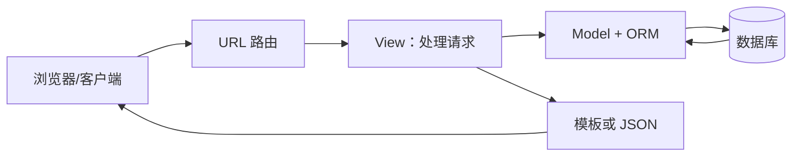

# Django

## 一句话解释

**Django** 是一个使用 Python 编写的 Web 后端框架，它把开发网站常见的功能预先组织好，让开发者不用从零处理路由、数据库、登录、后台管理和安全防护。

Django 不是编程语言，Python 才是语言；Django 是用 Python 开发 Web 应用的一套框架。

## 什么是 Web 后端

用户在浏览器里看到并操作的部分通常叫前端，服务器上负责处理数据和规则的部分通常叫后端。

例如登录网站时：

1. 前端收集用户名和密码。
2. 后端检查账户是否存在、密码是否正确。
3. 后端读取数据库并建立登录状态。
4. 后端返回成功或错误结果。
5. 前端根据结果更新页面或弹出 [[Toast提示]]。

Django 主要负责第 2～4 步。

## Django 处理一次请求的大致流程



- **URL 路由**：根据网址把请求交给正确的处理函数。
- **View**：读取请求、执行规则、调用数据层并决定返回什么。
- **Model**：描述数据结构和数据行为。
- **ORM**：让 Python 对象和数据库表互相映射，详见 [[ORM]]。
- **Template**：把数据填入 HTML 页面；如果开发 [[SDK与API|API]]，也可以直接返回 JSON。

## Django 自带哪些常用能力

- URL 路由；
- 请求和响应处理；
- ORM 和数据库迁移；
- 模板系统；
- 表单和数据校验；
- 用户、密码、登录和权限系统；
- 自动生成的管理后台；
- 缓存、国际化等常用设施；
- CSRF、XSS、SQL 注入等方面的安全防护机制。

“自带得多”是 Django 的主要特点之一，因此常被称为 **batteries-included（电池已包含）** 的框架。

## 一个最小示例

```python
from django.http import HttpResponse

def hello(request):
    return HttpResponse("你好，Django！")
```

这个 view（视图函数）接收浏览器的请求，返回一个 HTTP 响应。项目还需要在 URL 配置中把某个地址映射到这个函数。

如果要返回 JSON：

```python
from django.http import JsonResponse

def user_info(request):
    return JsonResponse({"name": "小明", "level": "beginner"})
```

这时 Django 就是在提供一个简单的 Web [[SDK与API|API]]。

## Django 有什么用

它适合开发：

- 内容管理系统；
- 企业内部管理系统；
- 电商、社区、博客；
- 带账户和权限的网站；
- 数据驱动的 Web 应用；
- REST API 后端（通常搭配 Django REST Framework）。

## 什么时候很适合使用 Django

- 团队主要使用 Python；
- 需求包含数据库、登录、权限和管理后台；
- 希望快速得到结构完整的应用；
- 项目更看重成熟生态和长期维护，而不是极小体积。

## 什么时候不一定要选 Django

- 只是写一个极简单的脚本或单个接口；
- 需要非常轻量、自由的结构；
- 团队完全使用其他语言生态；
- 核心是纯前端静态页面，不需要服务器逻辑；
- 对实时、异步或极端性能有非常特殊的架构要求。

这并不表示 Django 做不到，而是“能做”不等于“最合适”。

## Django、Flask 和 FastAPI 的粗略区别

| 工具 | 大致特点 | 常见场景 |
|---|---|---|
| Django | 功能完整、约定较多、自带 ORM 和后台 | 完整网站、管理系统、数据型应用 |
| Flask | 核心轻量、自由组合 | 小型服务、原型、需要自选组件的项目 |
| FastAPI | 强调类型提示、现代 API 开发和自动接口文档 | API 服务、机器学习服务、异步接口 |

初学者不要只根据“谁最快”选择框架。学习目标、项目需求和教程质量更重要。

## Django 与 MVT

Django 常用 **MVT** 描述其结构：

- Model：数据模型；
- View：处理请求和业务流程；
- Template：页面模板。

它和常听到的 MVC 思想相近，但名称对应关系不完全一致，不必在初学阶段纠结字母。

## 学 Django 前建议先会什么

1. Python 变量、函数、类和模块；
2. HTML 的基本结构；
3. HTTP 请求和响应的基本概念；
4. [[SDK与API|API]] 和 JSON；
5. 数据库表、行、列和主键；
6. Git 的基本操作。

## 常见误区

### “用了 Django 就不用写前端”

Django 能生成 HTML，但网页样式仍需要 [[CSS]]，复杂交互通常还要 JavaScript。也可以用 React/Vue 做独立前端，让 Django 只提供 API。

### “Django 自带数据库”

Django 自带数据库访问层，但真正存储数据的是 SQLite、PostgreSQL、MySQL 等数据库。

### “用了 ORM 就完全不用懂 SQL”

简单操作可以不手写 SQL，但理解 SQL、索引、连接和事务对于性能与正确性仍然重要，详见 [[ORM]]。

## 参考资料

- [Django 官方文档：Django at a glance](https://docs.djangoproject.com/en/stable/intro/overview/)
- [Django 官方入门教程](https://docs.djangoproject.com/en/stable/intro/tutorial01/)
