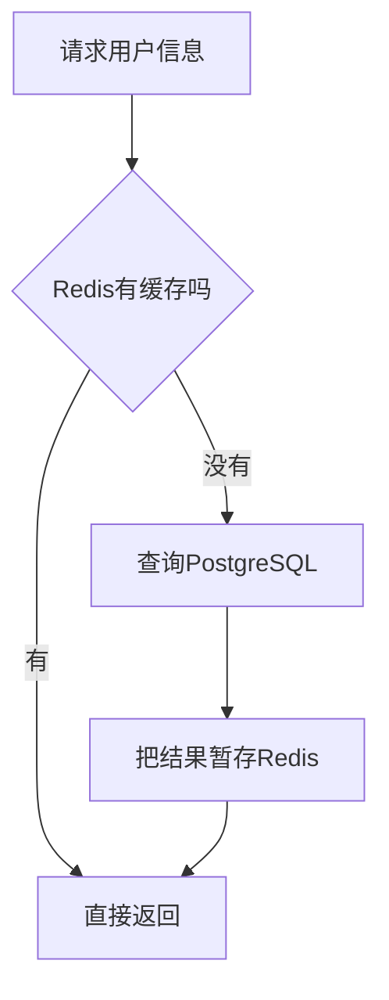

# Redis 缓存与分布式协调

> [!summary] 一句话解释
> **Redis（常读作“瑞迪斯”）是以内存访问为主的数据结构服务器，常用于缓存、会话、限流、短期队列、Presence 和分布式协调，但不应不加分析地代替长期权威数据库。**

## 生活类比

PostgreSQL 像公司的正式档案库；Redis 像前台手边的速查白板。

白板查得快，适合写“当前谁在线”“今天还可请求多少次”；但公司的最终合同和财务记录仍应进入正式档案库。

## Redis 为什么快

Redis 的主要工作数据放在内存中，避免每次读取都等待磁盘随机访问。它还提供经过设计的数据结构和原子命令。

常见数据结构：

| 类型 | 适合保存 |
|---|---|
| String | Token、计数器、简单缓存 |
| Hash | 对象字段 |
| List | 简单队列 |
| Set | 去重成员集合 |
| Sorted Set | 排行榜、按分数排序的任务 |
| Stream | 有消费组的事件流 |

## 缓存是什么

缓存保存“从其他地方获取或计算的结果”，让后续请求更快。



缓存数据应该可以重新从权威数据源构建。

## TTL 是什么

**TTL（Time To Live，存活时间）**规定一个 Key 多久后过期。

例如验证码只保存 5 分钟：

```text
SET verify:phone:123456 code EX 300
```

过期不是精确到某个 CPU 时钟周期的业务承诺。关键业务仍要在权威系统中验证时间。

## Redis 常见用途

### 会话

多台 Web 服务器共同读取登录会话，避免会话只存在某一台机器内存。

### 限流

记录某个用户、IP 或 API Key 在时间窗口内用了多少次。

### Presence

保存用户是否在线、最后心跳时间等短期状态。

### 分布式锁和租约

协调多个 Worker，避免同时执行同一任务。

### 队列和事件

List 或 Stream 可以承载部分异步任务，但生产级任务还要考虑确认、重试、死信、幂等和持久化。

## 原子操作

Redis 的单条命令通常以原子方式执行。例如 `INCR` 可以安全增加计数，而不需要客户端先读取再写回。

错误做法：

```text
读取 count=9
本地计算 10
写回 10
```

两个客户端同时操作可能丢失一次增加。使用原子 `INCR` 可以避免这类竞态。

## 分布式锁不是普通变量

锁需要考虑：

- 唯一持有者 Token；
- 自动过期；
- 只能由持有者释放；
- 任务超过租期怎样续约；
- 进程暂停或网络分区；
- 锁过期后旧持有者是否还会继续写；
- 是否需要 fencing token。

因此“`SETNX` 成功”只是起点，不等于完整正确的分布式锁。

相关知识：[[状态机与幂等性]]、[[高可用、健康检查与故障恢复]]。

## Redis 会不会丢数据

Redis 可以配置持久化：

### RDB Snapshot

定期生成数据快照。文件紧凑、恢复较快，但两次快照之间的最新修改可能丢失。

### AOF

**AOF（Append Only File，追加日志文件）**记录写操作，重启时重放。它可以提高持久性，但也有写入、重写和恢复成本。

### RDB + AOF

可以组合使用。具体策略要根据允许丢失多少数据、恢复时间和性能选择。

即使启用持久化，Redis 也不自动变成所有业务的最佳权威数据库。

## 缓存常见问题

### 缓存穿透

大量查询不存在的数据，每次都落到数据库。可以使用空值短缓存、输入校验或概率结构。

### 缓存击穿

一个热门 Key 失效，大量请求同时查询数据库。可以使用互斥重建、逻辑过期或提前刷新。

### 缓存雪崩

大量 Key 同时过期或 Redis 故障，数据库突然承受全部流量。可以让 TTL 随机错开、限流和降级。

### 数据不一致

数据库已更新，缓存仍是旧数据。要设计删除/更新顺序、事件通知和可接受的一致性窗口。

## 常见误区

### Redis 就是一个 Map

它有网络协议、持久化、复制、数据结构、脚本和运维问题，比进程内 Map 复杂。

### 内存数据库永远不会丢数据

进程崩溃、持久化间隔、复制延迟和错误配置都可能造成数据损失。

### 有 Redis 就不需要 PostgreSQL

两者通常分工协作。Redis 擅长速度和短期协调；PostgreSQL 擅长关系、事务和长期权威数据。

### Redis 锁能代替幂等

锁可能超时或失效。产生外部副作用的操作仍要有业务幂等键和结果记录。

## 在 Otto 中的作用

在 [[Otto产品总体技术架构]] 中，Redis 用于：

- 会话和短期共享状态；
- Edge Gateway 限流；
- 并发槽；
- Presence；
- 分布式锁与任务租约；
- 策略缓存。

账号、组织、审计等权威数据仍应进入 PostgreSQL；附件字节进入 S3/MinIO。

## 参考资料

- [Redis 官方数据类型](https://redis.io/docs/latest/develop/data-types/)
- [Redis 官方持久化说明](https://redis.io/docs/latest/operate/oss_and_stack/management/persistence/)
- [Redis 官方分布式锁说明](https://redis.io/docs/latest/develop/clients/patterns/distributed-locks/)
- 核对日期：2026-08-21。
