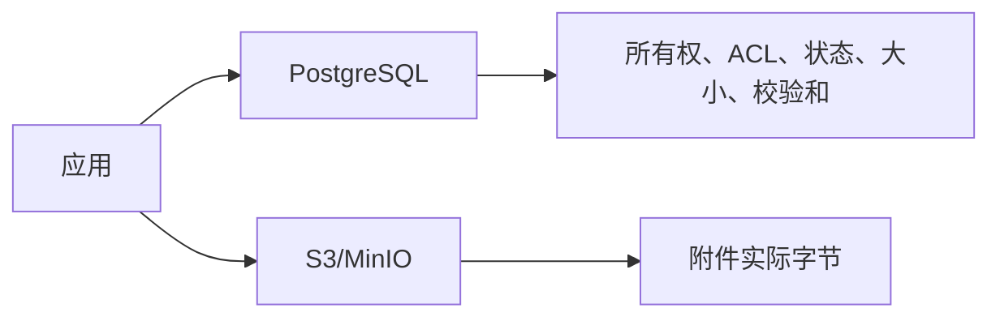

# S3 与 MinIO 对象存储

> [!summary] 一句话解释
> **对象存储把文件当作带 Key 和元数据的 Object（对象）保存在 Bucket（桶）中；Amazon S3 是最有影响力的对象存储服务和 API 体系，MinIO 是常用于私有环境的 S3 兼容对象存储实现。**

## 生活类比

文件系统像办公室文件柜：文件放在层层目录里，可以移动、改名和局部修改。

对象存储像大型仓储中心：每件货物有唯一编号 Key，放入某个仓库 Bucket，通过编号和权限领取整件货物。

## Object 由什么组成

一个对象通常包含：

- **Key**：对象名称或标识；
- **Value**：实际字节内容；
- **Metadata**：类型、长度、自定义信息等；
- **Version ID**：启用版本控制时区分不同版本。

```text
Bucket: company-attachments
Key: tenants/8f2a/random-object-id
Value: 文件字节
Metadata: content-type, checksum...
```

Key 中的 `/` 往往只是名称前缀，不一定是真实目录。

## 为什么附件不直接存 PostgreSQL

数据库可以保存二进制字段，但大量大文件会影响：

- 数据库体积；
- 备份和恢复时间；
- 查询缓存；
- 主从复制；
- 数据库 I/O；
- 生命周期和分层存储。

常见分工是：



PostgreSQL 决定“谁有权访问”，对象存储负责“保存和传输字节”。

## S3 是什么

**Amazon S3（Simple Storage Service）**是 AWS 的对象存储服务。S3 API 已成为对象存储领域广泛采用的接口风格。

常见操作：

- 创建和管理 Bucket；
- `PutObject` 上传；
- `GetObject` 下载；
- `HeadObject` 查询元数据；
- `DeleteObject` 删除；
- Multipart Upload 分片上传；
- Versioning 版本控制；
- Lifecycle 生命周期规则；
- Object Lock 不可变保留。

## MinIO 是什么

MinIO 是面向私有环境和数据基础设施的对象存储产品，提供 S3 兼容 API。应用使用 S3 SDK 时，常能通过配置 Endpoint 接入 MinIO。

“S3 兼容”不保证每个 AWS 功能、限制和管理行为完全相同，仍要对实际版本做兼容性测试。

## 分片上传

大文件可以拆成多个 Part：

```text
初始化Multipart Upload
  ↓
上传Part 1、Part 2、Part 3……
  ↓
记录每片ETag或校验信息
  ↓
完成上传并组合对象
```

优点：

- 失败时只重传部分分片；
- 可以并行上传；
- 适合大文件和不稳定网络。

但服务端需要管理上传状态、过期时间、配额和未完成分片清理。

## Presigned URL 是什么

**Presigned URL（预签名 URL）**是带短期授权的对象访问地址。

应用服务器先检查用户权限，再签发一个只能在短时间内执行指定操作的 URL。浏览器可以直接向对象存储上传或下载，减少应用服务器转发大文件的压力。

预签名 URL 应限制：

- 有效期；
- Bucket 和 Key；
- 上传或下载操作；
- 请求方法；
- 必要的长度和校验条件。

### 预签名 URL 不是永久公开链接

URL 在有效期内通常相当于持有者凭证，可能被浏览器历史、日志、聊天或截图泄露，因此应短期、最小权限，并避免把秘密密钥塞进对象元数据。

## 校验和与 ETag

上传后要验证对象是否完整。可以使用明确的 SHA-256 等校验和。

不能在所有情况下把 ETag 当作文件 MD5：分片上传、服务端加密和不同实现可能产生不同语义。

## 对象存储不是权限数据库

对象存储的 Bucket Policy/IAM 很重要，但业务系统通常还要在数据库中保存：

- 租户；
- 所有者；
- 会话和消息；
- 文档 ACL；
- 配额；
- 上传状态；
- 法律保留；
- 删除和迁移状态。

每次下载前应重新检查业务权限，不能只因为用户知道 Key 就允许下载。

## 随机对象 Key

不要把企业名、用户手机号、原始文件名和机密业务字段直接放进 Key。

更安全的方式是使用不可预测随机 ID，并把原始文件名加密保存或放在受保护数据库中。

## 客户端加密与 SSE-KMS

两个“加密层”要区分：

- **客户端 E2EE**：文件在客户端加密，对象存储只看到密文；
- **SSE-KMS（Server-Side Encryption with KMS）**：对象到达存储服务后，由存储层再次加密静态数据。

SSE-KMS 可以作为第二道保护，但不能替代 E2EE，因为存储服务仍可能参与解密。

## 生命周期和删除

生命周期规则可以自动：

- 转低成本存储层；
- 删除过期对象；
- 清理未完成分片；
- 保留历史版本。

清理程序必须避免误删：

- 正在上传的对象；
- 法律保留对象；
- 备份对象；
- 数据库仍标记为权威的对象；
- 正在迁移或恢复的对象。

## 从本地文件迁移到对象存储

正确顺序：

```text
复制 → 下载或读取校验 → 切换权威位置 → 双读宽限 → 删除旧副本
```

如果复制或校验失败，本地源仍应保持权威。不要先删后传。

## 常见误区

### 对象存储就是网络硬盘

它不是普通挂载盘，更新、重命名、目录和文件锁语义不同。应用应使用对象 API 设计。

### Bucket 私有就不需要业务 ACL

Bucket 私有只解决一层访问控制，企业、账号、文档和会话权限仍需业务系统判断。

### 有 ETag 就一定验证了完整 SHA-256

不同上传方式和服务实现的 ETag 语义可能不同，应使用明确校验算法。

### 删除数据库记录就会自动删除对象

数据库和对象存储是两个系统，需要状态机、重试、幂等和孤儿清理。

## 在 Otto 中的作用

在 [[Otto产品总体技术架构]] 中：

- S3/MinIO 保存企业附件密文和备份对象；
- PostgreSQL 保存对象所有权、ACL、配额和状态；
- 客户端 E2EE 文件密钥不能进入 URL、对象标签或日志；
- 上传采用分片、校验、租约和可恢复状态机；
- 从本地附件迁移时先复制校验，再切换权威位置。

## 参考资料

- [Amazon S3 官方文档](https://docs.aws.amazon.com/s3/)
- [Amazon S3 Objects Overview](https://docs.aws.amazon.com/AmazonS3/latest/userguide/UsingObjects.html)
- [MinIO 官方文档](https://min.io/docs/)
- 核对日期：2026-08-21。
