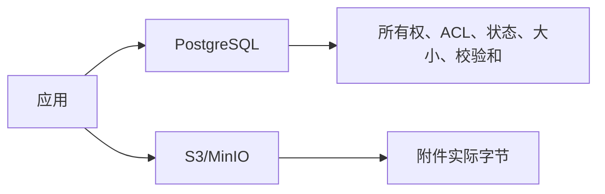
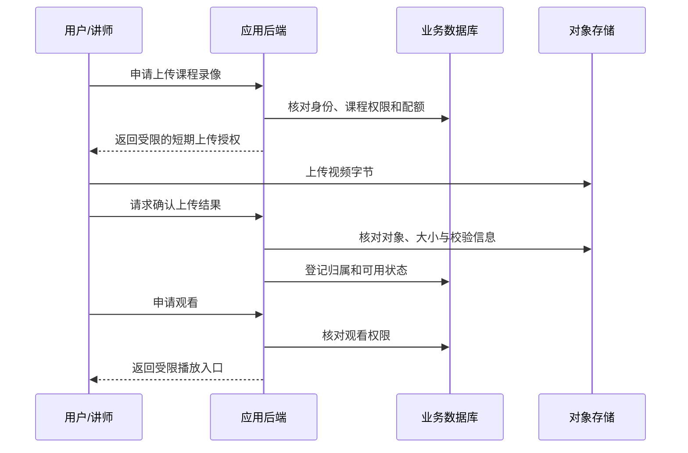

# S3 与 MinIO 对象存储

> [!summary] 一句话解释
> **对象存储把文件等字节内容连同名称、描述信息一起作为 Object（对象）保存在 Bucket（桶）中，程序通过接口上传和读取。它是一种存储组织与访问方式，不是一种新硬盘；S3、OSS、COS 和 MinIO 是相关服务或产品。**

> [!note] 本次学习范围
> 2026-10-04 补充核对对象存储基础、常见产品、预签名地址及计费边界。下文主要讨论通用对象接口；特殊目录桶、追加写入、表格/向量等产品扩展需要另看具体文档，不把某家产品的全部行为推广到所有对象存储。

## 先从上传一张图片理解

你在电脑上可以把图片存成 `D:\photos\cover.jpg`，程序通过本地文件路径读取它。

做成多人使用的网站后，图片还可以存到对象存储。程序告诉存储服务：

```text
请把这张图片的字节内容
保存到 lecture-assets 这个桶里
对象名称是 covers/lesson-001.jpg
```

以后需要图片时，程序提供桶名、对象名称和必要的授权，再向服务请求读取。**API（Application Programming Interface，应用程序编程接口，按 A-P-I 读）**就是软件之间发出这些请求的接口。

“对象”在这里是一个存储单元，不要求它是某种面向对象编程语言创建的对象。图片、视频、文本、备份包、模型文件，甚至程序临时生成的一段字节，都可以保存成对象。

在底层，对象存储仍然依赖服务器、硬盘和网络。托管服务替你管理这些基础设施；自建系统则仍要自己承担容量、可用性、安全和维护责任。

## 生活类比

文件系统像办公室文件柜：文件放在层层目录里，可以移动、改名和局部修改。

对象存储像大型仓储中心：每件货物有编号 Key，放入某个仓库 Bucket，通过编号和权限领取货物。编号主要在指定桶的范围内标识对象，并不要求在所有存储系统中全球唯一。

这个类比用于理解对象的组织方式，不表示每次下载都必须取回整个文件；例如 S3 支持按字节范围读取对象的一部分。[GetObject 接口](https://docs.aws.amazon.com/AmazonS3/latest/API/API_GetObject.html)

## Object 由什么组成

一个对象通常包含：

- **Key（键、对象名称，读音 /kiː/）**：对象在桶内的名称或标识；这里不是加密密钥，也不是访问密码。
- **Data / Value（内容）**：实际字节内容，例如一张图片的数据。
- **Metadata（元数据）**：描述内容的信息，例如文件类型、长度、自定义说明；不是文件正文。
- **Version ID（版本标识）**：在支持并启用版本控制的场景中，区分同一 Key 下的不同版本。

**Bucket（存储桶，读音 /ˈbʌkɪt/）**是容纳对象的逻辑容器，可以关联存储位置、访问策略和生命周期规则等设置。它不是一块独占硬盘，也不意味着必须预先占满某个固定容量。

```text
Bucket: company-attachments
Key: tenants/8f2a/random-object-id
Value: 文件字节
Metadata: content-type, checksum...
```

Key 中的 `/` 往往只是名称前缀，不一定是真实目录。

例如 `covers/lesson-001.jpg` 在控制台中可能显示为 `covers` 文件夹下的一张图，但在通用对象接口里，它可以只是一个完整名称。以 S3 通用桶为例，前缀可以模拟目录；不要因此默认支持普通文件系统的目录改名、文件锁和局部修改语义。[对象名称说明](https://docs.aws.amazon.com/AmazonS3/latest/userguide/object-keys.html)

对象的名称、数据、元数据与版本的划分，也可参考 [OSS 对象结构](https://www.alibabacloud.com/help/en/oss/user-guide/object-overview)。知道名称只解决“找哪个对象”，不代表有权访问。

## 对象存储、文件存储、块存储和硬盘有什么区别

这三种存储方式描述的是不同访问抽象，不是三种互不相容的物理材料。

| 方式 | 使用者主要看到什么 | 常见操作 | 常见用途 |
|---|---|---|---|
| 块存储 | 一系列可寻址的数据块，通常表现为磁盘卷 | 按块读写，常在上面建立文件系统 | 系统盘、数据库数据卷 |
| 文件存储 | 文件、目录和路径 | 打开、读取、修改、重命名；具体共享与锁语义看实现 | 本地工作目录、共享文件目录 |
| 对象存储 | 桶、对象名称、内容和元数据 | 上传、获取、查询属性、删除等接口操作 | 图片、视频、附件、备份、数据集 |

例如，一块物理硬盘可以提供块访问，操作系统在其上建立文件系统；对象存储软件又可以利用底层磁盘和文件系统保存对象。它们不是“有对象存储就不需要硬盘”的关系。基础见 [[磁盘与网卡：存储设备和网络接口]]。[三种存储方式的比较](https://aws.amazon.com/compare/the-difference-between-block-file-object-storage/)

通用对象存储常见更新方式是上传替换整个对象或产生新版本，而不是像本地文件那样随意原地修改若干字节。某些产品提供追加、目录或挂载功能，但不能假定其延迟、锁、重命名和一致性语义与普通磁盘完全相同。

## 它与网盘、数据库有什么关系

- **网盘**是面向用户的应用，提供界面、同步、分享、回收站等功能；其底层可以使用对象存储，但两者不是同义词。
- **数据库**擅长组织、查询和更新业务记录，例如“哪些课程已购买”“订单状态是什么”；对象存储常用来保存记录引用的实际附件。
- 对象存储也能保存表格、日志等结构化数据文件，但基础对象接口不等于完整的关系数据库查询与事务能力；分析、表格或向量功能往往还需要额外引擎或产品能力。

## 哪些场景适合，哪些需要谨慎

常见适用场景包括用户头像、商品图片、课程录像、知识库原始文档、软件安装包、备份和模型权重文件。

如果程序频繁原地修改同一文件的小片段、依赖特定文件锁，或者直接要求本地文件系统语义，就不能只把路径换成对象地址。普通数据库的实时数据文件和 Obsidian 的工作目录，都不宜未经专门适配就当成对象存储上的普通文件来操作。

你的 `D:\krxstudy` 仍是本地文件系统中的 Obsidian 仓库；Git 提交和推送负责版本管理与同步，不等于已经使用了对象存储。以后若用对象存储保存附件或备份，还需要明确同步工具、冲突处理与恢复流程。

## 为什么附件不直接存 PostgreSQL

数据库可以保存二进制字段，但大量大文件会影响：

- 数据库体积；
- 备份和恢复时间；
- 查询缓存；
- 主从复制；
- 数据库 I/O；
- 生命周期和分层存储。

常见分工是：


```mermaid
flowchart LR
    PG["PostgreSQL"] --> Meta["所有权、ACL、状态、大小、校验和"]
    S3["S3/MinIO"] --> Bytes["附件实际字节"]
    App["应用"] --> PG
    App --> S3
```

更准确地说，**业务后端依据 PostgreSQL 中的记录执行用户、租户和文档授权；对象存储执行自己的访问策略，并保存和传输实际字节。** 数据库里存了权限字段，不等于业务后端已经正确检查了权限。

这是常见分工，不是“数据库绝对不能存文件”。小规模、需要与业务记录保持紧密事务关系的二进制数据，也可以根据需求存进数据库。

## 用授课平台串起数据库、对象存储和 CDN

假设你要保存一节课程录像：

| 信息或内容 | 常见保存/处理位置 |
|---|---|
| 课程名称、讲师、价格、哪些用户可以观看 | 业务数据库 |
| 录像、封面、讲义的实际字节 | 对象存储 |
| 临近用户的可缓存内容副本 | CDN 边缘节点 |

**CDN（Content Delivery Network，内容分发网络，按 C-D-N 读）**负责内容分发与加速，可以把对象存储作为源站，但不是原始数据的永久备份。


```mermaid
sequenceDiagram
    participant U as 用户/讲师
    participant A as 应用后端
    participant D as 业务数据库
    participant O as 对象存储
    U->>A: 申请上传课程录像
    A->>D: 核对身份、课程权限和配额
    A-->>U: 返回受限的短期上传授权
    U->>O: 上传视频字节
    U->>A: 请求确认上传结果
    A->>O: 核对对象、大小与校验信息
    A->>D: 登记归属和可用状态
    U->>A: 申请观看
    A->>D: 核对观看权限
    A-->>U: 返回受限播放入口
```

这是示意流程；浏览器直传或后端转发都可以采用。直传可以减轻业务后端搬运大文件的负担，但授权、校验和状态管理仍要由受控系统负责。生产流程还需避免对象在验证后被不当覆盖，并考虑失败重试、超时清理和必要的内容检查。

**存下录像不等于实现直播平台。** 直播推流、实时分发、视频转码、不同清晰度、播放鉴权等，还需要专门的媒体处理和业务能力。参见 [[CDN内容分发网络：边缘缓存、回源与加速]]、[[直播平台开发前的需求、架构、成本与验收清单]]。

## S3 是什么

**Amazon S3（Simple Storage Service，简单存储服务，读作 S-three）**是 **AWS（Amazon Web Services，亚马逊云服务）**提供的对象存储服务。S3 API 是领域内广泛支持的一套接口，但“S3 兼容产品”不等于 AWS 自己运营的 S3。

常见操作：

- 创建和管理 Bucket；
- `PutObject` 上传；
- `GetObject` 下载；
- `HeadObject` 查询元数据；
- `DeleteObject` 删除；
- Multipart Upload 分片上传；
- Versioning 版本控制；
- Lifecycle 生命周期规则；
- Object Lock 不可变保留。

## MinIO 是什么

MinIO 是对象存储产品/项目名称，其相关产品提供 S3 兼容 API。**SDK（Software Development Kit，软件开发工具包，按 S-D-K 读）**可以帮助程序调用接口；应用使用相应 S3 SDK 时，常能通过配置 **Endpoint（服务端点，也就是接口地址）**接入兼容存储。

“S3 兼容”不保证每个 AWS 功能、限制和管理行为完全相同，仍要对实际版本做兼容性测试。

2026-10-04 核对时，MinIO 的官方文档入口指向 AIStor 文档。学习旧教程时需要分清历史社区版本、当前产品及各自的许可和支持范围，不要因为都叫 MinIO 就假定部署方式和功能完全相同。[当前官方文档](https://docs.min.io/aistor/)

## OSS、COS 又是什么

| 名称 | 全称或定位 | 与对象存储的关系 |
|---|---|---|
| Amazon S3 | Simple Storage Service | 亚马逊云的具体对象存储服务 |
| 阿里云 OSS | Object Storage Service，对象存储服务，按 O-S-S 读 | 阿里云的具体对象存储服务 |
| 腾讯云 COS | Cloud Object Storage，云对象存储，按 C-O-S 读 | 腾讯云的具体对象存储服务 |
| MinIO / AIStor | 对象存储相关产品 | 可部署的 S3 兼容实现；版本、许可与支持范围需核对 |

对象存储是技术类别，这些是服务或产品名称。这里的 OSS 特指阿里云产品，不是其他语境中“开源软件”的缩写。[阿里云 OSS](https://www.alibabacloud.com/help/en/oss/user-guide/what-is-oss/)、[腾讯云 COS](https://intl.cloud.tencent.com/zh/document/product/436)

## 分片上传

大文件可以拆成多个 Part：

```text
初始化Multipart Upload
  ↓
上传Part 1、Part 2、Part 3……
  ↓
记录每片ETag或校验信息
  ↓
完成上传并组合对象
```

优点：

- 失败时只重传部分分片；
- 可以并行上传；
- 适合大文件和不稳定网络。

但服务端需要管理上传状态、过期时间、配额和未完成分片清理。

## Presigned URL 是什么

**Presigned URL（预签名地址）**是带限时授权的对象访问地址。**URL（Uniform Resource Locator，统一资源定位符，按 U-R-L 读）**可以先理解为资源的访问地址。

应用服务器先检查用户权限，再签发一个只能在短时间内执行指定操作的 URL。浏览器可以直接向对象存储上传或下载，减少应用服务器转发大文件的压力。

预签名 URL 应限制：

- 有效期；
- Bucket 和 Key；
- 上传或下载操作；
- 请求方法；
- 必要的长度和校验条件。

这些限制需要按具体上传方式实现：不是给任意 URL 附上一个“最大长度”字段就会生效。例如普通预签名上传、表单上传策略与后端验证的能力不同，应核对服务文档。

### 预签名 URL 不是永久公开链接

URL 在有效期内通常相当于持有者凭证，可能被浏览器历史、日志、聊天或截图泄露，因此应短期、最小权限，并避免把秘密密钥塞进对象元数据。

它通常也**不是一次性链接**。例如 S3 预签名 URL 在有效条件仍满足时可以多次使用；它的能力受签发身份权限、请求操作、对象、有效期等约束。前端可以拿受限的临时授权，但不应该因此获得全桶长期管理凭据。[S3 预签名 URL 文档](https://docs.aws.amazon.com/AmazonS3/latest/userguide/using-presigned-url.html)

## 校验和与 ETag

上传后要验证对象是否完整。可以使用明确的 SHA-256 等校验和。

不能在所有情况下把 ETag 当作文件 MD5：分片上传、服务端加密和不同实现可能产生不同语义。

## 对象存储不是权限数据库

对象存储的 Bucket Policy/IAM 很重要，但业务系统通常还要在数据库中保存：

- 租户；
- 所有者；
- 会话和消息；
- 文档 ACL；
- 配额；
- 上传状态；
- 法律保留；
- 删除和迁移状态。

业务后端在授权下载或签发链接前应检查业务权限，不能只因为用户知道 Key 就允许下载。若采用预签名直连，后续请求通常不会每次都经过业务后端；禁用业务账号也不一定让已签发的链接立即失效，必须把短有效期、撤销方式和网关鉴权纳入设计。

## 随机对象 Key

不要把企业名、用户手机号、原始文件名和机密业务字段直接放进 Key。

更安全的方式是使用不可预测随机 ID，并把原始文件名加密保存或放在受保护数据库中。

## 客户端加密与 SSE-KMS

两个“加密层”要区分：

- **客户端 E2EE**：文件在客户端加密，对象存储只看到密文；
- **SSE-KMS（Server-Side Encryption with KMS）**：对象到达存储服务后，由存储层再次加密静态数据。

SSE-KMS 可以作为第二道保护，但不能替代 E2EE，因为存储服务仍可能参与解密。**E2EE（End-to-End Encryption，端到端加密）**强调由通信或数据使用端控制解密边界；**KMS（Key Management Service，密钥管理服务）**管理加密密钥与相关操作。详见 [[端到端加密E2EE与MLS]]。

## 与 KMS、Secret、IAM、配置管理和 Egress 的关系

接上 [[生产安全五件套：KMS、Secret、IAM、配置管理与Egress授权]]：

- **KMS**：为存储加密提供密钥保护，但不能替代访问控制。
- **Secret 管理**：保管确实需要的长期访问凭据；平台支持时可优先用短期身份凭据，减少长期密码分发。
- **IAM（Identity and Access Management，身份与访问管理）**：规定哪个身份能对哪个桶或对象执行读取、上传、删除等操作。
- **配置管理**：管理桶名、区域、服务地址、保留策略等配置及其变更。
- **Egress（出站）授权**：限制应用可以连接哪些存储端点；把机密文件上传到外部云存储，仍然是数据离开本地边界。

私有访问权限不等于物理位置在本地；加密保存也不等于任意上传都符合数据外发要求。

## 费用为什么不只是“存了多少文件”

托管对象存储的账单可能包括：

- 按容量与时长计算的存储费用；
- 上传、下载、列举等请求费用；
- 对外分发和跨区域等流量费用；
- 低频或归档数据的取回费用及最低保存时长相关费用；
- 历史版本、未完成分片、复制和附加处理产生的费用。

例如一段录像只保存一份，却被很多用户播放，存储容量变化不大，但分发流量会增加。使用 CDN 后，还应分别核对源站和 CDN 的计费项，不能只计算一个仓库容量。

“归档便宜”也不代表适合在线课程随时播放：有的归档层需要恢复等待。具体价格、等待时间和规则依服务、区域与存储类别而定，不在本笔记固定记一个数值。[OSS 计费组成](https://www.alibabacloud.com/help/en/oss/billing-overview)、[S3 定价分类](https://aws.amazon.com/s3/pricing/)

## 生命周期和删除

生命周期规则可以自动：

- 转低成本存储层；
- 删除过期对象；
- 清理未完成分片；
- 保留历史版本。

清理程序必须避免误删：

- 正在上传的对象；
- 法律保留对象；
- 备份对象；
- 数据库仍标记为权威的对象；
- 正在迁移或恢复的对象。

## 从本地文件迁移到对象存储

正确顺序：

```text
复制 → 下载或读取校验 → 切换权威位置 → 双读宽限 → 删除旧副本
```

如果复制或校验失败，本地源仍应保持权威。不要先删后传。

## 常见误区

### 对象存储就是网络硬盘

它不是普通挂载盘，更新、重命名、目录和文件锁语义不同。应用应使用对象 API 设计。

### Bucket 私有就不需要业务 ACL

Bucket 私有只解决一层访问控制，企业、账号、文档和会话权限仍需业务系统判断。

### 有 ETag 就一定验证了完整 SHA-256

不同上传方式和服务实现的 ETag 语义可能不同，应使用明确校验算法。

### 删除数据库记录就会自动删除对象

数据库和对象存储是两个系统，需要状态机、重试、幂等和孤儿清理。

### 对象存储很可靠，所以不用备份

硬件冗余和高持久性不能自动防止误删、凭据被盗、错误生命周期规则或应用逻辑覆盖。版本控制、隔离备份、不可变保留和恢复演练解决不同问题，也都需要正确配置。

### 有对象地址就能公开访问

地址解决“访问哪里”，权限解决“是否允许”。私有桶中的对象即使地址可推导，也应拒绝无授权请求；随机 Key 不是授权的替代品。

### 对象存储天生只能最终一致

一致性要看具体产品和操作。例如 Amazon S3 对对象写入、覆盖、删除后的读取提供强一致性，但这不代表它与业务数据库之间自动拥有跨系统事务。[S3 一致性说明](https://docs.aws.amazon.com/AmazonS3/latest/userguide/Welcome.html#ConsistencyModel)

## 在 Otto 中的作用

在 [[Otto产品总体技术架构]] 中：

- S3/MinIO 保存企业附件密文和备份对象；
- PostgreSQL 保存对象所有权、ACL、配额和状态；
- 客户端 E2EE 文件密钥不能进入 URL、对象标签或日志；
- 上传采用分片、校验、租约和可恢复状态机；
- 从本地附件迁移时先复制校验，再切换权威位置。

## 参考资料

- [Amazon S3 官方文档](https://docs.aws.amazon.com/s3/)
- [Amazon S3 Objects Overview](https://docs.aws.amazon.com/AmazonS3/latest/userguide/UsingObjects.html)
- [MinIO 官方文档](https://min.io/docs/)
- 核对日期：2026-08-21。

本次基础概念与相关边界补充核对日期：**2026-10-04**，不代表对 Otto 项目的实现状态重新完成了审计。

- [Amazon S3：服务、桶、对象、权限与一致性](https://docs.aws.amazon.com/AmazonS3/latest/userguide/Welcome.html)
- [S3 对象名称与前缀](https://docs.aws.amazon.com/AmazonS3/latest/userguide/object-keys.html)
- [S3 GetObject：按范围读取](https://docs.aws.amazon.com/AmazonS3/latest/API/API_GetObject.html)
- [S3 预签名 URL](https://docs.aws.amazon.com/AmazonS3/latest/userguide/using-presigned-url.html)
- [块存储、文件存储与对象存储的比较](https://aws.amazon.com/compare/the-difference-between-block-file-object-storage/)
- [OSS：对象与元数据](https://www.alibabacloud.com/help/en/oss/user-guide/object-overview)
- [阿里云 OSS 概述](https://www.alibabacloud.com/help/en/oss/user-guide/what-is-oss/)
- [腾讯云 COS 文档](https://intl.cloud.tencent.com/zh/document/product/436)
- [MinIO AIStor 官方文档](https://docs.min.io/aistor/)
- [OSS 计费组成](https://www.alibabacloud.com/help/en/oss/billing-overview)
- [S3 计费分类](https://aws.amazon.com/s3/pricing/)

## 学习建议与关联概念

先掌握“桶 + 对象名称 + 内容 + 元数据”，再分清它与本地文件、数据库和 CDN 的职责；最后学习权限、上传状态、版本控制和成本。

- [[磁盘与网卡：存储设备和网络接口]]：硬件、块访问、文件系统和对象服务并非同一层。
- [[SDK与API]]：程序怎样请求上传和下载。
- [[SQLite、SQLCipher与PostgreSQL]]：业务记录为什么通常由数据库保存。
- [[CDN内容分发网络：边缘缓存、回源与加速]]：对象存储作为源站，边缘缓存负责分发。
- [[生产安全五件套：KMS、Secret、IAM、配置管理与Egress授权]]：存储身份、密钥、参数和数据外发边界。
- [[状态机与幂等性]]：上传、确认、删除和失败重试怎样保持可恢复。
