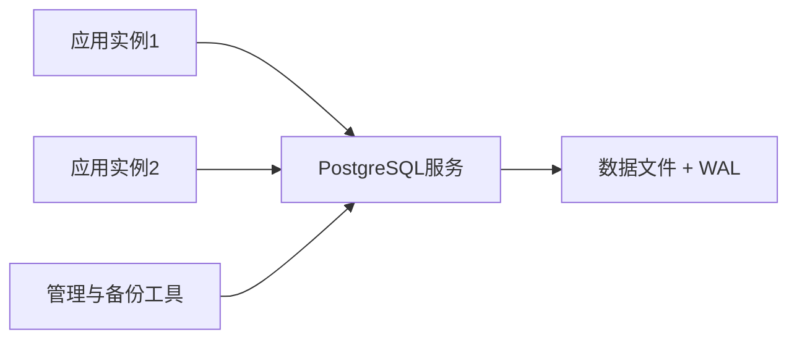

# SQLite、SQLCipher 与 PostgreSQL

> [!summary] 一句话区分
> **SQLite 是嵌入应用的单机文件数据库；SQLCipher 是为 SQLite 数据库文件增加透明整库加密的专用实现；PostgreSQL 是适合服务器、多用户并发和复杂企业数据的独立数据库服务。**

## 生活类比

- **SQLite**：个人抽屉里的账本，轻便，不需要专门管理员。
- **SQLCipher**：给这本账本加上密码锁，内容落盘时是密文。
- **PostgreSQL**：公司的档案管理中心，有专门服务、并发控制、权限、备份和审计。

## 数据库先解决什么问题

数据库负责有组织地保存和查询数据，并尽量保证：

- 多项修改要么一起成功，要么一起失败；
- 程序崩溃后数据仍能恢复一致；
- 多个操作不会相互踩坏；
- 可以按条件快速查询；
- 权限和约束能够阻止非法数据。

使用 [[ORM]] 时，程序可以用对象操作数据库，但底层仍然是数据库事务和 SQL。

## SQLite 是什么

SQLite 是一个嵌入式关系数据库。应用直接加载 SQLite 库，并读写一个本地数据库文件，不需要另外启动数据库服务器。

### 适合场景

- 桌面应用；
- 手机应用；
- 浏览器或嵌入式设备；
- 单机工具；
- 本地缓存；
- 小规模数据和离线场景；
- 自动化测试。

### 优点

- 配置简单；
- 数据库通常就是一个文件；
- 不需要独立服务进程；
- 支持事务、索引、SQL 和约束；
- 备份和携带方便。

### 边界

- 写并发能力和服务器数据库不同；
- 不适合让多台服务器共同写同一个文件；
- 把数据库放在 NFS、SMB/CIFS 等网络共享盘上多实例写入会引入锁和文件系统语义问题；
- 数据库文件被复制后，普通 SQLite 默认不提供整库加密。

## SQLite 的 WAL

**WAL（Write-Ahead Log，预写日志，读作“沃尔”）**表示修改先记录到日志，再逐步合并到主数据库。

SQLite WAL 模式中：

```text
读取者主要读取数据库文件
写入者把新修改追加到 -wal 文件
检查点再把 WAL 内容合回数据库
```

它可以改善读写并发，但不是“无限并发”，也不是把 SQLite 变成分布式数据库。

## SQLCipher 是什么

SQLCipher 是基于 SQLite 的加密数据库实现。应用仍使用大部分 SQLite API，但数据库页在写入磁盘前被加密，读取时再解密。

它主要保护：

- 数据库主文件；
- 页面内容；
- 合理配置下的 WAL/Journal 等持久化内容；
- 数据库文件被直接复制后的静态数据。

### SQLCipher 不保护什么

- 已经在应用内存中解密的数据；
- 用户主动导出的明文文件；
- 被恶意程序读取的屏幕或进程内存；
- 弱口令和泄露的密钥；
- 应用本身的越权查询。

> [!important] 算法不要混淆
> SQLCipher 官方设计有自己的页加密、KDF 和 HMAC 方案，常见设计不是简单地把每条记录用 AES-GCM 包一层。项目另外使用 AES-GCM 加密业务信封，也不代表 SQLCipher 本身使用同一种模式。

### 使用要点

- 密钥不能写进代码、日志或普通配置文件；
- 启动时应验证当前库确实支持 SQLCipher，不能失败后回落到明文 SQLite；
- 迁移、`rekey`、备份和恢复都要真实测试；
- 更换密钥可能重写大量数据库页面；
- 忘记密钥且没有恢复材料，数据通常无法解密。

## PostgreSQL 是什么

**PostgreSQL（常简称 Postgres，读作“Post格瑞斯”）**是独立运行的开源关系数据库服务器。

应用通过网络或本机 Socket 连接 PostgreSQL 服务：



### 适合场景

- Web 后端；
- 多用户企业系统；
- 多实例服务；
- 复杂事务和查询；
- 权限、审计和数据约束；
- 主从复制、备份和高可用；
- 需要长期作为权威数据源的业务。

### PostgreSQL 的能力

- ACID 事务；
- 多版本并发控制 MVCC；
- 丰富 SQL、索引和数据类型；
- 角色和权限；
- 约束、触发器和扩展；
- WAL、复制、备份和 PITR。

## PostgreSQL 的 WAL

PostgreSQL 使用 WAL 保证数据完整性。核心顺序是：

```text
先把“准备怎样修改”的 WAL 记录持久化
  ↓
再把实际数据页逐步写入磁盘
```

如果数据库崩溃，可以重放 WAL，把数据页恢复到一致状态。

WAL 还能支持：

- 在线备份；
- 流复制；
- 热备；
- PITR。

## PITR 是什么

**PITR（Point-in-Time Recovery，时间点恢复）**表示把数据库恢复到某个指定时间，而不只是恢复到某个完整备份文件的时间。

通常需要：

```text
基础备份 + 从备份开始的一整段连续WAL归档
```

恢复时先还原基础备份，再重放 WAL，直到目标时间。

### 例子

如果下午 15:10 误删了数据，可以尝试恢复到 15:09:59 的一致状态，而不是丢掉当天全部操作。

### PITR 不是回收站

- 需要提前正确归档 WAL；
- 需要足够的存储和保留策略；
- 必须演练恢复；
- 恢复通常针对整个数据库集群时间线；
- 配置文件等外部内容还要另外备份。

## 三者怎样选择

| 问题 | 推荐方向 |
|---|---|
| 单机桌面应用、离线使用 | SQLite |
| 单机数据库文件需要加密 | SQLCipher |
| 多个服务实例和企业并发 | PostgreSQL |
| 需要服务端权限、复制和 PITR | PostgreSQL |
| 只想给普通 SQLite 文件加登录密码 | 不能只靠应用登录；考虑 SQLCipher 和密钥管理 |

## 常见误区

### SQLite 是“玩具数据库”

SQLite 是成熟数据库，适合非常多单机场景；它的问题不是能力低，而是部署模型和服务器数据库不同。

### SQLCipher 会自动解决全部数据安全

它主要保护数据库落盘文件。密钥、内存、导出、权限和应用漏洞仍需单独保护。

### WAL 就是备份

WAL 是恢复和复制的重要日志，但没有基础备份、归档策略和恢复演练，不能等同于完整备份系统。

### PostgreSQL 一定比 SQLite 好

PostgreSQL 功能更强，但需要安装、运维、权限、连接池和备份。单机小应用可能使用 SQLite 更合适。

## 在 Otto 中的作用

在 [[Otto产品总体技术架构]] 中：

- Desktop 使用本机 SQLite/SQLCipher 保存离线会话和缓存；
- 企业 Server 使用 PostgreSQL 保存账号、组织、审计和业务权威数据；
- 多实例不能共同写一个共享 SQLite 文件；
- PostgreSQL 的 WAL、备份和 PITR 用于企业恢复；
- SQLCipher 原生库是否真实打包和验收属于发布门禁。

## 参考资料

- [SQLite 官方文档：Write-Ahead Logging](https://www.sqlite.org/wal.html)
- [SQLCipher 官方文档](https://www.zetetic.net/sqlcipher/documentation/)
- [PostgreSQL 官方文档：WAL](https://www.postgresql.org/docs/current/wal-intro.html)
- [PostgreSQL 官方文档：Continuous Archiving 与 PITR](https://www.postgresql.org/docs/current/continuous-archiving.html)
- 核对日期：2026-08-21。
