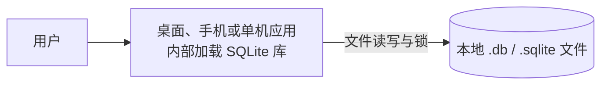
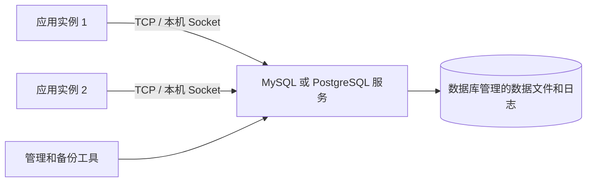
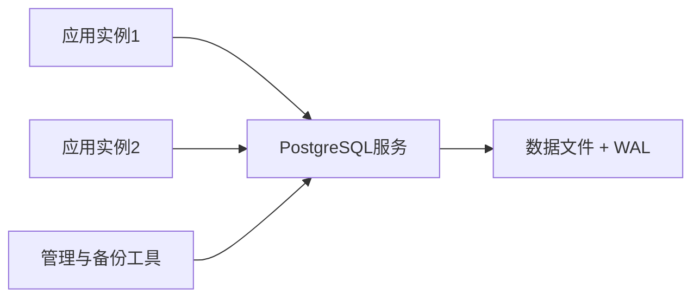
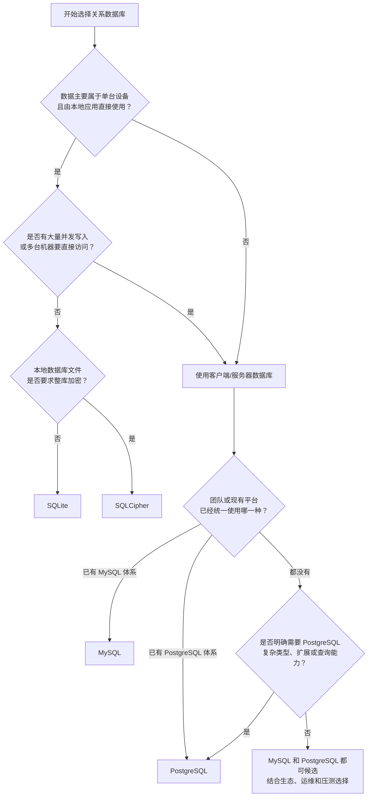

# SQLite、MySQL、SQLCipher 与 PostgreSQL

> [!summary] 一句话区分
> **SQLite 是由应用直接读写本地数据库文件的嵌入式数据库；MySQL 和 PostgreSQL 是独立运行、通过网络为多个应用提供服务的数据库服务器；SQLCipher 则是在 SQLite 基础上增加整库加密。**

最重要的区别不是“谁的 SQL 写法更好”，而是：

```text
SQLite：数据库引擎在你的应用进程里面，数据通常是一个本地文件
MySQL/PostgreSQL：数据库引擎是独立服务，应用通过 TCP 或本机 Socket 请求它
```

初学者可以先用下面这条规则选择：

> **数据只属于一台设备、希望零运维、写入并发不高，优先考虑 SQLite；多个应用实例或多台机器要共同读写权威数据，优先考虑 MySQL 或 PostgreSQL。**

## 生活类比

- **SQLite**：个人抽屉里的账本，轻便，不需要专门管理员。
- **SQLCipher**：给这本账本加上密码锁，内容落盘时是密文。
- **MySQL**：公司的标准业务账房，工具普及、人员容易招聘，常见网站和管理系统都能使用。
- **PostgreSQL**：公司的档案管理中心，有专门服务、并发控制、权限、备份和审计。

SQLite 与 MySQL/PostgreSQL 的关系，有点像：

- SQLite：Excel 文件跟着个人应用走，但拥有真正的 SQL、事务、索引和约束；
- MySQL/PostgreSQL：公司部署一套中央系统，所有业务人员通过受控接口访问。

这个类比只用于帮助理解部署形态。SQLite 不是电子表格，MySQL/PostgreSQL 也不只是“放在服务器上的大文件”。

## 数据库先解决什么问题

数据库负责有组织地保存和查询数据，并尽量保证：

- 多项修改要么一起成功，要么一起失败；
- 程序崩溃后数据仍能恢复一致；
- 多个操作不会相互踩坏；
- 可以按条件快速查询；
- 权限和约束能够阻止非法数据。

使用 [[ORM]] 时，程序可以用对象操作数据库，但底层仍然是数据库事务和 SQL。

## SQL、数据库和数据库管理系统不是同一个东西

### SQL 是语言

**SQL（Structured Query Language，结构化查询语言，读作“艾斯 Q 艾尔”或“sequel”）**是一套描述数据查询和修改的语言。

例如：

```sql
SELECT name, price
FROM product
WHERE price < 100;
```

这段 SQL 的意思是：从 `product` 表中找出价格小于 100 的商品，并返回名称和价格。

### 数据库是被保存的数据集合

日常说“这个数据库”可能指：

- 某个 SQLite 文件；
- MySQL 服务器中的一个逻辑 Database；
- PostgreSQL 集群中的一个 Database；
- 更宽泛的一整套数据系统。

### DBMS 是管理数据库的软件

**DBMS（Database Management System，数据库管理系统）**才是 SQLite、MySQL、PostgreSQL 这类软件所属的类别。

它们都能使用 SQL，但各自拥有不同的：

- SQL 方言；
- 数据类型；
- 函数；
- 索引类型；
- 并发控制；
- 备份、复制和扩展能力。

所以“都会 SQL”不代表可以直接互换。

## 两种根本不同的部署结构

### SQLite：应用直接打开文件



这里没有单独的 SQLite 服务器进程，也没有默认监听端口。应用进程自己执行 SQL，并通过操作系统文件接口读写数据库文件。

SQLite 官方称这种模式为 **Serverless（无独立服务器）**。这里不是指“云厂商替你管理服务器”的云 Serverless，而是指数据库引擎真的在应用进程内运行。

### MySQL/PostgreSQL：应用请求数据库服务



应用一般不能绕过数据库服务直接修改底层数据文件。数据库服务统一负责：

- 身份认证与权限；
- 多连接并发；
- 缓存和查询执行；
- 事务、锁和崩溃恢复；
- 日志、复制、备份和监控。

MySQL 默认 TCP 端口通常是 `3306`，PostgreSQL 通常是 `5432`。端口只是默认值，可以修改；SQLite 没有这类服务器监听端口。

## SQLite 是什么

SQLite 是一个嵌入式关系数据库。应用直接加载 SQLite 库，并读写一个本地数据库文件，不需要另外启动数据库服务器。

### 适合场景

- 桌面应用；
- 手机应用；
- 浏览器或嵌入式设备；
- 单机工具；
- 本地缓存；
- 小规模数据和离线场景；
- 自动化测试。

### 优点

- 配置简单；
- 数据库通常就是一个文件；
- 不需要独立服务进程；
- 支持事务、索引、SQL 和约束；
- 备份和携带方便。

### 边界

- 写并发能力和服务器数据库不同；
- 不适合让多台服务器共同写同一个文件；
- 把数据库放在 NFS、SMB/CIFS 等网络共享盘上多实例写入会引入锁和文件系统语义问题；
- 数据库文件被复制后，普通 SQLite 默认不提供整库加密。

## SQLite 的 WAL

**WAL（Write-Ahead Log，预写日志，读作“沃尔”）**表示修改先记录到日志，再逐步合并到主数据库。

SQLite WAL 模式中：

```text
读取者主要读取数据库文件
写入者把新修改追加到 -wal 文件
检查点再把 WAL 内容合回数据库
```

它可以改善读写并发，但不是“无限并发”，也不是把 SQLite 变成分布式数据库。

## SQLCipher 是什么

SQLCipher 是基于 SQLite 的加密数据库实现。应用仍使用大部分 SQLite API，但数据库页在写入磁盘前被加密，读取时再解密。

它主要保护：

- 数据库主文件；
- 页面内容；
- 合理配置下的 WAL/Journal 等持久化内容；
- 数据库文件被直接复制后的静态数据。

### SQLCipher 不保护什么

- 已经在应用内存中解密的数据；
- 用户主动导出的明文文件；
- 被恶意程序读取的屏幕或进程内存；
- 弱口令和泄露的密钥；
- 应用本身的越权查询。

> [!important] 算法不要混淆
> SQLCipher 官方设计有自己的页加密、KDF 和 HMAC 方案，常见设计不是简单地把每条记录用 AES-GCM 包一层。项目另外使用 AES-GCM 加密业务信封，也不代表 SQLCipher 本身使用同一种模式。

### 使用要点

- 密钥不能写进代码、日志或普通配置文件；
- 启动时应验证当前库确实支持 SQLCipher，不能失败后回落到明文 SQLite；
- 迁移、`rekey`、备份和恢复都要真实测试；
- 更换密钥可能重写大量数据库页面；
- 忘记密钥且没有恢复材料，数据通常无法解密。

## MySQL 是什么

**MySQL（官方读法为“My Ess Que Ell”，国内也常读“麦 SQL”）**是由 Oracle 开发、发布和支持的关系型数据库管理系统。最常见形态是独立运行的 MySQL Server，应用通过驱动或命令行客户端连接它。

MySQL 经常用于：

- 网站和 Web API 后端；
- 电商、内容管理系统和企业管理系统；
- Java、PHP、Python、Go、Node.js 等服务端程序；
- 多用户、多应用实例共同读写的数据；
- 需要账号权限、备份、复制和监控的业务系统。

### MySQL Server、客户端和 Workbench 的区别

- **MySQL Server**：真正保存数据、执行查询和管理事务的数据库服务；
- **MySQL Client**：命令行客户端，用来连接服务器并执行 SQL；
- **MySQL Workbench**：图形化管理工具，本身不是数据库服务器；
- **Connector/Driver（连接器/驱动）**：让 Java、Python 等程序和 MySQL 通信的库。

只安装 Workbench 不一定已经安装或启动 MySQL Server。Workbench 更像“数据库遥控器”，Server 才是“数据库机器”。

### InnoDB 是什么

MySQL 支持不同 **Storage Engine（存储引擎）**。存储引擎负责表数据怎样落盘、怎样加锁、怎样建立索引和恢复。

现代 MySQL 的默认存储引擎通常是 **InnoDB**。MySQL 8.4 官方文档列出的关键能力包括：

- ACID 事务；
- `COMMIT` 提交和 `ROLLBACK` 回滚；
- 崩溃恢复；
- 行级锁；
- MVCC 多版本并发控制；
- 主键聚簇索引；
- 外键约束；
- Redo Log 与 Undo Log。

因此不能笼统地说“MySQL 不支持事务”。更准确地说，事务能力和表使用的存储引擎有关；当前新建业务表通常应确认使用 InnoDB。

### MySQL 怎样处理多个并发请求

多个应用连接 MySQL Server 后，服务器统一调度它们。InnoDB 可以让不同事务并发读写不同数据，并在发生冲突时使用 MVCC、行锁和事务隔离维持一致性。

但“支持并发”不等于“连接越多越快”。高并发下仍要治理：

- 慢 SQL 和缺失索引；
- 长事务；
- 热点行锁竞争；
- 死锁；
- 连接池耗尽；
- CPU、内存和磁盘 I/O 饱和；
- 复制延迟。

具体排查框架见 [[高并发系统：瓶颈分析、扩容与稳定性治理]]。

### MySQL 的日志不要混在一起

初学者经常看到下面几种日志：

- **Redo Log（重做日志）**：InnoDB 用于崩溃恢复，保证已提交修改可以恢复；
- **Undo Log（撤销日志）**：支持事务回滚和 MVCC 的旧版本读取；
- **Binary Log / Binlog（二进制日志）**：MySQL Server 记录数据变更，常用于复制和时间点恢复；
- **Slow Query Log（慢查询日志）**：帮助找到耗时查询；
- **Error Log（错误日志）**：记录服务器启动、运行和故障信息。

它们目的不同，不能把“开了 Binlog”简单等同于“已经有可靠备份”。仍然需要完整备份、日志保留和恢复演练。

### MySQL 的优点

- Web 开发生态普及，驱动、框架和运维工具丰富；
- 团队容易找到经验和资料；
- InnoDB 适合常见在线事务处理；
- 支持复制、备份、高可用和托管云服务；
- 对常见增删改查业务十分成熟。

### MySQL 的边界

- 需要安装、配置、升级、监控和备份；
- 应用要管理连接池、超时和凭据；
- 暴露网络端口就要配置认证、TLS 和防火墙；
- 高并发和大数据量不会因为换成 MySQL 自动解决；
- 它和 PostgreSQL 的 SQL、类型、索引、复制及扩展机制并不相同。

## PostgreSQL 是什么

**PostgreSQL（常简称 Postgres，读作“Post格瑞斯”）**是独立运行的开源关系数据库服务器。

应用通过网络或本机 Socket 连接 PostgreSQL 服务：



### 适合场景

- Web 后端；
- 多用户企业系统；
- 多实例服务；
- 复杂事务和查询；
- 权限、审计和数据约束；
- 主从复制、备份和高可用；
- 需要长期作为权威数据源的业务。

### PostgreSQL 的能力

- ACID 事务；
- 多版本并发控制 MVCC；
- 丰富 SQL、索引和数据类型；
- 角色和权限；
- 约束、触发器和扩展；
- WAL、复制、备份和 PITR。

### PostgreSQL 和 MySQL 的侧重点

两者都是成熟的客户端/服务器式关系数据库，都能完成绝大多数常见 Web 业务。初学者不应把它们理解成“一个能做复杂业务，一个只能做简单业务”。

比较常见的侧重点是：

- MySQL 在传统 Web 开发、内容管理、电商和大量现有系统中非常普及；
- PostgreSQL 对 SQL 标准、复杂查询、丰富数据类型、扩展机制和严格数据约束投入较深；
- PostgreSQL 常用 `JSONB`、数组、自定义类型、表达式/部分索引以及 PostGIS 等扩展处理复杂数据；
- MySQL 的 InnoDB、复制体系、运维工具和 Web 生态也非常成熟；
- 同一个业务在两者上通常都能实现，但具体语法、执行计划、索引、复制和运维方法不同。

选择时更应考虑：

- 团队现有经验；
- 云平台和运维体系；
- ORM/驱动兼容性；
- 数据类型与查询需求；
- 复制、高可用和恢复目标；
- 真实负载测试结果；
- 迁移和长期维护成本。

“网上有人说某数据库更快”不能直接作为选型证据。性能与版本、表结构、索引、SQL、硬件、缓存、并发方式和数据规模密切相关。

## PostgreSQL 的 WAL

PostgreSQL 使用 WAL 保证数据完整性。核心顺序是：

```text
先把“准备怎样修改”的 WAL 记录持久化
  ↓
再把实际数据页逐步写入磁盘
```

如果数据库崩溃，可以重放 WAL，把数据页恢复到一致状态。

WAL 还能支持：

- 在线备份；
- 流复制；
- 热备；
- PITR。

## PITR 是什么

**PITR（Point-in-Time Recovery，时间点恢复）**表示把数据库恢复到某个指定时间，而不只是恢复到某个完整备份文件的时间。

通常需要：

```text
基础备份 + 从备份开始的一整段连续WAL归档
```

恢复时先还原基础备份，再重放 WAL，直到目标时间。

### 例子

如果下午 15:10 误删了数据，可以尝试恢复到 15:09:59 的一致状态，而不是丢掉当天全部操作。

### PITR 不是回收站

- 需要提前正确归档 WAL；
- 需要足够的存储和保留策略；
- 必须演练恢复；
- 恢复通常针对整个数据库集群时间线；
- 配置文件等外部内容还要另外备份。

## SQLite、MySQL 和 PostgreSQL 核心对比

| 对比维度 | SQLite | MySQL（通常指 InnoDB） | PostgreSQL |
|---|---|---|---|
| 产品形态 | 嵌入式数据库库 | 独立数据库服务器 | 独立数据库服务器 |
| 应用怎样访问 | 应用直接打开本地文件 | 通过驱动和网络/Socket 访问服务 | 通过驱动和网络/Socket 访问服务 |
| 是否需要安装服务 | 不需要独立服务 | 需要 | 需要 |
| 默认网络端口 | 没有 | 通常 `3306` | 通常 `5432` |
| 典型数据位置 | 一个设备上的单个数据库文件及日志文件 | 由服务管理的数据目录、表空间和日志 | 由服务管理的数据目录、表空间和 WAL |
| 多个并发读取者 | 支持 | 支持 | 支持 |
| 多个并发写入者 | 同一数据库文件同一时刻只有一个写事务 | 支持，由事务、MVCC 和行锁协调 | 支持，由事务、MVCC 和锁协调 |
| 数据库用户和角色 | 没有服务器级数据库用户；主要靠文件权限和应用权限 | 有账号、角色和权限 | 有角色和细粒度权限 |
| 远程多机器直连 | 不适合共享文件直连 | 适合 | 适合 |
| 事务 | 支持 | InnoDB 支持 | 支持 |
| 外键 | 支持，但应用应确认已启用 | InnoDB 支持 | 支持 |
| 高可用和复制 | 不自带服务器复制体系 | 有复制、集群及云服务方案 | 有流复制、逻辑复制及生态方案 |
| 备份 | 文件快照或 SQLite Backup API，需保证一致性 | 逻辑/物理备份加 Binlog 等 | 逻辑/物理备份加 WAL 等 |
| 运维复杂度 | 低 | 中到高 | 中到高 |
| 典型用途 | 手机、桌面、嵌入式、离线、本地缓存、测试 | 网站、业务后台、电商、常规 OLTP | 复杂业务系统、数据约束、复杂查询和扩展需求 |

### 为什么 SQLite 只能同时有一个写事务

SQLite 需要协调对同一个数据库文件的修改。即使开启 WAL，它也主要改善“读取者不必因为写入而全部停下”，并没有把同一个数据库文件变成多写节点系统。

SQLite 官方说明：

- 可以有许多同时读取者；
- 每个数据库文件在任意时刻只能有一个写入者；
- 写事务足够短时，多个写入者可以排队轮流完成；
- 如果业务要求许多客户端同时持续写入，应考虑客户端/服务器数据库。

这不代表 SQLite “只能单线程”或“一有两个人就不能用”。真正要看的是写事务数量、持续时间和是否能排队。

### SQLite 放到共享网盘能否变成多人数据库

通常不应该这样做。

如果多台电脑通过 SMB、NFS 等网络文件系统直接打开同一个 SQLite 文件，会把 SQLite 对文件锁和一致性的要求交给网络文件系统。网络延迟、断线或锁实现问题可能导致性能和可靠性风险。

正确思路通常是：

```text
多台客户端
    ↓ 网络 API
一台应用服务器
    ↓
SQLite（轻量场景）或 MySQL/PostgreSQL（常规多用户场景）
```

如果客户端需要直接通过数据库协议共同访问，则优先使用 MySQL/PostgreSQL 这类服务器数据库。

### 数据量大小不是唯一判断标准

常见误解是：

```text
数据小 → SQLite
数据大 → MySQL/PostgreSQL
```

数据量确实重要，但部署和并发写入往往更早决定选择：

- 一个很大的单机分析文件仍可能适合 SQLite 或 DuckDB；
- 一个数据量不大但有 20 台应用服务器同时写入的系统，更适合 MySQL/PostgreSQL；
- 一个手机 App 即使有几十万条本地记录，也不一定需要运行 MySQL Server。

## 怎样选择：从问题出发

### 选择 SQLite 的典型情况

- 数据属于当前设备或当前用户；
- 应用要离线工作；
- 不希望安装和维护数据库服务；
- 写入并发较低；
- 桌面、手机、嵌入式或单机工具；
- 本地缓存、配置、搜索索引或测试数据；
- 希望把复杂结构保存成便携的单文件。

### 选择 SQLCipher 的典型情况

- 原本适合 SQLite；
- 但数据库文件被复制后也不能直接看到明文；
- 团队能正确管理密钥、迁移、备份和恢复。

SQLCipher 的前提仍是“这个场景适合 SQLite”。它不是把 SQLite 变成服务器数据库。

### 选择 MySQL 的典型情况

- 常见 Web 业务和管理系统；
- 团队、云平台或已有系统主要使用 MySQL；
- 多个应用实例共同访问；
- 需要成熟的 InnoDB 事务、复制和运维生态；
- 使用的产品或框架明确优先支持 MySQL/MariaDB。

### 选择 PostgreSQL 的典型情况

- 多用户服务端权威数据；
- 重视复杂查询和严格的数据约束；
- 需要丰富类型、`JSONB`、地理空间或其他扩展；
- 希望使用 PostgreSQL 的 SQL、索引和扩展能力；
- 团队已有 PostgreSQL 运维和高可用经验。

### 一个简单决策树



## MySQL 和 MariaDB 是什么关系

**MariaDB** 源自 MySQL，是独立发展的开源关系数据库服务器。它与 MySQL 在客户端协议、连接器和许多 SQL 用法上高度兼容，因此一些 Linux 环境会用 MariaDB 替代 MySQL。

但现代 MySQL 和 MariaDB 已经持续分化：

- 版本号不能一一对应；
- JSON、认证、复制、GTID、系统变量和部分 SQL 行为可能不同；
- 不能因为应用能连上，就认为所有功能和数据文件完全兼容；
- 迁移前必须按具体版本检查兼容矩阵，并做备份和测试。

初学阶段可以把 MariaDB 先理解为“MySQL 家族中高度兼容但已经独立发展的另一套数据库”，不要把两个名字当成同一软件。

## 其他常见数据库放在哪里

### SQL Server

**Microsoft SQL Server** 是微软的商业关系数据库，常见于 .NET、Windows、Azure 和企业信息系统，也支持 Linux。它有自己的 T-SQL 方言、管理工具、商业版本和授权体系。

### Oracle Database

**Oracle Database** 是 Oracle 的企业级商业关系数据库，常见于大型金融、通信、政府和传统核心业务。能力和生态成熟，但授权、运维和专业知识成本通常较高。

MySQL 虽然也由 Oracle 公司维护，但 **MySQL 不等于 Oracle Database**，它们是两个不同产品。

### DuckDB

**DuckDB** 也是嵌入式数据库，但主要面向 **OLAP（Online Analytical Processing，在线分析处理）**：批量扫描、聚合 CSV/Parquet 和数据分析。SQLite 更常用于嵌入式事务数据；两者用途不能只按“都是单文件”判断。

### MongoDB

**MongoDB** 是文档数据库，主要用类似 JSON/BSON 的文档组织数据，不属于传统关系型数据库。它并不是“完全没有结构”，而是结构和约束方式不同。

### Redis

**Redis** 是以内存数据结构为核心的数据服务，常用于缓存、计数、限流、短期状态和协调。它通常不能直接替代保存订单、余额等权威关系数据的 MySQL/PostgreSQL。详见 [[Redis缓存与分布式协调]]。

## 常见误区

### SQLite 是“玩具数据库”

SQLite 是成熟数据库，适合非常多单机场景；它的问题不是能力低，而是部署模型和服务器数据库不同。

### SQLite 完全不能用于网站

不准确。单台应用服务器、写入压力不大、数据和应用在同一设备时，SQLite 可以支持实际网站。更关键的迁移信号是：

- 需要多台服务器直接共同访问；
- 大量并发写事务不能排队；
- 需要服务器级角色权限；
- 需要成熟的复制、高可用和集中运维。

### 开发用 SQLite，生产换 MySQL，不用改代码

ORM 可以隐藏一部分差异，但不能保证完全相同。常见差异包括：

- 数据类型和自动类型转换；
- 大小写、排序规则和字符集；
- 日期时间、布尔值和 JSON；
- 外键检查；
- 自增主键；
- 锁、事务隔离和并发行为；
- SQL 函数、分页和 DDL；
- 索引和查询计划。

如果生产使用 MySQL/PostgreSQL，集成测试最好也覆盖相同数据库类型和接近生产的版本。

### MySQL、PostgreSQL 只是 SQLite 加了网络端口

不对。服务器数据库拥有长期运行的服务进程，统一管理缓存、并发、账号权限、日志、复制、备份和远程连接；不是简单地在 SQLite 文件前面套一个端口。

### MySQL 一定比 PostgreSQL 快，或 PostgreSQL 一定比 MySQL 强

这种结论缺少业务条件。数据库性能要结合具体版本、SQL、索引、数据分布、读写比例、事务冲突、硬件和配置压测。功能也应按项目真正需要的类型、扩展和运维方案比较。

### 连接越多，服务器数据库越快

连接池能复用连接，但数据库 CPU、内存、锁和磁盘容量有限。资源饱和后，更多活跃连接会增加排队和竞争。连接池应设置上限并通过真实负载调优，详见 [[高并发系统：瓶颈分析、扩容与稳定性治理]]。

### SQLCipher 会自动解决全部数据安全

它主要保护数据库落盘文件。密钥、内存、导出、权限和应用漏洞仍需单独保护。

### WAL 就是备份

WAL 是恢复和复制的重要日志，但没有基础备份、归档策略和恢复演练，不能等同于完整备份系统。

### PostgreSQL 一定比 SQLite 好

PostgreSQL 功能更强，但需要安装、运维、权限、连接池和备份。单机小应用可能使用 SQLite 更合适。

## 初学者学习建议

建议按下面顺序实践：

1. 用 SQLite 建一张表，练习 `INSERT`、`SELECT`、`UPDATE`、`DELETE`；
2. 学习主键、唯一约束、外键和索引；
3. 学习事务的提交与回滚；
4. 理解 SQLite 文件、WAL 和“一个写事务”的含义；
5. 安装 MySQL 或 PostgreSQL，认识 Server、Client、端口、用户和权限；
6. 用程序驱动或 [[ORM]] 连接服务器数据库；
7. 观察连接池、慢查询和 `EXPLAIN` 查询计划；
8. 学习备份和真实恢复；
9. 最后再学习复制、高可用、分区和高并发治理。

第一次学习 SQL，SQLite 最省安装成本；第一次学习 Web 后端数据库，MySQL 和 PostgreSQL 任选一种深入即可。不要同时死记三套方言。

## 在 Otto 中的作用

在 [[Otto产品总体技术架构]] 中：

- Desktop 使用本机 SQLite/SQLCipher 保存离线会话和缓存；
- 企业 Server 使用 PostgreSQL 保存账号、组织、审计和业务权威数据；
- 多实例不能共同写一个共享 SQLite 文件；
- PostgreSQL 的 WAL、备份和 PITR 用于企业恢复；
- SQLCipher 原生库是否真实打包和验收属于发布门禁。

## 关联概念

- [[ORM]]：程序中的对象和数据库表怎样映射，以及为什么 ORM 不能抹平全部数据库差异。
- [[高并发系统：瓶颈分析、扩容与稳定性治理]]：连接池、慢 SQL、索引、锁和数据库容量怎样影响高并发。
- [[状态机与幂等性]]：数据库怎样配合唯一约束和事务防止重复业务结果。
- [[Redis缓存与分布式协调]]：Redis 与关系数据库的分工，以及缓存为什么不能自动替代权威数据源。
- [[系统代理、VPN与端口]]：MySQL/PostgreSQL 的 TCP 端口和网络路径。
- [[防火墙与端口对外开放]]：远程数据库端口开放为什么需要谨慎控制来源。
- [[TLS与数字证书]]：应用远程连接数据库时怎样保护传输内容和验证服务端。

## 参考资料

- [SQLite 官方文档：Appropriate Uses For SQLite](https://sqlite.org/whentouse.html)
- [SQLite 官方文档：SQLite Is Serverless](https://www.sqlite.org/serverless.html)
- [SQLite 官方文档：Write-Ahead Logging](https://www.sqlite.org/wal.html)
- [SQLCipher 官方文档](https://www.zetetic.net/sqlcipher/documentation/)
- [MySQL 8.4 官方文档：What is MySQL?](https://dev.mysql.com/doc/refman/8.4/en/what-is-mysql.html)
- [MySQL 8.4 官方文档：Introduction to InnoDB](https://dev.mysql.com/doc/refman/8.4/en/innodb-introduction.html)
- [PostgreSQL 官方文档：What Is PostgreSQL?](https://www.postgresql.org/docs/current/intro-whatis.html)
- [PostgreSQL 官方文档：MVCC Introduction](https://www.postgresql.org/docs/current/mvcc-intro.html)
- [PostgreSQL 官方文档：WAL](https://www.postgresql.org/docs/current/wal-intro.html)
- [PostgreSQL 官方文档：Continuous Archiving 与 PITR](https://www.postgresql.org/docs/current/continuous-archiving.html)
- [MariaDB 官方文档：MariaDB versus MySQL Compatibility](https://mariadb.com/docs/release-notes/compatibility-and-differences/mariadb-vs-mysql-compatibility)
- 核对日期：2026-08-29。
