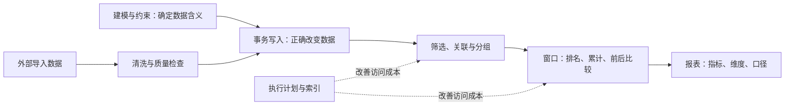

# SQL 与关系型数据库学习地图

> [!summary] 一句话解释
> SQL 学习涵盖“数据怎样存得合理、查询怎样算得正确、并发和故障下怎样保持可靠、怎样定位性能问题”。复杂统计、窗口函数和索引是这套能力中的不同部分。

**SQL** 是 **Structured Query Language（结构化查询语言，读作 S-Q-L，也有人读作 sequel）**。它用于定义数据结构、查询和修改数据，以及控制事务和访问权限。

MySQL、PostgreSQL、SQLite 是数据库系统，SQL 是与它们交流的一种语言。产品差异见 [[SQLite、SQLCipher与PostgreSQL]]，对象代码怎样映射到表见 [[ORM]]。

## 学习顺序与本套笔记

| 顺序 | 笔记 | 学会回答的问题 |
|---|---|---|
| 0 | [[SQL订单实战：样例数据与练习]] | 表长什么样，怎样运行示例，结果怎样核对 |
| 1 | [[SQL基础查询与多表关联]] | 筛选、排序、NULL、JOIN、分组和子查询怎么写 |
| 2 | [[关系型数据库设计：建模、约束与范式]] | 一行代表什么，表怎么拆，怎样阻止坏数据 |
| 3 | [[SQL复杂统计与报表设计]] | 金额、人数、比例、退款、复购和多维报表怎么算 |
| 4 | [[SQL窗口函数：排名、累计与同期比较]] | 怎样排名、取每组最新记录、累计、移动平均和比较同期 |
| 5 | [[SQL数据清洗与质量校验]] | 怎样识别缺失、重复、格式错误并保留处理记录 |
| 6 | [[SQL事务、锁与并发一致性]] | 多步写入如何一起完成，抢库存如何避免超卖 |
| 7 | [[SQL索引、执行计划与性能优化]] | 查询为什么慢，索引如何设计，怎样验证改进 |
| 8 | [[B+树与数据库索引原理]] | 页、树、聚簇/二级索引、回表和联合索引为什么这样工作 |
| 9 | [[数据库事务日志、主从复制与故障恢复]] | 日志怎样支持提交和恢复，复制延迟与备份有什么区别 |

这套笔记包含学习地图、九篇专题和配套练习入口，共十一篇。先建立基本查询能力，再沿专题深入。不要把学习过程变成背诵几百个关键字。

## 一张图串起这些能力

## 生活类比

把数据库想成一个订单档案室：表设计决定用什么表格记账；约束负责验收表格；SQL 查询负责找资料和算账；索引像额外目录；事务像“这笔业务的几张单据必须一起办妥”；报表则把明细整理成经营指标。

目录建得再好，也不能修复原始账目含义不清或重复算钱的问题。因此先验证结果，再优化速度。

## 方言与验证范围

本套公共示例尽量使用 SQLite、PostgreSQL 和现代 MySQL 都常见的 SQL，金额统一以整数“分”保存。窗口函数练习需要支持窗口函数的版本，例如 MySQL 8.0+。

以 PostgreSQL 为目标的方言示例会在代码前标明，例如 `GROUPING SETS`、有序集聚合和执行计划选项；这些特性不一定是 PostgreSQL 独有，但产品支持和写法有差别。不能把某一产品的函数名、锁行为或隔离级别结论直接套给另一产品。

配套验证脚本在本机 SQLite 的内存数据库中直接执行标有 `-- lab:` 的代码块，核对样例结果、约束和回滚。这验证公共示例的逻辑；**不等于已经在 MySQL/PostgreSQL 中实测过方言、执行计划、并发锁或生产性能**。

## 八个基本概念

- Table（表）：一类数据的集合，如订单。
- Row（行）：一条记录，如订单 101。
- Column（列）：记录的一项属性，如金额。
- Key（键）：标识记录或表达关联的字段。
- Grain（粒度）：一行究竟代表一个订单、一件商品，还是某天某城市的汇总。
- Constraint（约束）：数据库强制执行的数据规则。
- Query（查询）：说明想要哪些结果，由数据库规划怎样取得。
- Transaction（事务）：把一组数据库操作作为一个提交或回滚单位。

## SQL 语句的类别

| 类别 | 英文全称与中文 | 示例 |
|---|---|---|
| DDL | Data Definition Language，数据定义语言 | `CREATE TABLE`、`ALTER TABLE` |
| DML | Data Manipulation Language，数据操作语言 | `INSERT`、`UPDATE`、`DELETE` |
| 查询 | `SELECT` 有时单列为 DQL：Data Query Language，数据查询语言 | `SELECT ... FROM ...` |
| TCL | Transaction Control Language，事务控制语言 | `BEGIN`、`COMMIT`、`ROLLBACK` |
| DCL | Data Control Language，数据控制语言 | 支持账户权限的数据库中的 `GRANT`、`REVOKE` |

这些分类是学习用的整理方式，资料对 SELECT 的归类并不总相同。

## 从业务问题转成 SQL 的五步

1. 写清问题：统计哪个时间范围、哪个人群、哪个状态。
2. 确定粒度：一行订单还是一行商品明细。
3. 找表和关系：每次 JOIN 会把一行变成几行。
4. 先在小样本手算，再写 SQL 和验证。
5. 正确后查看执行计划、数据规模和运行开销。

## 学完后还能继续什么

- 递归查询：组织树、分类树、路径，处理深度上限和循环。
- 视图、物化视图与汇总表：封装逻辑与提前计算，注意数据新鲜度。
- JSON（JavaScript Object Notation，JavaScript 对象表示法，常读作 Jason）、全文搜索与地理索引：适合特定数据，不是所有字段的默认选择。
- 存储过程和触发器：把部分逻辑放入数据库，注意隐式副作用与维护成本。
- 数据仓库：事实表、维度表、星型模型、历史维度和批次。
- 权限、参数绑定、备份、恢复、复制和监控：数据库工程不可缺少的部分。
- 分区、分库分表、分布式数据库：先掌握单库建模、索引和事务，再分析是否有必要。

相关：[[高并发系统：瓶颈分析、扩容与稳定性治理]]、[[开发、测试、预发布与生产环境]]、[[状态机与幂等性]]。

## 参考资料

核对日期：2026-09-08。

- [PostgreSQL：SQL 语言文档](https://www.postgresql.org/docs/current/sql.html)
- [MySQL 8.4：窗口函数](https://dev.mysql.com/doc/refman/8.4/en/window-functions.html)
- [SQLite：窗口函数](https://sqlite.org/windowfunctions.html)
