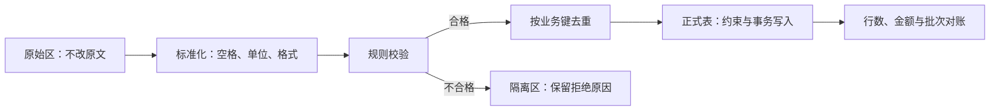

# SQL 数据清洗与质量校验

> [!summary] 一句话解释
> 数据清洗是按明确规则识别和处理缺失、重复、格式不一致与业务异常，同时保留原始数据及处理依据。

像整理收来的报名表：先扫描留底，再统一格式、查重复和漏填，把可接受数据送入正式名单；不是把看不顺眼的行直接删掉。

**ETL = Extract, Transform, Load（抽取、转换、加载，读作 E-T-L）**；ELT 调换后两步，先加载再转换。是否使用 SQL 是实现选择，能否追溯是质量要求。

## 可追溯的流程



来源、批次号、抓取时间、原始主键和规则版本，帮助解释“这条记录从哪里来，为什么变成这样”。

## 缺失不等于零，格式异常不等于可以猜

- 库存 0 是已知没有库存；NULL 可能是尚未同步。
- `00123` 可能是有前导零的业务编号，不应无脑转整数。
- 日期 `03/04/2026` 可能是 3 月 4 日或 4 月 3 日，必须知道来源格式。
- 货币必须带单位与币种；100 分不等于 100 元。
- CAST 转换失败的处理因产品不同，有的报错，有的截断或转换成意外值。先校验、再转换，不把 CAST 当清洗规则。

## 样例：整理并去重联系人

原始表 `raw_contacts` 有 8 行，包含空邮箱、格式错误、大小写与空格不一致，以及同一邮箱的新旧记录。数据见 [[SQL订单实战：样例数据与练习]]。

本练习**假定业务把邮箱整体按大小写不敏感识别同一联系人**，所以使用 LOWER；这不是所有邮件地址和所有系统都应执行的通用标准。也不擅自删除邮箱中的点号或加号后缀。

```sql
-- lab: contact_classification
WITH normalized AS (
  SELECT source_id, NULLIF(LOWER(TRIM(email_raw)), '') AS email
  FROM raw_contacts
)
SELECT source_id, email,
       CASE WHEN email IS NULL THEN 'missing_email'
            WHEN email NOT LIKE '%_@_%._%' OR email LIKE '% %'
              THEN 'invalid_email'
            ELSE 'accepted_candidate' END AS quality
FROM normalized ORDER BY source_id;
```

TRIM 去首尾空格，LOWER 转小写，NULLIF 把空字符串转缺失值，CASE 给出处理原因。这里 LIKE 只是很粗的教学筛选，并非完整邮箱标准校验，更不能证明邮箱存在或归用户所有。

接着仅在通过校验的候选记录中去重：

```sql
-- lab: clean_contacts
WITH normalized AS (
  SELECT source_id, NULLIF(LOWER(TRIM(email_raw)), '') AS email,
         TRIM(name_raw) AS name, updated_day
  FROM raw_contacts
), valid AS (
  SELECT * FROM normalized
  WHERE email LIKE '%_@_%._%' AND email NOT LIKE '% %'
), ranked AS (
  SELECT *, ROW_NUMBER() OVER (
    PARTITION BY email ORDER BY updated_day DESC, source_id DESC
  ) AS rn FROM valid
)
SELECT source_id, email, name FROM ranked
WHERE rn = 1 ORDER BY source_id;
```

保留来源 2、6、8；3、4 缺失，7 格式不合规则；1、5 是被较新版本替代的旧记录。

因此核对：8 条原始 = 3 条保留 + 3 条拒绝 + 2 条被替代。NULL 邮箱不代表这些人是同一个人，不应把所有缺失邮箱一起当作重复客户合并。

同日更新用 source_id 打破并列只是本练习规则；真实来源可能需要精确时间戳、事件版本、来源优先级或人工审核。用 ROW_NUMBER 去重前一定先定义“什么叫同一条”。

## 不要让去重掩盖业务事实

同一商品买两次、同一金额付两单不一定重复。应区分原始文件重复行、同一业务事件重试，以及真实的两次交易。

业务键例如 `(来源系统, 外部订单号)`，不一定等于数据库代理主键。重复导入时只让本地自增 ID 不同，并不能防止同一订单进来两次。

**UPSERT** 是 UPDATE 与 INSERT 组合形成的术语，表示冲突时更新、否则插入。PostgreSQL/SQLite 的 `ON CONFLICT` 与 MySQL 的 `ON DUPLICATE KEY UPDATE` 并非相同语法。需要先有合适唯一约束，还要防“迟到旧事件覆盖较新状态”。

重复处理得到同样业务结果叫 [[状态机与幂等性|幂等]]；只写一个 UPSERT 关键字不会自动解决乱序事件、重复扣款和消息丢失。

## 业务质量：订单总额是否等于明细

```sql
-- lab: order_amount_mismatches
WITH item_totals AS (
  SELECT order_id, SUM(quantity * unit_price_cents) AS cents
  FROM order_items GROUP BY order_id
)
SELECT o.order_id FROM orders o
LEFT JOIN item_totals i ON i.order_id = o.order_id
WHERE i.order_id IS NULL OR o.amount_cents <> i.cents
ORDER BY o.order_id;
```

样例返回 0 行，表示没发现缺明细或总额不符。真实业务如果有运费、优惠和税费，必须先把对账公式改对，不能拿本例简单等式误报。

检查退款不能超过订单额：

```sql
-- lab: excessive_refunds
SELECT r.order_id FROM refunds r
JOIN orders o ON o.order_id = r.order_id
GROUP BY r.order_id, o.amount_cents
HAVING SUM(r.amount_cents) > o.amount_cents
ORDER BY r.order_id;
```

样例返回 0 行。这是事后检测，不足以防止两个并发退款都通过事前检查；写入时还要在事务中协调同一订单的退款预算，见 [[SQL事务、锁与并发一致性]]。

## 质量检查的六个维度

| 维度 | 要问的问题 |
|---|---|
| 完整性 | 必填字段缺了多少；该来的日期/批次到了吗 |
| 唯一性 | 同一业务键是否重复 |
| 合法性 | 状态、日期、金额范围是否满足规则 |
| 关联完整性 | 是否有找不到父记录的订单 |
| 一致性 | 明细与总计、两个系统的金额是否对得上 |
| 时效性 | 数据距离真实发生时间延迟多久 |

检查结果应该保留数值、阈值和失败样本。例如“今天无订单”与“今天导入程序挂了”都可能得到 0，但解决办法完全不同。

## 修改正式数据的安全步骤

1. 保留源数据，确认备份/恢复途径和修改权限。
2. 先 SELECT 预览目标与预期行数，在练习库或副本验证。
3. 以批次标识和业务键控制范围，必要时分批提交，避免超长锁等待。
4. 在事务内修改并检查影响行数、唯一约束和对账。
5. 记录修改前后值、规则版本，观察后续报表和增量任务。

不要把 `DELETE FROM 表` 或无 WHERE 的 UPDATE 当作学习练习。此套样例的清洗查询只生成结果，不覆盖 raw_contacts，不连接真实数据库。

学习建议：先解释 8 行各自为什么保留/拒绝/替代，再尝试给一行制造金额错误，确认质量查询能找出来；在内存练习库重建即可。

相关：[[SQL窗口函数：排名、累计与同期比较]]、[[SQL复杂统计与报表设计]]、[[关系型数据库设计：建模、约束与范式]]。

## 参考资料

核对日期：2026-09-08。

- [PostgreSQL：字符串函数](https://www.postgresql.org/docs/current/functions-string.html)
- [PostgreSQL：条件表达式](https://www.postgresql.org/docs/current/functions-conditional.html)
- [PostgreSQL：INSERT 与 ON CONFLICT](https://www.postgresql.org/docs/current/sql-insert.html)
- [SQLite：UPSERT](https://www.sqlite.org/lang_upsert.html)
