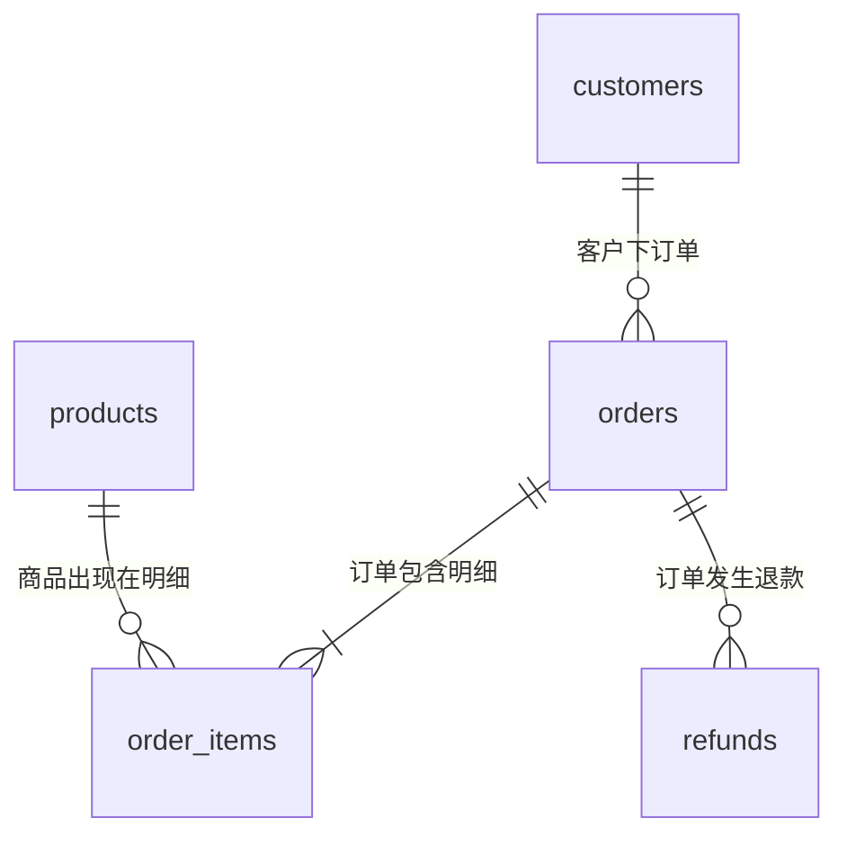

# 关系型数据库设计：建模、约束与范式

> [!summary] 一句话解释
> 数据库设计先决定“每一行代表什么”，再用主键标识、外键关联、约束保护数据，用范式减少同一事实被反复记录造成的矛盾。

可以把它理解为设计公司的登记表：客户信息只登记一次，订单凭客户编号找到客户，商品明细凭订单编号归属于订单。

入口：[[SQL与关系型数据库学习地图]]。完整建表和数据见 [[SQL订单实战：样例数据与练习]]。

## 先确定实体、粒度和关系

实体是业务中需要记录的事物，例如客户、订单、商品。粒度是“一行是什么”：一行订单不等于一行订单商品，也不等于一天的销售额。



图表达业务目标；外键只能保证每条明细找到订单，不能单独强制“每个订单至少有一条明细”，后者还需要提交业务时的检查。

- 一对多：一个客户可以有多个订单，一个订单属于一个客户。
- 多对多：一个订单包含多个商品，一个商品出现在多个订单；用明细表连接。
- 一对一：例如客户和可选的扩展资料，通常用外键加唯一约束表达。

## 主键：记录的身份证

**PK = Primary Key（主键，读作 P-K）**。主键选定一列或一组列作为记录的唯一标识，原则上唯一且非空。一张表只有一个主键约束，但主键可以包含多列。

`orders.order_id = 101` 标识一笔订单。金额不能当主键，因为不同订单可以同为 50 元；姓名不能当主键，因为人会重名、改名。

| 名称 | 含义 | 例子 |
|---|---|---|
| 候选键 | 能唯一标识记录且不含多余列的字段组合 | 满足业务规则的订单号 |
| 主键 | 从候选键中选出的主要标识 | `order_id` |
| 自然键 | 业务本来就有的标识 | 国家代码；是否稳定需要判断 |
| 代理键 | 为数据库关联额外引入的标识 | 自增整数编号 |
| 复合主键 | 多列联合才唯一 | `(order_id, line_no)` |
| 唯一约束 | 除主键之外也不允许重复的业务标识 | `external_order_no UNIQUE` |

明细表的 `(order_id, line_no)` 表示“某订单的第几行”。不能只用 `product_id`，同一种商品会出现在许多订单。是否允许同一订单同一商品多行，应由业务决定。

主键不等于自增，也不等于按创建时间连续无缺口。回滚、预分配等都可能留下编号空缺。**编号不是秘密，也不能代替访问权限检查。**

SQLite 有历史兼容例外：某些普通表的非 INTEGER 主键可能允许 NULL；需要明确 `NOT NULL` 或采用适当的严格表/无 rowid 表设计。练习中的整数主键使用 SQLite 的 `INTEGER PRIMARY KEY` 语义，不把这个行为推广到全部数据库。

## 外键：关系的数据库级检查

**FK = Foreign Key（外键，读作 F-K）**。例如：

```sql
-- 建表片段；完整可执行定义见配套 SQL 文件
customer_id INTEGER NOT NULL REFERENCES customers(customer_id)
```

意思是：订单中的客户编号必须指向存在的客户。它防止“订单写了客户 999，但客户表没有这个人”。外键通常引用主键或满足要求的唯一键，不要求两边字段同名。

外键和 JOIN 不同：外键在写入时维护关系；JOIN 在查询时匹配数据。没有外键也能 JOIN，但正确关系要靠其他机制维护；有外键也不会自动把客户姓名加进 SELECT 结果。

删除父记录时要选政策：

- 阻止删除：客户有历史订单时不允许直接删。
- 级联删除 `ON DELETE CASCADE`：子记录跟着删，便利但影响范围大。
- `SET NULL`：保留子记录，清空引用，要求列允许 NULL。

默认行为和约束检查时机因产品而异。不要为了让删除成功而随意关闭外键。SQLite 每个连接需确认 `PRAGMA foreign_keys = ON`。

## 约束：在入口阻止坏数据

| 约束 | 保护什么 | 不能代替什么 |
|---|---|---|
| NOT NULL | 必须提供值 | 不保证空字符串合法 |
| UNIQUE | 某列或组合不重复 | NULL 的处理要看数据库 |
| CHECK | 每行满足表达式 | 不自动表达跨表金额守恒 |
| FOREIGN KEY | 引用的父记录存在 | 不保证用户有权访问父记录 |
| PRIMARY KEY | 主要唯一身份 | 不保证业务单号也唯一 |

`CHECK (stock >= 0)` 配合 `NOT NULL` 才能同时防负数和缺失；CHECK 的表达式得到未知值时通常不作为违规。数据库规则与程序校验互补：程序提供友好提示，数据库守住最后一道边界。

多租户系统还要防跨租户关联。例如用 `(tenant_id, customer_id)` 的复合唯一键及对应复合外键，避免只检查 customer_id 存在却把甲公司的订单关联到乙公司的客户。

## 范式：减少重复事实，不是比赛谁拆表多

范式是检查关系结构是否容易产生重复和异常的规则。**NF = Normal Form（范式，读作 N-F）**。

先理解函数依赖：`客户编号 → 客户姓名` 表示在指定业务规则下，一个客户编号决定一个客户姓名；不是数学函数代码，而是数据含义上的决定关系。

### 第一范式：不要把需要独立处理的一组值塞进一个格子

不理想：订单表中 `product_ids = '10,20,30'`。查商品数量、关联价格、做外键都会困难。

更合适：订单明细一行一个明细项。第一范式通常用“字段值在当前模型下具有原子性、没有重复组”入门理解；是否原子取决于业务操作需求，不是字符串不能包含标点。

### 第二范式：不要只依赖复合键的一部分

错误示例：

`明细(订单号, 行号, 客户号, 商品号, 数量)`，主键是 `(订单号, 行号)`。

客户号只由订单号决定，不需要行号，所以放进每条明细会重复。将客户号留在订单表，明细只存该行自己的事实。第二范式要求满足第一范式，并消除非主属性对候选键的部分依赖。

### 第三范式：不要把依赖其他非键属性的事实顺手塞进来

`订单号 → 客户号 → 当前客户城市`。若每笔订单都保存“客户当前城市”，客户搬家需要修改很多行，漏改就矛盾。

第三范式在入门场景中可以理解为消除这类非键属性的传递依赖；严格定义涉及每个非平凡函数依赖的决定项是否为超键、依赖项是否为主属性，不要把通俗口诀当成完整数学定义。

三类异常：更新异常（同一事实不同版本）、插入异常（没订单就无法登记客户）、删除异常（删最后一笔订单顺便丢掉客户档案）。

进一步还有 **BCNF = Boyce–Codd Normal Form（博伊斯–科德范式，读作 B-C-N-F）** 等，处理更复杂的依赖。先能识别以上异常，再学形式化证明。

## 为什么订单仍然要保存成交单价和收货地址

商品“当前价格”与订单“下单时成交价”不是同一个事实。保存 `unit_price_cents` 是记录历史，不应在商品改价后重算旧订单。

同理，订单当时的收货地址应该作为历史快照保留；它与客户当前地址不同。先分清时间含义，不能把必要历史快照误判成违反范式。

适度反规范化是有意保存可计算或重复数据来减少查询成本，例如订单总额、日汇总。代价是需要事务更新、对账、重建和明确权威来源。样例保留订单总额，并用 [[SQL数据清洗与质量校验]] 检查它是否与明细合计一致。

## 类型、时间与扩展字段

- 钱：常用整数最小货币单位，或明确精度的 `DECIMAL/NUMERIC`；不要用二进制浮点数追求严格金额相等。还要记录币种、舍入规则和防溢出边界。
- 日期与时刻：生日、业务日期与“绝对发生时刻”不同。生产系统应确定时区，报表再转换成业务日期。
- SQLite：普通表中的类型声明不等于强类型数据库的完整校验；`DATE` 不会自动验证所有输入都是合法日期，`VARCHAR(80)` 也不自动等同于强制 80 字符上限。
- JSON（JavaScript Object Notation，JavaScript 对象表示法，常读作 Jason）：适合变化较快、非核心的扩展属性；频繁筛选、关联和严格约束的核心字段一般应认真建模。
- 删除：软删除标记不等于数据从备份消失，还影响唯一约束、查询条件和隐私保留政策。

## 业务库与分析库的模型为什么不同

**OLTP = Online Transaction Processing（联机事务处理，读作 O-L-T-P）**，关注下单、扣库存等小范围、低延迟的正确写入。

**OLAP = Online Analytical Processing（联机分析处理，读作 O-L-A-P）**，关注大量历史数据的扫描、汇总和比较。

分析库常采用星型模型：事实表记录交易等事件，维度表记录日期、商品、渠道等分析角度。一行事实必须有明确粒度。保存维度历史时还要区分“按购买时城市”还是“按当前城市”统计，不能悄悄改口径。

## 学习建议与关联

画出订单模型，逐表回答：一行是什么、主键是什么、哪些值不允许缺失、引用谁、删除怎么办、历史如何保留。之后再写建表语句。

相关：[[SQL基础查询与多表关联]]、[[SQL事务、锁与并发一致性]]、[[B+树与数据库索引原理]]、[[ORM]]。

## 参考资料

核对日期：2026-09-08。建表公共示例在 SQLite 练习库校验；各产品细节按官方说明区分。

- [PostgreSQL：约束](https://www.postgresql.org/docs/current/ddl-constraints.html)
- [SQLite：外键](https://www.sqlite.org/foreignkeys.html)
- [SQLite：CREATE TABLE 与主键兼容行为](https://www.sqlite.org/lang_createtable.html)
- [Microsoft：数据库规范化基础](https://learn.microsoft.com/en-us/office/troubleshoot/access/database-normalization-description)
