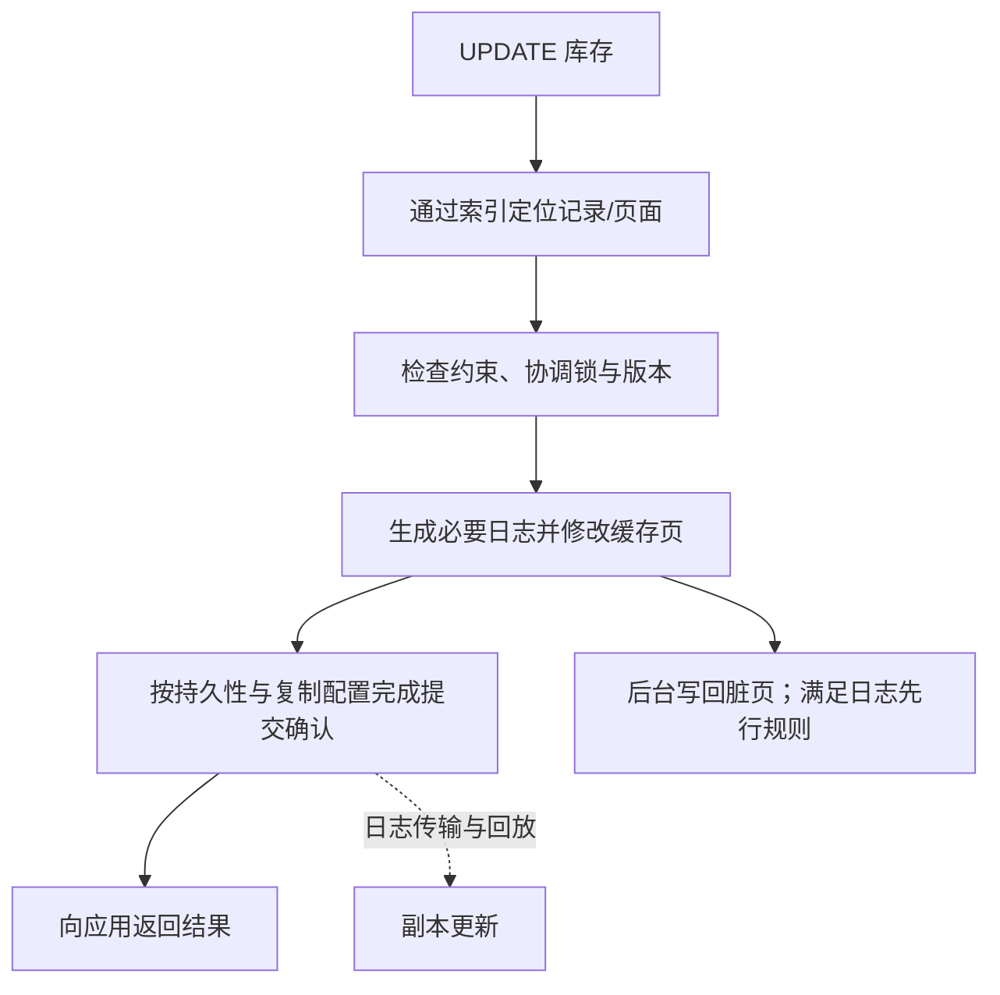

# 数据库事务日志、主从复制与故障恢复

> [!summary] 一句话解释
> 事务日志帮助数据库在崩溃后恢复正确状态，复制把变化传到其他节点；复制能支持可用性与读扩展，但不能代替备份，也不保证副本瞬间最新。

像柜员先把交易记进可靠的流水账，再逐步整理各本分类账；分店收到流水后更新自己的账本。流水写稳、分店收到、分店完成更新，是不同阶段。

前置：[[SQL事务、锁与并发一致性]]、[[B+树与数据库索引原理]]。

## 内存中改了，为什么还需要日志

数据库会把页面放在内存缓存中操作。被改过、尚未写回数据文件的页常叫 Dirty Page（脏页）；这里的“脏”不是损坏或 SQL 脏读。

内存快但断电会丢。如果每笔事务都立即把所有被改动的表页和索引页写稳，可能产生很多分散写入。日志记录必要变化，使数据页可以稍后写回，同时具备恢复依据。

**WAL = Write-Ahead Logging（预写式日志，读作 W-A-L 或 wall）**：相关日志要先可靠写入，再允许对应数据页写入持久存储。它不等于“绝不能先修改内存页”。

在保证同步持久性的配置下，提交确认依赖必要日志与提交记录可靠持久化；不要求每个数据页已经完成写回。断电恢复时，再重放需要的变化。[PostgreSQL WAL 原理](https://www.postgresql.org/docs/current/wal-intro.html)

## redo、undo、binlog 分别解决什么

| 名称与读法 | 主要作用 | 典型位置/边界 |
|---|---|---|
| Redo Log，重做日志，读 redo log | 崩溃恢复时重放必要变化 | InnoDB 存储引擎；不是普通业务操作日志 |
| Undo Log，撤销日志，读 undo log | 回滚，或为一致性读重建旧版本 | InnoDB 的版本和事务机制 |
| Binary Log，二进制日志，简称 binlog | MySQL 复制、按日志恢复等 | MySQL 服务层；不等于 InnoDB redo |
| PostgreSQL WAL | 崩溃恢复、物理复制、归档恢复等 | PostgreSQL 自己的日志体系 |
| Relay Log，中继日志，读 relay log | 副本暂存收到的 MySQL 复制事件 | 收到不代表已经应用 |

这些是按用途建立的认识框架，不是所有数据库都同时有这五个文件。特别是 PostgreSQL 的普通行版本实现不能照搬为“MySQL 式 undo 链”。

Redo 日志也不是“只记录已提交事务”：为恢复所需，它可能涉及后来未提交的修改。最终哪些效果对用户可见、哪些需要撤销，必须结合事务状态及引擎的恢复机制判断。

MySQL 开启 binlog 时，事务提交还需要协调引擎事务与 binlog 的一致性；不能把它理解成两个文件随意各写一次。这里不展开内部提交协议，也不把内部协调等同于任意外部支付服务参与同一事务。

## 一次扣库存的底层视角

图省略了引擎内部许多细节，尤其不表示后台刷页必须等事务提交以后才开始。不要把示意图当成字节级固定执行顺序。

如果应用收到网络超时，不能直接断言事务失败：可能已经提交，只是成功响应丢失。再次重试前需要业务唯一键与结果查询来避免重复扣款/扣库存。

## 检查点、刷盘与恢复

Checkpoint（检查点，读作 checkpoint）帮助记录恢复进度并推进必要数据页写回，降低重启时需要处理的日志范围。它不是自动生成一份独立完整备份。

数据库可能将多个事务的日志一起刷盘，称 Group Commit（组提交），以摊薄持久化开销。进程写入操作系统缓存不等于已经达到断电后仍可靠的介质状态；刷盘配置、操作系统与存储硬件承诺共同影响结果。

为了提速放宽日志持久化设置，可能改变“已确认提交在突然故障中会不会丢失”的保证。学习时理解权衡，不要对真实库随手调低安全级别。

## 主从复制究竟在复制什么

主库负责接受写入，副本持续追上变化。常见称呼包括主从、主备，英文常见 Primary/Standby、Source/Replica。具体术语依产品而异，不必把“从库”理解成被应用逐条遥控的第二份表。

MySQL 常见复制路径：源端 binlog → 副本接收并写 relay log → 应用线程/工作线程回放事件。根据复制格式，事件可以描述语句或行变化，不是每个模式都只是复制 SQL 文本。

PostgreSQL 物理流复制主要传输 WAL 并在备库回放；逻辑复制则以发布/订阅等方式传播选定数据变化，有不同的对象、结构变更和兼容性限制。不能只凭“都叫复制”就认为可以任意跨版本、跨引擎直接互换。

新副本通常先需要一致的基础数据，再接上对应位置的增量日志；从空库只追未来日志不会自动补全全部过去数据。

## 异步、同步、半同步：等到哪一步再说成功

| 方式 | 提交通常等待什么 | 主要权衡 |
|---|---|---|
| 异步 | 不等待副本确认所需变化 | 主库故障时，未复制部分可能丢失 |
| 同步 | 等待指定副本达到约定阶段 | 更强保证，但网络/副本问题可增加延迟或阻塞 |
| MySQL 半同步 | 典型配置等待至少一个副本确认事件已写稳中继日志 | 不等于已经应用；还需看超时与退化行为 |

PostgreSQL 同步配置可区分远端写入、刷盘或应用等阶段。**“副本收到”不等于“副本 SELECT 已看见”。** 即使一个同步副本满足要求，也不能推出随便读另一个异步副本都是最新。

MySQL 半同步发生等待超时可能退回异步，需要监控状态，不能把“曾开启半同步”当作永久无条件的零数据丢失保证。

## 刚下单，为什么页面却查不到

1. 应用把新订单写入主库并成功提交。
2. 查询被分流到一个尚未回放到这笔事务的副本。
3. 副本返回旧状态，看起来像刚写入的数据丢了。

这叫复制延迟导致的读后写一致性问题。办法包括关键读走主库、会话在合适条件下保持主库读取、依据日志位置等待指定副本追上等。简单睡固定一秒不提供严格保证。

复制读扩展适合允许一定延迟的查询。库存扣减必须由权威写入路径协调，不能先读延迟副本库存就承诺一定能买。

## 主库坏了，切换不是改个地址就完事

故障切换需要判断故障、选择合适副本、确认复制进度、提升新主、切换流量，并阻止旧主继续接受冲突写入。

网络隔离可能让旧主其实还活着。若新旧两台同时对外写入，会形成 Split Brain（脑裂）。Fencing（隔离旧写入者）等机制用于防止双主冲突；仅有数据库复制不代表已经具备完善自动切换方案。

主从复制主要复制同一份数据；分片是把不同数据分散到不同节点。增加副本不能自动提高同一热点记录的写入能力，多主写也带来更复杂的冲突与一致性问题。

## 复制不等于备份

误删会复制，错误更新会复制，攻击造成的逻辑破坏也可能复制。副本是跟进状态的伙伴，不天然是一台时间机器。

**PITR = Point-in-Time Recovery（时间点恢复，读作 P-I-T-R）** 通常需要合适基础备份和连续日志，才能把独立恢复实例推进到误操作之前的目标位置。

**RPO = Recovery Point Objective（恢复点目标，读作 R-P-O）**，关注能接受丢多少时间范围的数据；**RTO = Recovery Time Objective（恢复时间目标，读作 R-T-O）**，关注多久恢复服务。两者分别是数据损失窗口和恢复耗时目标。

备份应考虑异地/独立故障域、权限隔离、加密与密钥管理、保留政策，并定期恢复演练。显示“备份成功”不等于已经证明恢复可用。

## 监控什么

- 日志产生、发送、接收、刷盘和回放分别进到哪里。
- 副本是否报错、应用线程是否落后、链路是否中断。
- 长事务与大事务是否造成延迟尖峰。
- 日志保留是否可能填满磁盘；例如 PostgreSQL 复制槽可能因副本不前进而保留很多 WAL。
- 切换所需时间与恢复演练结果，不能只盯“连接正常”。

**LSN = Log Sequence Number（日志序列号，读作 L-S-N）** 是 PostgreSQL 表示日志位置的概念；MySQL 的 **GTID = Global Transaction Identifier（全局事务标识，读作 G-T-I-D）** 用于标记和跟踪事务，不是跨系统共同的同一种编号。

学习建议：先口述“改内存 → 日志持久化 → 数据页写回”的关系，再画“主库提交 → 副本接收 → 副本回放”。真正搭复制、模拟断电或切主应在专门实验环境，不对学习仓库或真实业务直接操作。

关联：[[SQL索引、执行计划与性能优化]]、[[SQL复杂统计与报表设计]]、[[状态机与幂等性]]。

## 参考资料

核对日期：2026-09-08。本篇为原理梳理，没有对真实数据库部署复制或执行故障演练。

- [PostgreSQL：WAL 原理](https://www.postgresql.org/docs/current/wal-intro.html)
- [PostgreSQL：检查点与 WAL 配置原理](https://www.postgresql.org/docs/current/wal-configuration.html)
- [PostgreSQL：流复制、同步复制与复制槽](https://www.postgresql.org/docs/current/warm-standby.html)
- [PostgreSQL：逻辑复制](https://www.postgresql.org/docs/current/logical-replication.html)
- [PostgreSQL：连续归档与时间点恢复](https://www.postgresql.org/docs/current/continuous-archiving.html)
- [MySQL 8.4：Redo Log](https://dev.mysql.com/doc/refman/8.4/en/innodb-redo-log.html)
- [MySQL 8.4：复制实现](https://dev.mysql.com/doc/refman/8.4/en/replication-implementation.html)
- [MySQL 8.4：复制线程](https://dev.mysql.com/doc/refman/8.4/en/replication-threads.html)
- [MySQL 8.4：半同步复制](https://dev.mysql.com/doc/refman/8.4/en/replication-semisync.html)
