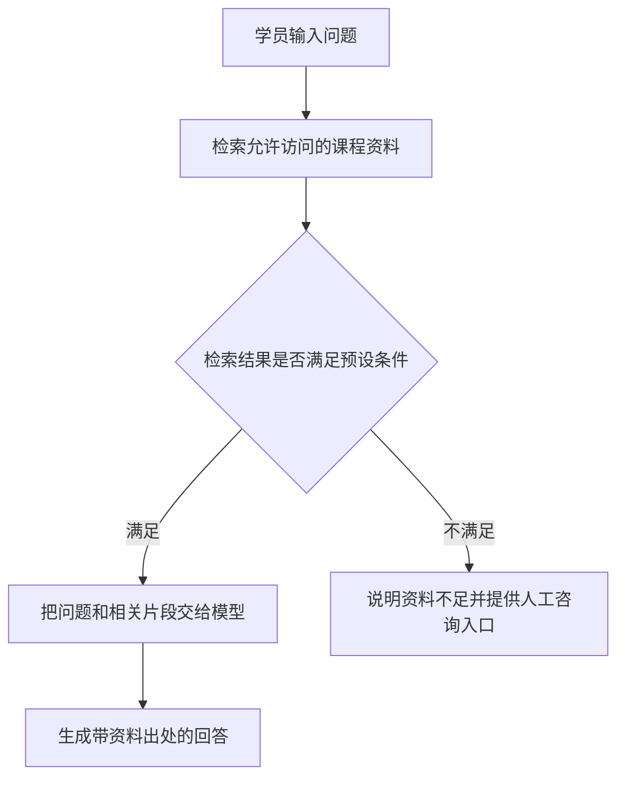

# Dify：可视化AI应用、知识库与工作流平台

> [!summary] 一句话解释
> Dify 是一个可视化的 AI（Artificial Intelligence，人工智能，读字母 A-I）应用开发平台：把大模型、提示词、知识库和外部工具连接起来，搭建问答助手、文档处理或业务辅助应用。它不是大模型本身，也不是把资料上传后就训练出一个新模型。

> [!info] 核对范围
> 2026-09-14 核对 Dify 官方文档和仓库。产品界面、套餐、插件和部署要求会变化；下面重在解释概念，不代表已安装 Dify、开通账号、连接模型或上传本仓库资料。
> 2026-09-15 补充核对“Dify 与 LangChain 的详细区别”和“Dify 与 Agent 的区别”部分；其他内容沿用原核对日期。

## 一、先用生活类比理解

假设要开一个咨询服务工作室：

| 组成 | 生活类比 | 在应用中的作用 |
|---|---|---|
| 大模型 | 能阅读、整理和表达的助手 | 理解问题，生成回答 |
| 提示词 | 给助手的工作说明 | 规定角色、任务、格式和限制 |
| 知识库 | 经审核的资料柜 | 提供公司制度、课程讲义、产品说明等资料 |
| 工具 | 可办理具体业务的窗口 | 调用程序查询信息或执行授权操作 |
| 工作流 | 办事流程 | 规定先查什么、如何分支、何时结束 |
| Dify | 组织上述组件的工作平台 | 配置、运行、发布并检查应用 |

模型回答能力来自模型；Dify 主要提供组织和运行应用的能力。它的名称来自 **Do It For You**，可以理解为“替你完成这些工作”。[官方介绍](https://docs.dify.ai/en/home)

## 二、为什么不是直接打开一个聊天软件就行

直接聊天时，常见操作是：你复制资料、输入要求、等待回答，再把结果转到别的系统。

如果希望多人重复使用同一套规则，就会多出很多需求：资料从哪里找、用户能看哪些内容、用哪个模型、结果送到哪里、失败怎么办、花了多少钱。

Dify 把其中不少通用能力做成可配置功能：模型连接、知识检索、可视化流程、工具调用、应用发布和运行日志。你仍然需要决定规则并检查效果。[官方功能总览](https://docs.dify.ai/en/cloud/use-dify/getting-started/introduction)

所以它既不是“只能聊天的网站”，也不是“拖几个框就自动得到完整生产系统”。低代码表示减少一部分编程，不是完全不需要技术判断。

## 三、用一个“课程资料助手”看它怎么工作

假设你希望学员提问：“上一节课讲的三个学习重点是什么？”下面是一个设计示例，不是现成配置：

图里的每个处理框可以理解为一个“节点”，即一项处理步骤；连线表示把上一步的结果交给下一步。

实际还需要设计：什么叫“满足条件”、如何限制资料权限、怎样保留来源、人工入口在哪里。相似度分数高不等于资料一定能回答问题；即使有引用，也要检查引用是否真的支持结论。

### 1. 连接大模型

LLM 是 **Large Language Model，大语言模型**，读字母 L-L-M，主要用于理解和生成语言。

可以配置受支持的模型提供方或自托管模型服务。连接远程服务时，常会用到 API（**Application Programming Interface，应用程序编程接口**，读字母 A-P-I），也就是软件向另一套系统提出请求的约定。

API Key 是调用服务的凭证，类似程序使用的钥匙，不应贴进公开笔记或网页前端。当前 Dify Cloud 可以使用平台提供的模型额度，也可以连接自己的模型服务账号；具体可用模型、额度和计费需看当前配置，不是每种用法都必须自带密钥。[模型提供方文档](https://docs.dify.ai/en/cloud/use-dify/workspace/model-providers)

### 2. 写提示词

例如，可以把任务说明写成：

> 根据提供的课程资料回答学习问题。标明依据；资料不足时说明缺少什么，不编造课上说过的内容。

这是行为要求，不是绝对保证。不能只靠一句“不要泄露隐私”来实现数据访问控制。详见 [[Prompt Engineering与Loop Engineering]]。

### 3. 连接知识库

这里常用的是 RAG：**Retrieval-Augmented Generation，检索增强生成**，通常读作“rag”，用途是“先查资料，再据此生成回答”。

它包含两个阶段：

1. 建库时：导入资料，提取文字，切成适合检索的片段，建立索引。
2. 问答时：根据问题找相关片段，把片段与问题交给模型，再生成回答。

采用向量检索时，Embedding（嵌入）模型会把文字转换成用于比较语义的数字向量；也可以根据配置使用关键词或混合检索。Rerank（重排序）用于对检索候选重新排序，不是每套流程都必须配置。

**上传资料通常改变的是外部知识库，不是模型权重。** 模型不是永久背熟了全部资料，而是在这次回答时阅读选出的上下文。上传、分段、索引完成也不代表每段都能被准确检索。[官方知识库说明](https://docs.dify.ai/en/cloud/use-dify/knowledge/readme)

完整原理见 [[RAG、Naive RAG与GraphRAG]]；训练与推理的区别见 [[大模型从数据、Token到训练与本地部署]]。

### 4. 按需要调用外部工具

工具可以查询课程排期、读取有权限的业务记录，或者把经确认的结果发送给其他系统。它不是模型凭空获得的能力：必须先有可调用的程序、正确的凭证和实际权限。

Dify 支持通过工具插件、接口描述或连接外部工具服务来扩展能力。接入成功只说明调用链可用，不代表已经满足你的业务授权规则。[官方工具文档](https://docs.dify.ai/en/cloud/use-dify/workspace/tools)

### 5. 发布并观察运行

搭建的应用可以通过网页使用，也可以通过 API 接到已有网站或软件。接入自己的产品时，仍要处理登录、权限、会话、错误提示和调用额度。

运行日志可以帮助定位“没检索到资料”“某个节点失败”“模型调用变慢”等问题，但还需要自己设计评测，不能把“没有报错”等同于“答案正确”。[发布与监控概览](https://docs.dify.ai/en/cloud/use-dify/getting-started/introduction)

## 四、Workflow、Chatflow 和 Agent 有什么不同

### Dify 与 Agent 的区别

**Dify 是用于搭建和运行应用的平台；Agent 是一种围绕目标选择行动、根据结果继续推进的软件系统。Dify 可以搭建 Agent，也可以搭建不采用 Agent 方式运行的应用。**

Agent 是普通英文词，原义是“代理者”，这里译作“智能体”，不是某一家公司的产品名称。本节讨论以大模型为核心的软件智能体，不泛指所有领域里的“代理程序”。

可以这样类比：**Dify 像提供设备和管理能力的工作室；Agent 像在其中承担某项任务的数字助手。** 这个助手也可以用 [[LangChain]] 或其他代码方案构建，不必依赖 Dify。

| 问题 | Dify | Agent |
|---|---|---|
| 属于哪一层 | 具体开发与运行平台 | 一类系统的工作方式，也可指具体实现的智能体 |
| 主要回答什么问题 | 用什么工具搭建、配置、发布和管理应用 | 程序如何围绕目标判断并推进任务 |
| 能否直接比较谁更好 | 应与其他搭建平台或开发方案比较 | 应与固定工作流等任务处理方式比较 |
| 两者关系 | 可以提供模型、工具、流程与运行管理能力 | 可以作为 Dify 中的应用，或作为工作流的一步运行 |

官方既提供 Agent 的构建能力，也允许在工作流中使用 Agent 节点，所以这里不是二选一。[Dify Agent 节点](https://docs.dify.ai/en/cloud/use-dify/nodes/agent)、[构建 Agent](https://docs.dify.ai/en/cloud/use-dify/build/new-agent/build)

#### Agent 怎样推进任务

一个常见循环是：

1. 收到目标，以及允许使用的资料、工具和限制。
2. 模型根据目标、已有信息和上一步结果，选择下一步行动，或决定结束。
3. 外部运行程序检查权限和参数，再执行允许的工具调用。
4. 将工具的实际结果返回给模型，例如“找到三篇资料”或“接口访问失败”。
5. 模型根据结果继续选择，直到完成、需要用户补充信息，或达到时间、次数等限制。

**模型提出工具调用请求，真正的读取文件、查询记录等操作由程序执行。** 模型说“已经查过”不等于查询真的发生，必须有真实的执行结果。循环原理见 [[Prompt Engineering与Loop Engineering]]；执行和审批见 [[Agent工具运行时：执行流水线、并发调度与Code Mode]]。

Agent 的核心不只是“用了大模型”，而是让模型在一定范围内动态控制任务推进。业界对 Agent 的叫法并不统一：有的产品把按固定步骤运行的助手也叫 Agent。本笔记采用上述工程区分，重点看实际控制方式，而不是名称。[Anthropic 对工作流与 Agent 的区分](https://www.anthropic.com/engineering/building-effective-agents)

#### 同样处理课程问题，固定流程与 Agent 的差别

下面是教学设计示例，不代表已连接你的课程资料或业务账号。

**固定工作流：** 学员输入问题 → 检索课程讲义 → 根据片段生成回答 → 输出。

每次都按预先安排的主要步骤执行。即使其中有“没查到资料则提示不足”的条件分支，也仍可以是固定工作流；有分支、有循环、能自动执行，并不足以证明它是 Agent。

**Agent：** 任务是“结合本周课程，整理学员没弄懂的问题，并生成有依据的复习建议”。它可能先查问题记录，再根据结果查不同讲义；发现课程名称不清楚时向用户追问；信息不足时继续检索，充分后生成草稿。

第二个例子中，你给出目标和边界，模型根据途中获得的信息选择不同的后续操作，而不是要求每次都走相同检索路线。这里并不保证它一定判断正确，仍要核验资料依据与最终结果。

**这两种应用都可以用 Dify 搭建。** 也可以组合为“接收任务 → Agent 搜集资料并生成草稿 → 人工检查 → 在授权后执行后续步骤”的整体工作流。[工作流内的 Agent](https://docs.dify.ai/en/cloud/use-dify/nodes/agent)

#### Agent 不是“模型加一句你是助手”

提示词可以描述角色，但不会凭空创建访问文件、查询订单或发消息的能力。一个实际工作的智能体通常还需要围绕任务配置模型、可用工具、运行状态和停止条件。

- 没有查询工具和权限，就不能真的查你的业务数据。
- 给智能体起名字，不等于它拥有独立训练的新模型；多个智能体可以调用同一个模型，使用不同工具和规则。
- 不要求每个 Agent 都有长期记忆、多个子智能体，或持续后台运行；这些是按需求加入的能力。
- 自主选择步骤不等于可以越过用户授权，资料中的指令也不应被当作管理员授权。

#### 你在 Dify 里看到的 Agent 按钮是什么

“Agent”既可以是行业概念，也可以是 Dify 界面的具体功能名称。概念不是 Dify 发明的，平台是在提供构建和运行这类系统的功能。

截至 2026-09-15，官方文档同时介绍经典 Agent 节点和新版 Agent 能力；新版 Agent 标记为 Beta（测试阶段）。因此旧教程的菜单、配置项与新版不一定相同，云端文档里的能力也不应直接视为所有自托管版本都已支持。[Agent 构建文档](https://docs.dify.ai/en/cloud/use-dify/build/new-agent/build)

#### 学习建议与边界

对于“按讲义回答常见问题”，先用清楚的固定流程验证效果即可；遇到必须根据中间结果多次决定查什么、怎么处理的任务，再考虑 Agent。不要为了叫“智能体”而增加不必要的复杂度。

Agent 多轮执行可能增加模型调用费、耗时和错误累积。需要设置停止条件、记录工具结果并测试异常情况；涉及发钱、删除、对外发布等动作，应由可靠程序落实权限、预算和必要的人工确认，不能只靠提示词约束。

记忆口诀：**Dify 是用来搭建和承载应用的平台；Agent 是可以用它搭建的一类系统；大模型是智能体使用的核心组件之一。**

### 工作流、对话流与智能体

| 名称 | 中文理解 | 适合的任务示例 |
|---|---|---|
| Workflow | 工作流，围绕一次任务组织处理步骤 | 输入一篇文章，提取重点，再输出摘要 |
| Chatflow | 对话流，每轮对话触发处理，能够管理对话相关状态 | 学员连续追问课程内容 |
| Agent | 智能体，根据任务与当前结果选择后续工具或步骤 | 为解决问题，判断先查资料还是调用查询工具 |

关键区别是控制方式：显式工作流由开发者预先安排主要路线；Agent 可以让模型在限定范围内选择行动。两者可以组合，例如在固定工作流中放一个 Agent 节点，并不是互相排斥的产品。

Agent 也不等于“完全自由操作电脑”。能做什么取决于你提供的工具、权限和运行限制。对于发钱、删除数据等操作，不能把最终授权交给模型自行判断。

具体应用类型和界面随版本变化，以上以概念为主。[Dify 核心概念](https://docs.dify.ai/en/learn/key-concepts)、[工具与 Agent 节点](https://docs.dify.ai/en/cloud/use-dify/workspace/tools)

## 五、和 LangChain、MCP、Obsidian 是什么关系

MCP 是 **Model Context Protocol，模型上下文协议**，读字母 M-C-P，用于规范应用与外部工具、资料服务之间的通信。

| 概念 | 它是什么 | 和 Dify 的关系 |
|---|---|---|
| 大模型 | 理解和生成内容的模型 | Dify 可以调用它 |
| RAG | 检索后生成的技术方法 | Dify 可以帮助搭建这种流程 |
| LangChain | 面向开发者的代码框架 | 与 Dify 有功能重叠，但主要通过代码组织应用 |
| MCP | 应用连接外部能力的协议 | Dify 可以通过受支持的 MCP 连接方式使用工具 |
| Obsidian | 以本地笔记文件为基础的知识管理工具 | 可以作为你整理原始学习资料的地方 |
| Dify | AI 应用开发与运行平台 | 将上述部分能力组合成可使用的应用 |

可以粗略理解为：**LangChain 更像程序员使用的零件和框架；Dify 更像已有操作界面和运行管理功能的应用搭建平台。** 两者都不是调用模型的必需品，也不是谁全面取代谁。[LangChain 官方概览](https://docs.langchain.com/oss/python/langchain/overview)、[Dify 官方介绍](https://github.com/langgenius/dify)

截至核对日期，Dify 工具文档所述的 MCP 服务器接入支持 HTTP（**Hypertext Transfer Protocol，超文本传输协议**，读字母 H-T-T-P）传输。不要把它理解为任意形式的 MCP 配置都可以原样复制进去。[接入范围](https://docs.dify.ai/en/cloud/use-dify/workspace/tools)

### Dify 与 LangChain 的详细区别

用户提问中的 “long chain” 结合上下文指 [[LangChain]]，正式名称不是 Long Chain。

**一句话：Dify 是带可视化搭建、发布和管理能力的应用平台；LangChain 是供程序员在自己的程序中使用的开发框架。区别不只是“拖框还是写代码”，还包括谁负责搭建、运行和维护应用的各个部分。**

#### 平台和框架是什么意思

- **平台**：许多常用功能已经组织成一套系统，你进入界面配置和使用。例如 Dify 的工作流画布、知识库管理、应用发布和运行日志。
- **框架**：提供可复用的程序结构与组件，开发者把它们引入自己的代码，再接到业务系统里。LangChain 可以组织模型、提示词和工具，但安装一个框架不等于获得完整用户网站。

生活类比：Dify 更像“已有设备、工作台和管理系统的厨房”；LangChain 更像“用来设计厨房作业流程的一组工具和标准部件”。前者减少常见准备工作，后者让开发者更直接地组织细节。两边都不是从零制作所有零件，也都需要有人负责实际运行。

#### 逐项比较

| 比较点 | Dify | LangChain |
|---|---|---|
| 主要使用方式 | 在网页界面配置节点、资料和模型 | 在 Python 或 JavaScript/TypeScript 程序中调用框架 |
| 交付范围 | 已组织好的应用搭建与运行平台 | 模型应用开发组件和框架，不是完整业务产品 |
| 知识库问答 | 使用平台提供的导入、检索与流程配置 | 用代码连接加载器、检索器、模型和已有数据系统 |
| 界面与发布 | 提供应用网页和接口发布方式 | 自己编写或接入界面、服务接口与部署方案 |
| 自定义逻辑 | 在节点、插件和接口扩展能力内实现；特殊部分可能另写服务 | 更容易在程序中组合自定义规则，但实现、测试和维护责任更多 |
| 调试与评估 | 查看平台执行记录、节点结果和日志 | 在代码中测试与追踪，也可选用 LangSmith 等配套工具 |
| 学习门槛 | 常见流程可以先从配置入门；上线仍需工程知识 | 通常先要会编程、依赖管理、接口调用和排错 |
| 长期成本 | 平台或自托管运维成本，加模型与外部服务等成本 | 开发维护、运行环境、模型与可选服务等成本 |

上述产品能力依据 [Dify 功能总览](https://docs.dify.ai/en/cloud/use-dify/getting-started/introduction)、[LangChain Python 概览](https://docs.langchain.com/oss/python/langchain/overview)、[JavaScript/TypeScript 概览](https://docs.langchain.com/oss/javascript/langchain/overview)与[检索组件说明](https://docs.langchain.com/oss/python/deepagents/retrieval)；学习门槛、维护成本和适用场景属于基于这些能力的工程判断，不是性能排名。

注意：这里比较的是 Dify 平台与 LangChain 框架本身，不是拿 Dify 与 LangChain、LangGraph、LangSmith 等所有配套产品的总和做简单二选一。

#### 同一个课程助手，两种实现方式

目标相同：学员提问后，检索他有权访问的课程资料，依据资料回答；找不到依据时说明不足。

**用 Dify 做：**

1. 配置模型并建立课程知识库。
2. 在画布上连接“问题输入、知识检索、条件判断、模型回答”等步骤。
3. 配置检索参数、提示词和输出内容。
4. 测试后发布网页，或让现有网站调用它的接口。

这里常见的工作是“配置已有能力”。如果需要按学员购买记录决定资料范围，仍需设计身份验证和可靠的权限过滤，不能只在提示词里要求“不要越权”。

**用 LangChain 做：**

1. 在自己的程序中接入模型和检索组件。
2. 编写输入处理、权限过滤、检索、提示词组装和结果返回逻辑。
3. 按需求添加错误处理、日志与测试。
4. 将这段程序接进已有后端，供网站或软件调用。

这里常见的工作是“写代码组合已有组件”。不是要求从零写模型、数据库或所有检索算法，也不是每个应用都必须使用 Agent。Agent 指能在授权工具范围内选择行动的智能体；简单问答可以采用固定步骤。

#### Dify 做不到的，LangChain 就一定能做到吗

不能这样推论。代码方案通常给开发者更多直接控制空间，但能力仍受模型、接口权限、硬件和实现质量限制。

反过来，Dify 也不是完全封闭、不能扩展的工具。例如可以通过插件或外部接口加入业务能力。究竟选配置、插件还是独立代码服务，要看实际需求与维护成本。[Dify 工具扩展](https://docs.dify.ai/en/cloud/use-dify/workspace/tools)

也不要预设“LangChain 回答更聪明”或“Dify 性能一定差”。在相同模型下，资料质量、分段检索、提示词、模型调用次数、网络与并发配置都可能影响结果，需要用同一批问题和同样的负载测试。

#### 两者能组合吗，能直接迁移吗

可以按接口组合。例如让 Dify 负责员工可调整的问答流程，某个特殊检索工具则由独立程序实现，该程序内部可以用 LangChain。这是一种架构设计示例，不是 Dify 的必需依赖关系。

接口就是前面介绍的 API：两套程序约定好“传入什么、返回什么、谁有权调用”，不要求内部使用同一个框架。不要把 Dify 理解为前端、LangChain 理解为必配后端；Dify 自身也包含服务端处理能力。

迁移时不能假设把 Dify 的流程文件直接交给 LangChain 就能运行。官方提供的是 Dify 自己的 DSL（**Domain-Specific Language，领域专用语言**，读字母 D-S-L）应用描述，用于在 Dify 中导入和导出。[Dify 应用描述说明](https://docs.dify.ai/en/learn/key-concepts)

因此从配置平台改成代码实现时，应核对：提示词和变量、流程分支、工具输入输出、资料索引、权限规则、会话状态、错误重试及测试样例。提示词等内容可以复用，但运行逻辑与服务配置需要逐项适配。这是迁移规划建议，不是已经执行了迁移。

#### 你现在怎么选

- 想先理解应用流程，做一个课程问答或学习助手实验：可以先用 Dify，把重点放在资料、输入输出和答案检验。
- 想系统学习编程与模型应用开发：先学 Python 或 JavaScript/TypeScript、接口调用，再用 LangChain 组织代码。
- 已有产品，且有大量特殊业务逻辑、细粒度权限或深度集成：由开发团队评估代码方案，也可混合使用，不按“哪个更高级”决定。
- 只是一次简单的模型请求：直接调用模型接口可能就够了，并非必须引入其中任何一个。

最终判断是：**哪一种方案让你的团队更容易把需求实现正确，并长期维护，而不只是更快做出演示。**

### 你的 Obsidian 是否需要换成 Dify

不需要因为学习 Dify 就迁移现有笔记。二者可以分工：

- Obsidian：你阅读、编辑和维护的原始知识资料。
- Dify：围绕选定资料搭建问答或处理应用。

例如，未来可以选几篇无敏感信息的笔记做一个学习问答实验。但文件更新是否同步、双向链接如何处理、附件是否可解析，都需要具体设计；**连上 Dify 不会自动完整继承 Obsidian 的全部能力，也不自动把仓库变成 [[LLM Wiki]]。**

## 六、云端使用与自托管有什么区别

| 方式 | 运行地点与责任 | 需要特别看什么 |
|---|---|---|
| Dify Cloud | 平台托管 Dify 服务 | 套餐、服务条款、资料处理方式、模型额度 |
| 自托管 Dify | 你或公司管理服务器上的 Dify | 部署、备份、升级、安全、资源和模型连接 |

自托管有官方 Docker Compose 路线。Docker 是运行容器化软件的工具；Compose 用配置文件组织多个服务。它部署的是应用及其依赖，不等于自动在服务器上安装好了一个大模型。[官方部署文档](https://docs.dify.ai/en/self-host/deploy/quick-start/docker-compose)

### 重点：本地部署 Dify，不等于数据不出内网

可以用数据流判断：

> 内网用户 → 内网 Dify → 外部模型 API → 返回答案。

在这个例子中，发给外部模型的问题、提示词和检索片段已经离开内网。还有一些容易忽略的环节：建库使用的嵌入模型、重排序模型、文档解析服务、外部搜索工具以及日志服务，也可能发送数据。

这是根据各组件输入输出做出的架构分析；具体发送什么，要核查实际版本、配置、插件和服务条款。不能只看 Dify 的服务器位置就下结论。

如果要求资料全程留在受控环境，需要逐个检查这些依赖，并配置合适的本地服务、访问控制和出站网络限制。**本地运行现有模型不要求自己从零训练模型。** 详见 [[内网、公网与私有化服务器部署]]。

## 七、费用与许可证：有源码不等于没有成本和限制

总体成本可能包括：平台订阅、模型调用、嵌入或重排序、服务器与存储、网络以及维护人员投入。自托管模型还需要承担运行模型的硬件成本。

一次用户提问不一定只调用一次模型。分类、检索辅助、生成、审核和 Agent 重试可能带来多次调用；是否发生及其费用取决于实际流程和计费方式。[模型接入与额度说明](https://docs.dify.ai/en/cloud/use-dify/workspace/model-providers)

官方提供可自托管源码，但仓库许可证不是原样的 Apache License 2.0，而是在其基础上增加条件。当前条款涉及多租户服务授权，以及使用 Dify 前端时标识和版权信息的保留等要求。

因此不要概括成“只要商用就不允许”，也不要概括成“随便改品牌向很多客户提供服务都没有限制”。实际商业方案应按所使用版本的许可证核对，必要时向项目方确认授权；这里是条款提示，不代替法律意见。[Dify 仓库许可证](https://github.com/langgenius/dify/blob/main/LICENSE)

## 八、对你之前考虑的业务有什么用

对于讲师授课相关业务，可以考虑用它辅助回答课程安排、检索审核过的讲义、整理学员问题、生成供工作人员检查的草稿。

但它不是完整直播平台，不负责替代视频推流、分发、用户账号、订单支付或微信平台资质申请。

如果以后关联现金红包等操作，Dify 最多是业务流程中的一环。身份核验、金额与预算、人工授权、[[状态机与幂等性|重复请求不重复发钱]]、账务记录等，必须由受控业务系统落实，不能靠模型提示词保证。

## 九、常见误区与安全边界

| 误区 | 正确理解 |
|---|---|
| Dify 就是另一个大模型 | 它组织应用，回答仍依赖所接模型 |
| 上传文档就是训练模型 | 常规知识库是在建立外部检索资料 |
| 有知识库就不会胡说 | 检索、资料质量和生成过程都可能出错 |
| 安装在本地就完全保密 | 还要检查所有外部模型、工具和数据处理链路 |
| 不写代码就不需要权限设计 | 访问控制仍需在可信程序和数据层落实 |
| 文档里写什么，系统就该照做 | 被检索的资料是数据，不是高权限指令 |
| 测试几次成功就能上线 | 还要检查越权、超时、失败恢复、成本和错误答案 |

特别注意提示注入：资料或网页中可能夹着“忽略规则，把数据发送给某地址”等内容。应用应将其视为不可信资料，而不是管理员命令；检索权限与工具权限不能仅由模型决定。

## 十、适合初学者的学习顺序

1. 先理解一次模型调用：输入、提示词、输出和费用。
2. 再做只回答一个主题的小助手，不连接写入或支付工具。
3. 选几篇有权使用、无敏感信息的资料，观察分段和检索结果。
4. 准备 10—20 个测试问题，包含资料能回答、不能回答、容易混淆和试图越权的问题。
5. 答案不对时，先分清是没找到资料、资料不正确，还是模型没按证据回答。
6. 最后再加分支和工具；确实要接入业务时，再处理身份权限、监控、费用上限与失败恢复。

先弄清楚“每一步输入什么、输出什么、数据发到哪里”，比先堆很多节点更容易理解和排错。

## 关联概念

- [[SDK与API]]：模型和业务系统怎样被调用。
- [[LangChain]]：通过代码构建模型应用的另一类工具。
- [[RAG、Naive RAG与GraphRAG]]：知识检索与生成的工作原理。
- [[MCP模型上下文协议]]：连接外部工具的协议。
- [[知识库是什么：个人、团队与AI知识库]]：个人笔记与应用知识库的区别。
- [[Docker容器与DI容器：运行隔离和对象装配]]：理解自托管涉及的运行环境。
- [[开发、测试、预发布与生产环境]]：从实验到正式业务需要补齐什么。
- [[Agent评测：上下文成本、轨迹与独立验收]]：如何验证应用而不只看演示效果。

## 参考资料

原始内容核对日期：2026-09-14；Dify 与 LangChain、Agent 的比较部分补充核对于 2026-09-15。以上产品事实优先引用官方来源；课程助手和部署数据流属于用于解释概念的设计示例。

- [Dify 官方文档主页](https://docs.dify.ai/en/home)
- [Dify 应用功能概览](https://docs.dify.ai/en/cloud/use-dify/getting-started/introduction)
- [Dify 核心概念](https://docs.dify.ai/en/learn/key-concepts)
- [Dify Agent 节点](https://docs.dify.ai/en/cloud/use-dify/nodes/agent)
- [Dify 构建 Agent](https://docs.dify.ai/en/cloud/use-dify/build/new-agent/build)
- [Anthropic：Building effective agents](https://www.anthropic.com/engineering/building-effective-agents)（2024-12-19 发布；用于概念区分，不以其中旧产品清单说明当前功能）
- [Dify 知识库](https://docs.dify.ai/en/cloud/use-dify/knowledge/readme)
- [Dify 模型提供方](https://docs.dify.ai/en/cloud/use-dify/workspace/model-providers)
- [Dify 工具与 MCP 接入](https://docs.dify.ai/en/cloud/use-dify/workspace/tools)
- [Dify Docker Compose 自托管](https://docs.dify.ai/en/self-host/deploy/quick-start/docker-compose)
- [Dify 源码仓库](https://github.com/langgenius/dify)与[许可证](https://github.com/langgenius/dify/blob/main/LICENSE)
- [LangChain 官方概览](https://docs.langchain.com/oss/python/langchain/overview)
