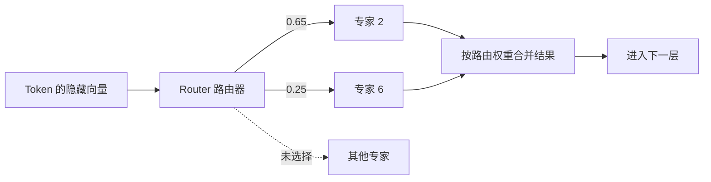
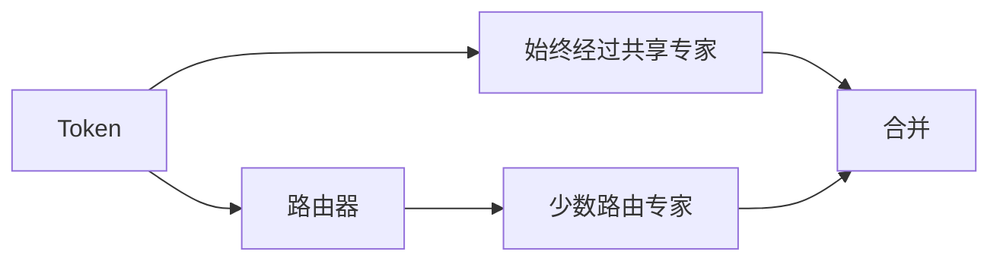

# MoE稀疏专家模型与DeepSeekMoE

> [!summary] 一句话解释
> MoE（Mixture of Experts，读作“艾姆欧伊”，混合专家模型）让模型拥有许多专家参数，但为每个 Token 只选择少数专家运行，从而用接近较小模型的激活计算获得更大的参数容量。

## 一、它解决什么问题

普通的**稠密模型（Dense Model）**每处理一个 Token，某一层的全部参数都会参与计算。模型越大，能力通常越强，但每次计算也越贵。

MoE 的思路是：

> 不让所有参数每次都上班，而是建立许多专家，由路由器按 Token 选出少数专家。

生活类比：一家医院有几十个科室。病人不必依次看完所有科室，分诊台会把病人送到少数相关科室。医院的总专业能力很大，但一次就诊只使用其中一部分。

## 二、MoE 通常放在 Transformer 的哪里

一个 Transformer Block 可粗略写成：

```text
输入
  ↓
注意力层：不同 Token 交换信息
  ↓
FFN/MLP：每个 Token 分别经过非线性变换
  ↓
输出
```

大多数语言模型 MoE 是把其中的 **FFN（Feed-Forward Network，前馈网络）/MLP（多层感知机）**换成多个专家。注意力、归一化和其他共享参数仍会运行。

所以“每个 Token 只调用几个专家”不等于“整台模型只加载那几个文件”，也不等于模型其他层都停止工作。

## 三、一次路由怎样发生

假设一层有 8 个专家，每个 Token 激活 Top-2：



1. Router（路由器）根据 Token 当前的隐藏向量给专家打分。
2. 取分数最高的 `k` 个专家，称为 Top-k routing。
3. Token 分别经过这些专家。
4. 按路由权重合并专家输出。

一个 Token 在不同层可能被送往不同专家；同一个词在不同语境中也可能走不同路线。

## 四、总参数与激活参数

这是理解 MoE 最重要的一点。

| 指标 | 含义 | 更直接影响什么 |
|---|---|---|
| 总参数量 | 全部共享层和所有专家的参数总和 | 模型文件、集群显存/内存、网络分布 |
| 激活参数量 | 处理一个 Token 时实际参与前向计算的参数量 | 单 Token 的计算量，但不是速度的唯一决定因素 |

例如 DeepSeek-V3 技术报告给出的配置是 **671B 总参数、每 Token 激活 37B**。`B` 是 Billion，即十亿。这不能简化为“它就是一个 37B 模型”：它能从更大的专家池中调用容量，但整个 671B 权重仍需存储、加载并分布在设备之间。

## 五、DeepSeekMoE 改了什么

传统 MoE 可能有几个较大的路由专家。DeepSeekMoE 论文重点提出两种方法。

### 1. 细粒度专家分割

把少数大专家进一步拆成更多小专家，同时相应增加被激活的小专家数量。

类比：原来只有“内科”和“外科”，现在拆成心内、呼吸、消化、神经等更细部门。一份任务可组合多个细分能力，路由更灵活。

目标是让专家更专门，减少不同专家学习大量重复知识。

### 2. 共享专家隔离

设置一些 **Shared Experts（共享专家）**，专门承载很多 Token 都需要的通用知识；其余 Routed Experts（路由专家）更专注差异化知识。

类比：所有科室共用挂号、检验和病历系统，不必让每个专科都重复建设一套。



## 六、训练 MoE 为什么并不轻松

### 1. 负载不均衡

如果路由器总喜欢少数专家，就会出现“热门专家排长队、其他专家闲着”。训练通常需要负载均衡损失、无辅助损失的平衡策略或路由偏置调整。

### 2. 专家容量与 Token 丢弃

一个批次中某个专家能接收的 Token 数可能有限。超出容量后，系统需要丢弃、绕行或排队；策略会影响训练稳定性和质量。

### 3. 跨设备通信

专家通常分布在多张 GPU 上。路由后要把 Token 发往对应 GPU，再把结果收回来，这常涉及 **All-to-All（全互换通信）**。计算省了，网络通信可能成为瓶颈。

### 4. 训练稳定性

路由选择是动态的，专家获得的数据量不同。初始化、数值精度、并行策略和均衡方式都比普通稠密模型复杂。

## 七、MoE 一定推理更快吗

不一定。

- **有利因素**：每 Token 激活的 FFN 参数少，理论 FLOPs 更低。
- **不利因素**：全部专家仍要放在内存或多机集群中；路由、跨卡通信、小批量和不规则访存都有开销。
- **本地部署**：如果硬件放不下全部权重，需要频繁从 CPU/磁盘调入专家，速度可能很差。
- **大规模服务**：合理做专家并行、批处理和高速互联时，MoE 优势更容易发挥。

因此，参数表里的“激活 37B”不能直接推导出“速度等于普通 37B 模型”。

## 八、专家真的是“数学专家”“编程专家”吗

通常不能这样理解。

专家的分工由训练数据和路由自动形成，可能与语言、语法、Token 类型或抽象特征有关，但不一定能被人清晰命名。它们也不是独立的完整模型，而是某些层里的子网络。

> [!warning] 常见误区
> - 专家不是可以单独聊天的多个 Agent。
> - 路由不是先读完整问题再选一个总专家，而是每层、每 Token 动态选择。
> - 稀疏激活不等于稀疏存储；没被当前 Token 激活的参数仍然存在。
> - 总参数更大不自动保证效果更好，数据、训练、路由和有效容量同样重要。

## 九、MoE 与其他技术怎样组合

- MoE 主要优化 FFN 层的容量与计算。
- [[高效注意力：FlashAttention、GQA、MLA与线性注意力|MLA/GQA/FlashAttention]]主要处理注意力和 KV Cache。
- [[大模型推理加速：FP8、量化、KV Cache与多Token预测|FP8/量化]]改变数值精度与部署成本。
- DeepSeek-V2/V3 正是把 DeepSeekMoE 与 MLA 等技术组合，而不是二选一。

## 十、学习建议

初学阶段先记住三个数字问题：

1. 模型总共有多少参数？
2. 每 Token 激活多少参数？
3. 部署时这些专家放在哪里、通信成本多大？

看到宣传中的“万亿参数低成本模型”时，用这三问通常就能避免大部分误解。

## 参考资料

> [!info] 核对日期
> 2026-08-30。论文中的成本和速度数字依赖具体模型、集群与测试条件。

- [DeepSeekMoE: Towards Ultimate Expert Specialization in Mixture-of-Experts Language Models](https://arxiv.org/abs/2401.06066)
- [DeepSeek-V2 Technical Report](https://arxiv.org/abs/2405.04434)
- [DeepSeek-V3 Technical Report](https://arxiv.org/abs/2412.19437)
- [Switch Transformers](https://arxiv.org/abs/2101.03961)

