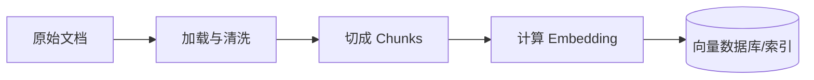
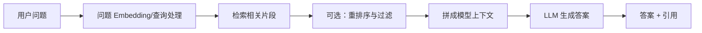

# RAG、Naive RAG 与 GraphRAG

## 先给结论

**RAG（Retrieval-Augmented Generation，检索增强生成）**是一种让大语言模型在回答之前先从外部知识库检索资料，再把资料作为上下文生成答案的方法。

- **Naive RAG**：最基础的“切文档 → 向量检索 Top-K 片段 → 交给模型回答”流程。
- **Graph RAG / GraphRAG**：把文档中的实体、关系和主题组织为图，借助图关系和社区摘要检索，特别适合需要“串联多处信息”或“总结整个资料库”的问题。

> [!note] 拼写
> 正确拼写是 **Graph RAG** 或微软项目名 **GraphRAG**，不是 `Grahp RAG`。

## 为什么需要 RAG

大语言模型的知识主要储存在训练得到的参数中，存在几个问题：

- 训练完成后，内部知识不会自动更新；
- 模型没有见过公司的私有文档；
- 无法把整个大型资料库一次性塞进上下文窗口；
- 可能在不确定时生成听起来合理但错误的内容；
- 仅靠模型参数很难给出清楚、可追踪的资料来源。

RAG 的思路不是马上重新训练模型，而是在**提问时**给模型临时提供与问题相关的外部资料。

## 用开卷考试类比

- 普通模型回答：像学生只靠记忆闭卷作答。
- RAG：像先让学生去资料柜找到几页相关内容，再根据这些内容作答。
- 知识库：资料柜。
- Retriever：图书管理员或搜索系统。
- Embedding：把文字转换成表示语义位置的数字坐标。
- LLM：阅读取回资料并组织答案的学生。

开卷并不自动等于正确：如果找错资料、资料本身错误，或学生误解了资料，答案仍然可能错。

## RAG 的完整流程

RAG 通常分为“离线索引”和“在线查询”两部分。这里的“索引”是资料处理和可检索结构的统称，详见 [[Index的常见含义#三、搜索引擎和 RAG 中的 Index]]。

### 第一部分：离线索引



#### 1. 收集文档

资料可能来自 PDF、网页、Word、数据库、公司 Wiki、客服记录等。

#### 2. 加载和清洗

提取正文、标题、日期、作者、权限、来源链接等。扫描 PDF 可能还需要 OCR。

#### 3. Chunking（切块）

文档太长，通常会切成较小片段。切块策略会直接影响检索：

- 太小：上下文被切断，单个片段信息不完整；
- 太大：混入无关内容，占用上下文；
- 固定字数切分简单，但可能切断标题与正文；
- 按段落、章节或语义切分通常更自然，但更复杂。

#### 4. Embedding（嵌入）

Embedding 模型把每个文本片段转换成一串数字，也叫向量。语义相近的文本通常在向量空间中更接近。

例如“如何重置密码”和“忘记密码怎么办”用词不同，但语义接近，向量检索有机会把它们匹配起来。

#### 5. 存储和建立索引

向量、原文和元数据存入向量数据库或搜索系统，供以后快速查询。

### 第二部分：在线查询



1. 接收用户问题。
2. 将问题转换为向量或搜索查询。
3. 找出最相关的 Top-K 片段。
4. 可根据权限、时间、来源和重排序模型进一步筛选。
5. 把问题、检索片段和回答规则组成 Prompt。
6. 模型基于片段生成答案。
7. 返回答案，最好附带来源并允许用户检查原文。

## Naive RAG 是什么

**Naive** 在这里是“朴素、基础”的意思，不是嘲讽。RAG 综述常把早期或基础流程称为 Naive RAG：

```text
Index（建立索引） → Retrieve（检索） → Generate（生成）
```

最典型实现是：

1. 文档固定长度切块；
2. 为片段生成 Embedding；
3. 存入向量数据库；
4. 对问题进行相似度检索；
5. 取 Top-K 片段；
6. 把片段直接拼到 Prompt 中；
7. 让模型回答。

### Naive RAG 的优点

- 结构简单，容易理解和实现；
- 开发速度快；
- 延迟和调用次数比较可预测；
- 对“答案明确存在于某个片段”的问答很有效；
- 很适合 FAQ、产品文档助手和内部规章查询的原型。

### Naive RAG 的典型问题

#### 检索不到真正需要的片段

用户和文档用词差异大、问题太模糊，或 Embedding 不适合该领域时，真正答案可能排不进 Top-K。

#### 找到的片段相似但不能回答

“主题相似”不等于“包含答案”。例如用户问退款期限，系统取回的却只是介绍退款入口的片段。

#### 信息被切散

答案需要同时看多个章节，而每个片段只包含一小部分。

#### Top-K 片段互相冲突

旧版本和新版本文档可能同时被取回，模型不知道以谁为准。

#### 无法回答全局问题

“过去一年客户最常抱怨的三类问题是什么？”需要统计和汇总整个资料库，不是找几个最相似段落就能解决。

#### Lost in the middle

上下文太长时，模型可能忽略夹在中间的重要片段。

#### 权限泄露

如果检索前不按用户权限过滤，模型可能看到不应访问的内部资料。

## Advanced RAG 如何改进

Naive RAG 之后的常见增强包括：

- Query rewriting：改写模糊问题；
- Multi-query：生成多个查询角度；
- Hybrid search：结合关键词搜索与向量搜索；
- Metadata filtering：按时间、部门、版本和权限过滤；
- Reranking：用更精确的模型重排候选片段；
- Parent-child retrieval：检索小片段，返回更完整的父章节；
- Context compression：只保留真正相关的句子；
- Answer verification：检查答案是否有来源支持；
- Iterative/Agentic RAG：Agent 判断是否需要继续检索或换一种查询。

[[LangChain]] 官方文档将常见架构概括为固定的 2-Step RAG、由 Agent 决定检索时机的 Agentic RAG，以及带查询和答案验证的 Hybrid RAG。

## Graph RAG 是什么

普通向量检索把知识主要看作许多独立文本片段；Graph RAG 进一步把知识表示为图：

- **节点（node）**：人、公司、产品、地点、概念、事件等实体；
- **边（edge）**：实体之间的关系；
- **属性/Claim**：时间、描述、证据等信息；
- **社区（community）**：联系紧密的一组实体；
- **社区摘要**：对一组关系和主题的整体总结。

### 微软 GraphRAG 的索引过程

根据微软官方文档，其代表性流程包括：

1. 将资料切为 TextUnits；
2. 从文字中抽取实体、关系和关键 claim；
3. 构建知识图谱；
4. 用 Leiden 等图聚类方法形成层级社区；
5. 自下而上生成每个社区的摘要；
6. 查询时结合图结构、实体邻居或社区摘要组织上下文。

### Local Search 与 Global Search

- **Local Search（局部搜索）**：从具体实体出发，沿相关关系和邻居扩展。适合“项目 A 与供应商 B 有什么关系？”
- **Global Search（全局搜索）**：利用不同层级的社区摘要，适合“整个资料库的主要主题和风险是什么？”

微软实现还有 DRIFT Search 等模式，结合局部实体与社区信息逐步扩展。

## 用一个例子比较

资料库包含几十万封企业邮件。

问题一：“张三在 8 月 10 日的邮件中给出的报价是多少？”

- Naive RAG 很适合，只要能检索到那封邮件的相关片段。

问题二：“过去六个月，哪些团队围绕延期问题形成了相互关联的讨论，主要原因是什么？”

- 答案分散在多封邮件、多人和多个项目之间。
- Graph RAG 更有机会通过人、团队、项目和延期事件的关系进行聚合。

## Naive RAG 与 Graph RAG 对比

| 维度 | Naive/Baseline RAG | Graph RAG |
|---|---|---|
| 主要索引 | 文本片段与向量 | 实体、关系、图社区、摘要，通常也结合文本/向量 |
| 擅长问题 | 明确事实、局部问答 | 多跳关系、全局主题、跨文档综合 |
| 建立索引成本 | 较低 | 较高，需要抽取和聚类 |
| 更新复杂度 | 相对简单 | 图、关系和社区摘要可能需要增量更新或重算 |
| 可解释性 | 可引用原文片段 | 可展示关系路径和原文，但图抽取也可能出错 |
| 技术复杂度 | 低到中 | 中到高 |
| 适合初学原型 | 很适合 | 通常不应作为第一版 |

## Graph RAG 不是永远更好

- 简单 FAQ 没必要先构建庞大知识图谱；
- 实体和关系抽取会产生错误；
- 建图和生成社区摘要需要额外模型调用，成本较高；
- 文档频繁变化时，保持图和摘要新鲜更复杂；
- 图擅长关系，但原始细节仍应回到来源文本核验；
- “Graph RAG”是一个方法家族，微软 **GraphRAG** 是其中一个具体开源实现，两者不要完全等同。

## RAG 能消除幻觉吗

不能。RAG 只增加了外部证据，仍可能出现：

- 检索错资料；
- 原资料错误或过时；
- 模型忽略或误解资料；
- 模型把不同片段错误拼接；
- 引用存在但并不真正支持结论；
- 文档中的恶意指令影响模型，即 prompt injection。

可靠系统需要同时评估：

- 检索召回率和相关性；
- 答案是否由资料支持（groundedness/faithfulness）；
- 答案正确性和完整性；
- 引用是否准确；
- 权限和隐私；
- 延迟与成本。

## 初学者学习顺序

1. 理解大模型和 Prompt；
2. 理解文档、chunk 和 token；
3. 理解 Embedding 与相似度；
4. 做一个最小 Naive RAG；
5. 学会观察检索结果，而不只看最终答案；
6. 加入混合检索、重排序和评估；
7. 真正遇到多跳关系或全局总结问题后，再学习 Graph RAG。

## 关联概念

- [[MCP模型上下文协议]]：MCP 可以向 AI Host 提供知识库 Resource 或检索 Tool，但不会自动完成 RAG 的切分、Embedding、召回和评估。
- [[LangChain]]：可以组织文档加载、Retriever、模型和 Agent 等 RAG 组件。
- [[Index的常见含义]]：理解搜索索引、向量索引和“离线索引”阶段的不同含义。

## 参考资料

- [原始 RAG 论文：Retrieval-Augmented Generation for Knowledge-Intensive NLP Tasks](https://arxiv.org/abs/2005.11401)
- [RAG 综述：Retrieval-Augmented Generation for Large Language Models](https://arxiv.org/abs/2312.10997)
- [LangChain 官方文档：Retrieval 与 RAG 架构](https://docs.langchain.com/oss/python/langchain/retrieval)
- [Microsoft GraphRAG 官方文档](https://microsoft.github.io/graphrag/)
- [GraphRAG 论文：From Local to Global](https://arxiv.org/abs/2404.16130)
