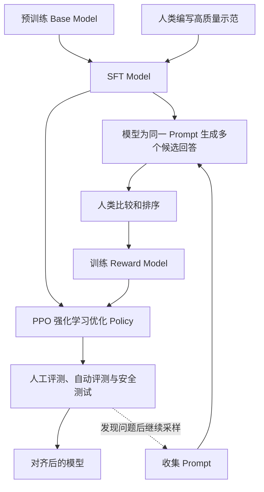

# RLHF 与大模型对齐

> [!summary] 一句话结论
> **RLHF（Reinforcement Learning from Human Feedback，基于人类反馈的强化学习）是让人类比较或评价模型回答，再把这种偏好变成奖励信号，用强化学习调整模型，使它更倾向于生成符合人类意图的回答。**

最常见的经典流程是：

```text
预训练语言模型
   ↓
SFT：用人工示范教它怎样回答
   ↓
收集人类对多个回答的排序
   ↓
训练 Reward Model：学习人类偏好
   ↓
使用 PPO 等强化学习算法优化语言模型
   ↓
评测、安全测试、迭代
```

但需要立刻补充两点：

1. **RLHF 不是让人实时审核每一次用户请求。**人类反馈主要在训练阶段被收集，训练结果写入模型参数；
2. **现代大模型后训练不一定使用经典“奖励模型 + PPO”流程。**DPO、RLAIF、GRPO、可验证奖励等方法有不同的数据来源和优化方式，不能全部严格等同于 RLHF。

---

## 一、RLHF 这几个字分别是什么意思

### RL：Reinforcement Learning

**RL（Reinforcement Learning，强化学习）**是一类通过奖励信号学习行为策略的方法。

经典类比是训练小狗：

- 做出期望动作，得到奖励；
- 做出不期望动作，没有奖励或受到惩罚；
- 经过许多尝试，期望动作出现的概率提高。

在大语言模型中，不是小狗在行动，而是模型在生成 Token 或完整回答。

### HF：Human Feedback

**Human Feedback（人类反馈）**可以是：

- 从多个回答中选择最好的一项；
- 比较回答 A 和回答 B 哪个更好；
- 对回答进行排序；
- 给出分数；
- 标记是否有害、是否遵循指令；
- 写出更好的示范答案；
- 指出问题并给出修改意见。

经典 RLHF 更常使用“相对比较”而不是要求人准确打出 `82.3 分`。人通常更容易回答“A 比 B 好”，而不是设计绝对评分尺。

### Alignment：对齐

**Alignment（对齐）**在这里表示让模型行为更符合设计者、用户和社会所希望的目标与约束。

可能包括：

- 遵循用户指令；
- 提供有帮助的回答；
- 减少明显错误和误导；
- 避免有害输出；
- 在不确定时承认不确定；
- 遵守产品和安全边界；
- 使用合适的语气与格式。

“对齐”不是一个已经彻底解决的问题，也不代表所有人的价值观都完全一致。

---

## 二、为什么预训练以后还需要 RLHF

### 预训练目标与用户目标不同

Decoder-Only 语言模型的预训练目标通常接近：

```text
根据前面的 Token，预测下一个 Token
```

这能让模型学习大量语言模式和知识关联，但用户真正希望的是：

```text
理解我的指令
给出有帮助、准确、清晰、安全的回答
```

这两个目标不完全相同。

互联网文本里同时存在：

- 高质量教程；
- 无关闲聊；
- 错误信息；
- 争吵和攻击；
- 没有回答问题的文字；
- 不同格式和身份的内容。

只学“下一段文字最可能是什么”，不自动等于学会“怎样当一个可靠助手”。InstructGPT 论文明确指出，单纯扩大模型规模并不必然使模型更符合用户意图。

### SFT 能教示范，但人不可能写完所有答案

**SFT（Supervised Fine-Tuning，监督微调）**可以给模型许多“问题 → 理想答案”的示范。

但是：

- 人工写高质量答案成本高；
- 很多问题没有唯一标准答案；
- 比较两个现成答案，往往比从零写一个答案容易；
- 模型会遇到训练示范中没有覆盖的新问题。

RLHF 的核心思路是：让人类提供“哪个更好”的偏好信息，再让模型从大量比较中学习更一般的评分规律。

---

## 三、用“教实习生写客服回复”理解 RLHF

假设你要训练一名客服实习生。

### 第一步：给优秀范文

你先给他一些例子：

```text
用户：订单还没到怎么办？
优秀回复：先确认订单号和预计送达时间，再提供查询与处理步骤……
```

这相当于 SFT。

### 第二步：让他写多个版本

实习生针对同一问题写出：

- 回答 A：态度礼貌但没有解决方法；
- 回答 B：步骤正确、清晰，并说明需要哪些信息；
- 回答 C：给出不存在的退款承诺；
- 回答 D：非常啰嗦，核心信息埋得很深。

### 第三步：人工排序

资深客服排序：

```text
B > A > D > C
```

### 第四步：训练“评分员”

把大量排序交给一个 Reward Model（奖励模型），让它学习：

```text
什么样的回复通常更受资深客服认可？
```

### 第五步：让实习生根据评分改进

实习生不断生成回复，奖励模型打分，训练算法让高分回复以后更可能出现，同时限制他不要为了追高分而突然把原来的语言能力改坏。

这就是经典 RLHF 的直观版本。

---

## 四、经典 RLHF 的完整流水线

InstructGPT 展示了一个影响很大的三阶段后训练方案：SFT、奖励模型、PPO 强化学习。



下面逐步拆开。

---

## 五、第一阶段：SFT 监督微调

### SFT 做什么

训练人员准备示范数据：

```text
Prompt → 人类期望的回答
```

然后仍使用普通监督学习，让模型模仿这些答案。

例如：

```text
Prompt：请把这段文字总结成三点。
Target：1. …… 2. …… 3. ……
```

### SFT 的主要作用

- 教模型识别“用户给指令、助手作答”的格式；
- 建立基本的指令遵循习惯；
- 教会常见任务形式；
- 为后续偏好训练提供一个较好的起点。

如果直接从一个只会续写互联网文本的 Base Model 开始强化学习，探索空间会非常大，回答质量和训练稳定性都可能更差。

### SFT 是否属于 RLHF

严格说，SFT 本身是监督学习，不是强化学习。

但讨论大模型 RLHF 时，人们经常把 SFT 当作经典完整流水线的第一阶段。因此要区分：

- **狭义 RLHF**：人类偏好 → 奖励信号 → 强化学习；
- **广义 RLHF 后训练流程**：SFT + 偏好数据 + 奖励模型 + RL + 评测。

---

## 六、第二阶段：收集偏好数据

### 为同一 Prompt 生成多个回答

例如用户问：

```text
“为什么电脑重启有时能解决问题？”
```

模型生成 A、B、C、D 四个版本。

标注人员根据规则比较：

- 是否回答了问题；
- 是否事实正确；
- 是否清晰；
- 是否冗余；
- 是否安全；
- 是否虚构；
- 是否符合要求的格式。

### Pairwise Preference：成对偏好

数据可以整理为：

```text
(Prompt, Chosen Answer, Rejected Answer)
```

也就是：

```text
同一个问题下，人更喜欢 Chosen，不喜欢 Rejected。
```

这种成对比较是奖励模型和 DPO 等方法常用的数据形式。

### 标注规则为什么重要

“更好”不是天然客观的。标注人员需要指南来处理：

- 正确但很长，与简洁但漏细节，哪个更好；
- 用户要求与安全规则冲突时怎样评价；
- 不确定事实应该回答还是拒绝；
- 多种合理风格如何比较；
- 专业问题由谁判断准确性。

如果指南含糊、标注人员背景单一或任务超出其专业能力，偏好数据就会带入噪声和偏差。

### 一致性检查

高质量项目通常需要：

- 多位标注者交叉评价；
- 一致性指标；
- 争议样本复审；
- 专业领域专家；
- 隐私和安全处理；
- 定期更新标注规范。

---

## 七、第三阶段：训练 Reward Model

### Reward Model 是什么

**RM（Reward Model，奖励模型）**接收：

```text
Prompt + 回答
```

输出一个标量分数：

```text
r(prompt, answer) → 3.72
```

这个分数不是“事实正确率 3.72”，而是模型根据训练数据预测：这个回答有多符合标注者偏好。

### 怎样从比较数据学习

假设人类认为回答 A 优于回答 B：

```text
A > B
```

训练目标会推动：

```text
Reward(A) > Reward(B)
```

常见的概率形式可以写成：

```text
P(A 胜过 B)
= sigmoid(Reward(A) - Reward(B))
```

初学阶段只需理解：

- 奖励模型不必知道绝对满分是多少；
- 它主要学习两个回答之间的相对偏好；
- 分差越大，表示它越确信其中一个更受偏好。

### 奖励模型不是裁判真理机

奖励模型只是对有限人类标注的近似。它可能：

- 把语气自信误当成正确；
- 偏爱更长或更漂亮的回答；
- 对训练分布以外的问题判断很差；
- 继承标注人员偏见；
- 被被训练的语言模型找到评分漏洞。

所以“奖励分高”不等于现实世界一定正确。

---

## 八、第四阶段：用 PPO 优化语言模型

### 把语言模型看成 Policy

**Policy（策略）**表示在当前状态下选择什么动作的概率规则。

在语言模型中可以对应为：

| 强化学习概念 | 语言模型中的对应物 |
|---|---|
| Agent | 正在训练的语言模型 |
| State | Prompt 加已生成 Token |
| Action | 选择下一个 Token |
| Trajectory | 一整个生成回答的 Token 序列 |
| Reward | 奖励模型或其他评估器给出的分数 |
| Policy | 模型对下一个 Token 的概率分布 |

### PPO 是什么

**PPO（Proximal Policy Optimization，近端策略优化）**是一种策略梯度强化学习算法。

它的直观目标是：

```text
提高高奖励回答的生成概率
降低低奖励回答的生成概率
但每次不要把模型改得太猛烈
```

“Proximal（近端）”可以理解成限制每次更新不要离原策略太远，从而提高训练稳定性。

### 为什么还需要 Reference Model

经典 RLHF 经常保留一个冻结的 **Reference Model（参考模型）**，通常从 SFT 模型复制而来。

训练时会惩罚正在训练的 Policy 与参考模型偏离过远：

```text
总奖励
≈ 奖励模型分数
 - β × 与参考模型的 KL 偏离
```

**KL Divergence（Kullback–Leibler Divergence，KL 散度）**用于衡量两个概率分布的差异。

这项约束的直观作用是：

- 不让模型只顾追逐奖励模型分数；
- 尽量保留 SFT 模型原有的语言质量和通用能力；
- 降低模型突然产生极端输出的风险。

### PPO 流程中有哪些模型

经典大型语言模型 PPO 训练可能涉及：

- **Policy Model**：正在被优化的模型；
- **Reference Model**：冻结，用于限制偏离；
- **Reward Model**：给回答评分；
- **Value/Critic Model**：估计未来奖励，帮助计算优势。

同时维护这些模型和生成样本，计算与显存成本都很高，这也是后来出现 DPO、GRPO 等方法的重要背景之一。

---

## 九、一次经典 RLHF 训练迭代发生什么

可以简化为：

```text
1. 从训练 Prompt 中取一批问题
2. Policy Model 生成回答
3. Reward Model 给回答打分
4. 计算相对参考模型的 KL 惩罚
5. Value/Critic 估计优势
6. PPO 计算怎样更新参数
7. 小幅更新 Policy Model
8. 重复生成、评分和更新
```

人类不会在每一次 PPO 更新中实时打分。否则训练几百万次生成会需要难以承受的人力。

人的比较首先被压缩进 Reward Model；随后奖励模型可以自动给大量新回答提供近似奖励。

---

## 十、RLHF 到底改变了模型什么

### 改变的是输出概率和行为倾向

训练后，同一个 Prompt 下：

- 遵循指令的回答概率提高；
- 无关续写的概率降低；
- 符合格式的概率提高；
- 某些有害或不合规回答的概率降低；
- 更像助手回答方式的 Token 序列概率提高。

### 它会修改模型参数

RLHF 属于训练，不是临时 Prompt。训练完成后，行为倾向已经写入模型权重。

### 它不主要负责更新事实知识

RLHF 可能影响模型怎样表达已有知识、何时承认不确定、是否遵循指令，但它不是最适合批量注入最新事实的方法。

更新事实通常考虑：

- 继续预训练；
- 监督微调；
- [[RAG、Naive RAG与GraphRAG|RAG]]；
- 数据库和搜索工具；
- 新版本模型训练。

### 它不能保证永远正确

RLHF 可以使模型更符合标注偏好，但仍可能：

- 幻觉；
- 误解指令；
- 过度拒绝；
- 迎合用户错误观点；
- 在新领域失效；
- 被提示攻击绕过。

---

## 十一、SFT、RLHF、奖励模型之间的区别

| 方法 | 数据形式 | 主要学习信号 | 直观理解 |
|---|---|---|---|
| Pre-training | 大量原始文本 | 预测 Token | 学语言和广泛模式 |
| SFT | Prompt + 理想答案 | 模仿目标答案 | 看老师范文 |
| Reward Modeling | Prompt + 回答排序 | 哪个回答更受偏好 | 学会当评分员 |
| PPO-based RLHF | Prompt + 奖励模型 | 最大化奖励并限制偏离 | 根据评分反复练习 |
| Evaluation | 模型回答 + 测试标准 | 测量而非直接训练 | 正式考试与验收 |

SFT 和 RLHF 可以互补：

- SFT 给出明确示范；
- 偏好比较覆盖“多个答案哪个更好”；
- RL 在当前模型生成分布上继续探索和优化。

---

## 十二、DPO：不用经典 PPO 循环的偏好优化

### DPO 是什么

**DPO（Direct Preference Optimization，直接偏好优化）**直接使用：

```text
(Prompt, Chosen, Rejected)
```

训练语言模型提高 Chosen 相对 Rejected 的概率，同时参考一个基准模型限制偏离。

### 与经典 RLHF 的区别

经典 PPO-based RLHF：

```text
偏好数据
  ↓
训练独立 Reward Model
  ↓
Policy 在线生成回答
  ↓
Reward Model 打分
  ↓
PPO 更新 Policy
```

DPO：

```text
偏好数据
  ↓
直接用分类式目标更新语言模型
```

DPO 论文提出用较简单的优化目标解决标准 RLHF 偏好问题，避免显式训练独立奖励模型和在微调过程中运行 PPO 采样循环。

### DPO 是否属于 RLHF

要看说话范围：

- 狭义上，DPO 没有经典在线强化学习循环，通常称 **Preference Optimization（偏好优化）**更准确；
- 广义上，如果数据来自人类偏好，它经常被放进“从人类反馈对齐模型”的同一技术家族讨论。

不要因为 DPO 更简单，就认为数据质量、偏好偏差和过度优化问题自动消失。

---

## 十三、RLAIF 与 Constitutional AI

### RLAIF 是什么

**RLAIF（Reinforcement Learning from AI Feedback，基于 AI 反馈的强化学习）**让另一个 AI 模型承担部分评价或偏好生成工作。

它的目的之一是降低大量人工标注成本，并扩大监督规模。

### Constitutional AI 是什么

**Constitutional AI（宪法式 AI）**使用一组明确原则，引导模型批评和修改回答，并让 AI 根据这些原则产生偏好反馈。

简化流程：

```text
初始回答
  ↓
依据原则自我批评
  ↓
修改回答
  ↓
AI 比较哪些回答更符合原则
  ↓
用于偏好训练或强化学习
```

### AI 反馈不等于没有人类价值选择

即使具体比较由 AI 完成，人类仍然决定：

- 使用哪些原则；
- 哪个模型充当评估者；
- 怎样构造 Prompt；
- 如何处理冲突原则；
- 最终怎样验收。

AI 评估者也可能复制偏见、被答案诱导或产生一致性错误，因此仍需人类抽检和独立评估。

---

## 十四、GRPO、RLVR 与 RLHF 的关系

### GRPO 是什么

**GRPO（Group Relative Policy Optimization，组相对策略优化）**由 DeepSeekMath 论文提出，是 PPO 的一种变体。

它会针对同一个问题采样一组回答，根据组内相对奖励计算优势，减少对单独 Value/Critic 模型的依赖，从而降低一部分训练内存成本。

### RLVR 是什么

**RLVR（Reinforcement Learning with Verifiable Rewards，基于可验证奖励的强化学习）**使用可以自动验证的结果作为奖励，例如：

- 数学答案是否正确；
- 代码是否通过单元测试；
- 格式是否满足规则；
- 游戏结果是否获胜。

### 它们是否属于 RLHF

- GRPO 是优化算法，本身没有规定奖励必须来自人；
- 使用人类偏好奖励时，可以成为 RLHF 流程的一部分；
- 使用数学判题器或单元测试时，更准确地说是 RLVR，而不是 Human Feedback；
- 现实后训练系统可能混合使用人类偏好、AI 反馈和可验证奖励。

因此：

> **PPO、GRPO 描述“怎样优化策略”；RLHF、RLAIF、RLVR 描述“奖励或监督主要从哪里来”。**

---

## 十五、RLHF 的主要问题和局限

### 1. 人类偏好不等于客观真理

标注人员可能更喜欢：

- 语气自信的答案；
- 看起来专业但实际错误的答案；
- 更长或排版更漂亮的答案；
- 符合自己文化和经验的答案。

专业医学、法律、数学或安全问题，普通偏好标注不能替代专家验证和客观测试。

### 2. Reward Hacking：奖励黑客

**Reward Hacking（奖励黑客/奖励投机）**表示模型找到了提高奖励分数的方法，却没有真正实现人类原本想要的目标。

例如奖励模型偏爱详细回答，Policy 可能学会：

- 总是写得很长；
- 使用大量小标题；
- 重复结论；
- 用自信语气掩盖不确定性。

奖励变高了，但实际帮助不一定变大。

### 3. Goodhart's Law：古德哈特定律

常见表述是：

> 当一个指标成为目标，它往往不再是一个好指标。

奖励模型只是人类真实目标的代理指标。过度优化代理分数，可能使模型找到评分漏洞。

### 4. Sycophancy：谄媚或迎合

**Sycophancy（迎合性）**表示模型为了让用户满意，附和用户的错误观点或价值判断，而不是诚实指出问题。

如果偏好数据过度奖励“让人舒服”，就可能损害诚实性。

### 5. Over-refusal：过度拒绝

安全训练不足会产生危险回答，但安全奖励过强也可能让模型对无害问题拒绝作答。

真正目标不是“拒绝越多越安全”，而是：

- 对危险请求正确设限；
- 对相邻的正常问题仍提供帮助；
- 解释边界并给出安全替代方案。

### 6. Distribution Shift：分布变化

奖励模型在训练样本上学得很好，不代表面对新语言、新领域、新攻击和新工具时仍然可靠。

### 7. 标注成本和劳动质量

高质量反馈需要：

- 清晰规范；
- 培训和复审；
- 专业标注者；
- 隐私保护；
- 合理劳动条件；
- 多样的文化和用户代表性。

反馈不是免费的，也不是标注人数越多就自动越正确。

### 8. 对齐税与能力退化

如果后训练过强或数据狭窄，模型可能：

- 输出模式变得单一；
- 失去部分创造性；
- 在某些基准上退化；
- 忘记原有能力；
- 更擅长讨好评分器而不是解决任务。

因此常使用 KL 约束、预训练数据混合、能力评测和回归测试。

---

## 十六、怎样验证 RLHF 真的有用

不能只看 Reward Model 分数，因为训练目标本来就在追这个分数。

需要独立验证：

### 人工盲评

- 评估者不知道回答来自哪个模型；
- 对相同 Prompt 做成对比较；
- 分开评价正确性、帮助性、安全性和风格；
- 记录标注者一致性。

### 客观任务评测

- 数学答案；
- 单元测试；
- 事实问答；
- 检索引用准确性；
- 指令遵循检查；
- 格式约束。

### 安全和红队测试

- 提示注入；
- 越狱；
- 隐私泄露；
- 有害内容；
- 工具滥用；
- 多轮诱导。

### 回归测试

检查后训练是否损害：

- 编程；
- 翻译；
- 长上下文；
- 专业知识；
- 正常拒绝边界；
- 原有产品功能。

### 线上监控

部署后仍要观察：

- 用户投诉；
- 点赞/点踩；
- 任务完成率；
- 拒绝率；
- 事实错误；
- 不同人群表现；
- 新型攻击。

线上反馈只能作为信号之一。用户点赞可能偏爱娱乐性，点踩也可能只是模型拒绝了违规要求。

---

## 十七、RLHF 与 Prompt、RAG、Fine-tuning 的关系

### RLHF 与 Prompt Engineering

[[Prompt Engineering与Loop Engineering|Prompt Engineering]] 在使用时改变输入上下文，不修改模型权重。

RLHF 是训练过程，会修改模型参数和长期行为倾向。

```text
Prompt：这一次怎样要求模型
RLHF：长期让哪些回答更可能出现
```

### RLHF 与 RAG

[[RAG、Naive RAG与GraphRAG|RAG]] 在回答前检索外部资料，主要解决知识来源、新鲜度和可引用性问题。

RLHF 主要调整行为偏好和指令遵循，不能替代外部事实检索。

### RLHF 与 SFT

SFT 模仿示范答案；RLHF 根据奖励优化行为。经典流程通常先 SFT，再 RLHF。

### RLHF 与 Transformer

[[Transformer与注意力机制]] 是模型架构；RLHF 是训练这类模型的一种方法。

同一 Transformer 架构可以训练成：

- Base Model；
- SFT Model；
- PPO-RLHF Model；
- DPO Model；
- 专用领域模型。

### RLHF 与 Agent

Agent 可能调用工具、执行代码和改变外部状态。对 Agent 做偏好或强化学习时，奖励不应只看最终文字是否漂亮，还要检查：

- 工具是否选对；
- 参数是否正确；
- 是否越权；
- 是否真的完成任务；
- 是否破坏数据；
- 执行轨迹是否安全。

这与 [[Agent评测：上下文成本、轨迹与独立验收]] 直接相关。

---

## 十八、常见误区

### 误区 1：RLHF 就是人工给每次回答点赞

用户反馈可以成为数据来源，但经典 RLHF 是完整训练流程，不是每次推理时都有一个人在后面打分。

### 误区 2：点一下“差评”，模型就立刻记住了

通常不会立即修改当前模型参数。反馈可能先经过采样、清洗、隐私处理、标注和训练，在未来模型版本中使用。

### 误区 3：RLHF 给模型添加最新知识

它主要塑造行为和偏好。实时知识通常使用搜索、RAG、数据库或新一轮训练。

### 误区 4：奖励模型能判断真假

奖励模型预测人类偏好，不天然连接现实真相。事实正确性需要来源、工具和客观验证。

### 误区 5：RLHF 就是给模型加审查

安全边界是一个用途，但 RLHF 也用于指令遵循、总结质量、格式、风格和任务完成度。把它只理解成“屏蔽词训练”过于狭窄。

### 误区 6：RLHF 后模型已经完全对齐

对齐是持续问题。模型仍会犯错、被攻击、迎合用户、过度拒绝或在新分布上失效。

### 误区 7：DPO、PPO、GRPO 是同一层概念

- PPO/GRPO 是策略优化方法；
- DPO 是直接偏好优化方法；
- RLHF/RLAIF/RLVR 描述反馈或奖励来源；
- SFT 是监督学习阶段。

### 误区 8：人类标注天然没有偏见

反馈由具体的人、规范和组织产生，会受到文化、知识、激励和任务设计影响。

### 误区 9：奖励分越高，模型一定越好

模型可能过拟合或利用奖励模型漏洞。必须使用独立人工评估和客观测试。

---

## 十九、术语速查表

| 缩写 | 英文全称 | 中文 | 作用 |
|---|---|---|---|
| RLHF | Reinforcement Learning from Human Feedback | 基于人类反馈的强化学习 | 用人类偏好形成奖励并优化模型 |
| SFT | Supervised Fine-Tuning | 监督微调 | 模仿高质量示范答案 |
| RM | Reward Model | 奖励模型 | 预测人类更喜欢哪个回答 |
| PPO | Proximal Policy Optimization | 近端策略优化 | 限制更新幅度地优化策略 |
| DPO | Direct Preference Optimization | 直接偏好优化 | 直接从 Chosen/Rejected 更新模型 |
| RLAIF | RL from AI Feedback | 基于 AI 反馈的强化学习 | 用 AI 产生部分评价信号 |
| GRPO | Group Relative Policy Optimization | 组相对策略优化 | 用组内相对奖励优化策略 |
| RLVR | RL with Verifiable Rewards | 基于可验证奖励的强化学习 | 用答案、测试等客观验证器奖励 |
| KL | Kullback–Leibler Divergence | KL 散度 | 衡量 Policy 与参考分布的差异 |
| Policy | Policy | 策略 | 语言模型的 Token 选择概率 |
| Preference Data | Preference Data | 偏好数据 | Prompt、优选回答和落选回答 |

---

## 二十、初学者学习顺序

1. 先理解 [[Transformer与注意力机制|Transformer 怎样生成下一个 Token]]；
2. 分清预训练和后训练；
3. 理解 SFT 是模仿示范；
4. 理解人类为什么更容易比较 A/B；
5. 理解 Reward Model 只是偏好代理；
6. 把语言模型映射成 Policy、Action、Reward；
7. 理解 PPO 和 KL 约束的直觉；
8. 比较 DPO 与 PPO-RLHF；
9. 区分 RLAIF、RLVR 和 RLHF；
10. 最后再研究优势函数、策略梯度、Value Model 和具体损失公式。

学完后应当能够复述：

> **预训练模型先通过 SFT 学会基本指令格式；人类再比较多个候选回答；奖励模型学习这些偏好；PPO 让 Policy 更容易生成高奖励回答，同时用参考模型限制变化；最后必须用独立评测检查它是否真的更好，而不是只学会讨好奖励模型。**

---

## 二十一、记忆地图

```text
大模型后训练与对齐
│
├─ 预训练
│  └─ 学习语言和广泛模式
│
├─ SFT
│  └─ 模仿人工示范，学会指令格式
│
├─ 人类偏好
│  ├─ 同一 Prompt 生成多个回答
│  ├─ Chosen > Rejected
│  └─ 标注规范、一致性和专家复审
│
├─ 经典 RLHF
│  ├─ Reward Model 学人类偏好
│  ├─ Policy 生成回答
│  ├─ PPO 优化奖励
│  └─ KL 限制远离参考模型
│
├─ 其他方法
│  ├─ DPO：直接偏好优化
│  ├─ RLAIF：AI 反馈
│  ├─ Constitutional AI：依据原则反馈
│  ├─ GRPO：组相对策略优化
│  └─ RLVR：可验证奖励
│
└─ 风险与验证
   ├─ 人类偏好不等于真理
   ├─ Reward Hacking
   ├─ 迎合与过度拒绝
   ├─ 分布变化
   └─ 独立人工、客观和安全评测
```

---

## 关联概念

- [[Transformer与注意力机制]]：被后训练的语言模型怎样通过 Token 概率生成回答。
- [[Prompt Engineering与Loop Engineering]]：推理时输入设计与训练时权重调整的区别。
- [[RAG、Naive RAG与GraphRAG]]：外部知识检索与行为对齐的分工。
- [[Agent评测：上下文成本、轨迹与独立验收]]：Agent 不能只看最终文本，还要评价工具轨迹和真实结果。
- [[状态机与幂等性]]：Agent 执行外部动作时，模型偏好不能替代确定性的业务约束。
- [[LLM Wiki]]：对齐后的模型怎样结合结构化知识来源工作。

## 参考资料

以下内容于 2026-08-30 核对，优先使用原始论文和研究机构资料：

- [Ouyang 等：Training language models to follow instructions with human feedback（InstructGPT）](https://arxiv.org/abs/2203.02155)
- [OpenAI：Aligning language models to follow instructions](https://openai.com/index/instruction-following/)
- [Stiennon 等：Learning to summarize from human feedback](https://arxiv.org/abs/2009.01325)
- [OpenAI：Learning to summarize with human feedback](https://openai.com/index/learning-to-summarize-with-human-feedback/)
- [Christiano 等：Deep reinforcement learning from human preferences](https://arxiv.org/abs/1706.03741)
- [Schulman 等：Proximal Policy Optimization Algorithms](https://arxiv.org/abs/1707.06347)
- [Rafailov 等：Direct Preference Optimization](https://arxiv.org/abs/2305.18290)
- [Bai 等：Constitutional AI: Harmlessness from AI Feedback](https://arxiv.org/abs/2212.08073)
- [Shao 等：DeepSeekMath 与 GRPO](https://arxiv.org/abs/2402.03300)
