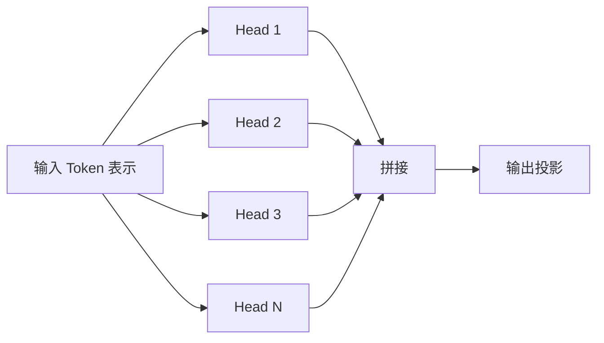
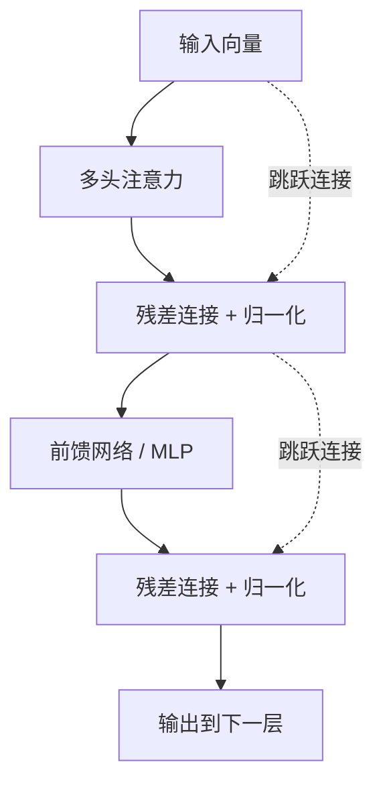
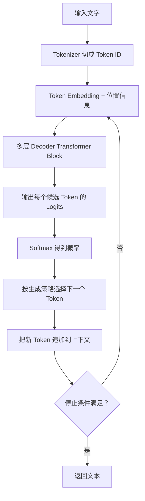
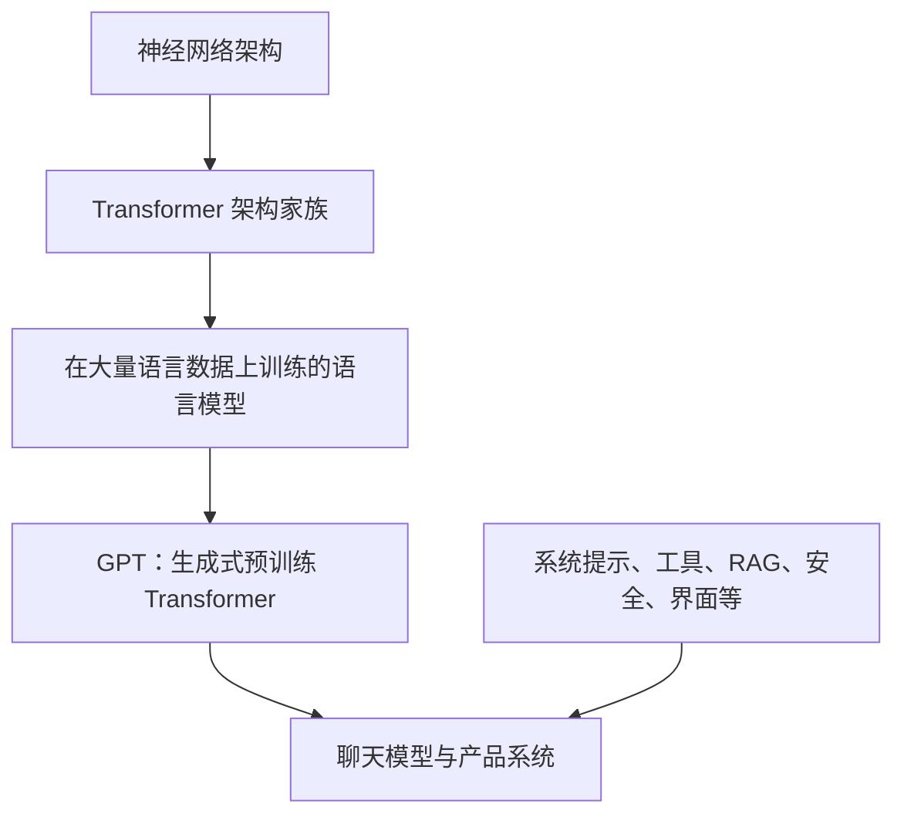

# Transformer 与注意力机制

> [!summary] 一句话结论
> **Transformer 是一种以 Attention（注意力机制）为核心的神经网络架构，它让输入中的每个 Token 都能根据相关程度读取其他 Token 的信息；GPT、BERT 和多数现代大语言模型都建立在 Transformer 或其变体之上。**

最简化地看：

```text
文字
  ↓ 切成 Token
Token 向量 + 位置信息
  ↓
多层 Transformer Block
  ├─ 注意力：不同 Token 之间交换信息
  └─ 前馈网络：分别加工每个 Token 的信息
  ↓
输出向量或下一个 Token 的概率
```

但不要把 Transformer 简化成“注意力机制”四个字。一个可用的 Transformer 通常还包含：

- Tokenization（分词/标记化）；
- Embedding（嵌入向量）；
- Position Information（位置信息）；
- Multi-Head Attention（多头注意力）；
- Feed-Forward Network（前馈网络）；
- Residual Connection（残差连接）；
- Layer Normalization（层归一化）；
- 训练得到的大量参数；
- 输出层和生成策略。

---

## 一、为什么会出现 Transformer

Transformer 由论文 **Attention Is All You Need** 在 2017 年提出，最初用于机器翻译。

在它之前，处理句子、语音等序列数据时经常使用：

- **RNN（Recurrent Neural Network，循环神经网络）**；
- **LSTM（Long Short-Term Memory，长短期记忆网络）**；
- **CNN（Convolutional Neural Network，卷积神经网络）**。

### RNN 的直观处理方式

假设句子是：

```text
我 / 昨天 / 在 / 公园 / 看见 / 一只 / 小猫
```

RNN 更像逐词阅读：

```text
读“我” → 形成状态
  ↓
读“昨天” → 更新状态
  ↓
读“在” → 再更新状态
  ↓
……
```

后面的计算依赖前面的状态，因此序列中的步骤较难全部同时计算；很远的信息还需要经过多次状态传递。

### Transformer 的基本想法

Transformer 更像让句子里的每个词都可以直接查看其他词，然后决定：

```text
为了理解我自己，其他位置分别有多重要？
```

原始论文提出了一个主要建立在注意力机制上的编码器—解码器架构，不再依赖循环或卷积来完成主要的序列信息交互。这让训练过程更容易利用 GPU 对许多位置进行并行计算，也让相距很远的 Token 可以通过一次注意力计算直接建立联系。

---

## 二、先认识六个前置概念

### 1. Token：模型处理的基本片段

**Token（标记，读作“偷肯”）**是模型实际处理的离散单位。

Token 不一定等于一个汉字或一个英文单词。它可能是：

- 一个汉字；
- 一个词；
- 英文单词的一部分；
- 标点；
- 空格或特殊控制标记；
- 图片中的一个 Patch；
- 音频的一段表示。

例如一句话可能被切成：

```text
“Transformer是什么？”
        ↓
[“Transform”, “er”, “是”, “什么”, “？”]
```

这里只是示意，真实切分取决于模型使用的 Tokenizer（分词器）。

### 2. Token ID：词表中的编号

模型不能直接读取文字，所以分词器会把 Token 映射成整数编号：

```text
“猫” → 12873
“喜欢” → 4931
```

编号本身没有“猫”的意义，只是词表中的位置。

### 3. Embedding：把编号变成向量

**Embedding（嵌入）**把每个 Token ID 转换成一串数字，也就是向量。

```text
Token ID 12873
      ↓ Embedding Table
[0.12, -0.48, 0.31, 0.07, ...]
```

这些数字是在训练中学习出来的。向量为模型提供可计算的表示，后续层会不断根据上下文更新它。

### 4. Parameter：模型学到的参数

**Parameter（参数）**是训练过程中被调整的数值，例如：

- Embedding 表中的数字；
- 生成 Q、K、V 的矩阵；
- 前馈网络的权重；
- 输出层权重。

“70 亿参数模型”表示模型大约有 70 亿个经过训练的可调数值，并不表示模型保存了 70 亿条完整知识。

### 5. Layer：层

一个 Transformer 模型通常把相似结构重复很多次。每次重复可以称为一个 Layer（层）或 Block（块）。

前面的层可能更多处理局部和基础模式，后面的层在已经加工过的表示上继续组合信息。但不能简单规定“第几层一定负责语法、第几层一定负责事实”。

### 6. Context Window：上下文窗口

**Context Window（上下文窗口）**表示模型一次能够接收和处理的 Token 范围。

上下文窗口包括的不只是用户刚输入的文字，还可能包括：

- System Prompt；
- 历史对话；
- 工具说明；
- RAG 检索片段；
- 工具返回结果；
- 模型正在生成的内容。

上下文长度有限，不等于模型拥有永久记忆。

---

## 三、Attention 到底是什么意思

**Attention（注意力机制）**不是说模型像人一样“集中精神”，而是一组数学计算：

> **对于当前位置，计算其他位置分别应该占多大权重，再按这些权重汇总信息。**

### 生活类比：带着问题查档案

假设你要确定一句话里的“它”指谁：

```text
小猫追着毛线球，因为它一直在滚动。
```

理解“它”时，你会检查前面的词：

- “小猫”是否符合“滚动”？
- “毛线球”是否符合“滚动”？
- “追着”提供了什么关系？

模型不会真的进行这段中文推理，但注意力计算可以让“它”这个位置根据学到的关系，从“毛线球”等位置汇总更多信息。

### 注意力权重不是固定词典

同一个词在不同句子里会读取不同信息：

```text
苹果发布了新设备。
我吃了一个苹果。
```

“苹果”的初始 Token 表示可能相似，但经过多层上下文交互后，两个位置的内部向量会变得不同。

---

## 四、Q、K、V 是什么

Transformer 的 Scaled Dot-Product Attention（缩放点积注意力）通常使用三组向量：

- **Q：Query，查询**；
- **K：Key，键**；
- **V：Value，值**。

可以用“查资料”理解：

| 名称 | 类比 | 作用 |
|---|---|---|
| Query | 我正在寻找什么 | 当前 Token 用什么特征去匹配其他 Token |
| Key | 我的索引标签是什么 | 其他 Token 用什么特征接受匹配 |
| Value | 我真正携带的内容 | 匹配后要被汇总的信息 |

### Q、K、V 从哪里来

每个 Token 当前层的向量，会分别乘以三个训练得到的权重矩阵：

```text
输入向量 X
  ├─ × Wq → Q
  ├─ × Wk → K
  └─ × Wv → V
```

所以 Q、K、V：

- 不是数据库里的 Query、Key、Value；
- 不是人工给每个词贴的标签；
- 是模型在训练中学出来的内部向量表示。

### 一次注意力计算的五步

#### 第一步：Q 与所有 K 比较

当前位置的 Query 与各个位置的 Key 做点积：

```text
Q当前位置 · K位置1
Q当前位置 · K位置2
Q当前位置 · K位置3
……
```

点积越大，一般表示在这个注意力头学到的空间里越匹配。

#### 第二步：除以缩放因子

分数会除以 `√dₖ`，其中 `dₖ` 是 Key 向量的维度。

这样做是为了防止维度较大时点积数值过大，让 Softmax 过度饱和、训练变得困难。

#### 第三步：加入 Mask

**Mask（掩码）**用于禁止某些位置参与注意力。

GPT 一类生成模型通常使用 **Causal Mask（因果掩码）**：生成当前位置时只能看到当前位置及之前的 Token，不能偷看后面的答案。

#### 第四步：Softmax 转成权重

**Softmax** 把分数转换成一组非负权重，合计为 1。

示意：

```text
小猫      0.05
追着      0.10
毛线球    0.70
因为      0.03
它        0.12
```

真实模型的权重不会总是像这个人工例子一样清晰。

#### 第五步：加权汇总 V

用权重对各位置的 Value 加权求和，得到当前位置的新信息：

```text
输出 = 0.05 × V小猫
     + 0.10 × V追着
     + 0.70 × V毛线球
     + ……
```

### 数学公式

标准形式是：

```text
Attention(Q, K, V)
= softmax((QKᵀ / √dₖ) + Mask) V
```

初学阶段不用推导矩阵，只需要看懂四件事：

1. Q 和 K 算相关分数；
2. 除以 `√dₖ` 稳定数值；
3. Mask 决定哪些位置不能看；
4. 用 Softmax 权重汇总 V。

---

## 五、Self-Attention 和 Cross-Attention

### Self-Attention：自注意力

**Self-Attention（自注意力）**表示 Q、K、V 来自同一段序列。

例如一句话中的每个 Token 都读取同一句话的其他 Token：

```text
句子 X → Q
句子 X → K
句子 X → V
```

### Cross-Attention：交叉注意力

**Cross-Attention（交叉注意力）**表示 Query 来自一个序列，而 Key、Value 来自另一个序列。

在原始编码器—解码器 Transformer 中：

```text
解码器当前状态 → Q
编码器的输入表示 → K 和 V
```

这样翻译模型在生成目标语言时，可以读取源语言句子的表示。

多模态模型也可能用交叉注意力，让文本位置读取图片、音频或视频表示。

---

## 六、为什么需要 Multi-Head Attention

**Multi-Head Attention（多头注意力）**表示模型同时进行多组不同的 Q、K、V 投影和注意力计算，然后把结果合并。



生活类比是让多个分析员从不同角度读同一段话：

- 一个可能更关注相邻词；
- 一个可能更关注指代关系；
- 一个可能更关注句子结构；
- 一个可能更关注远距离关联。

这只是帮助理解。实际训练中没有人规定“第 3 个头必须看主谓关系”，注意力头也不一定能被简单、稳定地解释成某种人类概念。

多头的价值在于：模型可以在不同的学习空间中同时建立多种关系，而不是用唯一一套相似度完成所有信息交互。

---

## 七、位置为什么必须单独告诉模型

仅靠普通自注意力，模型会比较 Token 内容，但不会天然知道 Token 排列顺序。

下面两句话的词几乎相同，意思却不同：

```text
狗咬人
人咬狗
```

因此要加入 **Positional Information（位置信息）**。

常见方法包括：

- 原始 Transformer 的正弦/余弦位置编码；
- Learned Positional Embedding（可学习位置嵌入）；
- RoPE（Rotary Position Embedding，旋转位置编码）；
- 相对位置偏置等。

可以先把它们理解成：给 Token 向量附加“我位于哪里、与其他位置相隔多远”的线索。

位置方法会影响长上下文和外推行为，但“支持更长上下文”不代表模型能同等准确地使用窗口内每一条信息。

---

## 八、Attention 之后还有什么

一个 Transformer Block 不只有 Attention。



不同模型会采用 Pre-Norm、Post-Norm 等不同排列，上图只表达主要组件关系。

### Feed-Forward Network：前馈网络

**FFN（Feed-Forward Network，前馈网络）**或 **MLP（Multi-Layer Perceptron，多层感知机）**会分别加工每个 Token 当前的向量。

可以粗略记成：

- Attention：Token 之间交换和汇总信息；
- FFN：每个 Token 对已经汇总的信息做非线性加工。

注意力决定“从哪里读取”，前馈网络和其他参数也承担大量模式变换。不能把模型的全部能力都归因于注意力权重。

### Residual Connection：残差连接

**Residual Connection（残差连接）**把模块输入直接加回模块输出：

```text
新状态 = 旧状态 + 模块加工结果
```

它帮助信息和梯度穿过很多层，使深层模型更容易训练。

### Layer Normalization：层归一化

**Layer Normalization（层归一化）**对内部数值做归一化处理，帮助训练保持稳定。

### Dropout

**Dropout（随机失活）**在训练时随机屏蔽一部分激活，作为正则化手段，降低模型过度依赖某些路径的风险。具体模型是否使用、使用在哪里和比例多大由架构决定。

---

## 九、Encoder、Decoder 和三类 Transformer

原始 Transformer 同时有 Encoder（编码器）和 Decoder（解码器）。后来的模型经常只取其中一部分或进行改造。

### 1. Encoder-Only：只有编码器

代表：BERT。

编码器通常允许每个 Token 同时查看左右两侧上下文，适合形成整段输入的表示。

常见任务：

- 文本分类；
- 情感分析；
- Token 标注；
- 搜索和向量表示；
- 信息抽取。

BERT 的全称是 **Bidirectional Encoder Representations from Transformers（来自 Transformer 的双向编码器表示）**。

### 2. Decoder-Only：只有解码器

代表：GPT 系列。

GPT 的全称是：

- **Generative（生成式）**；
- **Pre-trained（预训练）**；
- **Transformer**。

Decoder-Only 模型通过因果掩码，只能根据前面的 Token 预测后面的 Token，因此非常适合连续生成文字和代码。

### 3. Encoder-Decoder：编码器加解码器

代表原始 Transformer、T5 等。

常见任务：

- 翻译；
- 摘要；
- 输入一种序列并生成另一种序列。

简化流程：

```text
输入文字 → Encoder 形成输入表示
                     ↓ Cross-Attention
已有输出 → Decoder 逐步生成新文字
```

### 三种结构对比

| 结构 | 输入能看哪里 | 典型目标 | 代表 |
|---|---|---|---|
| Encoder-Only | 通常能看左右上下文 | 理解、分类、表示 | BERT |
| Decoder-Only | 只能看当前位置及之前 | 预测下一个 Token、生成 | GPT |
| Encoder-Decoder | 编码器看输入，解码器读取输入并自回归生成 | 输入到输出的转换 | 原始 Transformer、T5 |

“理解型”和“生成型”只是帮助初学者记忆的典型定位，不是绝对能力边界。

---

## 十、GPT 怎样用 Transformer 生成一句话

以一个简化的 Decoder-Only 模型为例：



### 1. Logits 是什么

**Logits（未归一化分数）**是模型对词表中每个候选 Token 给出的原始分数。

Softmax 会把它们转成概率分布。

### 2. 选择下一个 Token

系统可以：

- 直接选概率最高的 Token；
- 按概率采样；
- 调整 Temperature（温度）；
- 使用 Top-k、Top-p 等限制候选范围。

因此同一个提示词可能产生不同回答。生成策略改变的是如何从概率分布选择，不会临时重写模型参数。

### 3. 循环生成

新 Token 会被追加到上下文，再预测下一个：

```text
“天空” → 预测“是”
“天空是” → 预测“蓝”
“天空是蓝” → 预测“色”
……
```

这种一个接一个生成的方式叫 **Autoregressive Generation（自回归生成）**。

### 4. KV Cache 是什么

生成第 100 个 Token 时，前 99 个 Token 的 Key 和 Value 已经计算过。**KV Cache（键值缓存）**会保存各层过去 Token 的 K、V，避免每一步都从头重复计算它们。

KV Cache 可以加速生成，但会随着批量大小、层数、隐藏维度和上下文长度增加而占用更多显存或内存。

---

## 十一、Transformer 怎样训练

### 1. Pre-training：预训练

**Pre-training（预训练）**是在大规模数据上学习通用模式。

Decoder-Only 语言模型常见目标是预测下一个 Token：

```text
输入：今天天气很
目标：好
```

模型开始时预测可能很差。训练系统会：

1. 计算模型预测；
2. 与训练数据中的正确 Token 比较；
3. 计算 Loss（损失）；
4. 用 Backpropagation（反向传播）计算参数应该怎样调整；
5. Optimizer（优化器）更新参数；
6. 在大量样本上重复。

### 2. 为什么训练可以并行

虽然生成时必须逐 Token 进行，但训练时完整目标序列通常已经存在。

使用因果掩码后，可以在一次前向计算中并行计算多个位置的下一个 Token 预测：

```text
输入位置：我  喜  欢  猫
预测目标：喜  欢  猫  。
```

每个位置仍然不能看到未来 Token，但这些位置的矩阵运算可以一起提交给 GPU。

### 3. Fine-tuning 和对齐

预训练以后，还可能进行：

- **Supervised Fine-Tuning（监督微调）**；
- 偏好训练；
- 安全训练；
- 工具使用训练；
- 特定领域适配。

其中，[[RLHF与大模型对齐|RLHF]] 会把人类对多个回答的比较变成奖励信号，让模型更倾向于生成符合人类意图的回答；DPO、RLAIF、GRPO 和可验证奖励则属于相关但不完全相同的后训练方法。

因此一个聊天模型的行为不只来自 Transformer 架构，还来自训练数据、训练目标、微调、系统提示、工具和产品层控制。

---

## 十二、Transformer 为什么影响这么大

### 1. 适合硬件并行计算

Transformer 的主要操作大量使用矩阵乘法，GPU/TPU 很擅长并行执行这类计算。

### 2. Token 可以直接建立远距离联系

句首和句尾相隔很远时，注意力仍可直接计算两者关系，不必让信息逐个位置传递。

### 3. 架构容易扩大

研究者可以增加：

- 层数；
- 隐藏维度；
- 注意力头；
- 训练数据；
- 计算量；
- 上下文长度。

这使 Transformer 成为大规模预训练模型的有效基础架构。

### 4. 不只适用于文字

只要能把输入表示成 Token 或向量序列，Transformer 就可以用于：

- 图像；
- 音频；
- 视频；
- 代码；
- 蛋白质序列；
- 多模态数据。

例如 Vision Transformer 会把图片切成 Patch（图像块），把每个 Patch 转成向量后交给 Transformer。

---

## 十三、Transformer 的代价和局限

### 1. 标准注意力开销会随序列长度快速增长

如果有 `n` 个 Token，每个 Token 都要与其他 Token 比较，注意力分数矩阵大致有 `n × n` 个位置。

```text
Token 数翻倍
注意力分数数量大约变成 4 倍
```

这通常称为标准自注意力的 **O(n²)** 时间/内存特征。实际实现会受 FlashAttention、分块、稀疏注意力、滑动窗口和模型结构影响，但长上下文仍会显著增加计算与缓存成本。

### 2. 生成过程难以完全并行

自回归模型必须先生成前一个 Token，才能把它加入上下文生成下一个 Token，所以输出长度会直接影响响应时间。

### 3. 上下文窗口不是永久记忆

窗口之外的内容不会自动一直保留。即使内容在窗口内，模型也不保证能准确提取其中所有细节。

长期知识通常还需要：

- 训练参数；
- 外部数据库；
- [[RAG、Naive RAG与GraphRAG|RAG]] 检索；
- 会话摘要；
- 专门的记忆系统。

### 4. 下一个 Token 预测不保证事实正确

模型输出的是在其参数、上下文和生成设置下的 Token 概率。语言流畅不等于事实已经过数据库或现实世界验证。

所以重要事实仍需要：

- 可靠来源；
- 检索或工具；
- 数据库查询；
- 规则校验；
- 人工复核。

### 5. 训练和运行成本高

大型 Transformer 需要大量：

- 训练数据；
- GPU/TPU 计算；
- 显存和存储；
- 分布式训练工程；
- 推理优化和能源。

“架构容易扩展”不等于扩展成本低。

---

## 十四、Transformer、LLM、GPT 和 ChatGPT 的关系



- **Transformer**：神经网络架构；
- **Language Model（语言模型）**：学习语言序列概率的模型；
- **LLM（Large Language Model，大语言模型）**：参数、数据和能力规模较大的语言模型；
- **GPT**：Generative Pre-trained Transformer，一类生成式预训练 Transformer；
- **ChatGPT**：面向对话的产品/系统，不只是裸 Transformer 结构。

类比：

```text
Transformer ≈ 发动机结构
训练好的 LLM ≈ 装有具体发动机、经过制造和调校的车辆
聊天产品 ≈ 车辆 + 导航 + 仪表盘 + 安全系统 + 服务网络
```

Transformer 本身不会凭空拥有知识。知识和能力主要来自训练数据、训练方法和模型参数，使用时还会受到上下文、工具和产品系统影响。

---

## 十五、Transformer 与 RAG、Prompt、LangChain、MCP 的关系

### Transformer 与 Prompt

[[Prompt Engineering与Loop Engineering|Prompt]] 是放进模型上下文的输入。Transformer 负责处理这些 Token；Prompt Engineering 是设计输入和交互流程，不是修改 Transformer 架构。

### Transformer 与 RAG

[[RAG、Naive RAG与GraphRAG|RAG]] 会先从外部知识库检索内容，再把内容作为 Token 放进上下文。Transformer 不会因此永久学会这些资料，只是在当前请求中处理它们。

### Transformer 与 LangChain

[[LangChain]] 是用于组织模型调用、Prompt、检索、工具和工作流的软件框架。它通常调用已经训练好的 Transformer 模型，本身不是神经网络架构。

### Transformer 与 MCP

[[MCP模型上下文协议|MCP]] 规定 AI 应用怎样发现和调用外部工具或读取资源。Transformer 可以根据上下文决定发起工具调用，但网络通信、权限和工具执行由模型外部的 Agent Runtime 完成。

### Transformer 与向量数据库

向量数据库可保存文档 Embedding 并做相似度检索。它是模型外部的数据系统，不是 Transformer 内部的 Q、K、V 存储。

> [!warning] 不要混淆两种“向量”
> Transformer 内部每一层都会产生临时 Token 向量；RAG 使用的文档 Embedding 是为检索保存的向量。两者都使用向量数学，但用途、生命周期和生成方法不同。

---

## 十六、常见误区

### 误区 1：Transformer 就是 ChatGPT

Transformer 是底层架构家族；聊天产品还包括训练、对齐、系统提示、上下文管理、工具、检索、安全和用户界面。

### 误区 2：Attention 就像人类意识一样理解文字

Attention 是可训练的数值加权机制。它能形成非常强的上下文表示，但不要把注意力权重直接等同于人的意识或解释过程。

### 误区 3：Q、K、V 是人工编写的知识库

Q、K、V 是每层根据输入向量和训练权重即时计算出来的内部表示，不是三张人工维护的数据表。

### 误区 4：某个注意力头一定对应一种语法规则

有些头可能表现出可观察模式，但头的功能可能分散、重叠或依赖上下文，不能把每个头固定命名成人类规则。

### 误区 5：Attention 权重最高的词就是模型作出答案的全部原因

输出还经过多层注意力、前馈网络、残差、归一化和输出层。单张注意力图通常不足以完整解释模型决定。

### 误区 6：上下文足够长，模型就拥有无限记忆

上下文有容量和计算成本，长上下文中的信息也可能被忽略或使用错误；跨会话长期记忆还需要外部系统。

### 误区 7：模型生成时会实时在互联网上学习

普通推理主要使用已经训练好的参数和当前上下文。联网搜索、RAG 或工具结果是临时输入，不等于当场重新训练模型参数。

### 误区 8：Transformer 只能处理文字

图片块、音频片段、视频帧和其他数据都可以转换为向量序列，由 Transformer 或其变体处理。

### 误区 9：Transformer 已经淘汰所有其他架构

CNN、RNN、状态空间模型和各种混合架构仍有适用场景。模型选择取决于任务、延迟、内存、硬件和数据特征。

---

## 十七、初学者学习顺序

建议按以下顺序理解，不必一开始推导所有矩阵：

1. Token 和 Token ID；
2. Embedding 向量；
3. 上下文窗口；
4. Q、K、V 的生活类比；
5. `QKᵀ → Softmax → 加权 V`；
6. Self-Attention 与 Causal Mask；
7. Multi-Head Attention；
8. 位置信息；
9. FFN、残差连接和 LayerNorm；
10. Encoder、Decoder、BERT 与 GPT；
11. 预训练、损失和反向传播；
12. 自回归生成、Temperature 与 KV Cache；
13. 最后再学习矩阵维度、FlashAttention、RoPE、GQA/MQA 和分布式训练。

初学阶段只要能说清楚下面这段，就已经掌握核心：

> **文字先变成 Token 和向量；自注意力让每个 Token 根据 Q、K 的匹配程度，从其他 Token 的 V 中汇总信息；多头从不同表示空间并行计算；前馈网络继续加工；多层重复后，模型产生输出表示或下一个 Token 的概率。**

---

## 十八、记忆地图

```text
Transformer
│
├─ 输入
│  ├─ Tokenization
│  ├─ Token Embedding
│  └─ Position Information
│
├─ Transformer Block × N
│  ├─ Attention
│  │  ├─ Q：寻找什么
│  │  ├─ K：怎样被匹配
│  │  ├─ V：携带什么内容
│  │  ├─ Mask：哪些位置不能看
│  │  └─ Multi-Head：多组关系空间
│  ├─ Feed-Forward / MLP
│  ├─ Residual Connection
│  └─ Layer Normalization
│
├─ 架构类型
│  ├─ Encoder-Only：BERT
│  ├─ Decoder-Only：GPT
│  └─ Encoder-Decoder：原始 Transformer、T5
│
├─ 训练
│  ├─ 大规模预训练
│  ├─ Loss 与反向传播
│  └─ 微调和对齐
│
└─ 推理
   ├─ Logits → 概率
   ├─ 选择下一个 Token
   ├─ 自回归循环
   └─ KV Cache
```

---

## 关联概念

- [[大模型架构与效率技术地图]]：把 MoE、高效注意力、状态空间/长期记忆、推理模型、多模态和部署加速放进同一张地图。
- [[高效注意力：FlashAttention、GQA、MLA与线性注意力]]：详细区分 FlashAttention、GQA、MLA、稀疏注意力和线性注意力。
- [[状态空间模型与长期记忆：Mamba、Titans与外部记忆]]：理解为什么一些架构用有限状态或外部存储补充标准注意力。
- [[RLHF与大模型对齐]]：人类偏好、奖励模型、PPO、DPO 与 RLAIF 怎样改变训练后模型的行为倾向。
- [[Prompt Engineering与Loop Engineering]]：怎样设计放入上下文的输入，以及怎样用反馈循环完成任务。
- [[RAG、Naive RAG与GraphRAG]]：怎样把外部知识检索结果临时加入 Transformer 上下文。
- [[LangChain]]：怎样在模型外部编排 Prompt、检索、工具和工作流。
- [[MCP模型上下文协议]]：AI 应用怎样连接外部工具和资源。
- [[LLM Wiki]]：怎样组织适合人和大语言模型共同使用的知识库。
- [[知识库是什么：个人、团队与AI知识库]]：模型参数、上下文、向量检索和知识库的区别。
- [[高并发系统：瓶颈分析、扩容与稳定性治理]]：大模型服务在 GPU、KV Cache、批处理和请求排队方面也需要容量治理。

## 参考资料

以下内容于 2026-08-30 核对，优先使用原始论文和官方文档：

- [Vaswani 等：Attention Is All You Need（原始 Transformer 论文）](https://arxiv.org/abs/1706.03762)
- [NeurIPS：Attention Is All You Need 论文版本](https://papers.neurips.cc/paper/7181-attention-isall-you-need.pdf)
- [OpenAI：Improving Language Understanding by Generative Pre-Training（GPT-1 论文）](https://cdn.openai.com/research-covers/language-unsupervised/language_understanding_paper.pdf)
- [Devlin 等：BERT: Pre-training of Deep Bidirectional Transformers for Language Understanding](https://arxiv.org/abs/1810.04805)
- [PyTorch 官方文档：Scaled Dot Product Attention](https://docs.pytorch.org/docs/stable/generated/torch.nn.functional.scaled_dot_product_attention.html)
