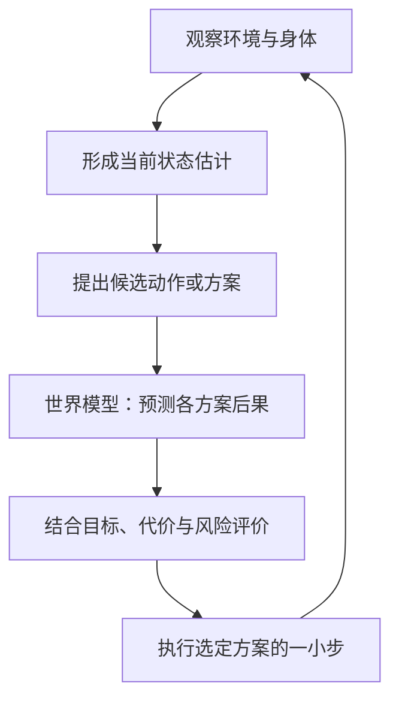

# 世界模型：环境预测、想象与规划

> [!summary] 一句话解释
> 世界模型是对环境及其变化规律的一种内部表示；在控制与决策场景中，尤其用于预测“当前这样，如果我采取这个动作，接下来可能发生什么”，从而辅助学习、规划或行动。

## 一、“世界”不是说它知道整个宇宙

**World Model（世界模型；World 近似读“沃尔德”，Model 近似读“莫德尔”）** 中的“世界”，可以只是一张桌子、一个房间、一个游戏关卡，或某个机器人任务涉及的环境。

“模型”不是模型玩具，而是对某些规律的简化表示。例如，用位置和速度估计小车下一刻在哪，就是环境建模的一种基本思路。

在 **AI（Artificial Intelligence，人工智能，按字母读“诶艾”）** 研究中，很多世界模型通过数据学习表示与变化规律。它们不必把每一个原子都模拟出来，也不保证对没见过的环境都预测正确。

> [!important] 这个词有宽窄不同的用法
> 一些工作强调可用于控制的、带动作条件的动态预测；另一些工作强调视频、空间或环境的表示与生成。阅读论文和产品资料时，要先问“输入是什么、预测什么、能否交互、怎么评测”，不能仅凭名称把它们当成同一种能力。

## 二、生活类比：先在脑中试一下

桌边放着一个杯子。你想移动它时，会预想：

- 往桌子中间移动，可能更稳妥。
- 往桌边推得太远，可能掉下去。
- 杯中有水，快速移动可能洒出。

你没有真的把杯子推下去才知道可能有风险，而是利用经验预估后果。

“脑内预演”是帮助理解世界模型的类比，不是在断言人脑已经被完全解释，也不是说人工模型具有意识或人类体验。

## 三、先区分观察、状态、动作和策略

| 概念 | 通俗解释 | 拿杯子时的例子 |
|---|---|---|
| Observation（观察） | 传感器实际提供的信息 | 一幅摄像头图像、夹爪的受力读数 |
| State（状态） | 描述环境和身体当前情况的信息 | 杯子位置、速度、手爪位置、是否接触 |
| Action（动作） | 智能体可以施加的操作 | 移动手爪、闭合夹爪 |
| Policy（策略） | 根据已有信息选择动作的规则或模型 | 决定先接近杯子，再尝试抓取 |
| World Model（世界模型） | 表示环境、预测变化的模型 | 预测执行某个动作后，杯子与手爪会怎样变化 |

摄像头不一定能看到杯子背面，也不一定能知道杯子重量，所以“观察”不等于“完整真实状态”。实际模型往往要结合历史观察，估计一个有不确定性的内部状态。

最重要的区别是：

```text
策略：当前信息 + 目标 → 我打算做什么
世界模型：当前状态表示 + 候选动作 → 接下来可能怎样
```

世界模型本身不一定知道什么是“好结果”。任务目标、奖励或价值评估可以由其他组件提供，也可能与世界模型联合学习。

## 四、怎样利用预测来选动作

下面展示的是一种使用方式，不是所有世界模型都必须采用的架构：



例如，模型预测某条路径会碰到障碍物，另一条路径绕开障碍但更长，决策组件就可以结合安全限制与时间成本做选择。

实际结果出来以后应重新观察，而不是一路相信最开始的长程预测。预测中的一点误差，连续推演之后可能被放大。

但也有另一种用法：**主要在训练时利用世界模型“想象”经验，训练好策略后，执行时由策略快速输出动作，不必每一步都显式比较很多未来。**

DreamerV3 就是通过学习环境模型、利用想象的未来情景改进行为的研究实例。具体训练与执行流程应看原论文，不能把上面的教学图当成它的逐行实现。[作者项目页](https://danijar.com/project/dreamerv3/)

## 五、一个不用神经网络也能看懂的最小例子

设一个教学用虚拟小车在一条线上移动：

- 合法位置只有 `0、1、2、3、4`。
- 当前在 `1`，目标在 `3`。
- 动作是左移一步、右移一步或不动。
- 碰到边界时停在边界，没有障碍物或惯性。

| 候选动作 | 简化模型预测的下一位置 | 与目标 3 的距离 |
|---|---:|---:|
| 左移 | 0 | 3 |
| 不动 | 1 | 2 |
| 右移 | 2 | 1 |

在这个特意简化的任务中，选择“右移”可以靠近目标。

其中：

1. “从位置 1 右移会到位置 2”是**环境预测**。
2. “距离目标更近更好”是**任务评价**。
3. “因此选择右移”是**决策**。

这里的移动规则是人为规定的，不是已经训练出了神经网络世界模型。学习型模型可以从许多“原位置—动作—实际新位置”的记录中学习变化规律；真实机器人则会涉及远比此例复杂的状态、延迟、噪声和接触。

## 六、世界模型怎么训练，数据从哪里来

### 1. 收集有时间关系的数据

常见数据可以是：视频序列、模拟环境中的交互记录、机器人观察与动作记录、传感器时间序列。

针对动作预测，一条经验可以抽象写为：

```text
原先看到什么 → 执行了什么动作 → 后来实际看到了什么
```

这不是只能靠“网上找文本”获得的数据。通过人工示范、已有控制器或受控探索，也能获得任务经验；真实设备的数据采集要考虑成本和安全。

单纯观看视频可以学习视觉变化规律，但视频里未必记录了准确的控制动作、接触力与隐藏状态。看到两个事件前后发生，也不能自动证明第一个导致第二个。因此，从观看视频走到可靠控制，仍需要验证与适配。

### 2. 把复杂观察变成内部表示

一幅图像可能包含大量像素。模型不一定每次都在原始像素上推演，而可以先压缩成一组数字，尽量保留任务需要的结构。

这类内部表示常叫 **Latent State（潜在状态）**。可以把它类比为“对当前情况的简要记录”，但它未必能逐项翻译成“杯子坐标、杯子重量”等人工可读字段。

### 3. 学习预测与真实结果之间的关系

模型根据先前观察或内部状态，以及可用的动作信息预测后续；再利用真实后续数据产生训练信号，调整参数。

不同方法可以在像素、潜在特征或概率分布层面学习，也可以加入重建、奖励、任务终止等辅助目标。不是所有方法都只做“逐像素相减”。

### 4. 把模型用于任务学习或决策

学到预测能力之后，可以：

- 比较候选动作的可能后果。
- 生成模拟经验，训练策略。
- 提取对决策有用的环境特征。
- 提供交互环境或可视化预测，帮助分析与测试。

**RL（Reinforcement Learning，强化学习，按字母读“阿尔艾勒”）** 可以参与策略训练，但世界模型本身也可以利用自监督或其他预测学习方式训练。“世界模型”并不是“强化学习”的同义词。

### 5. 更新当前状态，不等于每次都重新训练

执行一个动作后，用新观察更新“现在在哪里”，属于状态估计。

利用新数据重新调整模型权重，才涉及参数学习。系统可以只做前者，也可以在受控流程中周期性做后者，不能把“有记忆或反馈”直接理解为“模型一直在自主改写自身”。

## 七、两个真实研究例子

### World Models：2018 年的代表性论文

David Ha（戴维·哈）和 Jürgen Schmidhuber（于尔根·施密德胡伯）的《World Models》把视觉压缩、时间预测和控制器组合起来，在游戏环境中研究环境表示与“想象中学习”。

它的重要入门价值是把“看见什么、预测什么、决定做什么”分开看，而不是让你死记某个网络结构。论文也讨论了利用模型缺陷投机的问题。

这里的“实际环境”包括原始游戏环境，并不表示论文已经让所有策略从梦境直接迁移到真实物理机器人。世界模型的思想也早于这篇同名论文，并非 2018 年凭空出现。[作者项目与论文](https://worldmodels.github.io/)

### DreamerV3：利用想象的经验学习策略

DreamerV3（Dreamer 近似读“追默”，V3 表示版本 3）是一种基于世界模型的强化学习方法。它学习环境模型，并利用模型中的想象轨迹改进策略，研究其在不同控制任务上的适用性。

“想象”在这里是模型计算出的状态序列，不是意识活动；它也不要求每次都渲染成供人观看的高清视频。

项目页中的实验成绩有任务、数据量与评测条件，不能直接变成“装到任意机器人上就会工作”的承诺。[作者项目页与 Nature 论文入口](https://danijar.com/project/dreamerv3/)

## 八、和大语言模型、视频生成、模拟器有什么区别

**LLM（Large Language Model，大语言模型，按字母读“艾勒艾勒艾姆”）** 通常以语言序列建模为重要基础；世界模型强调环境表示与变化预测。两者不是完全互斥的技术阵营。

| 比较对象 | 主要关注点 | 不能直接等同的原因 |
|---|---|---|
| 大语言模型 | 处理、预测或生成语言序列，完成相关任务 | 能说出物理常识，不代表能准确预测具体设备执行动作的后果 |
| 视频生成模型 | 生成时间连续的视觉内容 | 画面逼真，不自动证明动作可控、对象一致或物理预测可靠 |
| 传统模拟器 | 用人为设置的规则、几何和物理计算环境变化 | 不一定通过数据学习；学习型世界模型也不一定输出可见画面 |
| 世界模型 | 表示环境并预测其变化，具体范围因研究而异 | 可以服务于学习、控制、交互或生成，不限定为一种输出形式 |

重要补充：

- 语言模型可能学到某种隐式世界知识，也可以成为世界模型或机器人系统的组件，不能说它“绝不可能有世界表示”。
- 世界模型可以使用 [[Transformer与注意力机制]] 等网络结构，不是 Transformer 的必然替代者。
- 视频生成模型可能发展为可交互的世界模型，也可能有一定环境建模能力；需要拿对应的能力与评测来判断。
- 传统物理模拟、学习预测与实际传感，可以组成混合系统。

## 九、和具身智能是什么关系

[[具身智能与离身智能：感知、行动与环境交互]] 关心身体如何感知和行动；世界模型关心怎样表示环境与预测后果。它们是可以组合的两个维度：

| 系统例子 | 与身体交互的关系 | 与世界模型的关系 |
|---|---|---|
| 机械臂结合预测规划抓取物体 | 现实中的身体交互 | 可以利用世界模型 |
| 机器人直接根据观察执行学到的策略 | 同样存在身体交互 | 不一定显式学习环境预测模型 |
| 游戏中利用环境预测来选动作 | 属于虚拟交互；具身称呼取决于定义 | 可以使用世界模型，不需要真实机械身体 |
| 生成环境变化供人分析的预测系统 | 可以完全不控制身体 | 也可能采用世界模型 |

所以不能把“具身智能—世界模型—机器人”理解成三个同义词，也不能把它们理解成必然逐代替换的关系。

## 十、主要难点与常见误区

1. **预测越远，误差可能积累越大。** 前一步位置偏了，后续模拟可能越来越偏。
2. **现实信息不完整。** 重量、摩擦、遮挡和人的意图未必能从现有观察得出。
3. **没见过的环境可能失效。** 换光照、物体材质或设备后，训练规律不一定适用。
4. **“像真的”与“能用于控制”不是一个指标。** 好看的视频不保证准确的接触和运动预测。
5. **策略可能利用模型漏洞。** 在模型中得高分的动作，在真实环境中可能失败。
6. **世界模型不是全知数据库。** 查历史资料与预测动作后果是不同任务，可以结合 [[RAG、Naive RAG与GraphRAG]] 使用。
7. **拥有世界模型不等于通用智能已经实现。** 可用范围、长期一致性、任务成功率和安全性都需分别检验。

遇到产品宣传时，可以问：它预测几步？输入是否包括动作？在未见过的场景上怎样？是否闭环验证？失败时如何处理？结果是否经过独立测试？

## 十一、学习建议与关联概念

先掌握“观察、状态、动作、策略”，再区分“预测未来”和“选择动作”；理解之后，再看网络架构与论文细节。

- [[具身智能与离身智能：感知、行动与环境交互]]：身体、行动与环境。
- [[多模态模型：ViT、DiT与视觉语言模型]]：图像、视频与动作的表示。
- [[大模型从数据、Token到训练与本地部署]]：数据、参数学习与推理的区别。
- [[推理模型、RL推理与测试时计算扩展]]：搜索、验证与增加决策计算。
- [[状态空间模型与长期记忆：Mamba、Titans与外部记忆]]：可用来理解内部状态，但“状态空间模型”与“世界模型”不是同义词。
- [[大模型架构与效率技术地图]]：世界模型属于建模目标与用途，不等于另一种注意力优化。

本篇虚拟小车是人工规则下的教学例子；没有训练模型，也没有连接或控制真实设备。

## 参考资料

核对日期：2026-09-08。使用原始研究与作者项目页说明技术思路，不将特定实验成绩扩展成所有现实任务的能力保证。

- [Ha 与 Schmidhuber：World Models，2018 年论文与交互项目](https://worldmodels.github.io/)
- [World Models：arXiv 论文条目](https://arxiv.org/abs/1803.10122)
- [Hafner 等：Mastering Diverse Control Tasks through World Models，DreamerV3 作者项目页](https://danijar.com/project/dreamerv3/)
- [Google DeepMind：Gemini Robotics，用于对照动作输出与身体交互](https://deepmind.google/blog/gemini-robotics-brings-ai-into-the-physical-world/)
