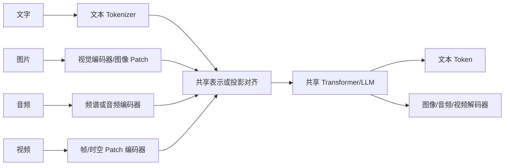
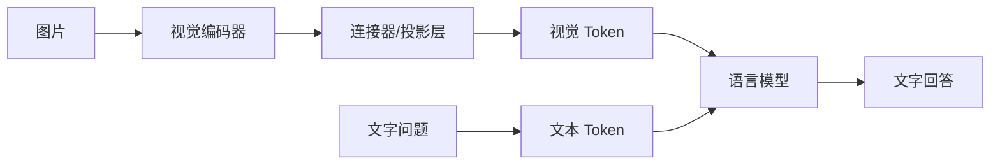

# 多模态模型：ViT、DiT与视觉语言模型

> [!summary] 一句话解释
> 多模态模型把文字、图片、音频或视频转换成可联合计算的向量或 Token；ViT 主要用 Transformer 理解图片，DiT 用 Transformer 作为扩散生成骨干，VLM 则让视觉表示与语言模型协作。

## 一、什么是“模态”

Modality（模态）就是信息的表现形式：

- 文字；
- 图片；
- 音频；
- 视频；
- 深度、热成像、传感器数据；
- 动作、机器人控制信号等。

Multimodal Model（多模态模型）能处理两种或更多模态。它不只是把图片附件转成文件名，而是把视觉或声音内容编码成模型能参与计算的表示。

生活类比：同一个人既能读信、看图、听声音，也能把“照片里的红灯”“录音里说停车”和文字规则联系起来。

## 二、计算机怎样把不同模态交给模型

神经网络最终处理的是数字张量，不直接理解像素、声音或汉字。因此需要编码步骤。



常见实现不止一种：

1. **独立编码器 + 共享空间**：各模态分别编码，再对齐到同一向量空间。
2. **视觉编码器 + Projector + LLM**：先提取视觉特征，用投影层变成 LLM 可读取的视觉 Token。
3. **共享骨干**：多种模态 Token 进入一个共享 Transformer，但前处理和输出解码仍可能不同。
4. **统一离散 Token**：用图像/音频 Codec 把不同数据离散化，再用统一序列模型处理。

所以“统一多模态”不一定表示所有原始字节都用同一个文本分词器处理。

## 三、ViT 是什么

ViT（Vision Transformer，读作“维艾提”，视觉 Transformer）把图片切成固定大小的 Patch（图像块），把每个块变成向量并加上位置信息，再像处理一串 Token 一样交给 Transformer。

假设图片是 `224 × 224` 像素，Patch 是 `16 × 16`：

```text
横向 224 / 16 = 14 块
纵向 224 / 16 = 14 块
总计 14 × 14 = 196 个图像 Token
```


原始 ViT 论文重点是图像分类和视觉表示学习。今天的视觉编码器可能基于 ViT 及其变体，但 ViT 本身不是“会聊天的多模态大模型”。

### 分辨率为何昂贵

Patch 越小或图片越大，视觉 Token 越多。若使用稠密注意力，Token 数翻倍会让注意力关系约增加四倍。因此高清图片、多页 PDF 和长视频会迅速吃掉上下文与算力。

## 四、DiT 是什么

DiT（Diffusion Transformer，读作“迪艾提”，扩散 Transformer）是在 Diffusion Model（扩散模型）中使用 Transformer 作为骨干网络。

扩散生成可粗略理解为：

1. 从随机噪声开始。
2. 模型根据文字条件预测怎样去除一部分噪声。
3. 重复多步，逐渐形成图片或视频。

早期图像扩散模型常用 U-Net；DiT 论文把常用 U-Net 骨干换成在潜空间 Patch 上运行的 Transformer。

```text
ViT：图片 → 理解/分类/特征
DiT：噪声潜变量 + 条件 → 反复去噪 → 生成图片
```

两者都使用 Transformer 和 Patch 思想，但任务、训练目标和输入输出完全不同。

## 五、VLM 是什么

VLM（Vision-Language Model，视觉语言模型）让视觉和语言发生联系，可执行：

- 图片描述；
- 视觉问答；
- OCR 后理解文档；
- 图表、界面和截图分析；
- 视觉定位和指代；
- 根据图片继续对话。

以 LLaVA 类架构为例：



训练还需要 Image-Text Pair（图文对）和 Visual Instruction Tuning（视觉指令微调），让模型不仅对齐图片与描述，还学会遵循“比较、定位、解释”等用户指令。

## 六、音频与视频怎样进入模型

### 音频

常见做法包括：

- 把波形转换成 Mel Spectrogram（梅尔频谱图），再用音频编码器处理；
- 用神经音频 Codec 把声音变成离散 Token；
- 分别建模语音内容、说话人、环境声、音乐等特征。

### 视频

视频不仅有空间维度，还有时间维度：

- 抽取关键帧；
- 将每帧切成 Patch；
- 使用时空 Patch；
- 压缩长视频后再送入模型；
- 同步建模画面、音频和字幕。

如果一秒取很多帧，每帧又有很多视觉 Token，数量会爆炸。因此帧采样、分辨率、自适应压缩和长序列注意力都很重要。

## 七、什么叫“统一”

统一可以指不同层次：

| 统一层次 | 含义 | 例子 |
|---|---|---|
| 表示统一 | 不同模态映射到可比较的嵌入空间 | 图文检索、ImageBind |
| 主干统一 | 不同模态 Token 由一个共享 Transformer 处理 | 多模态基础模型 |
| 任务统一 | 一个模型用指令完成描述、问答、定位等任务 | VLM/MLLM |
| 输入输出统一 | 同一模型既理解又生成多种模态 | 文生图、看图对话、语音对话组合 |

ImageBind 展示了把图片、文字、音频、深度、热成像和 IMU 等对齐到共同嵌入空间的路线。但“共享嵌入”不等于一个模型已经能以同等水平生成所有模态。

## 八、理解与生成不是同一件事

- Vision Encoder 把图片压成特征，适合理解。
- LLM 根据特征输出文本。
- 若要输出图片，通常还需要 Diffusion/DiT 或其他图像解码器。
- 若要输出音频，通常还需要声学模型、Codec 或波形生成器。

所以一个“原生多模态模型”背后仍可能由多个模块协作，产品称呼不能代替架构图。

## 九、主要难点

### 1. 对齐

模型要知道哪段文字对应图片的哪个对象、哪句语音对应哪个时间段。弱图文对可能只提供大致主题，学不到精确位置关系。

### 2. Token 数量

高清图、长音频和视频会产生大量 Token，带来显存、延迟和成本。

### 3. 空间与时间理解

能描述场景不等于能精确数数、读小字、判断左右或理解跨分钟的事件因果。

### 4. 幻觉

模型可能“看见”不存在的物体，漏读小字，或用语言常识覆盖真实像素证据。

### 5. 安全

图片中的隐藏文字、文档内容、音频指令都可能携带 Prompt Injection。多模态输入也涉及人脸、声音和位置等隐私。

## 十、常见误区

> [!warning] 常见误区
> - ViT、DiT、VLM 不是三个版本关系。
> - ViT 主要是视觉 Transformer 架构，不等于文生图。
> - DiT 是扩散生成的 Transformer 骨干，不等于视觉聊天模型。
> - 能识别图片不等于能生成图片。
> - 把视频抽几帧输入不等于模型完整理解了每一秒。
> - 多模态统一不一定降低成本，反而常因视觉/音频 Token 增加而更贵。

## 十一、学习建议与关联概念

先理解 [[Transformer与注意力机制]]，再按“输入编码器 → 对齐/投影 → 共享模型 → 输出解码器”阅读任何多模态架构图。看到产品宣传时询问它支持哪些输入、哪些输出、采样/分辨率限制和如何评测。

- 效率：[[高效注意力：FlashAttention、GQA、MLA与线性注意力]]
- 部署：[[大模型推理加速：FP8、量化、KV Cache与多Token预测]]
- 工具安全：[[MCP模型上下文协议]]

## 参考资料

> [!info] 核对日期
> 2026-08-30。多模态产品能力变化很快，具体输入限制和输出能力需查看对应模型卡与官方文档。

- [An Image is Worth 16×16 Words：ViT](https://arxiv.org/abs/2010.11929)
- [Scalable Diffusion Models with Transformers：DiT](https://arxiv.org/abs/2212.09748)
- [Visual Instruction Tuning：LLaVA](https://arxiv.org/abs/2304.08485)
- [ImageBind: One Embedding Space To Bind Them All](https://arxiv.org/abs/2305.05665)

