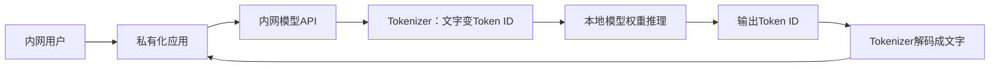
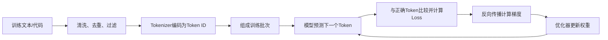

# 大模型从数据、Token到训练与本地部署

> [!summary] 一句话结论
> **原始文字、代码等资料先由 Tokenizer 切成 Token 并转换为数字 ID，模型通过反复预测下一个 Token 调整权重；模型训练完成后，可以只下载“权重 + Tokenizer”在内网推理，不需要重新从头训练。**

## 一、先直接回答 DeepSeek 会不会“出服务器”

取决于你用的是 **DeepSeek 的云端 API**，还是把 **DeepSeek 模型权重部署在自己的服务器**。

| 使用方式 | 模型在哪里计算 | Prompt 是否离开你的服务器 | 是否需要自己从头训练 |
|---|---|---:|---:|
| 调用 DeepSeek 官方 API | DeepSeek 的服务器 | 是 | 否 |
| 调用第三方云平台托管的 DeepSeek | 第三方服务器 | 是 | 否 |
| 下载开放权重，在企业 GPU 服务器运行 | 企业自己的服务器 | 通常不需要离开内网 | 否 |
| 自己微调后在内网运行 | 企业自己的服务器 | 通常不需要离开内网 | 否，只是在已有权重上继续训练 |
| 从零预训练一个基础模型 | 企业自己的训练集群 | 可全部留在内网 | 是，成本极高 |

### 调用 API 时哪些内容可能出去

应用发给外部模型 API 的请求可能包含：

- System Prompt；
- 用户问题；
- 对话历史；
- RAG 检索得到的内部文档片段；
- 工具返回结果；
- 图片、文件或其他多模态内容；
- 用户标识、请求元数据等。

HTTPS/TLS 可以加密这些内容在网络中的传输，防止普通中间人直接看到，但外部模型服务端必须处理请求内容才能推理。因此：

> **传输加密不等于数据没有离开企业，也不等于服务提供方完全看不到明文。**

具体是否保存日志、保存多久、是否用于训练，需要查看供应商当前合同、隐私政策、地区和产品配置，不能从“用了 HTTPS”推断。

## 二、本地推理不等于本地训练

这是理解本地模型最关键的区别。

### 本地推理

Inference（推理）是使用已经训练好的模型回答问题。需要准备：

- Model Weights（模型权重）；
- Tokenizer（分词器/标记器）；
- 模型配置；
- 推理引擎，例如 vLLM、SGLang、llama.cpp 或厂商实现；
- 足够的 GPU 显存、内存和磁盘；
- 对外提供服务的本地 API。



整个推理链路都在企业控制的网络中时，Prompt 不需要为了模型计算而发送到 DeepSeek 云端。

### 本地训练

Training（训练）是用数据和损失函数反复调整模型权重。它比推理需要更多：

- 训练数据；
- GPU 集群；
- 梯度、激活值和优化器状态所需显存；
- 分布式训练网络；
- 数据清洗、评测和训练工程；
- 数周或数月的稳定运行能力。

因此，**能在本地运行一个模型，不代表有能力从头训练同样的模型。**

生活类比：购买一本已经写好的百科全书在办公室阅读，是本地推理；组织几千人重新收集世界资料、编写并校对整套百科全书，是从头训练。

## 三、什么是模型权重

Model Weights（模型权重）是训练过程中学到的大量数字，包括：

- Token Embedding；
- 注意力层的投影矩阵；
- 前馈网络或 MoE 专家参数；
- 归一化参数；
- 输出层参数。

模型开始训练时，这些数字大多是随机初始化的。经过大量“预测 → 比较答案 → 计算误差 → 修改权重”，数字逐渐编码语言、知识模式和解决问题的能力。

下载开放权重，类似获得已经训练完成的“模型大脑快照”。推理时主要读取权重，不会因为每次聊天就自动把所有新知识写回权重。

## 四、Token 到底从哪里来

Token（标记，读作“偷肯”）不是从某个 Token 仓库购买的文字，也不是训练数据天然自带的固定单位。它是 **Tokenizer 根据规则把原始数据切分后的单位**。

原始数据可能来自：

- 网页和书籍；
- 新闻、论文和百科资料；
- 开源代码；
- 数学与科学数据；
- 对话和问答；
- 获得授权的专有数据；
- 人工标注或合成数据。

经过清洗后的文字会被 Tokenizer 切分。例如：

```text
原文：我喜欢Transformer。

可能切成：
[我] [喜欢] [Transform] [er] [。]
```

这里只是示意，真实结果由具体模型的 Tokenizer 决定。

### Tokenizer 是怎样得到的

Tokenizer 通常先在一批代表性语料上训练或设计一个 Vocabulary（词表）。常见方法包括：

- BPE（Byte Pair Encoding，字节对编码）；
- Byte-level BPE（字节级 BPE）；
- WordPiece；
- Unigram；
- 字节或字符级编码。

以 BPE 的直觉为例：

1. 开始时用较小单位表示文本；
2. 统计哪些相邻单位经常一起出现；
3. 把高频组合合并成新 Token；
4. 重复直到达到目标词表大小。

常见词可能成为一个 Token，罕见词可能拆成多个 Token。Tokenizer 还会定义特殊 Token：

- BOS：序列开始；
- EOS：序列结束；
- Padding：批处理填充；
- 对话角色或工具调用标记。

### 不要和 Access Token 混淆

计算机语境里还有几种同名概念：

| 名称 | 是什么 | 从哪里来 |
|---|---|---|
| LLM Token | 模型处理的文本/多模态序列单位 | Tokenizer 对输入数据切分编码 |
| Access Token | 证明登录身份或接口权限的访问凭证 | 身份认证服务器签发 |
| API Key | 调用某个平台 API 的长期或半长期密钥 | 平台账号后台创建 |
| Token 用量/额度 | 输入和输出 LLM Token 的计费统计 | 平台按 Tokenizer 结果计算 |

本笔记后面说的“14.8 万亿 Token”指第一种训练序列单位，不是 14.8 万亿个 API 密钥。

## 五、Token、Token ID、Embedding 的关系

```text
原始文字
  ↓ Tokenizer切分
Token
  ↓ 查词表
Token ID（整数编号）
  ↓ 查Embedding表
向量
  ↓ Transformer计算
上下文表示和下一个Token概率
```

例如：

```text
“猫” → Token ID 12873
Token ID 12873 → [0.12, -0.48, 0.31, ...]
```

- Token 是切分后的符号单位。
- Token ID 是它在词表中的整数编号。
- Embedding 是模型用来计算的向量。
- 参数训练更新的是向量和网络权重，不是简单把原文保存在某个表格里。

## 六、训练语料中的“14.8 万亿 Token”是什么意思

假设清洗后有大量文字和代码。使用模型固定的 Tokenizer 编码以后，所有训练序列加起来包含 14.8 万亿个 Token，那么就称训练语料规模约为 14.8T Tokens。

这里的 `T` 是 Trillion（万亿）。它可能包含同一信息的多种表达，也可能经过多个训练 Epoch 或采样策略；论文中的“训练 Token 数”要按具体数据口径理解。

以 DeepSeek-V3 技术报告为例，其报告：

- 671B 总参数；
- 每个 Token 激活约 37B 参数；
- 在 14.8T 多样化、高质量 Token 上预训练；
- 完整训练使用约 2.788M H800 GPU 小时；
- 之后还进行了监督微调和强化学习。

这些数字说明：个人或普通企业从头复制同等级基础模型训练，通常不现实。下载权重进行本地推理则是完全不同的成本等级。

## 七、预训练到底怎样进行

Decoder-Only（仅解码器）语言模型最典型的预训练目标是：**根据前面的 Token 预测下一个 Token。**

假设训练文本是：

```text
今 天 天 气 很 好
```

训练时可以构造：

```text
输入：今 天 天 气 很
目标：天 天 气 很 好
```

模型在每个位置预测后一个 Token：

```text
看到“今”       → 预测“天”
看到“今天”     → 预测“天”
看到“今天天”   → 预测“气”
看到“今天天气” → 预测“很”
```

完整循环是：



### Loss 是什么

Loss（损失）衡量模型预测与正确目标之间的差距。正确 Token 概率越低，损失通常越大。

### 反向传播是什么

Backpropagation（反向传播）沿计算图反向计算：每个参数稍微变化会让损失怎样变化。这个变化方向叫 Gradient（梯度）。

### 优化器是什么

Optimizer（优化器）根据梯度调整参数，例如 AdamW。训练在海量批次上重复，模型的预测概率逐渐改善。

## 八、完整训练一款聊天大模型有哪些阶段

### 1. 设计架构和 Tokenizer

确定 Transformer/MoE 等结构、参数量、上下文长度、词表和特殊 Token。

### 2. 收集和治理数据

处理来源许可、隐私、重复、低质量、恶意内容、语言比例和数据污染。数据多不等于数据好。

### 3. 预训练 Base Model

在大规模 Token 上做下一个 Token 预测，得到 Base Model（基础模型）。它会续写，但不一定自然遵循聊天指令。

### 4. SFT 监督微调

SFT（Supervised Fine-Tuning，监督微调）使用“指令 → 高质量回答”示范，让模型学会问答、拒绝、格式和工具调用。

### 5. 偏好与强化学习

通过人类/AI 偏好、DPO、RLHF、可验证奖励等方法改善帮助性、安全性和推理行为。详见 [[RLHF与大模型对齐]]。

### 6. 评测和安全测试

检查知识、推理、代码、语言、安全、隐私、偏见、工具调用、长上下文和真实业务回归。

### 7. 压缩和部署

可以通过 FP8、INT8/INT4 量化、蒸馏、并行和 KV Cache 优化降低推理成本。详见 [[大模型推理加速：FP8、量化、KV Cache与多Token预测]]。

## 九、企业通常不从头训练，而是怎样做

### 路线 A：直接本地推理开放权重

下载已经训练好的模型、Tokenizer 和配置，在内网 GPU 上运行。这主要解决数据路径和外部 API 依赖问题。

### 路线 B：本地模型 + RAG

将企业文档保存到内部知识库，检索相关片段并交给本地模型。适合经常更新、需要引用来源的事实知识。

```text
内部文档 → 内部检索 → 本地模型 → 回答
```

详见 [[RAG、Naive RAG与GraphRAG]]。

### 路线 C：LoRA/SFT 微调

LoRA（Low-Rank Adaptation，低秩适配）只训练少量附加参数，比全量微调便宜。适合固定输出格式、行业语言、行为风格或特定任务。

微调不是给模型安装一个可以逐条可靠查询的数据库。需要准确更新的事实通常仍优先考虑 RAG。

### 路线 D：继续预训练

用大量行业原始文本继续训练基础模型，帮助模型适应专业语言和分布。成本和遗忘风险高于普通 SFT。

### 路线 E：从零预训练

自己设计 Tokenizer 和模型，使用海量数据从随机权重开始训练。只有在规模、数据、研究目标、合规或自主可控要求足以支撑巨大投入时才考虑。

## 十、怎样选择 RAG、微调或从头训练

| 目标 | 更常见方案 | 原因 |
|---|---|---|
| 文档经常变化，需要引用原文 | RAG | 数据可更新、删除和追踪来源 |
| 固定回答格式或工作流程 | SFT/LoRA | 改变模型行为倾向 |
| 让外部 Prompt 不出内网 | 本地推理 | 不必重新训练基础模型 |
| 适应大量行业语言和知识分布 | 继续预训练 + SFT/RAG | 比从零开始便宜，但仍需大量数据 |
| 研究全新基础模型架构 | 从零预训练 | 需要控制全部架构、数据和权重 |

通常可以按下面的成本顺序考虑：

```text
Prompt/工作流
  ↓ 不够
RAG
  ↓ 不够
LoRA/SFT
  ↓ 特殊需要
继续预训练
  ↓ 极少数情况
从零预训练
```

## 十一、推理时的 Token 又来自哪里

一次模型请求消耗的 Token 通常来自：

- 系统提示词；
- 用户问题；
- 历史对话；
- RAG 文档片段；
- 工具定义和工具结果；
- 模型生成的输出。

服务商按输入/输出 Token 计费，是因为 Token 数大致反映模型处理和生成的计算量。不同模型的 Tokenizer 不同，同一句中文在不同模型中的 Token 数可能不同。

本地模型不一定按 Token 向外付费，但仍然要为 GPU、耗电、服务器和运维付出成本。

## 十二、本地模型是否就完全没有数据安全问题

仍然不是。

本地推理可以减少 Prompt 发送给外部模型供应商的风险，但还要检查：

- 推理引擎是否发送遥测；
- 应用是否调用外部搜索、OCR、Embedding 或语音 API；
- 模型权重和容器从哪里下载，是否验证哈希和签名；
- 日志是否记录完整 Prompt 和敏感文档；
- 哪些员工能访问模型 API、数据库和备份；
- 模型能否通过工具访问不该访问的内网资源；
- 更新、插件和依赖是否引入供应链风险；
- GPU 显存、临时文件和崩溃转储如何清理。

“本地”缩小了一个外部边界，但没有自动解决身份、权限、日志、供应链和运维安全。

## 十三、DeepSeek 本地部署的现实区别

DeepSeek 提供过可下载的模型权重和 Tokenizer，官方仓库也给出本地推理示例。但不同型号需要的硬件差异极大。

- 完整 DeepSeek-V3 权重规模非常大，官方示例涉及多机多 GPU，并不适合普通个人电脑。
- 蒸馏版、较小模型或量化版本更适合工作站和消费级设备，但能力、速度和精度会不同。
- 下载“DeepSeek 模型”前要确认模型名称、参数规模、上下文、量化格式、许可证、推理框架和硬件需求。
- 开放权重不一定等于所有训练数据、训练代码和训练过程都完全开放，因此“开放权重”和“完全开源”需要按许可证和发布内容具体判断。

## 十四、常见误区

> [!warning] 常见误区
> - **私有化应用使用外部模型 API，数据就仍然完全在内网**：不对，请求内容会发送到外部模型服务。
> - **要避免外发就必须自己从头训练**：不对，可以下载已有开放权重做本地推理。
> - **本地部署等于本地训练**：不对，绝大多数本地模型只是运行别人训练好的权重。
> - **Token 是模型公司手工编写的知识条目**：不对，它是 Tokenizer 切分数据得到的序列单位。
> - **训练就是把网页原文复制进参数**：不对，训练通过预测损失改变分布式权重表示。
> - **微调可以可靠替代知识库**：不对，频繁更新且需引用的事实更适合 RAG。
> - **本地模型自动不会泄密**：不对，日志、工具、外部依赖和权限错误仍可导致泄露。
> - **下载完整 DeepSeek-V3 就能在普通显卡运行**：通常不现实，应先核对权重体积、显存和推理框架。

## 十五、初学者记忆口诀

```text
原始资料经过Tokenizer，才变成训练Token
Token查词表变成ID，ID再变成向量
预训练反复预测下一个Token，误差反向修改权重
训练完下载权重即可本地推理，不必从头训练
调用公网API会跨出服务器，本地权重推理可以不跨出
本地不等于绝对安全，还要检查日志、工具和外部依赖
```

## 关联概念

- [[Transformer与注意力机制]]：Token、Embedding、注意力、预训练和逐 Token 生成的基础。
- [[内网、公网与私有化服务器部署]]：判断模型、数据和网络边界在哪里。
- [[MoE稀疏专家模型与DeepSeekMoE]]：理解 DeepSeek 模型的总参数和每 Token 激活参数。
- [[RLHF与大模型对齐]]：从 Base Model 到聊天/推理模型的后训练过程。
- [[RAG、Naive RAG与GraphRAG]]：不改权重也能让模型使用企业新知识。
- [[知识库是什么：个人、团队与AI知识库]]：区分模型参数记忆与外部可更新知识。
- [[大模型推理加速：FP8、量化、KV Cache与多Token预测]]：降低本地部署的显存和推理成本。
- [[软件供应链：代码签名、SBOM与发布门禁]]：模型、镜像和推理依赖的来源与完整性。

## 参考资料

以下内容于 2026-09-01 核对。具体 API、模型版本、许可和本地运行方式可能变化，部署时应重新查看当前官方文档。

- [DeepSeek Chat Completions API 官方文档](https://api-docs.deepseek.com/api/create-chat-completion/)
- [DeepSeek-V3 官方 GitHub 仓库与本地运行说明](https://github.com/deepseek-ai/DeepSeek-V3)
- [DeepSeek-V3 Technical Report](https://arxiv.org/abs/2412.19437)
- [DeepSeek-V3 官方模型页与 Tokenizer 文件](https://huggingface.co/deepseek-ai/DeepSeek-V3)
