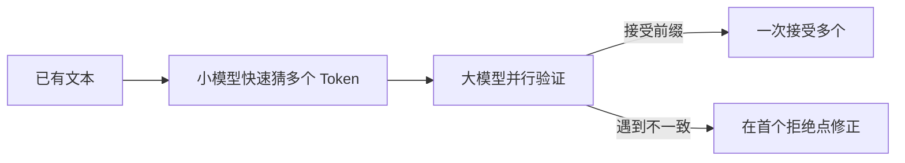

# 大模型推理加速：FP8、量化、KV Cache与多Token预测

> [!summary] 一句话解释
> 大模型推理加速不是单一算法：FP8/量化减少每个数占用的位数，KV Cache 压缩减少长上下文缓存，多 Token 预测与推测解码减少串行生成等待，还需配合批处理、并行和优化内核才能真正变快。

## 一、推理成本花在哪里

大模型回答时主要要付四类成本：

1. **权重存储**：模型参数要放入显存、内存或多台机器。
2. **计算**：矩阵乘法、注意力、激活函数等。
3. **内存带宽**：计算核心要反复读取权重和 KV Cache。
4. **串行生成**：自回归模型通常要等第一个 Token 生成后才能确定第二个。

不同优化解决不同瓶颈。一个方法省显存，不一定减少延迟；一个方法提高吞吐，也不一定让单个用户的首字更快。

## 二、先分两个推理阶段

| 阶段 | 做什么 | 常见瓶颈 | 常看指标 |
|---|---|---|---|
| Prefill 预填充 | 并行处理用户全部输入 Token | 计算量、注意力、长输入 | TTFT 首 Token 时间 |
| Decode 解码 | 一次生成一个新 Token | 读取权重/KV 的带宽、串行依赖 | TPOT 每输出 Token 时间、Tokens/s |

- TTFT（Time To First Token，首 Token 等待时间）：用户多久看到第一个字。
- TPOT（Time Per Output Token，每输出 Token 时间）：后续字出现多快。
- Throughput（吞吐量）：系统单位时间为所有请求共生成多少 Token。

## 三、FP8 是什么

FP8（8-bit Floating Point，8 位浮点数）用 8 个二进制位表示浮点数。常见格式：

- E4M3：1 位符号、4 位指数、3 位尾数，精度相对高、范围较小。
- E5M2：1 位符号、5 位指数、2 位尾数，范围较大、精度较低。

对比常见数据类型：

| 格式 | 每个数位数 | 粗略特点 |
|---|---:|---|
| FP32 | 32 bit | 范围与精度高，内存和带宽大 |
| FP16/BF16 | 16 bit | 大模型训练和推理常用折中 |
| FP8 | 8 bit | 更省存储/带宽、硬件可加速，但数值更难稳定 |
| INT8/INT4 | 8/4 bit 整数 | 需要缩放和量化方案，压缩更激进 |

如果把理想化的 FP16 权重改成 FP8，仅看权重字节数可约减半；但实际模型还包含元数据、缩放因子、未量化层、KV Cache 和运行时空间，端到端显存不会严格减半。

### FP8 为什么仍能用

神经网络对少量数值误差往往有容忍度，但需要：

- Scaling（缩放）把数值放进 FP8 可表示范围；
- 对敏感计算保留更高精度；
- 在 FP16/BF16/FP32 中累加部分结果；
- 使用支持 FP8 的硬件与内核。

DeepSeek-V3 技术报告使用 FP8 混合精度训练，这是训练/系统设计，不表示把任意模型文件强转 FP8 都会无损。

## 四、量化是什么

Quantization（量化）是把较高精度的权重、激活或缓存映射到较少位数的表示。

生活类比：原来温度记录到 `23.4178℃`，现在只记 `23.4℃`。文件更小、计算更省，但细节会有误差。

典型映射可粗略写成：

```text
整数值 q = round(原值 x / scale) + zero_point
近似恢复 x ≈ (q - zero_point) × scale
```

### 量化对象

- Weight Quantization：量化权重，例如 W4A16 表示 4 位权重、16 位激活。
- Activation Quantization：量化运行中间激活，例如 W8A8。
- KV Cache Quantization：量化历史 Key/Value。

### 量化时机

- PTQ（Post-Training Quantization，训练后量化）：模型训练完再压缩，成本低。
- QAT（Quantization-Aware Training，量化感知训练）：训练时模拟低精度误差，通常更稳，但训练成本高。

### 为什么 4 bit 不一定比 8 bit 更快

模型文件可能更小，但硬件若没有高效的 4 位矩阵内核，运行时还需解包或反量化，可能只省显存不提速。速度取决于：

- GPU/CPU 是否原生支持；
- Kernel（计算内核）是否优化；
- Prefill 是计算瓶颈还是 Decode 是带宽瓶颈；
- 批量、序列长度和并行策略；
- 是否有一部分层仍保持高精度。

## 五、KV Cache 是什么

生成第 t 个 Token 时，注意力需要历史 Token 的 Key 和 Value。若每次都重新计算历史，会大量浪费，所以把各层历史 K/V 缓存起来。

它的体积粗略与这些因素成正比：

```text
KV Cache ∝ 层数 × Token 数 × KV头数 × 每头维度 × 每个数的字节 × 批量
```

上下文越长、并发请求越多，KV Cache 越容易成为显存瓶颈。

## 六、KV Cache 怎样压缩

### 1. 减少 KV 头

- MQA：所有 Query 头共享一组 K/V。
- GQA：一组 Query 头共享一组 K/V。

### 2. 压缩表示

- MLA：把完整 K/V 联合压成低维潜在表示。
- Low-rank Compression：用低秩结构近似高维缓存。

### 3. KV 量化

把 FP16/BF16 KV 改成 8 bit、4 bit、2 bit 等。KIVI 论文研究了 Key 与 Value 分布差异并给出 2-bit 方案，但极低位量化是否保持质量依赖模型和任务。

### 4. 淘汰或稀疏保留

只保留局部窗口、重要 Token、Summary Token 或 Heavy Hitters。它可以大幅省缓存，但删除后可能无法精确召回被丢弃的信息。

### 5. 分页与卸载

PagedAttention 等技术像操作系统分页一样管理非连续 KV 块，减少内存碎片；也可把部分 KV 卸载到 CPU。它们主要改善内存管理，不一定压缩每个元素的信息量，CPU/GPU 传输也会带来延迟。

## 七、多 Token 预测是什么

普通语言模型训练目标是：在每个位置只预测下一个 Token。

MTP（Multi-Token Prediction，多 Token 预测）增加多个预测头，让同一隐藏状态同时预测未来第 1、2、3……个 Token。

```text
普通：当前位置 → 预测下 1 个 Token
MTP：当前位置 → 同时预测后面 n 个位置
```

论文研究表明，这可作为辅助训练目标改善样本效率和部分任务表现，也能为更快生成提供候选。

### 但它不等于直接一次吐出 n 个字

自回归序列的后续 Token 依赖前面实际选择。若模型同时猜出几个候选，通常还要验证它们是否与主模型分布一致；错误位置之后要回退。因此端到端加速需要配套解码算法和实现。

DeepSeek-V3 使用 MTP 训练目标，也讨论了其推测解码潜力。不能看到“MTP”就直接把速度乘以预测 Token 数。

## 八、推测解码是什么

Speculative Decoding（推测解码）通常让一个较小 Draft Model（草稿模型）快速提出多个 Token，再由大 Target Model（目标模型）一次并行验证：



只要验证规则正确，理论上可以保持目标模型分布；实际收益取决于草稿命中率、验证成本、批量和硬件。

MTP 可以帮助同一模型产生草稿候选，但“多 Token 预测”和“推测解码”不是完全同义词。

## 九、其他重要但容易漏掉的加速

- Batching/Continuous Batching：把多个请求组合，动态加入和移出批次，提高吞吐。
- Tensor/Expert/Pipeline Parallelism：把权重、专家或层分布到多设备。
- Optimized Kernels：融合算子，减少中间读写和启动开销。
- [[高效注意力：FlashAttention、GQA、MLA与线性注意力|FlashAttention/GQA/MLA]]：优化注意力与缓存。
- [[MoE稀疏专家模型与DeepSeekMoE|MoE]]：每 Token 稀疏激活专家。
- Prefix Cache：多个请求共用相同系统提示/前缀时复用计算。

## 十、一个方法到底省了什么

| 方法 | 权重显存 | KV 显存 | 计算量 | 带宽 | 串行步数 |
|---|---:|---:|---:|---:|---:|
| FP8/权重量化 | ✓ | 不一定 | 需硬件支持才明显 | ✓ | — |
| KV 量化 | — | ✓ | 有量化/反量化开销 | ✓ | — |
| GQA/MLA | — | ✓ | 部分减少 | ✓ | — |
| FlashAttention | — | 中间显存更少 | 理论稠密 FLOPs 仍平方 | ✓ I/O | — |
| MoE | 总权重不减 | — | ✓ 每 Token 激活 | 有通信开销 | — |
| 推测解码/MTP | — | 可能增加临时候选 | 验证方式决定 | — | ✓ 有机会一次接受多个 |

`✓` 表示主要目标，不代表任何环境都有同样收益。

## 十一、常见误区

> [!warning] 常见误区
> - “FP8 就是 INT8”——不对，一个是 8 位浮点，一个是整数表示。
> - “4-bit 模型只有原模型四分之一显存”——仅看权重可能接近，运行时还有缓存和其他空间。
> - “量化一定无损”——不对，位数越低越需评测任务质量。
> - “省显存就等于速度更快”——不对，瓶颈和内核支持决定实际速度。
> - “KV Cache 是模型永久记忆”——不对，它通常只服务当前生成请求。
> - “多 Token 预测一次就能无条件输出多个 Token”——不对，通常还需验证和回退。
> - “论文报告 3 倍速度，所有显卡都能 3 倍”——不对，必须看基线与测试条件。

## 十二、学习建议

看推理加速报告时记录：

1. 模型、精度、GPU 和软件版本；
2. 输入/输出长度与批量；
3. 测的是 TTFT、TPOT、吞吐还是显存；
4. 与哪个基线比较；
5. 质量损失多少；
6. 是单用户低延迟还是服务端高吞吐。

没有这些条件的“提速 N 倍”通常无法比较。

## 参考资料

> [!info] 核对日期
> 2026-08-30。不同 GPU、推理框架和模型支持差异很大，部署前应使用自己的任务和硬件基准测试。

- [FP8 Formats for Deep Learning](https://arxiv.org/abs/2209.05433)
- [SmoothQuant](https://arxiv.org/abs/2211.10438)
- [KIVI：2-bit KV Cache Quantization](https://arxiv.org/abs/2402.02750)
- [Better & Faster LLMs via Multi-token Prediction](https://arxiv.org/abs/2404.19737)
- [Efficient Memory Management for LLM Serving with PagedAttention](https://arxiv.org/abs/2309.06180)
- [DeepSeek-V3 Technical Report](https://arxiv.org/abs/2412.19437)

