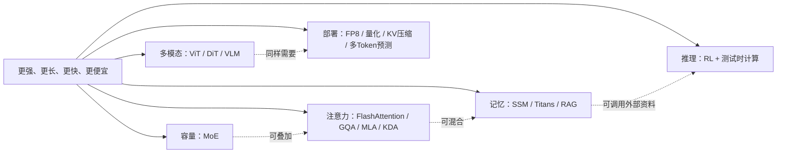

# 大模型架构与效率技术地图

> [!summary] 一句话解释
> 这些技术都在解决“大模型怎样更强、更长、更快、更便宜”，但它们分别改造参数容量、注意力、记忆、推理过程、输入模态和部署方式，不能简单看成互相替代。

## 一、先看完整地图

| 方向 | 核心问题 | 代表技术 | 主要节省什么 |
|---|---|---|---|
| 稀疏专家 | 想增加模型容量，又不想每个 Token 都跑全部参数 | MoE、DeepSeekMoE | 每个 Token 的计算量 |
| 高效注意力 | 长上下文的注意力矩阵、KV Cache 太贵 | FlashAttention、GQA、MLA、稀疏/线性注意力、Kimi Linear | 显存访问、KV Cache 或序列计算量 |
| 状态与长期记忆 | 固定上下文窗口装不下漫长历史 | Mamba、Mamba-2、Titans、外部记忆、RAG | 长序列计算或上下文占用 |
| 推理模型 | 一次直觉式生成不够可靠 | RL 推理、验证器、搜索、回溯、测试时计算扩展 | 这里通常不是节省，而是用更多推理计算换质量 |
| 多模态统一 | 不只理解文字，还要理解图片、音频、视频 | ViT、DiT、VLM | 统一表示与跨模态能力，不一定省计算 |
| 推理加速 | 模型已经训练好，怎样部署得更便宜 | FP8、量化、KV Cache 压缩、多 Token 预测 | 权重显存、带宽、缓存和生成时间 |

## 二、用“公司”来类比

把一个大模型想成一家超大型公司：

- **MoE（Mixture of Experts，混合专家）**：公司有很多部门，但每份工单只派少数合适的部门处理。
- **FlashAttention**：不改变会议要讨论的全部关系，而是改进资料在办公桌与档案库之间的搬运方式。
- **GQA/MLA**：减少每个员工都保存一整份历史会议材料造成的重复。
- **线性注意力与 Mamba**：不反复翻阅所有历史记录，而是维护一份不断更新的工作状态。
- **Titans/外部记忆/RAG**：增加长期记忆系统或外部档案室，需要时再取回资料。
- **推理时计算扩展**：对困难工单多拟几套方案、检查、比较和回退，而不是立刻交第一稿。
- **多模态**：公司不只收文字工单，也能处理照片、录音和视频。
- **量化与 FP8**：用更紧凑的数字格式保存和计算资料。
- **多 Token 预测**：不再每次只猜下一个字，而是同时为后面几个字准备候选。

## 三、最重要的三组区别

### 1. 总参数量不等于每 Token 激活参数量

MoE 模型可以有很大的**总参数量**，但路由器会让每个 Token 只经过少数专家。总参数仍要存储并分布到设备上，激活参数才更直接影响这次前向计算的浮点运算量。

详见：[[MoE稀疏专家模型与DeepSeekMoE]]。

### 2. “高效注意力”不都降低理论复杂度

- FlashAttention：算的仍是**精确的稠密注意力**，主要优化 GPU 内存读写；标准注意力的算术量仍随长度近似平方增长。
- GQA、MLA：主要减少 KV Cache 和解码带宽，仍然属于注意力。
- 稀疏注意力：只计算部分 Token 对，减少连接数量。
- 线性注意力：用代数重排或有限状态，避免显式形成完整的 Token 两两关系矩阵。

详见：[[高效注意力：FlashAttention、GQA、MLA与线性注意力]]。

### 3. 长上下文不等于长期记忆

| 名称 | 信息放在哪里 | 会不会跨会话保留 | 主要限制 |
|---|---|---:|---|
| 上下文窗口 | 当前输入 Token | 否 | 长度、计算与缓存 |
| KV Cache | 当前请求的注意力 K/V | 通常否 | 随层数、批量和长度增大 |
| Mamba 等状态 | 当前序列的压缩状态 | 通常否 | 有限状态可能遗失细节 |
| Titans 神经记忆 | 推理过程中可更新的记忆模块 | 依具体系统 | 仍是研究中的架构和容量管理问题 |
| RAG/外部记忆 | 向量库、数据库、文件等 | 可以 | 写入、检索、权限、过期与冲突 |
| 模型参数 | 训练得到的权重 | 可以 | 更新昂贵，无法可靠删除单条事实 |

详见：[[状态空间模型与长期记忆：Mamba、Titans与外部记忆]]。

## 四、一条请求经过了什么

以“阅读 10 万字资料并回答”为例：

1. 文本被切成 Token，进入模型。
2. MoE 路由器在某些前馈层为每个 Token 选择少数专家。
3. 注意力层用 GQA、MLA 或其他结构读取上下文；FlashAttention 可以优化具体计算实现。
4. 若是线性注意力或 SSM，部分历史会被压缩进状态；若用 RAG，则先从外部资料库检索片段。
5. 推理模型可能生成多个步骤或候选，用验证器、工具和回溯选择答案。
6. 服务端可能用 FP8/INT8/INT4、KV Cache 压缩、连续批处理等方式降低成本。

因此，一款模型可能同时属于多列，不能问“它到底是 MoE，还是 MLA 模型”。这像一辆车可以同时拥有混合动力、自动变速箱和辅助驾驶。

## 五、哪些说法容易误导

> [!warning] 常见误区
> - “MoE 有 6000 亿参数，所以每次回答都完整运行 6000 亿参数”——不对，需看激活参数，但全部专家仍要存放。
> - “FlashAttention 把注意力从平方变成线性”——不对，它是精确注意力的 I/O 优化。
> - “GQA、MLA 就是线性注意力”——不对，它们主要减少 K/V 的重复或缓存表示。
> - “支持一百万 Token 就会永久记住我”——不对，超长上下文通常仍是一次请求内的能力。
> - “推理模型一定会联网搜索并验证”——不对；内部思考、外部搜索和程序验证是三种不同机制。
> - “统一多模态就是同一个分词器直接读取所有原始字节”——通常不对；很多系统仍使用不同编码器和投影层。
> - “量化后文件小四倍，就一定快四倍”——不对，速度还取决于硬件、内核、批量和瓶颈位置。

## 六、推荐学习顺序

1. 先读 [[Transformer与注意力机制]]，理解 Token、Q/K/V、自注意力和逐 Token 生成。
2. 读 [[MoE稀疏专家模型与DeepSeekMoE]]，分清容量与激活计算。
3. 读 [[高效注意力：FlashAttention、GQA、MLA与线性注意力]]，建立长上下文成本观念。
4. 读 [[状态空间模型与长期记忆：Mamba、Titans与外部记忆]]，分清状态、上下文和外部存储。
5. 读 [[推理模型、RL推理与测试时计算扩展]]，理解“多想一会儿”怎样实现。
6. 读 [[多模态模型：ViT、DiT与视觉语言模型]]，理解不同模态如何变成模型可处理的表示。
7. 最后读 [[大模型推理加速：FP8、量化、KV Cache与多Token预测]]，从系统角度看成本。

## 关联概念

- [[RAG、Naive RAG与GraphRAG]]
- [[RLHF与大模型对齐]]
- [[知识库是什么：个人、团队与AI知识库]]
- [[Agent工具运行时：执行流水线、并发调度与Code Mode]]

## 参考资料

> [!info] 核对日期
> 2026-08-30。Kimi Linear、Titans 等仍是快速发展中的研究方向，论文中的速度和质量数字只代表其测试条件，不是所有设备和任务的保证。

- [DeepSeek-V3 Technical Report](https://arxiv.org/abs/2412.19437)
- [FlashAttention](https://arxiv.org/abs/2205.14135)
- [Mamba](https://arxiv.org/abs/2312.00752)
- [Kimi Linear](https://arxiv.org/abs/2510.26692)
- [Titans](https://arxiv.org/abs/2501.00663)
- [DeepSeek-R1](https://arxiv.org/abs/2501.12948)

