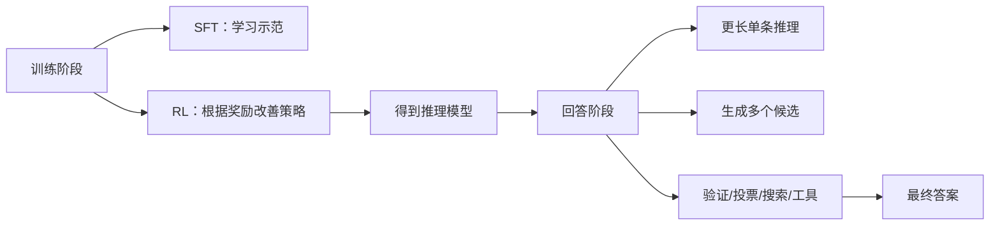

# 推理模型、RL推理与测试时计算扩展

> [!summary] 一句话解释
> 推理模型通过训练让模型学会更有效的解题行为，并可在回答时投入更多 Token、候选、验证和工具调用；RL 推理是训练方法，测试时计算扩展是推理阶段的资源策略，两者相关但不是同一个概念。

## 一、“推理”不是一个开关

普通自回归模型也是一个 Token 接一个 Token 地生成，但它可能很快给出第一种答案。所谓 Reasoning Model（推理模型）通常更擅长：

- 把难题分解为步骤；
- 尝试候选方案；
- 发现矛盾并修改；
- 使用代码、计算器、搜索或其他工具；
- 在答案可验证时根据结果继续探索。

这些能力来自模型基础能力、训练数据、强化学习、奖励设计、推理算法和工具运行时的组合，不是只靠提示词“请一步一步思考”。

## 二、先分训练时和回答时

- **训练时扩展**：花更多数据和算力训练或增大参数。
- **测试时/推理时扩展**：模型已经训练好，针对当前问题多花时间和算力。

“Test（测试）”在机器学习论文里常指模型参数不再训练、正在处理新问题，并不是只指软件测试。

## 三、RL 推理是什么

RL（Reinforcement Learning，读作“阿尔艾尔”，强化学习）让模型尝试答案，然后根据 Reward（奖励）调整生成策略。

### 1. 可验证奖励

数学题可以对最终数值，代码可以运行测试，棋类可以判胜负。这类反馈常称为 **RLVR（Reinforcement Learning with Verifiable Rewards，可验证奖励强化学习）**。

优点：奖励比“人觉得这个答案不错”更客观。难点：最终答案对，不代表中间解释真实；模型还可能钻评分器漏洞。

### 2. 过程奖励和结果奖励

- Outcome Reward：只看最终答案。
- Process Reward：给中间步骤评分。

过程奖励能更早发现错误，但制作可靠的逐步标注或过程验证器更困难。

### 3. DeepSeek-R1 的启示

DeepSeek-R1 报告展示了大规模 RL 可以激励反思、验证和更长推理等行为。R1-Zero 从未先做 SFT 的基础模型开始强化学习，出现推理能力，但也有可读性差和语言混杂问题；R1 使用冷启动数据与多阶段训练改善体验。

这不表示“RL 能从毫无能力的模型凭空创造全部知识”。RL 主要在基础模型已有表示和能力上塑造更有效的搜索与表达策略。

详见 [[RLHF与大模型对齐]]。

## 四、测试时计算扩展是什么

Test-Time Compute Scaling（测试时计算扩展，也叫 Inference-Time Scaling）是：针对当前问题，允许模型使用更多计算，再选择更好的答案。

常见方法如下。

### 1. 更长的单条推理

让模型有更多内部步骤来分解、检查和修正。简单，但模型可能只是在错误方向上想得更久。

### 2. Best-of-N

生成 N 个候选，用奖励模型或验证器选择最高分。候选可以并行生成，但成本随 N 增加。

### 3. Self-Consistency

走多条推理路径，对最终答案投票。适合有明确答案的问题，但多数候选可能共享同一错误。

### 4. Beam/Tree Search 与回溯

保留多个中间分支，逐步评分，淘汰较差路线；发现死路时回到早先分叉点。Tree of Thoughts（思维树）是相关研究范式。

### 5. Critique and Revise

生成初稿，再让模型或独立 Critic（批评器）指出问题并修改。若批评器能力不足，可能把正确答案改错。

### 6. 工具验证

- 数学：计算器或符号系统。
- 编程：运行代码、单元测试、编译器。
- 事实：搜索与 RAG，并核对来源。
- Agent：读取文件、执行命令、检查结果。

工具能提供外部反馈，但模型仍可能调用错工具、误读结果或引用不可靠来源。

## 五、搜索、验证、回溯分别是什么

| 行为 | 含义 | 例子 |
|---|---|---|
| 搜索内部候选 | 在多个可能解法之间探索 | 生成三种算法 |
| 外部搜索 | 查询互联网/知识库 | 查官方 API 文档 |
| 验证 | 检查候选是否满足约束 | 跑测试、代回方程 |
| 回溯 | 当前路线失败后返回早先分支 | 算法不通，换另一假设 |

> [!important]
> “推理模型会在回答前搜索、验证、回溯”是能力目标，不是所有产品每次请求的保证。一个离线模型可以进行内部候选搜索，却完全没有互联网访问；只有获得搜索工具和权限才会查网络。

## 六、为什么“多想”有时有效

预训练把大量模式压进模型参数，但一次贪心生成只取一条路径。更多测试时计算可以：

- 扩大候选覆盖率；
- 把复杂题拆成较简单子题；
- 利用可验证反馈筛掉错误；
- 针对难题动态投入资源，而简单题快速回答。

相关论文发现，最合适的策略取决于题目难度；不是所有问题都应该固定生成同样多候选。

## 七、为什么“多想”也会失败

- 基础模型不知道关键知识，搜索空间里可能没有正确答案。
- 验证器判断错误，错误答案反而被高分选中。
- 多条候选高度相关，没有真正多样性。
- 模型可能合理化错误，而不是纠正错误。
- 开放问题没有唯一可自动验证答案。
- 成本、延迟和能耗上升，用户可能等不起。
- 外部搜索带来过期资料、恶意网页和 Prompt Injection 风险。

因此推理时计算要看收益曲线：从 1 次增加到 8 次可能提升明显，从 100 次增加到 200 次可能几乎没有收益。

## 八、思维链与最终答案

CoT（Chain of Thought，思维链）是模型生成的中间推理文本。要注意：

- 它可能帮助解题，但不保证忠实反映模型内部真实因果过程。
- 写得很长、很像人类思考，不等于结论正确。
- 产品可能隐藏内部思维链，只给简明解释、证据和工具结果。
- 对用户最有价值的是可验证的计算、引用、假设和结论，而不是无限展开的心理独白。

## 九、推理模型与 RAG 的关系

- 推理模型改善怎样计划、探索和验证。
- RAG 提供模型参数外的资料。
- Agent Harness 提供工具、状态、权限和循环。

三者可组合：模型先规划检索词，RAG 返回资料，模型对多来源交叉核对，再用工具验证并生成答案。详见 [[RAG、Naive RAG与GraphRAG]] 和 [[Prompt Engineering与Loop Engineering]]。

## 十、常见误区

> [!warning] 常见误区
> - RL 推理不是运行时让用户给一个赞就立即改写整个模型。
> - 测试时计算不是模型参数量变大，而是当前问题使用更多计算。
> - 输出 Token 更多不必然更聪明，可能只是更啰嗦。
> - 自我检查不是独立真相源；最好结合可执行验证或不同来源。
> - 推理模型不等于自动联网搜索。
> - Benchmark 分数提高不保证真实工作中事实、引用和安全性都提高。

## 十一、学习建议

评价一款推理模型时，分别问：

1. 训练用了什么奖励或示范？
2. 回答时允许多少 Token、候选和工具调用？
3. 谁来验证，验证器是否可靠？
4. 质量提升用了多少额外时间和费用？
5. 评测题能否自动验证，是否接近真实任务？

## 参考资料

> [!info] 核对日期
> 2026-08-30。推理训练和测试时扩展仍快速发展，具体产品可能隐藏其内部策略。

- [DeepSeek-R1: Incentivizing Reasoning Capability in LLMs via Reinforcement Learning](https://arxiv.org/abs/2501.12948)
- [Scaling LLM Test-Time Compute Optimally](https://arxiv.org/abs/2408.03314)
- [Let's Verify Step by Step](https://arxiv.org/abs/2305.20050)
- [Tree of Thoughts](https://arxiv.org/abs/2305.10601)

