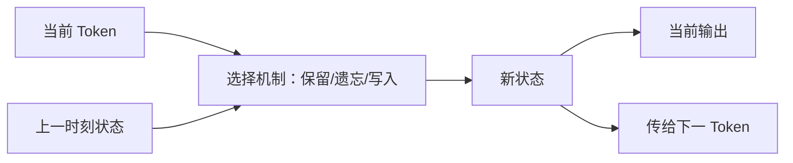
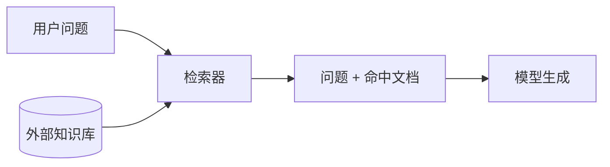

# 状态空间模型与长期记忆：Mamba、Titans与外部记忆

> [!summary] 一句话解释
> Mamba 等状态空间模型把历史压缩进不断更新的有限状态，Titans 尝试在推理时更新更有表达力的神经记忆，而 RAG 等外部记忆把资料保存在模型外；三者都与“记忆”有关，但保存位置、精确性和持久性完全不同。

## 一、先理解为什么需要别的记忆方式

标准 Transformer 用注意力让当前 Token 直接查看上下文中的历史 Token，查找很灵活，但长序列会带来平方注意力计算和不断增长的 KV Cache。

研究者因此探索三条路线：

1. **压缩状态**：把历史不断浓缩进一个状态，例如 SSM/Mamba。
2. **可更新的神经记忆**：推理期间让记忆模块学习新输入，例如 Titans。
3. **外部存储**：把原始资料放在数据库、向量库或文件中，需要时检索，例如 RAG。

## 二、SSM 是什么

SSM（State Space Model，读作“艾丝艾丝艾姆”，状态空间模型）源自控制系统和信号处理。最简单的思想是维护隐藏状态：

```text
h_t = 更新(h_{t-1}, x_t)
y_t = 读取(h_t, x_t)
```

- `x_t`：当前第 t 个输入。
- `h_{t-1}`：读取当前输入前的历史摘要。
- `h_t`：结合新输入后的状态。
- `y_t`：当前输出。

生活类比：会议秘书不会每听一句话就重读整本会议逐字稿，而是持续更新一页“当前结论与待办”。处理 1000 句通常只需更新 1000 次，因而序列长度上的计算可近似线性增长。

代价也很直观：一页摘要不等于完整逐字稿。如果压缩策略不好，早期的某个精确数字可能丢失。

## 三、Mamba 做了什么

Mamba 是基于 **Selective State Spaces（选择性状态空间）**的序列模型架构。

传统线性时不变状态模型对所有输入使用相近的更新方式，难以根据内容选择“该记住什么”。Mamba 让部分状态参数由输入决定，使模型能按当前 Token 选择保留、传播或忘记信息。



### 两种运行视角

- **训练时**：使用硬件感知的 Parallel Scan（并行扫描）等算法，不能简单理解成 CPU 上慢慢从左到右的普通循环。
- **生成时**：可递归更新有限状态，不需要像标准注意力那样为全部历史保留越来越大的 KV Cache。

原始 Mamba 论文报告线性序列扩展和很高吞吐，但这是特定模型与硬件实验，不代表它在所有任务上都胜过 Transformer。

## 四、Mamba-2 是什么

Mamba-2 来自论文《Transformers are SSMs》。论文提出 **SSD（State Space Duality，状态空间对偶性）**，说明一类结构化 SSM 与注意力形式之间存在紧密联系，并据此设计更适合硬件的核心层。

需要纠正两个误解：

- Mamba-2 不只是“Mamba 加大上下文长度”。它重点重构理论表达和计算算法。
- 论文报告核心层 2–8 倍速度提升，是其测试环境下与原 Mamba 核心层的比较，不是所有应用端到端固定提速。

## 五、状态为什么既高效又有限

注意力像“保留全部原始档案，然后按问题搜索”；状态模型像“每来一条消息就更新摘要”。

| 对比 | 完整注意力/KV | 有限递归状态 |
|---|---|---|
| 历史保存 | 保留每个 Token 的 K/V 表示 | 压缩到固定或受控状态 |
| 随机查找细节 | 通常更直接 | 取决于压缩后是否仍保留 |
| 长度增长成本 | 稠密注意力高，KV 增长 | 通常线性处理，推理状态受控 |
| 潜在问题 | 显存和计算昂贵 | 状态容量、遗忘、精确召回 |

所以 O(n) 不是免费的魔法，而是用一种更紧凑的历史表示换来的。

## 六、Titans：推理时学习的神经记忆

Titans 是研究性架构，论文标题是 **Learning to Memorize at Test Time（在测试/推理时学习记忆）**。

它把注意力视为准确但受窗口限制的短期记忆，并引入可在推理期间更新的 Neural Long-Term Memory（神经长期记忆）模块。该模块可由多层感知机表示，不只是一条固定长度向量。

### “惊讶度”是什么

Titans 用新输入相对当前记忆的预测误差/梯度作为一种 Surprise（惊讶）信号：

- 已符合记忆预期的普通信息，更新较小。
- 与当前记忆差异大的新信息，更新较强。
- Momentum（动量）帮助连续保留一段相关信息。
- Weight Decay（权重衰减）承担遗忘作用，防止记忆无限堆积。

生活类比：每天相同的通勤很少被长期记住，突发的重要事件更容易写进长期日记；但“意外”不一定等于“有价值”，因此记忆策略仍可能出错。

### 这是否会改写模型全部权重

不是通常意义上的重新训练整个大模型。它更新的是架构内设计好的记忆模块，受具体算法和生命周期约束。不要把它理解成聊天时自动把每句话永久写进基础模型参数。

### 研究状态

Titans 论文和 Google Research 后续材料报告了超长上下文实验，但仍应视为研究架构。论文中的 2M 级上下文与特定测试成绩不等于任意产品已经拥有可靠、永久、无损的两百万 Token 记忆。

## 七、外部记忆与 RAG

External Memory（外部记忆）把信息放在模型参数之外：

- Markdown/Obsidian 文件；
- SQL 数据库；
- 向量数据库；
- 搜索引擎；
- 知识图谱；
- 用户档案和事件日志。

RAG（Retrieval-Augmented Generation，检索增强生成）是典型用法：先按问题检索相关资料，把命中的片段放进上下文，再让模型回答。详见 [[RAG、Naive RAG与GraphRAG]]。



外部记忆的优势是可持久化、可追踪来源、可更新和删除，也可以保存原文；难点是检索可能找错、资料会过期、写入可能冲突，并涉及权限和隐私。

## 八、六种“记忆”不要混用

| 名称 | 本质 | 生命周期 | 能否保存原文细节 |
|---|---|---|---:|
| 上下文窗口 | 当前请求输入 Token | 一次请求/会话实现决定 | 是，但长度有限 |
| KV Cache | 为注意力保存历史 K/V | 通常一次生成 | 是历史的内部表示 |
| SSM 状态 | 历史的有限压缩状态 | 通常一次序列 | 不保证 |
| Titans 神经记忆 | 推理时可更新的神经模块 | 架构/系统决定 | 是学习后的表示，不等于原文库 |
| RAG 外部记忆 | 文件或数据库中的资料 | 可长期保存 | 可以 |
| 参数记忆 | 预训练/微调写入权重的模式 | 随模型版本保存 | 不能可靠逐条取出或删除 |

## 九、混合架构为什么常见

没有一种记忆方式同时做到无限容量、零成本、精确随机访问、永久持久和绝对隐私。因此实际系统常组合：

- 局部/全局注意力负责当前上下文的精确关系。
- 线性注意力或 SSM 负责长序列的高效状态传递。
- RAG/数据库负责跨会话的可管理知识。
- Agent 的工作记忆保存计划、工具结果和状态。

[[高效注意力：FlashAttention、GQA、MLA与线性注意力|Kimi Linear]] 也采用 KDA 与全局 MLA 混合，而不是完全放弃全局注意力。

## 十、常见误区

> [!warning] 常见误区
> - “线性复杂度”不等于“不会忘记任何历史”。
> - Mamba 的状态不是可直接查询的普通数据库。
> - Mamba-2 的名字不表示“第二代长期记忆产品”。
> - Titans 的 test-time memory 与 test-time compute 不是同一件事：前者在更新记忆，后者泛指回答时多用计算。
> - RAG 不是模型真的学会了文档，它只是把检索片段临时交给模型。
> - 超长上下文测试中的 Needle-in-a-Haystack 成绩，不能完整代表真实长文推理、冲突处理和事实可靠性。

## 十一、学习建议

遇到“这个模型有长期记忆”的宣传，追问：

1. 信息到底存在哪里？
2. 会保存多久，跨不跨会话？
3. 是原文、向量、有限状态还是权重？
4. 怎样写入、检索、纠错、删除和控制权限？
5. 所谓上下文长度是技术上可输入，还是实际任务仍能可靠利用？

## 参考资料

> [!info] 核对日期
> 2026-08-30。Titans 等属于快速发展中的研究方向，应以后续同行评测、实现和实际产品验证为准。

- [Mamba: Linear-Time Sequence Modeling with Selective State Spaces](https://arxiv.org/abs/2312.00752)
- [Mamba-2 / Transformers are SSMs](https://arxiv.org/abs/2405.21060)
- [Titans: Learning to Memorize at Test Time](https://arxiv.org/abs/2501.00663)
- [Google Research：Titans + MIRAS](https://research.google/blog/titans-miras-helping-ai-have-long-term-memory/)

