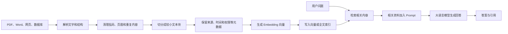

# 知识库是什么：个人、团队与 AI 知识库

> [!summary] 一句话结论
> **知识库是把值得长期复用的信息按照规则收集、整理、连接、检索和持续更新的系统；网上说“建立知识库”时，可能指个人笔记库、企业 Wiki、客服帮助中心，或者供 AI 检索的 RAG 知识库。**

## 一、先理解“知识”和“库”

### 什么是知识

这里的知识不是“所有文件”，而是能够帮助人或程序解决问题的信息，例如：

- 一个概念的解释；
- 某项工作的标准操作步骤；
- 产品使用方法；
- 常见故障和解决方案；
- 公司制度；
- 某次项目为什么做出这个决定；
- 一篇论文的结论、证据和适用范围。

### 什么是库

“库”不只是存储空间，还意味着资料能够被管理和找到，通常需要：

- 分类或页面结构；
- 标题、标签、作者、日期等元数据；
- 搜索、索引或链接；
- 权限；
- 版本和更新机制；
- 来源和可信度；
- 过期、纠错和删除规则。

所以：

> **文件堆解决“放在哪里”，知识库还要解决“怎样找到、怎样理解、是否可信、谁能看、谁来更新”。**

## 二、用图书馆类比

假设有一万本书：

### 只有仓库

书全部堆在地上。虽然没有丢，但很难找到需要的内容。

### 有文件夹

把书大致分成计算机、历史、医学，已经比堆在一起好，但仍可能不知道哪本书包含答案。

### 有知识库

除了保存书，还具备：

- 分类目录；
- 书名、作者、主题和出版时间；
- 搜索系统；
- 内容摘要；
- 相互引用关系；
- 借阅权限；
- 新旧版本说明；
- 图书管理员持续整理。

计算机知识库就是把这套思想用在文档、网页、数据和经验上。

## 三、网上常见的五种“知识库”

### 1. 个人知识库

个人知识库用于保存自己学习和工作中需要长期复用的内容。

常见工具：

- Obsidian；
- Notion；
- Logseq；
- Roam Research；
- 本地 Markdown 加 Git；
- 甚至整理良好的纸质卡片。

常见内容：

- 学习笔记；
- 读书和论文摘要；
- 工作经验；
- 项目决策；
- 常用命令；
- 待研究的问题；
- 自己总结出的概念关系。

你的 `D:\krxstudy` 就是个人计算机知识库：它有分类目录、概念笔记、双向链接、总索引和 Git 历史。

#### 个人知识库的目标

重点不是“收藏最多资料”，而是：

- 以后还能找到；
- 自己能重新理解；
- 新旧知识能够连接；
- 能帮助写作、学习和做决定。

### 2. 团队或企业知识库

团队知识库用于把分散在员工脑中、聊天记录和文件夹里的经验，变成团队可以共同使用的资料。

常见工具包括 Confluence、Notion、飞书知识库、SharePoint、GitBook 等。

常见内容：

- 新员工入职指南；
- 公司制度；
- 产品和接口文档；
- 标准操作流程 SOP；
- 项目设计与决策记录；
- 销售话术；
- 安全规范；
- 常见故障和解决办法。

团队知识库比个人笔记多出几个重要问题：

- 谁可以查看；
- 谁可以编辑；
- 谁是页面负责人；
- 哪一版正在生效；
- 离职人员的经验怎样保留；
- 机密内容是否被错误公开；
- 多人意见冲突时由谁确认。

### 3. 客服知识库或帮助中心

这是企业知识库的一种常见形式，主要面向客户或客服人员。

例如：

- FAQ（Frequently Asked Questions，常见问题）；
- 产品使用教程；
- 故障排查步骤；
- 退款和售后规则；
- 错误代码说明；
- 客户自助解决问题的文章。

它的价值是让用户不必每次都找人工客服，也让客服人员给出一致答案。Atlassian 对客服知识库的描述也强调 FAQ、How-to 和故障排查文章的集中存放与复用。

### 4. AI 或 RAG 知识库

这是当前 AI 圈说“建立知识库”时最常见的含义之一。

用户把 PDF、Word、网页、数据库记录等资料接入系统，系统对资料进行处理和索引。当用户向 AI 提问时，程序先找出相关资料，再把资料交给大模型回答。

这种方式通常叫：

**RAG（Retrieval-Augmented Generation，检索增强生成）**，详见 [[RAG、Naive RAG与GraphRAG]]。

#### 典型处理过程

#### AI 知识库里到底存了什么

可能同时包括：

1. 原始文件；
2. 解析后的文本；
3. 切分后的 Chunk（文本块）；
4. 文件名、来源、部门、时间、权限等元数据；
5. Embedding（向量表示）；
6. 全文或向量索引；
7. 文档与切片之间的对应关系；
8. 更新和删除状态。

因此“上传文件”只是建立 AI 知识库的第一步，不代表检索质量已经合格。

### 5. LLM Wiki

[[LLM Wiki]] 是较新的知识维护模式：让 LLM 把原始资料持续编译成结构化、互相链接、可以直接阅读的 Markdown Wiki。

它与典型 RAG 的侧重点不同：

- 典型 RAG 更关注“提问时怎样找到相关原文片段”；
- LLM Wiki 更关注“怎样把资料提前整理成能长期积累的知识页面”。

二者可以结合，并不冲突。

## 四、同一句“建立知识库”，不同人可能在做什么

| 说话的人 | 他可能真正想做的事 |
|---|---|
| 学生或自学者 | 用 Obsidian 整理课程、概念和学习路线 |
| 内容创作者 | 保存选题、素材、案例和引用 |
| 企业管理者 | 把制度、流程和经验放进内部 Wiki |
| 客服团队 | 建立 FAQ、教程和故障排查中心 |
| AI 产品经理 | 上传公司资料，让 AI 基于内部资料回答 |
| AI 工程师 | 构建解析、Chunk、Embedding、向量数据库和检索管线 |
| Agent 开发者 | 给 Agent 提供长期知识、工具说明和工作经验 |
| LLM Wiki 使用者 | 让 Agent 持续维护结构化 Markdown 知识网络 |

所以看到“我要建立知识库”，最好先问：

> **这个知识库给谁用、用来解决什么问题、由人阅读还是由 AI 检索？**

## 五、文件夹、数据库和知识库有什么区别

| 概念 | 主要作用 | 例子 |
|---|---|---|
| 文件夹 | 保存和粗略分类文件 | `D:\资料\计算机\网络` |
| 数据库 | 按结构保存和查询数据 | 用户表、订单表、PostgreSQL |
| 知识库 | 组织可以被理解和复用的知识 | Obsidian、企业 Wiki、帮助中心 |
| 搜索索引 | 帮助快速找到内容 | 全文索引、倒排索引、向量索引 |
| AI/RAG 知识库 | 让检索系统和 LLM 使用自己的资料 | 文档源 + Chunk + 向量索引 + Retriever |

它们可以组合：一个企业知识库可能把正文放在对象存储，把权限和元数据放在数据库，把搜索信息放在索引中，再通过网页或 AI 助手提供给用户。

## 六、“建立”不只是创建一个文件夹

一个完整的建立过程通常包括：

### 1. 明确使用者和问题

例如：

- 自己学习时快速复习；
- 新员工查询公司流程；
- 客服回答产品故障；
- AI 根据产品手册回答用户问题。

如果目标不清楚，知识库很容易变成什么都存、什么都找不到的资料垃圾场。

### 2. 确定资料来源

列出哪些来源可以进入知识库：

- 正式制度；
- 产品手册；
- 会议决策；
- 代码和 API 文档；
- 经过筛选的网页；
- 个人总结。

还要区分：原始证据、个人解释、AI 摘要和已经批准的正式结论。

### 3. 设计最小分类

分类不宜一开始过于复杂。可以先按：

- 主题；
- 项目；
- 对象类型；
- 使用场景；
- 资料状态。

你当前仓库按“软件基础、Web、数据库、AI、项目产品”分类，就是一种主题分类。

### 4. 统一页面模板

例如每篇概念笔记包含：

- 一句话解释；
- 生活类比；
- 工作原理；
- 具体例子；
- 常见误区；
- 关联概念；
- 来源和核对日期。

统一模板能降低阅读和维护成本。

### 5. 建立查找方式

可以组合：

- 目录；
- 标签；
- 双向链接；
- 全文搜索；
- 数据库筛选；
- 向量检索；
- 知识图谱。

不是所有知识库都需要向量数据库。个人库内容较少时，总索引、链接和全文搜索通常已经很实用。

### 6. 管理版本、权限和来源

至少需要回答：

- 谁写的；
- 来源是什么；
- 什么时候核对的；
- 谁能修改；
- 这是不是当前有效版本；
- 包含什么敏感信息。

### 7. 持续维护

知识库不是建完一次就结束，需要持续：

- 更新旧资料；
- 合并重复页面；
- 修复失效链接；
- 标记过期内容；
- 删除无用内容；
- 根据搜索失败和用户反馈补充缺口。

## 七、什么才算“质量好的知识库”

不是文件越多越好。更重要的是：

| 质量维度 | 要问的问题 |
|---|---|
| 可发现性 | 用户能否快速找到所需内容？ |
| 正确性 | 内容是否真实，引用是否支持结论？ |
| 新鲜度 | 内容是否过期，最后核对是什么时候？ |
| 完整性 | 能否真正解决目标问题？ |
| 一致性 | 不同页面是否互相矛盾？ |
| 可理解性 | 目标读者能否看懂？ |
| 可追溯性 | 能否回到原始资料和修改历史？ |
| 权限正确性 | 不该看的人是否被阻止？ |
| 可维护性 | 是否明确负责人、模板和更新流程？ |
| AI 检索质量 | 正确资料能否被召回，引用是否匹配答案？ |

## 八、AI 知识库为什么会答错

即使资料本身正确，AI 仍可能答错，因为：

- PDF 解析失败或扫描件没有正确 OCR；
- 表格结构丢失；
- Chunk 切得过大或过小；
- 问题与原文用词不同，相关内容没有召回；
- 检索到了相似但错误的版本；
- 没有按用户权限过滤；
- 模型忽略或误解了检索内容；
- 引用链接存在，但并不支持回答；
- 原始资料本身已经过期；
- 恶意文档包含 Prompt Injection。

所以真正的 AI 知识库还需要评估：

- 检索是否找到正确资料；
- 排名是否合理；
- 回答是否忠于资料；
- 引用是否准确；
- 权限是否正确；
- 内容更新和删除能否同步到索引。

## 九、知识库不等于训练大模型

建立 AI 知识库通常不会把资料永久训练进模型参数。

### 知识库/RAG

- 资料保存在模型外部；
- 提问时临时检索；
- 更新或删除资料相对方便；
- 适合加入公司内部或不断变化的知识。

### Fine-tuning 微调

- 使用样本继续训练模型参数；
- 更适合改变输出风格、格式或特定行为；
- 不适合把每一条经常变化的公司制度都硬记进参数；
- 很难像普通文件一样指出模型具体记住了哪句话。

简单记忆：

> **知识库更像给模型一本可以查的书；微调更像通过练习改变模型的答题习惯。**

## 十、知识库与“唯一事实来源”

网络上还常出现：

**SSOT（Single Source of Truth，单一事实来源）**。

它表示某类信息应该有明确的权威来源。例如：

- 在职员工信息以人事系统为准；
- 订单状态以订单数据库为准；
- 正式制度以已批准的制度文件为准。

知识库可以帮助解释和查找这些信息，但不一定自动成为权威来源。例如 AI 总结出的请假制度不能覆盖人事系统里的正式制度。

因此知识库页面最好写清：

- 这是原文还是摘要；
- 权威来源在哪里；
- 如果冲突，以哪个系统或文件为准。

## 十一、常见误区

### 误区 1：上传一批 PDF 就建立好了知识库

这只是收集资料。还需要解析、分类、索引、来源、权限、测试和持续更新。

### 误区 2：资料越多，知识库越好

大量重复、过期、冲突和低质量资料会降低查找和 AI 回答质量。

### 误区 3：向量数据库就是知识库

向量数据库只是可能使用的检索基础设施。完整知识库还包括原始资料、元数据、权限、维护和使用界面。

### 误区 4：用了 AI 就不需要整理

AI 可以帮助分类和总结，但仍需要来源规则、人工审核和过期管理。

### 误区 5：知识库一定要联网或上云

不一定。Obsidian、Markdown、SQLite 和本地搜索都可以建立本地知识库。

### 误区 6：AI 知识库能彻底消除幻觉

不能。它能提供证据，但仍可能检索错误、资料过期或模型误解。

## 十二、你现在应该怎样建立个人知识库

对你目前的学习目标，不需要先搭建向量数据库。继续维护 Obsidian 就足够有价值：

1. 一个概念优先对应一篇主题笔记；
2. 从总索引进入各分类；
3. 用双向链接连接前置和关联概念；
4. 新问题优先更新旧笔记，不创建近义重复文件；
5. 快速变化的内容记录来源和核对日期；
6. 用 Git 保存和同步历史；
7. 定期检查孤立页面、重复内容和失效链接；
8. 只有当资料量和查询需求明显增长时，再考虑 RAG、Embedding 和向量数据库。

你当前的仓库属于：

> **以 Obsidian 和 Markdown 为载体、由人确定学习目标、由 Agent 协助整理、使用 Git 管理历史的个人知识库。**

## 十三、以后听到“知识库”先问什么

1. 给谁使用：自己、员工、客户还是 AI？
2. 解决什么问题：学习、查制度、客服还是 AI 问答？
3. 原始资料在哪里，谁确认它可信？
4. 人怎样查找：目录、搜索、标签还是聊天？
5. AI 是否参与：只搜索，还是会总结和改写？
6. 谁可以看、谁可以改？
7. 内容过期后谁来更新？
8. 回答错误时能否追溯到来源？

回答完这些问题，才知道对方说的是哪一种知识库，以及是否真的需要复杂技术。

## 关联概念

- [[LLM Wiki]]：让大模型持续编译和维护可阅读的 Markdown 知识层。
- [[RAG、Naive RAG与GraphRAG]]：AI 怎样在回答前检索知识库资料。
- [[MCP模型上下文协议]]：AI 应用怎样以统一方式连接知识库 Resource 或检索 Tool。
- [[Index的常见含义]]：理解目录、全文索引、倒排索引和向量索引。
- [[SQLite、SQLCipher与PostgreSQL]]：知识库系统可能怎样保存结构化元数据。
- [[S3与MinIO对象存储]]：企业知识库可能怎样保存原始附件。
- [[身份认证与授权：ACL、RBAC、MFA、OAuth、OIDC、SAML与SCIM]]：企业知识库怎样限制查看和编辑权限。

## 参考资料

- [Atlassian：Knowledge Base 的用途与常见内容](https://www.atlassian.com/software/confluence/resources/guides/extend-functionality/confluence-jsm)
- [Atlassian：使用 Confluence 建立内部知识库](https://www.atlassian.com/software/confluence/resources/guides/best-practices/knowledge-base)
- [AWS：Amazon Bedrock Knowledge Bases 工作原理](https://docs.aws.amazon.com/bedrock/latest/userguide/kb-how-it-works.html)
- [Microsoft Learn：RAG 基础](https://learn.microsoft.com/en-us/training/modules/rag-fundamentals/)
- [Andrej Karpathy：LLM Wiki](https://gist.github.com/karpathy/442a6bf555914893e9891c11519de94f)
- 核对日期：2026-08-21。
