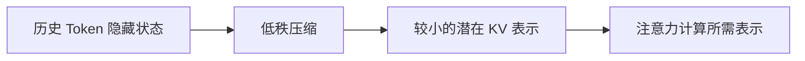

# 高效注意力：FlashAttention、GQA、MLA与线性注意力

> [!summary] 一句话解释
> FlashAttention、GQA、MLA、稀疏注意力和线性注意力都能降低注意力的实际成本，但它们分别优化显存读写、K/V 重复、缓存表示或 Token 连接数量，不能统称为“把平方复杂度变成线性”。

## 一、为什么长文本会变贵

先读：[[Transformer与注意力机制]]。

在标准 Self-Attention（自注意力）中，每个 Token 的 Query 都会与所有 Token 的 Key 比较。若序列长度为 `n`，关系数量约为：

```text
n × n
```

- 1,000 Token：约 100 万个位置关系。
- 10,000 Token：约 1 亿个位置关系。
- 长度扩大 10 倍，关系数约扩大 100 倍。

这就是常说的标准稠密注意力在序列长度上的 **O(n²) 平方复杂度**。训练或 Prefill（预填充，处理整段输入）尤其明显。

生成阶段还会保存历史 Token 的 Key 和 Value，这称为 **KV Cache（键值缓存）**。它避免每生成一个新 Token 都重算全部历史，但会占用越来越多显存，并消耗读取带宽。

## 二、先用一张表分清

| 技术 | 核心办法 | 仍看全部 Token 对吗 | 主要收益 | 是否理论线性 |
|---|---|---:|---|---:|
| FlashAttention | 分块计算，减少 HBM 与片上 SRAM 之间读写 | 是，精确稠密版是 | 中间显存、I/O、实际速度 | 否 |
| MQA | 所有 Query 头共享一组 K/V 头 | 是 | KV Cache、解码带宽 | 否 |
| GQA | 一组 Query 头共享一组 K/V | 是 | KV Cache、解码带宽与质量折中 | 否 |
| MLA | 把 K/V 压缩进低维潜表示 | 是 | KV Cache | 否 |
| 稀疏注意力 | 只连接局部、窗口、块或选中的位置 | 否 | 计算与显存 | 视模式而定 |
| 线性注意力 | 核技巧/递归状态，避免显式 n×n 矩阵 | 通常否 | 长序列计算与状态缓存 | 通常近似 O(n) |
| Kimi Linear | KDA 线性层与全局 MLA 层混合 | 部分 | 长上下文缓存和解码 | 混合架构 |

## 三、FlashAttention：改路线，不少算关系

### 全称与读法

FlashAttention 可读作“弗莱士 Attention”，意思是快速注意力。

GPU 有不同层次的存储：

- **HBM（High Bandwidth Memory，高带宽显存）**：容量大，但离计算核心较远。
- **SRAM（Static Random-Access Memory，片上静态存储）**：容量小，但更快。

朴素实现会把巨大的注意力分数矩阵写进 HBM，再反复读取。FlashAttention 使用 Tiling（分块）和在线 Softmax，让小块数据尽量留在片上快速存储中完成计算，减少 HBM 读写和中间矩阵落盘。

生活类比：你仍然要核对全班每个人与每份答卷，但不再每核对一步都跑去地下档案库；而是一次搬一小箱到桌上，处理完再换下一箱。

> [!important] 精确含义
> 原始 FlashAttention 的稠密版本会得到与标准注意力等价的结果，因此是 Exact Attention（精确注意力）。它改善 I/O 复杂度和实际显存，不把标准稠密注意力的算术复杂度从 O(n²) 改成 O(n)。

## 四、MHA、MQA 与 GQA

### 1. MHA：每个头都有自己的 Q/K/V

MHA（Multi-Head Attention，多头注意力）让多个注意力头学习不同关系。每个 Query 头通常对应自己的 Key、Value 头，表达能力强，但 KV Cache 重复较多。

### 2. MQA：所有 Query 头共享一组 K/V

MQA（Multi-Query Attention，多查询注意力）保留多个 Query 头，但所有 Query 头共用一组 K/V。缓存最省，解码快，但有时会损失质量。

### 3. GQA：分组共享 K/V

GQA（Grouped-Query Attention，分组查询注意力）处在两者中间：多个 Query 头分成若干组，每组共享一组 K/V。

```text
MHA：8 个 Q 头 → 8 组 KV
GQA：8 个 Q 头 → 2 组 KV
MQA：8 个 Q 头 → 1 组 KV
```

类比：

- MHA：每位员工保留一整套档案。
- MQA：所有员工共用一套档案。
- GQA：每个小组共用一套，平衡重复量和差异性。

GQA 主要减少 KV Cache 和解码时的内存带宽，但每个 Query 仍会访问整个序列的 Key，所以不是线性注意力。

## 五、MLA：压缩 K/V 的表示

MLA（Multi-head Latent Attention，多头潜在注意力）是 DeepSeek-V2/V3 使用的注意力结构。

它不直接为每个历史 Token、每一层保存完整的各头 K/V，而是把它们联合压缩成较小的 Latent Vector（潜在向量）；需要计算时再从潜在表示中恢复所需信息。



生活类比：不保存每位员工完整重复的会议记录，而是保存一份压缩档案，使用时按需要展开。

DeepSeek-V2 论文报告了非常显著的 KV Cache 降低，但这是该模型架构和测试条件下的结果，不能当作所有 MLA 实现的固定比例。

MLA 仍然计算注意力，也不等于“线性注意力”。

## 六、稀疏注意力：只看一部分位置

Sparse Attention（稀疏注意力）通过规则或学习，只计算部分 Token 对：

- Sliding Window：每个 Token 主要看附近窗口。
- Block Sparse：按块选择连接。
- Global Tokens：少数全局 Token 可看所有位置。
- 内容路由：动态选择可能相关的块。

优点是直接减少连接数；代价是可能漏掉远距离关系，并且“不规则稀疏”不一定容易让 GPU 跑快。

## 七、线性注意力：把历史压进状态

Linear Attention（线性注意力）通常使用核函数、矩阵乘法重排或递归更新，让计算不必显式形成 `n × n` 注意力矩阵。

可把它粗略理解成：

```text
过去方式：新 Token 与所有历史 Token 逐个比较
线性方式：先把历史累积进状态 S，新 Token 查询 S
```

状态更新示意：

```text
S_t = 更新(S_{t-1}, K_t, V_t)
输出_t = 查询(Q_t, S_t)
```

这样时间通常可随序列长度近似线性增长，推理时状态大小也可受控。但有限状态是对历史的压缩，不一定能像完整注意力一样精确取回任意细节。

## 八、Kimi Linear 与 Kimi Delta Attention

### 1. KDA 是什么

KDA（Kimi Delta Attention，Kimi 增量注意力）是一种线性注意力模块。它扩展 Gated DeltaNet，用更细粒度的门控管理有限的 RNN 式记忆状态。

“Delta Rule（增量规则）”可以先理解为：新信息写入时，不是盲目相加，而是根据“当前记忆预测错了多少”进行修正。

```text
写入变化 ≈ 新目标 - 记忆当前给出的预测
```

这类似纠正笔记：已经记对的内容少改，预测错误的关联重点更新，并用门控制保留、擦除和写入。

### 2. Kimi Linear 不是纯线性层堆叠

官方论文描述的是**混合架构**：按层组合 KDA 与全局 MLA。线性层负责高效压缩和传递大部分历史，全局注意力层保留直接访问长距离细节的能力。

论文/官方仓库在特定 1M 上下文设置中报告最高约 75% KV Cache 降低和约 6 倍解码吞吐。这是实验结果，不等于所有长度、GPU、批量上都固定加速 6 倍。

## 九、Prefill 与 Decode 的瓶颈不同

大模型推理分两阶段：

- **Prefill（预填充）**：一次处理用户输入的全部 Token，矩阵计算多，长输入的平方注意力明显。
- **Decode（解码）**：逐个生成新 Token，每一步要读历史 KV Cache，常受显存带宽影响。

所以：

- FlashAttention 对训练和 Prefill 的大矩阵/中间存储尤其重要。
- GQA、MLA、KV 量化对 Decode 的缓存和带宽尤其重要。
- 线性/稀疏注意力在极长序列时可能从算法层改变增长速度。

## 十、常见误区

> [!warning] 常见误区
> - 高效注意力不等于线性注意力。
> - FlashAttention 不是近似算法；其标准稠密版本是精确计算。
> - KV Cache 只避免重复计算历史 K/V，不会让所有注意力成本消失。
> - GQA/MLA 省缓存，不代表上下文长度可以无限增加。
> - 论文里的峰值加速不能脱离 GPU、精度、批量和序列长度引用。
> - 线性注意力的 O(n) 是复杂度描述，不保证任何长度下都比高度优化的 FlashAttention 快。

## 十一、关联概念与学习建议

- 基础：[[Transformer与注意力机制]]
- 参数容量：[[MoE稀疏专家模型与DeepSeekMoE]]
- 另一条线性序列路线：[[状态空间模型与长期记忆：Mamba、Titans与外部记忆]]
- 部署：[[大模型推理加速：FP8、量化、KV Cache与多Token预测]]

学习时每看到一种“高效注意力”，问四件事：它少算了哪些连接？少存了什么？结果是否仍精确等价？优化的是 Prefill 还是 Decode？

## 参考资料

> [!info] 核对日期
> 2026-08-30。Kimi Linear 为较新的研究和开源实现，性能数字按原论文条件理解。

- [FlashAttention](https://arxiv.org/abs/2205.14135)
- [GQA: Training Generalized Multi-Query Transformer Models](https://arxiv.org/abs/2305.13245)
- [DeepSeek-V2：MLA 与 DeepSeekMoE](https://arxiv.org/abs/2405.04434)
- [Kimi Linear 论文](https://arxiv.org/abs/2510.26692)
- [MoonshotAI/Kimi-Linear 官方仓库](https://github.com/MoonshotAI/Kimi-Linear)

