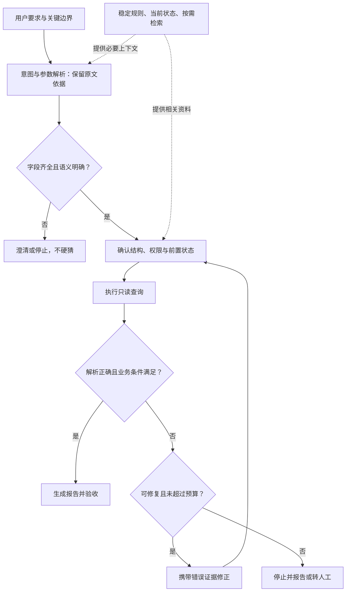

# Agent可靠性术语辨析：上下文、状态、反馈、路由与记忆

## 一句话解释

**这八个词讨论的是：怎样让智能体准确理解要求、不跳步骤、知道工具实际做了什么，并通过流程、校验、记忆和日志提高可靠性。**

Agent 发音为 /ˈeɪdʒənt/，指智能体；这里是能调用工具、根据结果继续办事的软件系统。围绕模型组织这些机制的运行支撑系统，就是 [[Agent Harness：模型之外的运行系统|Agent Harness]]。

> [!important] 原文语境与证据边界
> 用户于 2026-10-07 提供了一段关于智能体落地经验的文章正文。下文按这段原文解释八个名称，不把它们当作已确认的统一行业术语，也不据转述确认其中人物身份或公司背书。
> 原文没有给出“90% 以上翻车案例”“超过 8K tokens 且有三个以上硬约束时，漏看概率增加至 40%”的实验出处；本次检索也未找到足以验证这些数字的原始实验资料。它们不应作为通用技术规律引用。
> 下方官方文档和论文支持的是相应的基础机制，不是对整篇文章、八个名称或其统计数字的背书。

## 先看整体关系

前三项描述故障，后三项加上记忆、日志，描述治理方法。它们不是严格的一对一对应关系。

| 原文名称 | 通俗理解 | 更便于继续学习的概念 |
|---|---|---|
| 注意力视野盲区 | 要求明明在那里，却漏了、理解错了或执行时变形了 | 上下文管理、约束遵循、语义校验 |
| 隐性状态断档 | 必要步骤没做，却当成已经做了 | 前置条件、显式状态、状态机 |
| 环境反馈错位 | 以为工具办成了，真实结果却没有被正确理解和确认 | 工具返回契约、结果解析、完成验证 |
| 路由强解析 | 先把自然语言整理成明确的任务类型和参数 | 意图分类、参数提取、结构化输出 |
| SOP 降维映射 | 把长篇操作要求变成程序可执行的步骤和关卡 | 工作流、依赖图、流程编排 |
| 防御性反思 | 每步先验收，有证据再继续，失败则有边界地修正 | 输入输出校验、业务断言、有限重试 |
| 记忆冷热分区 | 当前需要的放在眼前，历史材料按需取用 | 工作记忆、持久化、检索与上下文选择 |
| 全链路白盒化 | 记录实际发生的全过程，让故障可以定位和追查 | 可观测性、链路追踪、审计 |

生活类比：让一位助理办事，不仅要给工作要求，还要给资料、步骤清单、验收标准和交接记录。助理说“没问题”不能替代检查办事结果。

以下统一用这个任务举例：

> 从商品库找出“型号精确等于 A，且价格不高于 300 元”的商品，生成报告；只允许查询，不得修改库存。

这是教学例子，并没有实际连接或操作任何数据库。

## 1. 注意力视野盲区：漏掉或扭曲关键要求

原文主要指模型处理复杂输入时，没有可靠地保留和执行全部约束。例如，把“型号为 A **并且**不超过 300 元”变成了“型号为 A **或者**不超过 300 元”。后者会纳入原本不合格的商品。

“上下文”就是本轮模型实际收到的材料，包括指令、对话、工具说明和查询结果等。Token 读作“托肯”，指模型处理文本的分词单位，不固定等于一个汉字或单词；8K tokens 约指八千个这类单位，不等于八千字。

需要把两种情况分开：

- **根本没看到**：要求被截断、被摘要漏掉，或相关资料没有检索进来。
- **看到了但没正确使用**：材料在输入中，模型仍漏掉否定词、混淆“且/或”、错误提取边界。

研究《Lost in the Middle》在所测试的模型与任务中观察到：重要信息的位置会影响表现，长上下文中部的信息可能更难被有效利用。但它不能证明所有模型存在统一的“8K、三个条件、40%”阈值。[论文原文](https://arxiv.org/abs/2307.03172)

### 怎么应对

1. 把要求拆成清楚的条件：型号、价格、逻辑关系、禁止动作。
2. 给当前步骤提供必要材料，减少不相关历史，但不删除关键限制。
3. 用程序核对生成的查询条件与用户要求是否一致。
4. 由数据库权限真正限制只读，不能只写一句“请勿修改”。

原文提到把字符串放进整数参数，也可能是参数定义、类型转换或工具适配的问题，不能只凭现象认定是“注意力稀释”。例如数字字段收到“三百左右”，系统不应默默猜成一个精确值。

**误区：这不是说模型有一块固定、可定位的视觉盲区，也不是 [[Transformer与注意力机制|注意力机制]] 中某个特定数学结构的正式名称。**

## 2. 隐性状态断档：前提没成立，流程已经往下走

按原文，“隐性”指进度与前提只存在于模型的叙述或假设中，没有被外部程序明确确认。“断档”主要指关键步骤被跳过，不只是聊天记录丢失。

原文举例：没有确认商品表叫什么、有哪些列，就直接生成数据库查询。

- SQL = Structured Query Language，结构化查询语言，常逐字母读 S-Q-L，用于向关系数据库表达查询等操作。
- Schema 不是缩写，读音近似“斯基玛”；数据库 Schema 在这里指表、列、类型和关系等结构信息。
- ReAct 来自 Reasoning and Acting，推理与行动交替的模式，详见 [[ReAct：推理、行动与观察的Agent模式]]。

模型“猜测价格列应该叫 price”，与系统“已经确认实际存在 unit_price 列”，完全是两回事。

### 怎么应对

把关键前提变成明确状态，并由程序依据真实结果更新：

```text
结构信息未确认 → 取得适用的结构信息 → 查询获准执行 → 得到结果 → 验收完成
```

如果结构信息未确认，就不能进入依赖它的查询生成步骤。允许使用适用于当前版本的可信结构文件、缓存或预定义查询，不一定每次都实时读取数据库结构；关键是不能无依据地猜。

保存检查点可以帮助中断后接续任务，但“有进度存档”不自动等于“每个前置条件都正确”。[LangGraph 持久化文档](https://docs.langchain.com/oss/python/langgraph/persistence)

**误区：模型输出 `schema_checked=true` 并不能自行证明检查发生过。状态应由对应工具结果及校验来支撑。**关联 [[状态机与幂等性]]。

## 3. 环境反馈错位：想做、调用了、做成了，被混为一谈

原文侧重模型的计划与工具实际反馈脱节：工具返回了嵌套数据，解析层却取错位置，于是模型以为得到了结果，实际没有可用数据。

API = Application Programming Interface，应用程序编程接口，逐字母读 A-P-I；可以理解为软件提供给其他程序的办事入口。

JSON = JavaScript Object Notation，JavaScript 对象表示法，读音近似“杰森”；是一种用字段和值组织数据的文本格式，不限 JavaScript 使用。

假设商品接口实际返回：

```json
{"status": "success", "data": {"items": [{"model": "A", "price": 299}]}}
```

商品列表位于 `data.items`，而不是最外层的 `items`。取错位置后直接当成“没有商品”，就把**解析失败**错误地当成了**合法空结果**。

同类问题还包括：收到“任务已受理”就宣称报告已生成，拿测试环境的结果证明生产环境正常，或把上一次调用的结果当成这次的结果。

### 怎么应对

- 明确工具返回的字段、类型、成功/失败/处理中状态。
- 区分“请求发出”“外部执行成功”“结果解析成功”“业务验收成功”。
- 记录任务和调用标识、目标环境、数据版本，让结果能对应到正确动作。
- 需要时读取最终文件或重新查询实际状态；不能只相信模型的完成叙述。

**误区：技术调用成功，不等于用户目标达成。**另见 [[Agent工具运行时：执行流水线、并发调度与Code Mode]]。

## 4. 路由强解析：先填好任务单，再进入对应流程

这里不是网络路由器，而是软件决定“这次请求交给哪条流程”。原文把意图识别、参数提取和结构化整理合称为“路由强解析”。

对上面的商品请求，可以先得到如下教学用任务对象：

```json
{
  "route": "product_report",
  "model_equals": "A",
  "price_max_inclusive": 300,
  "condition_logic": "AND",
  "operation": "read_only"
}
```

这段数据分别说明：走商品报告流程、精确型号 A、价格上限包含 300、条件必须同时满足、只读。它是任务描述，不是已获得权限或已经执行成功的凭证。

“强”要落在实际约束上，例如限定可选路线、必填字段和类型，而不只是提示词里要求“请严格输出”。JSON Schema 是描述和校验 JSON 结构的规则，可检查必填字段、类型等。[JSON Schema 官方说明](https://json-schema.org/understanding-json-schema/reference/object)

LangGraph 官方路由示例也展示了先输出受限定的路由选择，再进入对应分支的模式。[官方路由说明](https://docs.langchain.com/oss/python/langgraph/workflows-agents#routing)

### 需要修正原文的绝对说法

- **不是所有任务都必须加一个轻量模型。**简单请求可以由普通代码处理；复杂歧义可能需要更强的理解能力或向用户确认。
- **不是执行节点永远不能看原文。**保留原文及字段出处，必要时复核，有助于发现前置提取丢失条件。
- **结构正确不等于意思正确。**`AND` 被填成合法的 `OR`，可能仍通过格式校验，却违反需求。
- **不确定时允许暂停或转人工。**不能为了得到完整 JSON，把未知字段硬猜出来。

## 5. SOP 降维映射：把长篇要求变成可执行流程

SOP = Standard Operating Procedure，标准操作规程，逐字母读 S-O-P。此处不是浏览器里的同源策略。

System Prompt 指应用提供给模型的系统级指令。在这里，“降维”是文章的比喻：把藏在长指令中的步骤、依赖和限制，转成程序可以检查和推进的流程；不是数学上的向量降维。

原文的“搜集—清洗—对比—排版”可以变成各自有输入输出的节点。对商品例子则是：

```text
确认条件 → 确认数据结构 → 只读查询 → 校验结果 → 生成报告 → 验收报告
```

程序规定哪些前提未满足时不能继续。生活类比是把“请按公司流程办事”变成必须逐项完成的工单。

DAG = Directed Acyclic Graph，有向无环图，常读作“达格”：连线有方向，并且不能沿着连线绕回原节点。它适合表示无循环的步骤依赖。

### DAG 与多智能体的边界

1. **不是所有工作流都是 DAG。**带回退、循环修改的控制流程可以用有环图或状态机。一个 DAG 引擎也可以在节点内部安排有限重试，关键在讨论的是哪一层。
2. **节点不等于独立 Agent。**查表结构、校验数字、导出文件，常用普通函数就够；一个节点也可以只是一次模型调用。
3. **确定执行顺序，不等于模型输出确定。**图结构固定，模型生成的报告仍可能错误。
4. **不要机械拆得越多越好。**拆分会增加传递错误、延迟和成本，应通过实际任务测试取舍。

这种思路接近代码编排的工作流；模型自主选择下一步的智能体循环是另一种控制方式，两者可以组合。[Anthropic：工作流与智能体的区分](https://www.anthropic.com/engineering/building-effective-agents)

关联 [[LangGraph：有状态工作流与LangChain的区别]]。

## 6. 防御性反思：先用证据验收，再决定是否纠错

按原文，这主要是执行后的独立校验，不只是让模型再说一遍“我检查过了”。更准确的工程表达是：**校验结果、提供可用反馈、有限修正、失败停止。**

“独立模块”可以是一个普通校验函数，不一定是第二个模型、单独的服务器或另一个 Agent。

要区分至少三层验收：

| 层次 | 商品报告例子 | 不能证明什么 |
|---|---|---|
| 格式与类型 | 有商品数组，价格是数字 | 不能证明价格来自真实数据库 |
| 业务语义 | 每件商品型号为 A，价格不高于 300 | 不能单凭输出证明中途没有改库存 |
| 实际执行与权限 | 只读权限有效，调用与最终文件可核实 | 仍须检查报告是否完整、结论是否合理 |

对模型给出的纠错反馈可以很短：

```text
第 2 条商品价格为 329，超过用户要求的 300。
请检查筛选条件，不得改动原始价格。
```

反馈中保留机器可识别的错误类别、发生步骤和必要证据。原文建议把报错堆栈转成自然语言，这可以辅助修正，但不应因此丢弃结构化错误，也不能把含密钥、个人信息的堆栈完整送入模型。

### 必须有停止机制

- 可以设置一次初始尝试后最多两次修正；次数只是设计示例，不是通用最佳值。
- 重复出现相同错误、依赖缺失或权限不够时，应停止或请求帮助。
- 网络暂时故障和业务逻辑错误，要采用不同处理方式。
- 发消息、扣款等可能产生外部影响的动作，重试前须核对是否已经成功，并设计去重或幂等机制。见 [[状态机与幂等性]]。

Reflexion 论文研究过把任务反馈转成语言反思并供后续尝试使用，但“防御性反思”不等同于该论文方法，反思也不保证正确。[Reflexion 原始论文](https://arxiv.org/abs/2303.11366)

## 7. 记忆冷热分区：常用材料在桌面，历史材料进档案柜

原文用三个层次帮助理解：底层设定、多轮对话、检索知识库。这是上下文组织的比喻，不是把模型真的划分成三种硬件。

- **固定规则**：角色、禁止动作、业务边界等，保持稳定且适用于当前任务；关键权限还须由外部系统执行。
- **热材料**：当前问题、关键约束、已经验证的任务状态、最近有关的工具结果，优先提供给本轮模型。
- **冷材料**：历史报告、旧对话、知识资料等，放在外部存储，相关时再查取。

RAG = Retrieval-Augmented Generation，检索增强生成，常读作“拉格”；先找出相关资料，再提供给模型生成回答。检索知识库可以承担外部记忆的一部分，但不是长期记忆的唯一形式。

比如生成本次商品报告，需要当前条件和相关商品，不需要一口气读入公司过去五年所有报告。需要比较历史趋势时，再查对应时间段的数据。

### 类比不能照字面理解

- ROM = Read-Only Memory，只读存储器，常读作“罗姆”。系统提示词不是物理 ROM，也不因叫“只读”就绝不会被忽略或被应用修改。
- 热/冷强调当前访问与使用方式；短期/长期强调保存范围或时间，两组概念不完全等同。长期规则也可能需要一直作为热材料。
- 冷材料检索出来后，要进入本轮输入或被其他工具处理，才能影响这次工作；“存着”不代表“模型已经知道”。
- 不能把低频但重要的权限规则随意移出控制流程；精简上下文不能丢掉否定、边界和未完成事项。
- 保存和检索记忆仍须检查来源、版本、访问权限和过期冲突。知识库里的文本不是新的系统指令。

LangChain 文档区分会话内短期记忆与跨会话长期记忆，并讨论长历史的上下文管理问题。[官方记忆说明](https://docs.langchain.com/oss/python/concepts/memory)

关联 [[RAG、Naive RAG与GraphRAG]]、[[状态空间模型与长期记忆：Mamba、Titans与外部记忆]]。

## 8. 全链路白盒化：记录可核实的执行过程，不是读懂模型的大脑

“全链路”指从收到请求到生成结果的各阶段；“白盒化”在这里更适合理解为提高可观测性：能知道哪些步骤执行了、哪里失败、为什么停止。

Trace 是一次任务的执行链路；Span 是链路中的一个操作片段。可以用共同的任务标识把路由、检索、模型调用、工具执行和校验记录关联起来。[OpenTelemetry 链路追踪文档](https://opentelemetry.io/docs/concepts/signals/traces/)

### 值得记录什么

- 当前步骤、输入材料或其安全引用、目标环境和版本。
- 路由结果、工具名称与脱敏后的参数。
- 调用开始与结束时间、实际结果、解析及业务校验状态。
- 状态变化、失败原因、重试次数、成本和停止原因。
- 最终产物位置，以及它通过了哪些验收。

下面是教学用运行记录，不是模型完整的内部推理：

```json
{
  "step": "validate_products",
  "input_ref": "query-result-17",
  "expected": "all prices <= 300",
  "observed_max_price": 329,
  "validation": "failed",
  "next_action": "repair_query"
}
```

其中实际价格和校验状态应由结果处理程序或独立校验提供，不能全部由模型随意填报。

### 原文“强制输出思维链”需要谨慎理解

CoT = Chain of Thought，思维链，通常逐字母读 C-O-T。要求模型输出计划或简短依据，可以帮助阅读；但这些文本不能保证忠实反映内部计算，更不能证明工具真的执行成功。

**工程上需要的是可核对的步骤、证据和状态，而不是把一大段自述当作执行事实。**没有完整内部思维链，同样可以建立可靠的工具日志与任务追踪；有了思维链，也不能自动阻止死循环。

“可观测”还不等于“会自动刹车”。停止重复调用、限制时间与成本、等待审批，需要运行系统的实际控制逻辑。

全链路也不等于公开全部数据：密钥、认证信息和无关个人数据应脱敏或不记录；日志需要访问控制和保存期限。记录了操作，也不代表可以无条件重放操作。

关联 [[Preset与Agent Trajectory]]、[[Agent评测：上下文成本、轨迹与独立验收]]。

## 把八个概念放到同一条流程里



整个过程都需要日志记录。图中存在修正回路，所以整体不是 DAG；它刻意展示了“固定步骤 + 受限循环”的组合。

- 防漏条件：上下文管理、结构化解析、业务校验配合。
- 防跳步骤：显式状态和程序前置条件配合。
- 防假完成：解析真实反馈、检查外部状态、独立验收配合。
- 防死循环：区分错误类型、检测重复失败、限制次数/时间/成本。

## 原文中哪些应学，哪些不能照搬

应学的是：不要把可靠性完全寄托在换更大模型上，要检查模型能看到什么、工具能做什么、流程允许什么、结果怎样验收。

不能照搬的是：未经证实的百分比；所有执行节点都不能看原文；所有任务都必须先用轻量模型；每步必须是独立 Agent；所有流程都必须是 DAG；有 Schema 校验或思维链日志就能保证正确。

模型能力、工具质量、业务规则、数据质量和运行架构都会影响结果。不能从“架构很重要”再跳到“所有问题都与模型能力无关”。这三类故障也是经验分类，不是覆盖所有风险的完整清单。

## 学习建议

1. 先用一句话区分：**漏条件、跳步骤、假完成**。
2. 再学 [[状态机与幂等性]]、结构化数据、校验和日志。
3. 用 [[LangGraph：有状态工作流与LangChain的区别]] 理解怎样把这些机制组成流程。
4. 最后用 [[Agent评测：上下文成本、轨迹与独立验收]] 检查改造是否真的改善成功率、成本与安全性，不只看演示是否流畅。

练习：对“只查询商品、不修改库存”的任务，分别问：约束在哪里保存？什么状态能证明完成？哪个组件阻止写操作？失败两次之后怎么办？

## 参考资料与来源说明

核对日期：2026-10-07。原文为用户在本次对话提供的正文，未附公开原文地址或统计实验链接；以下为基础机制的官方资料和原始论文。

- [Lost in the Middle](https://arxiv.org/abs/2307.03172)：长上下文的信息位置与使用效果；不能据此推导原文给出的固定阈值。
- [LangGraph：Workflows and Agents](https://docs.langchain.com/oss/python/langgraph/workflows-agents)：路由、分步执行及不同编排方式。
- [LangGraph：Persistence](https://docs.langchain.com/oss/python/langgraph/persistence)：会话状态检查点与跨会话存储。
- [JSON Schema：Object](https://json-schema.org/understanding-json-schema/reference/object)：对象字段、类型和必填规则。
- [Anthropic：Building Effective Agents](https://www.anthropic.com/engineering/building-effective-agents)：工作流与智能体的区分、简单组合式设计和环境反馈。
- [Reflexion](https://arxiv.org/abs/2303.11366)：利用反馈与语言反思改善后续尝试的研究。
- [LangChain：Memory Overview](https://docs.langchain.com/oss/python/concepts/memory)：短期/长期记忆及上下文管理。
- [OpenTelemetry：Traces](https://opentelemetry.io/docs/concepts/signals/traces/)：通过关联操作片段追踪执行链路。
