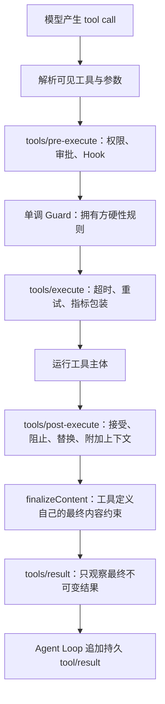

# Agent 工具运行时：执行流水线、并发调度与 Code Mode

> [!summary] 一句话解释
> **Agent 工具运行时负责把模型提出的工具调用变成受检查、可审批、可调度、可记录的真实操作；Code Mode 则让模型用一小段程序编排多个工具调用，减少模型与工具之间的往返。**

> [!warning] 当前实现会变化
> 本笔记以 2026-08-13 的 DeepSeek Harness 官方源码和文档为准。项目仍处于 Developer Preview，事件名、默认值和 Code Mode 后端以后可能改变。

## 先理解：模型不会自己打开文件

大语言模型本质上根据输入生成输出。它说“我要读取 `a.txt`”，不等于文件已经被读取。

真正的过程通常是：

```text
模型生成工具调用请求
        ↓
Harness 解析和检查请求
        ↓
工具运行时决定是否允许、怎样调度
        ↓
真实程序读取文件或调用 API
        ↓
结果记录到会话，并重新交给模型
```

因此，Tool Calling（工具调用）至少有两个层次：

- **模型层**：模型生成工具名和参数；
- **运行时层**：程序真正检查、执行、记录并处理结果。

[[MCP模型上下文协议|MCP]] 可以把外部工具接进 Host，但工具接入以后仍需要运行时处理调用。

## Tool Runtime 是什么

**Tool Runtime（工具运行时）**是管理工具注册与执行规则的系统。

在 DeepSeek Harness 中，`ctx.tools` 当前负责：

- 注册工具名称、说明、输入 schema 和输出 schema；
- 按 Agent Scope 计算最终可见工具；
- 把工具 schema 加入模型请求；
- 在执行前运行权限与策略门禁；
- 调用真正的工具代码；
- 统一错误和结果格式；
- 决定调用可以并行还是必须串行；
- 把最终工具结果交给 Agent Loop 记录。

## Schema 是什么

**Schema（模式/结构约定）**描述数据应该长什么样。

例如天气工具的输入可能约定为：

```json
{
  "city": "北京",
  "days": 3
}
```

对应规则可能是：

- `city` 必须是字符串；
- `days` 必须是整数；
- 两个字段是否必填；
- 是否允许额外字段。

工具运行时不能因为模型“看起来懂了”就完全相信参数。模型仍可能传错类型、漏字段或拼错名称，因此运行时要验证。

## 一次工具调用的完整流水线

DeepSeek Harness 当前工具流水线可以简化为：



这比“调用一个函数”多了很多层，因为 Agent 可能执行写文件、终端命令、发消息等有真实副作用的操作。

## 第一阶段：解析工具

运行时先确认：

- 当前 Agent 是否看得见这个工具；
- 工具名是否存在；
- 是否使用了保留名称；
- 参数是否符合 schema；
- 当前呈现模式允许模型直接调用它吗。

在纯 Code Mode 中，模型直接调用普通工具可能在进入审批前就被判定为不允许，因为此模式要求所有普通工具调用从 `run_code` 内部发起。

这样可以避免人工审批一个注定不能执行的调用。

## 第二阶段：`tools/pre-execute`

这是执行前的 **Waterfall（瀑布式事件/环绕中间件）**。

监听器可以用于：

- 权限审批；
- 沙箱策略选择；
- 企业安全 Hook；
- 允许、拒绝或询问用户；
- 记录执行前审计信息。

Waterfall 监听器只有调用 `next()` 才会把控制权交给下游；不调用便可以短路。

> [!important] 当前边界
> DeepSeek Harness 当前有意不允许 `tools/pre-execute` 随意改写 `exec.arguments`。否则日志记录的参数可能与真正执行的参数不同，破坏审计与重放一致性。

## 第三阶段：单调 Guard

**Guard（守卫）**是工具拥有方注册的硬性拒绝规则。

“单调”可以这样理解：

```text
一旦某条 Guard 明确拒绝
后面的策略不能再把它改回允许
```

例如工具拥有方可以登记“某种内部状态下禁止执行”或“重复调用达到上限后拒绝”等规则；这类硬性规则不应该被后面的普通美化插件绕过。文件工具的“先读后写”在当前 DeepSeek Harness 中具体由独立的 `fs/*` 观察策略实现，而不是写死在通用 Guard 里。

审批和 Guard 的职责不同：

- 审批回答“用户是否同意做”；
- Guard 回答“系统规则是否允许做”。

用户同意也不能自动覆盖所有系统安全约束。

## 第四阶段：`tools/execute`

这一层环绕真正的工具主体，适合实现：

- 超时；
- 重试；
- 性能指标；
- 取消信号；
- 统一错误处理；
- 嵌套工具调用的关联。

工具主体才是实际执行文件、网络、数据库或进程操作的代码。

## 第五阶段：`tools/post-execute`

工具执行完后，策略仍可以：

- 接受结果；
- 阻止结果交给模型；
- 替换模型可见的内容；
- 替换规范值并重新验证；
- 附加一条后续上下文消息。

例如搜索工具返回了很大的内部对象，后置策略可以只向模型展示摘要。

但“把显示文字改短”不一定是保密边界。如果程序消费方已经拿到了不应看到的规范值，就应该在更早阶段阻止或替换值，而不是只改变 UI 文案。

## `finalizeContent` 与 `tools/result`

`finalizeContent` 由工具定义自己拥有，用于确保最终内容满足该工具必须维持的约定。

之后的 `tools/result` 主要是只读观察点，例如：

- 统计成功/失败次数；
- 记录指标；
- 更新界面；
- 写审计日志。

不要混淆：

```text
tools/result：实时运行时事件
tool/result：写入 SessionEvent 的持久会话事实
```

前者适合观察当前进程，后者可以在重新加载后回放。

## 为什么要把这些阶段拆开

如果每个工具都自己实现权限、超时、审批、日志和错误处理，会出现大量重复代码：

```text
文件工具写一遍审批
终端工具再写一遍审批
数据库工具又写一遍审批
```

流水线让策略横跨多个工具，而工具主体只关注自己的业务：

```text
工具：我怎样完成操作
策略：什么时候允许操作
运行时：怎样统一调度、记录与返回
```

这就是“明确边界”的实际例子。

## 并发调度是什么

**Concurrency（并发）**表示多个任务在时间上重叠推进。它不一定等于多个 CPU 核同时计算，但可以同时等待不同的文件、网络或工具结果。

如果模型一次提出三个读取任务，串行执行可能是：

```text
读 A 完成 → 读 B 完成 → 读 C 完成
```

并发执行可能是：

```text
读 A ┐
读 B ├→ 一起等待 → 全部完成
读 C ┘
```

## 为什么不能把所有工具都并行

两个工具可能修改同一状态：

```text
调用 1：把 counter 从 0 改为 1
调用 2：把 counter 从 0 改为 2
```

如果同时运行，后写入者可能覆盖前者。这叫 **Race Condition（竞态条件）**。

因此 DeepSeek Harness 当前让工具通过 `isConcurrencySafe(args)` 按每次参数判断：

| 调用 | 可能的分类 |
|---|---|
| 读取 A 与读取 B | `parallel`，可以并发 |
| 写入同一个文件两次 | `exclusive`，必须独占 |
| 修改共享会话状态 | 通常 `exclusive` |
| 查询两个互不影响的远程资源 | 可能 `parallel` |

只有明确返回 `true` 才被当作并发安全；其他情况保守地独占执行。

## 并发组与顺序屏障

当前调度器会把连续的并发安全调用放进有上限的并发池；遇到独占调用时：

1. 先等待之前的并发组排空；
2. 单独运行这个独占调用；
3. 完成后才启动后续调用。

独占调用像道路上的收费站，是一个 **Ordering Barrier（顺序屏障）**。

虽然实际完成时间可能不同，持久结果和交给模型的结果仍保持模型原始调用顺序。这样不会因为 B 比 A 先完成，就把上下文顺序变成 B、A。

## 工具的分层可见性与遮蔽

DeepSeek Harness 的工具表按 Scope 分层：

```text
Global 全局工具
    ↓
Preset 工具层
    ↓
Agent 当前作用域工具
```

当前 Agent 的视图沿父链合并：

- 越近的同名工具遮蔽越远的工具；
- Agent 自己注册的工具可以覆盖继承项；
- 限制规则可以从继承集合中移除工具；
- 插件卸载时，其工具注册通过 Cordis Effect 自动撤销；
- `run_code` 是保留的传输名称，普通插件不能注册或覆盖。

这使不同 Preset 可以给同名能力不同实现，而不必让工具代码到处写“如果是研究 Agent……如果是编程 Agent……”。

作用域只管理受信任插件的可见性和所有权，不是安全沙箱。详见 [[Cordis运行时机制：Fiber、Effect与Scope]]。

## Code Mode 是什么

**Code Mode（代码模式）**让模型生成一小段代码，由代码调用多个工具并整理中间结果。

普通模式：

```text
模型请求 1 → 调用 list_files
模型请求 2 → 调用 read_file(A)
模型请求 3 → 调用 read_file(B)
模型请求 4 → 汇总
```

Code Mode：

```text
模型请求 1 → run_code：列文件、循环读取、筛选、汇总
模型请求 2 → 阅读程序最终返回值并回答
```

有些材料把相关思想称为 **PTC（Programmatic Tool Calling，程序化工具调用）**。不同产品的名字和具体实现可能不同；这里重点是“用程序编排工具”，不是记缩写。

## 一个简化的 Code Mode 例子

```ts
const files = await tools.list_files({ path: 'notes' })
const matched = []

for (const file of files) {
  const content = await tools.read_file({ path: file })
  if (content.includes('MCP')) matched.push(file)
}

return matched
```

这段代码做了三件事：

1. 获取文件列表；
2. 循环读取并在执行环境中筛选；
3. 只把匹配结果返回给模型。

中间读取到的所有内容不一定都要重新塞进模型上下文，因此有机会降低模型往返和上下文增长。

## Code Mode 的优势

- 适合循环、条件判断、批量处理和聚合；
- 多个工具步骤可在一次程序执行中完成；
- 中间规范值可以留在运行局部；
- 子调用仍能使用统一权限、Guard、超时和审计流水线；
- 并发安全的子调用可以进入有界并发池。

但它不保证任何任务都会减少 token。模型仍需看到生成的 SDK、可用工具类型和 `run_code` schema；工具越多，生成的 SDK 也可能越长。

## DeepSeek Harness 当前怎样运行 Code Mode

当前 TypeScript 后端使用 Node.js `worker_threads.Worker`：

1. 每次 `run_code` 创建全新 Worker，不复用持久内核；
2. 宿主先用 `stripTypeScriptTypes` 剥离可擦除类型；
3. 程序作为异步函数体运行，因此可使用顶层 `await` 和 `return`；
4. Worker 通过消息端口请求宿主调用工具；
5. 宿主把子调用重新送进完整工具流水线；
6. 运行结束后终止 Worker，只把日志和最终值包装成外层结果。

当前也存在 Python Code Runtime seam；Code Mode 的 SDK 语言由实际加载的运行时决定，而不是写死为 TypeScript。

## Worker 与宿主怎样通信

概念上类似：

```text
Worker → Host：请调用 tools.read_file，参数是 {...}
Host   → Worker：调用成功，规范值是 {...}
```

Worker 内不直接拿到宿主工具函数引用。宿主会检查消息结构、工具名、参数和值是否可以无损表示为 JSON。

当前实现还采用以下防御：

- 工具命名空间使用无原型对象；
- 只接受对象自己的属性，不沿原型链查找；
- 对 `__proto__`、`constructor` 等名称按普通键安全处理；
- 对端口收到的消息重新验证和构造；
- Worker 使用空环境变量，避免直接继承宿主凭据；
- 设置 Worker 堆内存上限；
- 分别限制计算时间和墙上时间；
- 超时后可以强制 `worker.terminate()`；
- 限制外层输出总字节数。

## 为什么“计算时间”和“墙上时间”要分开

**Compute Time（计算时间）**关注 Worker 真正忙碌了多久，例如死循环会大量消耗计算时间。

**Wall Time（墙上时间）**关注现实时间过去了多久，例如程序永远等待一个不返回的 Promise，CPU 可能并不忙，但任务也永远不结束。

```text
死循环             → 计算时间限制能发现
永远等待异步结果   → 墙上时间限制兜底
```

## Code Mode 不是安全沙箱

官方文档明确说明：Worker Thread 是 **isolation measure（隔离措施）**，不是 **security boundary（安全边界）**。

原因包括：

- 模型代码仍可通过被授予的工具产生真实副作用；
- 普通工具副作用不会因外层程序失败而自动回滚；
- Worker 终止不一定能杀死它间接派生的所有操作系统进程；
- 中间绑定值目前没有逐值字节上限，仍可能消耗大量内存；
- 安全性还取决于宿主、工具、文件系统、进程和沙箱提供方。

正确理解是：

```text
Worker 隔离：减少状态泄漏，提供独立堆和强制终止能力
系统沙箱：限制文件、进程、网络和凭据权限
工具审批：决定某个有副作用操作是否允许
```

三者不能相互代替。

## Capability Seam 与文件并发控制

工具运行时之下还可以有可替换的 **Capability Seam（能力接缝）**。

以文件系统为例：

```text
read/write/edit 工具（面向模型）
        ↓
ctx.fs 稳定接口
        ↓
本地提供方 / 沙箱提供方 / 远程 E2B 提供方
```

工具关心“读写文件”，不应绑死本机 Node.js 文件 API。

### `FsTarget` 为什么不是普通路径字符串

当前 `ctx.fs.resolve()` 把路径解析为不透明 `FsTarget`：

- `targetKey` 用于稳定识别目标，消费者不应解析；
- `displayPath` 用于展示给模型或用户；
- `processPath()` 才返回对应执行世界中子进程能打开的路径；
- `fileUrl()` 返回该执行世界的文件 URI。

远程沙箱里的 `/workspace/a.txt` 与本机路径不是同一个命名空间，因此把“目标身份”和“显示/进程路径”分开很重要。

### 文件版本与乐观并发控制

**Optimistic Concurrency Control（乐观并发控制）**先假设冲突不常发生，但写入时检查自己读取过的版本是否仍然有效。

```text
1. Agent 读取文件，看到版本 v1
2. 其他程序把文件改成 v2
3. Agent 按 v1 尝试写入
4. 提供方发现版本不匹配，拒绝覆盖
5. Agent 重新读取后再决定
```

当前文件 seam 支持：

- `createIfAbsent`：只有目标仍不存在时才创建；
- `replaceIfVersion`：只有版本仍等于已观察版本时才替换；
- 带版本的 `editText`：匹配与原子编辑在同一临界区内完成。

这能降低 Agent 用旧内容覆盖别人新修改的风险。

> [!important] 原子不等于有版本保护
> 无条件写入也可以是原子的——不会只写一半；但没有版本前置条件时，仍可能完整地覆盖别人刚写好的新版本。

## 常见误区

### 误区 1：模型调用工具就是直接执行函数

中间通常还有解析、权限、Guard、超时、后置处理和持久记录。

### 误区 2：用户批准后一定能执行

审批只是一层；工具不存在、参数错误或 Guard 拒绝时仍不能执行。

### 误区 3：并行一定更快、更好

共享状态冲突会让结果错误。只有明确满足并发契约的调用才应并行。

### 误区 4：Code Mode 就是让模型随便运行系统代码

理想实现只暴露受控绑定，并让子调用重新进入工具流水线；能做什么仍取决于被授予的工具和权限。

### 误区 5：Worker Thread 等于容器

不是。Worker 提供线程级执行隔离和可终止性，不自动提供完整文件、网络和进程隔离。

### 误区 6：Code Mode 一定更省 token

不一定。它减少的是部分模型往返和中间数据回填，但生成的 SDK、工具说明和最终结果仍占上下文。

## 初学者学习建议

1. 先理解 [[SDK与API|API]] 和函数调用；
2. 学习 JSON 与 JSON Schema；
3. 理解 Tool Calling 的“模型请求”和“真实执行”是两层；
4. 再理解审批、Guard、Hook 和流水线；
5. 学习异步、并发、竞态条件和原子操作；
6. 最后阅读 Code Mode、Worker Thread 与沙箱边界。

## 关联概念

- [[DeepSeek Harness、Everything is a Plugin与Cordis]]：工具运行时所在的 Harness 总体架构。
- [[Cordis运行时机制：Fiber、Effect与Scope]]：工具怎样跟随插件生命周期注册和撤销。
- [[Preset与Agent Trajectory]]：Preset 决定工具集合，Trajectory 记录实际工具调用。
- [[Prompt Engineering与Loop Engineering]]：工具结果怎样推动下一个 Agent Step。
- [[MCP模型上下文协议]]：外部 MCP 工具接入 Host 后仍需要工具运行时。
- [[Agent评测：上下文成本、轨迹与独立验收]]：怎样评价工具调用过程是否安全高效。

## 参考资料

- [DeepSeek Harness：工具执行流水线](https://github.com/deepseek-ai/deepseek-harness/blob/master/docs/tool-execution-pipeline.zh.md)
- [DeepSeek Harness：dsh-tools](https://github.com/deepseek-ai/deepseek-harness/blob/master/packages/core/tools/README.zh.md)
- [DeepSeek Harness：Code Runtime Worker Thread](https://github.com/deepseek-ai/deepseek-harness/blob/master/packages/code-runtime/code-runtime-worker-thread/README.zh.md)
- [DeepSeek Harness：dsh-scope](https://github.com/deepseek-ai/deepseek-harness/blob/master/packages/core/scope/README.zh.md)
- [DeepSeek Harness：文件系统 seam](https://github.com/deepseek-ai/deepseek-harness/blob/master/packages/fs/fs/README.zh.md)
- [DeepSeek Harness：文件系统观察策略](https://github.com/deepseek-ai/deepseek-harness/blob/master/packages/fs/fs-observation-policy/README.zh.md)
