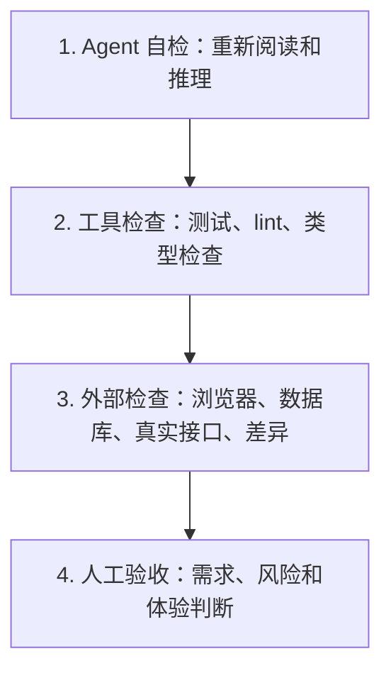

# Agent 评测：上下文成本、轨迹与独立验收

> [!summary] 一句话解释
> **评测 Agent 不能只看“最后答对没有”，还要同时检查过程是否安全、成本是否合理、结果是否有证据、能否稳定复现，以及是否经过独立验收。**

## 为什么“完成任务”还不够

两个 Agent 都可能交付正确答案，但过程完全不同：

```text
Agent A：3 次工具调用，2 分钟，无人工干预，通过独立测试
Agent B：40 次工具调用，20 分钟，泄露密钥，碰巧得到同样答案
```

如果只记录“最终答案正确”，两者都会得到满分，显然不合理。

Agent 是会调用工具、改变环境、持续运行的系统，因此评测对象至少包括：

- 最终结果；
- 实际执行轨迹；
- 权限和副作用；
- 时间、token 与调用次数；
- 人工干预程度；
- 失败后的恢复能力；
- 验收证据的独立性。

## Evaluation 是什么

**Evaluation（评估/评测，常简称 Eval）**是用明确标准判断系统表现的过程。

它不是简单“试一下感觉不错”，而应该回答：

1. 测什么任务；
2. 成功标准是什么；
3. 过程允许和禁止什么；
4. 记录哪些指标；
5. 重复多少次；
6. 谁或什么程序负责验收。

## Agent 评测的五个维度

| 维度 | 要回答的问题 | 示例指标 |
|---|---|---|
| 正确性 | 结果对不对、任务完成了吗 | 测试通过率、答案准确率 |
| 安全性 | 是否遵守权限、有没有不必要副作用 | 越权次数、审批违规、敏感信息暴露 |
| 效率 | 花了多少资源才完成 | 时间、步骤、工具调用、token、费用 |
| 自主性 | 需要人救场多少次 | 人工干预次数、澄清次数、阻塞率 |
| 可复现性 | 同样条件下能否稳定完成 | 多次运行成功率、结果方差、轨迹差异 |

此外还应检查 **Evidence Quality（证据质量）**：结论是否能由日志、测试、来源或产物支持。

## Context 是什么

**Context（上下文）**是一次模型请求中，模型实际能够看到的全部输入。

它不只包括用户刚输入的一句话，还可能包括：

- 系统提示词；
- 开发者和仓库规则；
- Agent Preset 的提示词片段；
- 工具名称、说明与 schema；
- Skills 摘要；
- 会话历史；
- 工具调用和结果；
- RAG 检索资料；
- 文件、图片和附件；
- 压缩摘要；
- 当前模型与调用配置所需的封装。

因此：

```text
用户问题很短
≠
模型实际输入很短
```

## Token 是什么

**Token（词元）**是模型处理文字时使用的基本计量单位。它不严格等于一个汉字、一个英文单词或一个字符。

不同模型使用不同 tokenizer（分词器），所以：

- 同一段文字在不同模型中 token 数可能不同；
- 中文、代码、JSON 和工具 schema 的比例不同；
- “4 个字符约等于 1 token”只能作为粗略估算，尤其可能低估中文和 JSON Schema。

## Context Window 与 Context Pressure

**Context Window（上下文窗口）**是模型一次请求能够处理的 token 容量。

**Context Pressure（上下文压力）**表示当前请求或下一次预计请求已经占用了多少容量。

```text
上下文占用率 ≈ 当前输入 token / 模型上下文窗口
```

这是帮助观察的指标，不一定等于精确账单，也不应只凭一个近似百分比做高风险决策。

## 上下文为什么会膨胀

### 1. 工具太多

模型通常要在请求前看到每个可用工具的名称、说明和参数 schema。工具越多，固定前缀越长。

```text
可用工具数量增加
→ 工具 schema 增加
→ 每次请求固定成本增加
→ 模型选择错误的可能性也可能增加
```

这也是 Preset 的价值之一：不只是“添加能力”，还要移除当前任务不需要的工具。

### 2. 系统和仓库规则很多

系统提示词、`AGENTS.md`、Skills 摘要、安全规则和格式要求都会进入固定上下文。

规则不是越多越好。重复、冲突或与任务无关的规则会增加成本和理解难度。

### 3. 工具结果不断累积

读取大文件、搜索大量结果或输出长日志后，这些内容可能在后续步骤重复发送，直到被压缩或替换。

### 4. 会话持续太久

多轮对话和长期任务会积累消息、计划、错误、重试和工具结果。

### 5. Code Mode 也有固定成本

Code Mode 可能减少中间数据回填和模型往返，但模型仍需看到生成的工具 SDK、`run_code` schema 和使用规则，因此不保证任何任务都更省 token。

## 固定成本与增量成本

可以把上下文粗略分成：

```text
固定前缀：系统提示词 + 工具 schema + Preset/Skills/规则
增量历史：用户消息 + 助手消息 + 工具调用与结果
```

固定前缀在每个请求中都存在，但模型提供方可能通过 KV Cache 降低重复计算成本。

## KV Cache 是什么

**KV Cache（Key-Value Cache，键值缓存）**保存模型处理过的前缀计算结果。当前后续请求如果保持相同前缀，模型可能复用之前的计算。

生活类比：

- 没有缓存：每次考试都重新读完整教材；
- 有缓存：教材前 100 页没变，可以复用之前的阅读笔记，只处理后面的新增内容。

影响缓存复用的常见变化：

- 系统提示词变化；
- 工具集合或顺序变化；
- Preset 变化；
- 模型或调用配置变化；
- 会话压缩从较早位置替换消息。

仅在历史末尾追加新消息，通常更有利于保留旧前缀缓存。

## Cache Read 与 Cache Write

模型提供方可能报告：

- **Uncached Input Tokens**：未从缓存复用的输入；
- **Cache Read Tokens**：从缓存读取的前缀；
- **Cache Write Tokens**：新写入缓存的部分；
- **Output Tokens**：模型本次生成的输出。

不同提供方的计费和字段定义可能不同，比较时要确认口径。

只说“输入 10 万 token”还不够，还要看其中多少命中缓存，以及固定前缀是否稳定。

## Trajectory 是评测的主要证据

[[Preset与Agent Trajectory|Agent Trajectory]] 记录一次任务的实际执行路径，例如：

- turn 和 step；
- 模型请求与输出；
- 工具调用、参数、结果和错误；
- 审批、取消与恢复；
- token 用量与时间；
- 最终结束原因。

只有最终答案，没有轨迹，就难以判断 Agent：

- 是真正完成，还是碰巧答对；
- 是否调用了危险工具；
- 是否重复尝试；
- 是否在失败后正确恢复；
- 是否消耗了不合理的资源。

## 推荐记录的过程指标

| 类别 | 指标示例 |
|---|---|
| 任务 | 是否完成、验收项通过数、失败类型 |
| 循环 | turn 数、step 数、重试数、停止原因 |
| 工具 | 调用总数、成功率、重复调用、并发度 |
| 时间 | 总耗时、模型等待、工具等待、首 token 延迟 |
| Token | 输入、输出、cache read、cache write、预计下一次压力 |
| 人工 | 审批次数、澄清次数、人工修改与救场次数 |
| 安全 | 拒绝次数、越权尝试、敏感数据进入日志的情况 |
| 质量 | 测试通过、引用可靠性、独立验收结果 |

并非每个任务都需要所有指标，但至少应保存足以解释成功或失败的证据。

## 人工干预为什么要单独记录

假设 Agent 最终成功，但过程中人类做了这些事：

- 告诉它应该修改哪个文件；
- 修正了三次错误命令；
- 手工补上关键代码；
- 发现它没有运行测试并提醒它。

如果只记“任务成功”，就把人的贡献误算成 Agent 的自主能力。

可以分层记录：

```text
0 次：完全自主完成
1 次：正常权限审批
2 次：需要任务澄清
3 次以上：多次纠错或人工救场
```

权限审批与纠错干预也应区分：前者可能是正确安全流程，后者说明 Agent 自主性不足。

## 独立验收是什么

**Independent Validation（独立验证/独立验收）**指验收机制不完全依赖 Agent 自己的判断。

例如：

| 任务 | 较独立的验收方式 |
|---|---|
| 修改代码 | 现有自动化测试、静态检查、人工代码审查 |
| 制作网页 | 浏览器实际打开、截图、视觉比较、交互测试 |
| 修改数据库 | 独立查询、约束检查、备份与差异检查 |
| 研究事实 | 官方资料、原始论文、多个独立来源 |
| 写文件 | Git diff、格式校验、重新读取目标文件 |

Agent 自己写了测试，再自己解释测试结果，仍可能共享同一个误解。例如它误解了需求，测试也只验证了这个错误理解。

因此重要任务最好至少有一层来自任务外部的验收标准。

## 验收的四层结构



不是所有任务都需要第四层，但副作用越大、成本越高、越难恢复，就越应该加强独立验收。

## 怎样公平比较两个 Harness

模型相同，不代表实验条件相同。Harness 会决定：

- 系统提示词；
- 工具名称和说明；
- 文件编辑方式；
- 沙箱与权限；
- Preset 和 Skills；
- 上下文压缩；
- 重试和停止条件；
- Code Mode；
- 并发调度；
- 是否自动运行测试。

公平比较时应尽量固定：

1. 相同模型与版本；
2. 相同任务和输入文件；
3. 相同权限范围；
4. 相近的工具能力，而不只是工具数量；
5. 相同时间和 token 预算；
6. 相同验收标准；
7. 清楚记录 Preset、Profile、Skills 和配置版本；
8. 运行多次，而不是用一次结果下结论。

## 为什么单次实验不能代表普遍结论

大模型生成具有随机性，同一个任务可能一次成功、一次失败。

单次结果还可能受这些因素影响：

- 当时的模型路由或服务状态；
- 缓存是否命中；
- 网络与工具延迟；
- 仓库中已有的规则文件；
- 会话历史是否干净；
- 工具是否发生偶发错误。

应至少报告：

```text
样本数量
成功次数
失败次数
平均/中位耗时
成本分布
异常运行
```

不要只展示最好的一次。

## Minimal Composition 为什么适合基准测试

**Minimal Composition（最小组合）**是只加载实验真正需要的模型、工具和规则。

用途包括：

- 减少无关工具 schema；
- 降低仓库规则和 Skills 对结果的干扰；
- 让不同系统的实验条件更容易对齐；
- 更清楚地知道 token 消耗来自哪里；
- 缩小敏感信息进入上下文和日志的范围。

它不一定适合日常工作。日常模式可能需要更多安全和便利能力；基准测试模式追求变量可控。

## DeepSeek Harness 当前怎样测量上下文

当前 `token-meter` 会从持久会话日志折叠出：

- `tokenUsage`：未缓存输入、输出、缓存读取和缓存写入；
- `contextPressure`：最近请求压力、预计下一次请求压力、上下文窗口；
- `contextBreakdown`：系统提示词、工具和消息各自的大致组成。

其中有两类数字：

1. 模型提供方返回的实际用量样本；
2. 运行时按字符和结构开销计算的近似估算。

组成明细是近似值，不应要求它们与提供方总量精确相加。官方当前固定启发式规则约为“每四个字符一个 token，再加结构开销”，并明确提醒它可能严重低估中文和 JSON schema。

## Session 日志与隐私

会话日志用于重建模型上下文，因此可能包含：

- 用户问题；
- 文件内容；
- 命令与输出；
- 工具参数和结果；
- 系统提示词；
- 模型、提供方和调用配置；
- 插件扩展的持久事件。

应提前设计：

- 日志保留多久；
- 谁能读取；
- 是否加密；
- 删除和导出流程；
- 哪些字段需要脱敏；
- 遥测是否上传，以及上传哪些内容。

DeepSeek Harness 当前遥测 seam 本身不内置统一脱敏规则；未配置脱敏监听器时，外发记录可能保留原始文件或命令输出中的敏感信息。脱敏只修改外发副本，不会回写权威会话日志。

这说明：

```text
“日志可观测”是一项能力
“日志安全”是另一组需要部署方设计的规则
```

## 一个实用评测模板

```markdown
## 任务
- 目标：
- 输入：
- 禁止事项：
- 验收标准：

## 固定条件
- 模型与版本：
- Harness/Profile/Preset：
- 工具和权限：
- 时间/token 预算：
- 仓库版本：

## 运行结果
- 是否完成：
- turn / step：
- 工具调用：
- 总耗时：
- 输入/输出/cache token：
- 人工审批：
- 人工纠错：
- 错误与重试：

## 独立验收
- 自动测试：
- 外部检查：
- 人工检查：

## 风险
- 副作用：
- 敏感数据：
- 无法复现的部分：
```

## 常见误区

### 误区 1：最终答案正确就代表 Agent 很好

还要检查成本、安全、证据、人工干预和稳定性。

### 误区 2：用户问题只有十个字，所以输入成本很低

系统提示词、工具 schema、规则和历史可能远长于用户消息。

### 误区 3：工具越多，Agent 越强

无关工具会增加固定成本、权限面积和选择难度。

### 误区 4：上下文占用率是精确账单

它可能混合提供方样本和运行时估算，主要用于观察趋势。

### 误区 5：Agent 自己说“测试通过”就完成了

应查看真实测试输出，并在重要任务中增加独立验收。

### 误区 6：一次对比可以证明哪个 Harness 更强

单次运行样本太少，而且工具、提示词、权限和缓存可能不一致。

## 初学者学习建议

1. 先理解 Token、Context Window 和工具调用；
2. 学习 [[Preset与Agent Trajectory|Trajectory]]；
3. 为一个三步任务记录时间、步骤和工具调用；
4. 再加入 token、缓存和人工干预指标；
5. 给任务写明确的验收标准；
6. 最后学习多次实验、对照变量和统计结果。

## 关联概念

- [[Preset与Agent Trajectory]]：评测过程的主要证据来源。
- [[Prompt Engineering与Loop Engineering]]：循环如何重试、验证和停止。
- [[Agent工具运行时：执行流水线、并发调度与Code Mode]]：工具成本、并发和 Code Mode。
- [[DeepSeek Harness、Everything is a Plugin与Cordis]]：运行时怎样决定实际行为。
- [[RAG、Naive RAG与GraphRAG]]：检索资料也会占用上下文并需要来源评估。

## 参考资料

- [DeepSeek Harness：架构与会话日志](https://github.com/deepseek-ai/deepseek-harness/blob/master/docs/architecture.zh.md)
- [DeepSeek Harness：dsh-session](https://github.com/deepseek-ai/deepseek-harness/blob/master/packages/core/session/README.zh.md)
- [DeepSeek Harness：Token Meter](https://github.com/deepseek-ai/deepseek-harness/blob/master/packages/llm/token-meter/README.zh.md)
- [DeepSeek Harness：Session Telemetry](https://github.com/deepseek-ai/deepseek-harness/blob/master/packages/session/session-telemetry/README.zh.md)
- [DeepSeek Harness：测试策略](https://github.com/deepseek-ai/deepseek-harness/blob/master/docs/testing.zh.md)
- [SWE-agent 论文：Agent-Computer Interfaces Enable Automated Software Engineering](https://arxiv.org/abs/2405.15793)
