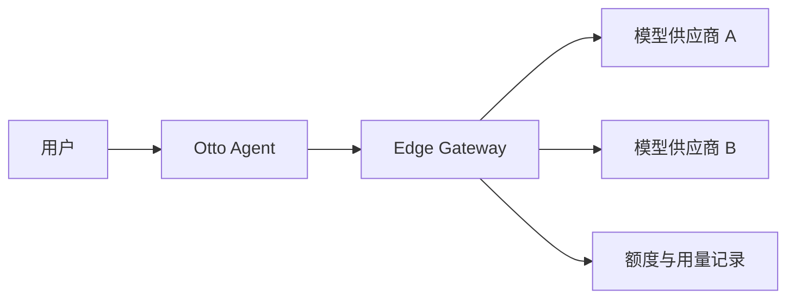
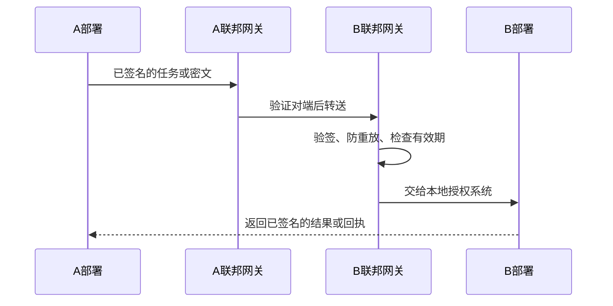
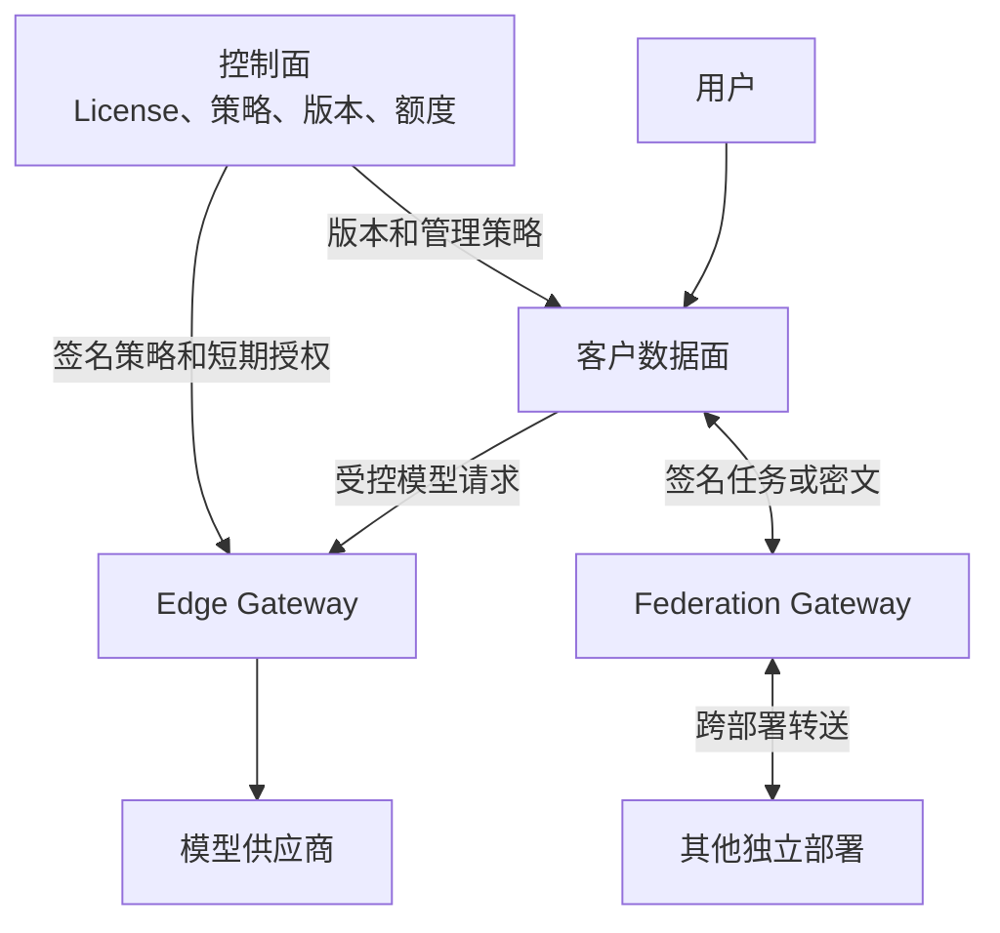

# Control Plane、Data Plane、Edge Gateway 与 Federation

> [!summary] 一句话结论
> **Control Plane（控制面）负责制定和下发规则，Data Plane（数据面）负责真正处理业务请求；Edge Gateway（边缘网关）守在外部服务入口，Federation（联邦）让多个相互独立的部署在保持边界的前提下协作。**

## 一、先用机场理解四个概念

| 技术概念 | 机场类比 | 主要工作 |
|---|---|---|
| Control Plane | 塔台和机场管理中心 | 规定航线、权限、版本、配额和运行策略 |
| Data Plane | 跑道、行李和客运现场 | 真正运输乘客和行李，也就是处理业务数据 |
| Edge Gateway | 边检和安检口 | 验证身份、限制流量、选择去往哪个外部服务 |
| Federation | 不同机场之间的联运协议 | 在不同管理主体之间验证身份并转交任务或密文 |

四者不是四种编程语言，也不一定对应四台固定服务器。它们首先是**职责边界**，一个小系统里可以由少量进程承担，大系统里则可能拆成许多服务。

## 二、Control Plane：控制面是什么

**Control Plane，读作“肯戳尔 普雷恩”，中文叫控制面。**

它通常管理“系统应该怎样运行”，例如：

- 哪个客户或设备拥有许可证；
- 哪个版本可以发布、灰度或回滚；
- 哪些模型、工具和功能可以使用；
- 每个组织有多少额度；
- 部署是否健康；
- 策略和公钥应该怎样下发。

控制面适合保存**管理元数据**，不应该因为方便就集中保存所有客户聊天、附件、提示词和模型密钥。否则一旦控制面发生问题，影响面会非常大。

## 三、Data Plane：数据面是什么

**Data Plane，读作“得塔 普雷恩”，中文叫数据面。**

它是真正承载用户业务的部分，例如：

- 接收用户请求；
- 读取授权文件和企业知识；
- 执行 Agent 工具；
- 保存账号、任务、聊天、审计和附件；
- 把允许的内容发给模型并接收结果。

在 Otto 企业架构中，客户侧 Server、[[SQLite、SQLCipher与PostgreSQL|PostgreSQL]]、[[Redis缓存与分布式协调|Redis]]、[[S3与MinIO对象存储|S3/MinIO]] 等主要属于数据面。

> [!important] 为什么要分开
> 控制面可以告诉数据面“谁能做什么”，但不等于控制面必须看到数据面的所有正文。把管理权和业务数据分开，有助于缩小权限和故障影响范围。

## 四、Edge Gateway：边缘网关是什么

**Gateway 是网关，也就是进入另一片网络或服务前的统一入口。**

在 AI 产品中，Edge Gateway 常位于 Agent 与模型供应商之间：

它可以负责：

1. 验证短期令牌和调用方身份；
2. 检查这个组织允许使用哪些模型；
3. 限制请求频率、并发数和预算；
4. 把逻辑模型名路由到具体供应商；
5. 转发 [[SSE与流式响应|SSE 流式响应]]；
6. 在用户取消时中止上游请求；
7. 记录不含业务正文的用量和结算证据。

它不应该变成“什么地址都能访问的开放代理”，也不应默认长期保存提示词、回复、文件和 API Key。上游地址必须使用白名单并防范 [[SSRF、DNS Rebinding与浏览器来源安全|SSRF 与 DNS Rebinding]]。

## 五、Federation：联邦协作是什么

**Federation，读作“费德瑞申”，这里可译为联邦或跨部署协作。**

假设 A 公司和 B 公司各自部署一套 Otto：

- 两边都有自己的管理员、账号和数据库；
- A 不能直接登录 B 的数据库；
- 但 A 的 Agent 可能要把一项任务或一封加密消息交给 B。

Federation Gateway 就像两个机构之间的受控收发室：

关键机制包括：

- **部署身份**：每个部署要有可验证的身份和公钥；
- **数字签名**：证明消息来自谁、途中有没有被修改；
- **Nonce（一次性随机数）或消息 ID**：防止旧消息被重复投递；
- **过期时间**：太旧的授权和消息不能继续使用；
- **幂等处理**：重复收到同一消息也不能重复扣款或重复执行，详见 [[状态机与幂等性]]；
- **端到端加密**：中继网关可以转发密文，但没有解密钥匙，详见 [[端到端加密E2EE与MLS]]；
- **本地再授权**：对方发来的任务仍要遵守接收方自己的权限策略。

## 六、它们怎样配合

一条健康的边界是：

- 控制面管规则，但尽量不拿客户正文；
- 数据面处理正文，但只接受可验证的策略；
- Edge 只做必要的模型访问控制和转发；
- Federation 只做跨边界的验证与转送；
- 每一层都使用最小权限和可审计身份。

## 七、常见误区

### 误区 1：控制面比数据面“更高级”

它们是职责不同，不是等级高低。数据面停止工作，用户同样无法完成业务。

### 误区 2：用了网关就自动安全

如果网关能访问任意地址、记录所有正文、长期持有万能密钥，反而会成为高风险集中点。

### 误区 3：Federation 就是共享一个数据库

联邦的重点恰恰是**保持独立管理边界**，通过协议交换有限信息，而不是让双方随意查询彼此数据库。

### 误区 4：跨部署消息有签名就可以直接执行

签名只证明来源和完整性。接收方仍需检查权限、有效期、风险、幂等键以及是否需要人工批准。

## 八、在 Otto 中具体有什么用

根据 Otto 手册中的架构划分：

- Otto Control 属于控制面，管理 License、发布、运营和额度；
- Otto Server 与客户存储主要属于数据面；
- Edge Gateway 管理模型访问、路由、流式转发和用量；
- Federation Gateway 用于不同私有部署之间的受控协作；
- 这些名称描述设计职责，不代表相关生产门禁和外部审计已经完成。

产品全貌见 [[Otto产品总体技术架构]]，分项学习入口见 [[Otto使用技术学习地图]]。

## 九、学习建议

1. 先理解 [[SDK与API]] 和客户端—服务器关系。
2. 再学习 [[身份认证与授权：ACL、RBAC、MFA、OAuth、OIDC、SAML与SCIM|身份认证与授权]]。
3. 接着看网关、限流、短期令牌和数据分层。
4. 最后学习联邦身份、签名、防重放、E2EE 和分布式幂等。

## 参考资料

- Kubernetes 官方文档：Control Plane Components，<https://kubernetes.io/docs/concepts/overview/components/>
- NIST：Zero Trust Architecture，<https://csrc.nist.gov/pubs/sp/800/207/final>
- 本笔记的 Otto 具体职责来自《Otto总体技术说明手册（非技术同事版）_2026-08-21》。
- 核对日期：2026-08-21。
