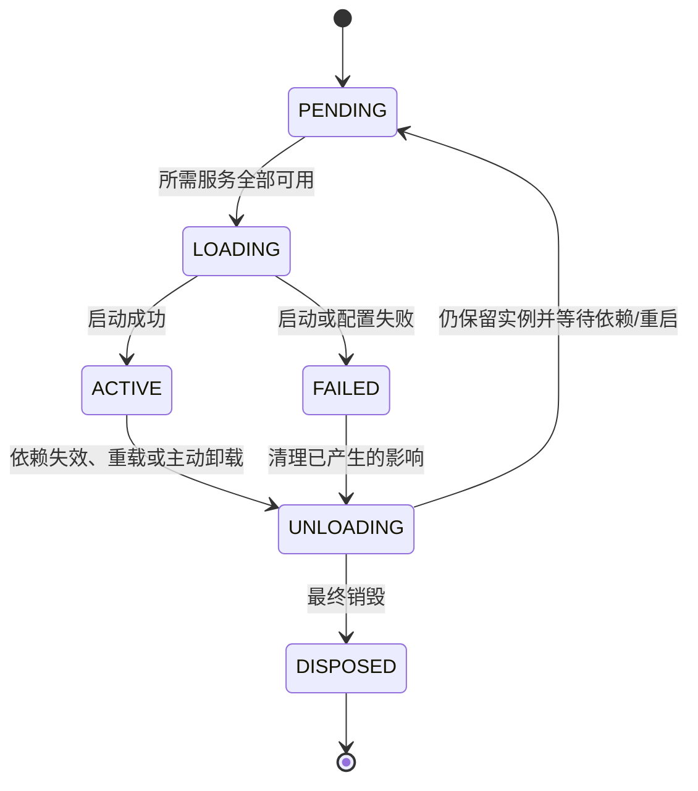
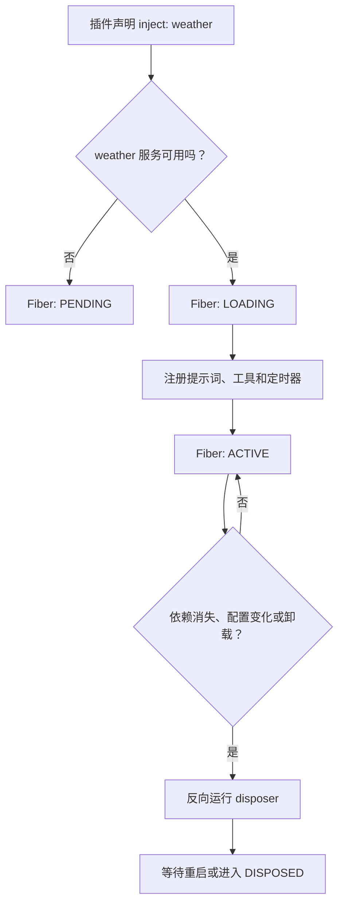

# Cordis 运行时机制：Fiber、Effect 与 Scope

> [!summary] 一句话解释
> **Cordis 用 Fiber 管理每个插件的生命周期，用 Effect 记录“安装能力时怎样撤销”，再用 Context、Inject 和 Scope 管理服务依赖与可见范围，使插件能够等待、启动、卸载和重新组合。**

> [!warning] 很新的实现
> 本笔记依据 2026-08-13 的 Cordis、DeepSeek Harness 官方源码和 Cordis 预印本核对。Cordis API 尚未稳定，Fiber 状态、Scope 实现和具体函数名都可能变化；应优先学习设计思想，不要死记当前源码。

## 先复习：Cordis 在哪一层

[[DeepSeek Harness、Everything is a Plugin与Cordis|DeepSeek Harness]] 是可以运行 Agent 的系统；Cordis 是它底层的插件元框架。

```text
DeepSeek Harness：模型、工具、会话、权限、沙箱、循环、界面
Cordis：这些组件怎样注册、依赖、启动、退出和清理
```

Cordis 本身不负责回答问题，也不是 Agent 模型。它更像一套“插件物业管理规则”。

## 为什么普通的“加载插件”还不够

加载一个插件时，插件可能会：

- 注册一个工具；
- 发布一个服务；
- 添加事件监听器；
- 启动定时器；
- 打开文件或网络连接；
- 挂载子插件；
- 修改提示词或界面。

如果卸载时只删除插件对象，却忘了清理这些影响，就会留下：

- 已不存在工具的旧 schema；
- 重复监听器；
- 不再需要的定时器；
- 仍被占用的端口；
- 看似卸载、实际仍在工作的“幽灵状态”。

Cordis 的核心问题不是“怎样 import 一个模块”，而是：

> **一个动态组件加入系统后产生的影响，怎样被追踪；它离开或依赖变化时，怎样按规则撤销？**

## 四个容易混淆的对象

| 对象 | 中文理解 | 主要职责 |
|---|---|---|
| Plugin | 插件 | 声明并安装一组能力或行为 |
| Context | 上下文/服务容器 | 提供 `ctx.<key>` 服务、事件和插件 API |
| Fiber | 插件运行实例 | 管理一次插件挂载的依赖、状态和清理工作 |
| Service | 服务 | 通过稳定 key 暴露的一项可复用能力 |

生活类比：

- Plugin 是“准备入驻的商店方案”；
- Fiber 是“这家商店本次实际入驻产生的经营实例”；
- Context 是商场统一提供的水、电、网络和管理入口；
- Service 是某个明确能力，例如快递、收银或安保服务。

同一个插件方案可以在不同 Context 下挂载多次，因此 Plugin 和 Fiber 不是同一个东西。

## Fiber 是什么

**Fiber** 原意是“纤维”，在 Cordis 中可以理解为：**框架替一次插件挂载建立的生命周期管理对象**。

Fiber 会记录：

- 插件依赖哪些服务；
- 当前是否满足依赖；
- 插件回调是否正在执行；
- 插件注册了哪些可撤销副作用；
- 插件是否失败、正在卸载或已经销毁；
- 它下面是否还有子 Fiber。

它不是操作系统线程，也不是 JavaScript 协程；不要把这里的 Fiber 与 React Fiber、线程或协程混为一谈。

## Fiber 状态机

DeepSeek Harness 当前 vendor 版本的 Cordis 暴露六个状态：

| 状态 | 英文含义 | 初学者理解 |
|---|---|---|
| `PENDING` | 等待中 | 必需服务尚未就绪，暂时不能启动 |
| `LOADING` | 加载中 | 正在执行插件的启动逻辑 |
| `ACTIVE` | 活跃 | 插件已启动并可提供能力 |
| `FAILED` | 失败 | 插件回调或配置处理发生错误 |
| `UNLOADING` | 卸载中 | 正在运行 disposer，撤销副作用 |
| `DISPOSED` | 已销毁 | 本次插件实例已结束，不能再登记 Effect |

可以用下面的简化图理解：



这是一张帮助理解的简化图，不表示源码中每一种内部过渡都只有这一条路径。

### 为什么需要 `PENDING`

假设“天气提示词插件”依赖 `weather` 服务：

```text
天气提示词插件 inject weather
            ↓
weather 尚未提供 → PENDING
weather 插件启动 → 天气提示词插件自动进入 LOADING → ACTIVE
```

这样不必手写“先加载天气 API，再加载提示词”的固定顺序。依赖关系本身就是启动条件。

## Inject 与 Reactive Coeffect

**Inject（依赖注入声明）**表示插件运行前需要哪些服务。

Cordis 论文把这种“组件从环境中需要什么”的关系称为 **Coeffect（共效应/环境需求）**；当服务变化会触发组件重新判断和响应时，称为 **Reactive Coeffect（响应式共效应）**。

概念代码：

```ts
const weatherPrompt = {
  inject: ['weather'],
  apply(ctx) {
    // 只有 weather 服务可用时才会运行
    ctx.systemPrompt.register('weather', '回答天气问题时先查询实时天气。')
  },
}
```

这段代码表达了两件事：

1. 插件需要 `weather`；
2. 依赖未满足时，由运行时等待，而不是让插件带着空依赖勉强启动。

它和普通 DI 容器的相似处是“声明依赖”，不同处是 Cordis 更强调依赖随时间出现、消失后，组件怎样响应。详见 [[DI容器、Pi与轻量钩子方案]]。

## Effect 与 Disposer

### Effect 是什么

**Effect（效应/副作用）**是代码对当前环境产生的改变，例如：

- 在工具表中新增一个工具；
- 在事件表中新增一个监听器；
- 开启一个定时器；
- 发布一个服务；
- 挂载一个子插件。

这些动作改变了函数外部的系统状态，因此叫副作用。

### Disposer 是什么

**Disposer（资源释放函数）**是 Effect 对应的清理函数。

概念代码：

```ts
ctx.effect(() => {
  const timer = setInterval(runCheck, 1000)

  return () => {
    clearInterval(timer)
  }
})
```

这段代码的含义是：

1. 创建定时器；
2. 立即把“怎样关闭它”交给 Fiber；
3. 插件卸载时，Fiber 调用清理函数。

### 为什么注册和撤销要放在一起

如果创建定时器的代码在 A 文件，清理定时器的代码在另一个卸载回调里，很容易只改前者却忘记后者。

把正向操作与反向操作放在同一个 Effect 中，可以让责任边界更清楚：

```text
安装监听器 ↔ 移除监听器
注册工具   ↔ 注销工具
打开资源   ↔ 关闭资源
挂载子树   ↔ 卸载子树
```

## Effect 的几个重要约定

### 1. Effect 立即执行

`ctx.effect()` 不是只登记一个将来才运行的任务。它会执行安装逻辑，并收集返回的 disposer。

### 2. 可以产生多个 disposer

当前 Cordis Effect 可以接受单个 disposer、异步返回的 disposer，或由同步/异步迭代器依次产生多个 disposer。

初学者不用立刻掌握生成器写法，只要知道一个 Effect 可以拥有一组有顺序的清理动作。

### 3. 按反向顺序清理

同一个 Effect 中产生的 disposer 会按照 **LIFO（Last In, First Out，后进先出）**顺序运行。

例如：

```text
1. 打开数据库连接
2. 开启事务
3. 注册查询监听器

清理顺序：
3. 移除监听器
2. 结束事务
1. 关闭连接
```

后创建的资源通常依赖先创建的资源，因此要先拆后装上的部分。

### 4. 清理函数是单次的

当前实现会防止同一个 Effect 的公开 disposer 重复执行。第二次调用通常是 no-op（不再做事），这是一种幂等保护。

但这不代表插件作者随便写什么清理代码都会自动正确。框架只能保证按约定调用，不能证明你写的反向操作真的恢复了正确状态。

### 5. 卸载后不能继续登记 Effect

Fiber 已经卸载或销毁时再创建 Effect，会得到 `INACTIVE_EFFECT` 一类错误。

否则可能出现：一边清理插件，另一段异步代码又偷偷安装新监听器，导致永远清不干净。

## Context 为什么会使用 Proxy

JavaScript 的 **Proxy（代理对象）**可以拦截属性读取和写入。

Cordis 创建 Context 时，会使用 Proxy 支持类似下面的服务访问：

```ts
ctx.tools
ctx.llm
ctx.sessions
```

读取 `ctx.tools` 时，运行时可以检查：

- 这个服务是否已经提供；
- 当前插件是否声明了对应 inject；
- 提供服务的 Fiber 是否处于可用状态；
- 当前 Context/realm 应该解析到哪个实现。

服务通常通过稳定 key 连接，而不是让消费者直接 import 某个具体实现。

```text
消费者依赖 ctx.fs
        ↓
本地文件系统提供方 / 沙箱提供方 / 远程提供方
```

替换提供方时，消费者仍然调用 `ctx.fs`。

## Service 的注册本身也是 Effect

发布服务不是永久修改全局变量，而应跟随拥有它的 Fiber：

```text
插件 ACTIVE  → 服务可解析
插件卸载     → 服务注册被撤销
依赖该服务的插件重新判断是否还能 ACTIVE
```

这把依赖注入与生命周期连接起来了。

如果只用普通对象保存服务，却不记录服务由谁拥有，卸载提供方后很容易留下已经失效的引用。

## Scope、Context 与 Realm 不完全相同

### Context

Context 是 Cordis 的服务、事件和插件操作入口。派生 Context 可以携带不同过滤条件或隔离规则。

### Realm

Realm 可以理解为服务实现的隔离区域。某个 Preset 自带服务时，如果错误地发布到根 realm，就可能变成整个进程共享的服务，与其他 Preset 冲突。

### DeepSeek Harness 的 Agent Scope

DeepSeek Harness 还在 Cordis 之上实现了 `dsh-scope`，用于让注册表按 Agent 分层：

```text
Agent 自己的 Scope
        ↓ 近者优先
Preset 的常驻 Scope
        ↓
Global 全局层
```

子作用域能看到祖先层的注册，同名项由更近的一层遮蔽；兄弟 Preset 之间默认不会互相看到对方的作用域化贡献。

这里的父链有一部分是 DeepSeek Harness 自己维护的逻辑关系，不等于所有层都必须在 Cordis Fiber 树里重新挂载一次。详见 [[Preset与Agent Trajectory]]。

## Scope 不是安全沙箱

这是最容易犯的误区之一。

作用域主要解决：

- 某个工具或提示词应该对谁可见；
- 注册项归谁拥有；
- 插件卸载时撤销哪些注册；
- 同名注册怎样遮蔽。

它不自动阻止一个受信任的同进程插件直接调用 Node.js 文件、网络或进程 API。

```text
Scope：可见性与所有权规则
Sandbox：限制不可信代码能碰到什么系统资源
```

Cordis 论文也明确区分：语言级依赖控制不足以隔离恶意组件；不可信代码仍需要进程、容器、虚拟机或其他执行沙箱。

## “可逆”有明确的系统边界

Cordis 论文把环境分成系统边界内外：

### 边界内

系统能够独占修改，并能恢复到修改前状态的位置。例如：

- Cordis 管理的工具注册表；
- Cordis 管理的监听器表；
- 一个只有当前系统访问、且具有可靠版本/恢复机制的状态位置。

### 边界外

系统不能保证独占或恢复的位置。例如：

- 已经发给用户的邮件；
- 已经支付的订单；
- 已发送到网络的消息；
- 其他进程也会修改的外部文件；
- 插件直接改写的未知全局状态。

因此：

> **Cordis 能撤销被它追踪且确实存在正确 inverse（逆操作）的 Effect，不能让现实世界中所有动作自动倒放。**

## Acquisition 与 Emission

论文进一步把外部操作分成两个阶段：

1. **Acquisition（获取）**：取得资源并在边界内记录，例如打开连接、登记句柄；
2. **Emission（发出）**：真正把数据发送到边界外，例如发出网络数据或邮件。

获取阶段往往能通过关闭句柄撤销；发出阶段通常不能简单撤销。

处理不可逆输出常见两种办法：

- **Withholding（延迟发出）**：等内部状态确定后再真正发送；
- **Compensation（补偿操作）**：无法倒放时，执行退款、撤回、冲正等业务补偿。

补偿并不等于回到完全相同的世界。例如退款后，用户仍可能已经看见扣款通知。

## Cordis 与 HMR

**HMR（Hot Module Replacement，热模块替换）**允许程序运行期间更新模块。详见 [[Webpack与HMR]]。

Cordis 官方 HMR 插件会：

- 监听源文件变化；
- 分析 Node 模块依赖图；
- 清理受影响的模块缓存；
- 只重载依赖发生变化文件的插件条目；
- 框架级依赖变化无法安全局部处理时，让宿主进程重启。

Effect/disposer 纪律降低了局部重载留下旧监听器和重复注册的概率，但它不是“任何插件都一定能无损热更新”的保证。

## 一个完整的小例子

假设有“天气提醒插件”：



这一流程同时用到了：

- Inject：声明需要天气服务；
- Fiber：记录运行状态；
- Effect：安装提示词、工具与定时器；
- Disposer：卸载时撤销；
- Context：访问服务和注册入口；
- Scope：决定能力对哪些 Agent 可见。

## 常见误区

### 误区 1：Fiber 就是线程

不是。这里的 Fiber 是插件生命周期实例，不负责像操作系统线程那样并行执行机器指令。

### 误区 2：用了 `ctx.effect()`，所有副作用都能自动撤销

不是。Effect 必须提供正确清理逻辑，且外部不可逆动作仍需延迟提交或补偿。

### 误区 3：Context/Scope 能阻止恶意插件访问系统

不能。它们主要管理依赖、可见性和所有权，不是完整安全沙箱。

### 误区 4：Cordis 是“DI + Hook”简单拼接

不够准确。Cordis 还把动态依赖响应、Effect 撤销、Fiber 生命周期、配置协调和作用域组合放在同一运行模型中。

### 误区 5：可热重载就代表生产环境绝对稳定

不是。未被追踪的全局修改、外部连接、不可逆输出和插件自身错误仍可能使重载失败。

### 误区 6：TypeScript 是实现这种思想的唯一语言

不是。Cordis 论文明确把范式描述为与语言无关；不同语言需要提供模块装卸、闭包/清理函数、依赖表达和运行时中介等相应机制。

## 初学者学习建议

1. 先理解函数、对象和回调；
2. 再理解 [[DI容器、Pi与轻量钩子方案|依赖注入与事件 Hook]]；
3. 手写一次“注册监听器并返回取消函数”；
4. 理解为什么资源要按反向顺序释放；
5. 再看 Fiber 的六个状态；
6. 最后研究 Scope、Realm、异步 Effect 和 Loader/HMR。

现在最应该记住的是：

```text
Fiber：谁拥有这次插件运行
Inject：插件需要什么
Effect：插件改变了什么，以及怎样撤销
Scope：这些注册对谁可见
Sandbox：不可信代码到底能访问什么
```

## 关联概念

- [[DeepSeek Harness、Everything is a Plugin与Cordis]]：Cordis 在 Agent Harness 中的总体位置。
- [[DI容器、Pi与轻量钩子方案]]：与 DI、Hook、Pi 的横向比较。
- [[Preset与Agent Trajectory]]：DeepSeek Harness 怎样用常驻 Preset Scope 组装会话。
- [[Agent工具运行时：执行流水线、并发调度与Code Mode]]：工具注册怎样成为 Effect，以及工具怎样执行。
- [[Webpack与HMR]]：通用 HMR 概念。

## 参考资料

- [Cordis 官方仓库](https://github.com/cordiverse/cordis)
- [Cordis 官方 core 源码：Fiber](https://github.com/cordiverse/cordis/blob/main/packages/core/src/fiber.ts)
- [Cordis 官方 core 源码：Context](https://github.com/cordiverse/cordis/blob/main/packages/core/src/context.ts)
- [Cordis 官方 HMR 插件](https://github.com/cordiverse/cordis/tree/main/packages/hmr)
- [Cordis 论文：A Programming Paradigm for Spatiotemporal Composability](https://github.com/cordiverse/paper)
- [DeepSeek Harness：Cordis 中文入门](https://github.com/deepseek-ai/deepseek-harness/blob/master/docs/cordis-primer.zh.md)
- [DeepSeek Harness：Scope 包说明](https://github.com/deepseek-ai/deepseek-harness/blob/master/packages/core/scope/README.zh.md)
