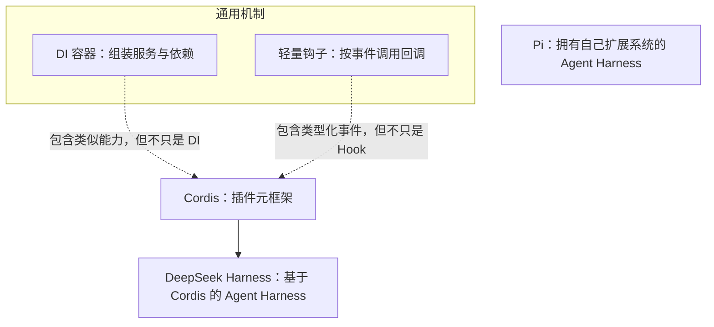
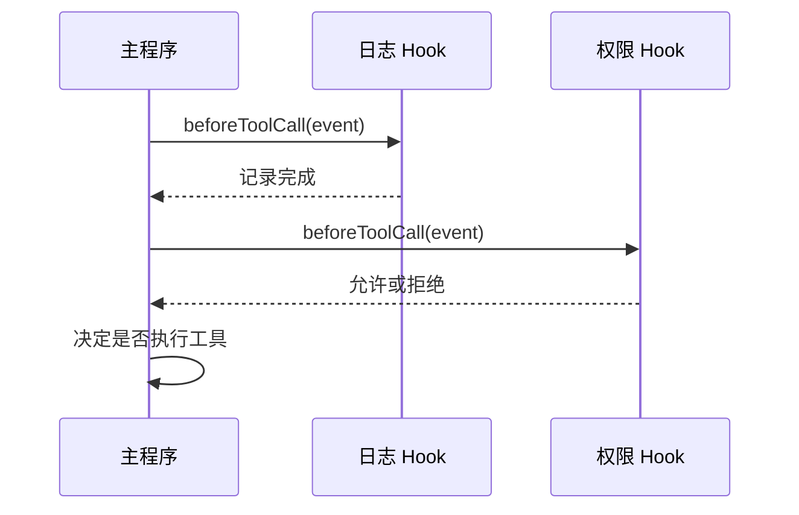

# DI 容器、Pi 与轻量钩子方案

> [!summary] 一句话解释
> **DI 容器负责把服务及其依赖组装起来；轻量钩子让代码在特定事件发生时执行回调；Pi 是一个可扩展的 Agent Harness；Cordis 则把服务依赖、事件、作用域和可逆生命周期统一成一个插件元框架。**

这几个概念经常一起出现在“怎样设计可扩展 Agent 系统”的讨论里，但它们不在同一个层级。

> [!warning] `PI` 的歧义
> Cordis 和 DeepSeek Harness 官方文档没有把全大写 `PI` 定义成一个 Cordis 专有缩写。结合 Agent 与钩子语境，本笔记按 **Pi Agent Harness** 解释。Pi 是名称，不需要展开成一串英文单词。如果你看到的原文明确写了 `PI = ...`，请保留原句；它也可能表示 Plugin Interface（插件接口）、Principal Investigator（首席研究员）等完全不同的概念。

## 先用一张图定位



最重要的分层是：

- **DI 和 Hook**：软件架构机制；
- **Cordis**：组合这些思想并加强生命周期管理的通用元框架；
- **DeepSeek Harness 和 Pi**：面向 AI Agent 的可运行系统。

---

## DI 是什么

**DI** 是 **Dependency Injection（依赖注入）** 的缩写，读作“D-I”，中文是“依赖注入”。

### 什么是依赖

如果“订单服务”必须调用“支付服务”才能工作，那么支付服务就是订单服务的依赖：

```text
订单服务 ──依赖──> 支付服务
```

最直接的写法，是订单服务自己创建一个支付对象：

```ts
class OrderService {
  payment = new WeChatPay()
}
```

问题是订单服务与 `WeChatPay` 绑死了：

- 想换成支付宝，要修改订单服务；
- 测试时难以换成不真正扣钱的假支付服务；
- 支付服务再依赖日志、数据库和配置时，创建逻辑会越来越复杂。

### 什么是“注入”

依赖注入的思路是：**订单服务只声明自己需要支付能力，具体支付实现从外部传进来。**

```ts
class OrderService {
  constructor(private payment: Payment) {}
}
```

外部可以传入：

```text
正式运行 → 注入微信支付
另一套产品 → 注入支付宝
单元测试 → 注入假支付服务
```

订单服务负责“使用支付能力”，不再负责“决定并创建哪个支付实现”。这体现了 **IoC（Inversion of Control，控制反转）**：对象创建和组装的控制权从业务类转移到外部。

## DI 容器是什么

当服务很多时，人工逐层创建对象仍然麻烦。**DI Container（依赖注入容器）**就是集中登记和组装服务的工具。

它通常完成：

1. 注册“接口/名称对应哪个实现”；
2. 分析一个对象需要哪些依赖；
3. 按依赖关系创建对象；
4. 把依赖传入构造函数或属性；
5. 管理服务实例的生命周期；
6. 在适当时间释放数据库连接等资源。

### 生活类比：剧组统筹

导演说：“这个场景需要摄影师、灯光师和录音师。”

导演不必亲自招聘、发工牌和安排所有人的上班时间。剧组统筹根据岗位要求找到合适人员，并安排他们进组。DI 容器就像这个统筹。

### 常见生命周期

不同 DI 框架叫法不完全相同，常见有：

| 生命周期 | 含义 | 类比 |
|---|---|---|
| Transient（瞬时） | 每次请求都创建新实例 | 每次叫车来一辆新车 |
| Scoped（作用域） | 同一个请求/会话内复用，离开作用域后释放 | 一次旅行期间使用同一辆租车 |
| Singleton（单例） | 整个应用通常只保留一个实例 | 整栋楼共用一个总服务台 |

这里的 **Container（容器）不是 Docker 容器**。DI 容器是“保存服务注册并组装对象”的软件结构；Docker 容器是隔离程序运行环境的操作系统级技术。

## DI 容器的边界

典型 DI 容器擅长：

- 解除业务代码与具体实现的硬绑定；
- 组装对象依赖；
- 管理 singleton/scoped/transient 等生命周期；
- 方便测试时替换实现。

但一个普通 DI 容器不一定负责：

- 插件发现和安装；
- 完整事件总线；
- 插件热重载；
- 撤销插件注册过的所有事件和工具；
- 配置差异协调；
- 动态插件树和多层作用域隔离。

因此 Cordis 有 DI-like（类似 DI）的能力，但不应简单等同于传统 DI 容器。

---

## Pi 是什么

**Pi** 是一个开源 **Agent Harness（智能体运行框架/系统）**。官方仓库把它描述为一个包含以下部分的 Agent 工具集：

- 多模型提供方的统一 LLM API；
- 带工具调用和状态管理的 Agent runtime；
- 交互式 coding agent CLI；
- TUI（Terminal User Interface，终端用户界面）；
- TypeScript 扩展系统。

Pi 和 [[DeepSeek Harness、Everything is a Plugin与Cordis|DeepSeek Harness]] 大致位于同一层：它们都是围绕大模型提供 Agent loop、工具、会话和交互界面的 Harness，而不是一个单纯的 DI 容器。

### Pi 怎样扩展

Pi 扩展可以通过 `ExtensionAPI`：

- `pi.on(...)`：监听会话、模型请求、工具调用等事件；
- `pi.registerTool(...)`：注册模型可以调用的新工具；
- 注册命令、快捷键、界面组件和模型提供方；
- 保存扩展状态；
- 覆盖内置工具；
- 在会话关闭时清理资源。

概念示意：

```ts
export default function (pi) {
  pi.on('tool_call', event => {
    // 在工具执行前观察或拦截
  })

  pi.registerTool({
    name: 'my_tool',
    // 工具描述、参数和执行逻辑
  })
}
```

这段只用于理解结构，实际字段要以当前 Pi 官方类型和文档为准。

### Pi 与 Cordis 的区别

| Pi | Cordis |
|---|---|
| 面向 AI Agent 和编程助手的可运行 Harness | 面向通用插件组合的底层元框架 |
| 已经包含 Agent loop、LLM API、工具和 TUI | 不直接提供一个完整编程 Agent 产品 |
| 通过自己的 Extension API 和事件扩展 | 通过 Context、Service、inject、effect、事件和 loader 组织插件 |
| 主要问题是“怎样运行和扩展 Agent” | 主要问题是“动态组件怎样安全组合和撤销” |

截至核对日期，没有官方依据表明 Pi 基于 Cordis；更准确的说法是它们各自拥有扩展机制。

> [!warning] Pi 的权限边界
> Pi 官方目前明确说明：它默认使用启动进程所属用户的文件、进程、网络和凭据权限，并不自带完整权限限制系统。需要更强隔离时，应使用容器或沙箱。可扩展不等于天然安全。

---

## 轻量钩子方案是什么

**Lightweight Hook System（轻量钩子系统）**不是一个唯一产品，而是一种简单的扩展设计：

1. 主程序预先定义一些事件点；
2. 扩展注册 callback（回调函数）；
3. 事件发生时，主程序依次调用这些函数。



概念代码可能只有这样：

```ts
hooks.on('beforeToolCall', checkPermission)
hooks.on('afterToolCall', writeAuditLog)
```

### 为什么叫“轻量”

因为它通常只需要：

- 一张“事件名 → 回调列表”的表；
- 注册和取消注册函数；
- 触发事件的函数；
- 少量错误、顺序和异步处理规则。

不一定需要完整 DI、插件树、配置协调和热重载系统。

### 优点

- 概念少，容易实现；
- 适合少数明确扩展点；
- 运行开销和学习成本通常较低；
- 很适合日志、通知、前后置检查和简单拦截。

### 局限

项目变大后，需要自行处理：

- Hook A 依赖某个服务，但服务尚未启动；
- 两个 Hook 修改同一数据，执行顺序冲突；
- 插件卸载后，旧回调有没有全部取消；
- 一个插件注册了工具、提示词、计时器和监听器，怎样整体回滚；
- 不同 Agent/会话应看到哪些 Hook；
- 配置更新后哪些组件需要重载；
- 回调失败是继续、短路、并行还是回滚。

Hook 本身只解决“事件发生时通知谁”，不会自动解决所有依赖和生命周期问题。

### 它和 Git Hook 一样吗

思想相似：都在预定时间点触发扩展逻辑。但实现层次不同：

- [[Git Hook与自动化检查|Git Hook]] 常是在 Git 进程的特定阶段启动外部脚本；
- 应用内轻量 Hook 常是在同一进程中调用已注册的函数；
- Agent Hook 常围绕 `session_start`、`beforeToolCall`、`tool_result`、`turn_end` 等生命周期事件。

---

## Cordis 与它们到底有什么不同

[[DeepSeek Harness、Everything is a Plugin与Cordis|Cordis]] 同时包含几类能力：

- 像 DI 容器一样，通过稳定服务 key 和 `inject` 表达依赖；
- 像 Hook/Event Bus 一样，通过类型化事件扩展行为；
- 通过 Context 和 realm 控制能力的可见范围；
- 通过 effect/disposer 跟踪并撤销副作用；
- 通过 loader 处理声明式配置、协调和热模块替换；
- 在服务加入或离开时，让依赖它的组件响应变化。

Cordis 论文把问题分成两个方向：

- **Spatial Composability（空间可组合性）**：同一时刻，组件依赖关系怎样正确组合；
- **Temporal Composability（时间可组合性）**：组件随时间加载、卸载和替换时，影响怎样完整撤销。

传统 DI 主要覆盖前者的一部分；轻量 Hook 主要提供事件扩展点；Cordis 试图把依赖响应和可逆副作用放进同一个运行模型。

> [!important] 不要说 Cordis 是“DI + Hook 的简单相加”
> 这个说法适合初步类比，却不够准确。Cordis 的重点还包括作用域化上下文、响应式依赖、可逆 effect、配置协调和动态组件演算。它也不能被视为所有 DI 容器或 Hook 系统的严格“升级版”；不同工具解决的问题和复杂度不同。

## 横向比较

| 比较项 | DI 容器 | 轻量 Hook | Pi | Cordis |
|---|---|---|---|---|
| 类型 | 通用架构工具 | 通用扩展模式 | Agent Harness | 插件元框架 |
| 主要问题 | 服务怎样创建和注入 | 事件发生时执行哪些回调 | 怎样运行和扩展编程 Agent | 动态组件怎样组合、隔离和撤销 |
| 依赖管理 | 核心能力 | 通常较弱或没有 | 由自身扩展结构处理 | `ctx` 服务与 `inject` |
| 事件扩展 | 不一定提供 | 核心能力 | `pi.on(...)` 等 | 类型化事件，多种分发模式 |
| 生命周期 | 常管理服务实例 | 通常靠开发者清理 | 有会话与扩展生命周期事件 | effect/disposer 与插件生命周期 |
| 动态卸载回滚 | 通常有限 | 通常手工处理 | 以 Pi 当前扩展约定为准 | Cordis 的重点能力 |
| 是否直接是 Agent | 否 | 否 | 是 | 否 |

## 什么时候选哪一种

### 只需要三四个固定事件点

优先考虑轻量 Hook。不要为了几个回调引入庞大架构。

### 有很多业务服务需要替换和测试

DI 容器通常足够，例如数据库、支付、缓存和日志服务的装配。

### 想直接使用一个可扩展的编程 Agent

可以研究 Pi 等 Agent Harness。此时你是在选择产品和 Agent 运行时，不只是在选择依赖管理工具。

### 在建设会动态装卸大量能力的插件宿主

当系统真的需要服务依赖、多个作用域、热重载、配置协调和完整清理时，Cordis 这类元框架才更有价值。

技术不是越复杂越先进。最简单且能满足边界、测试、重载和安全要求的方案，通常更合适。

## 初学者记忆法

```text
DI 容器：你需要谁，我替你把它送进来
轻量 Hook：事情发生了，我通知已登记的人
Pi：一套能实际运行的编程 Agent 系统
Cordis：管理插件怎样接入、依赖、通信、隔离和退出
DeepSeek Harness：用 Cordis 组织起来的 Agent Harness
```

## 学习建议

1. 先理解“依赖”和接口；
2. 手写一次构造函数注入，不急着安装 DI 框架；
3. 手写一个只有 `on`、`off`、`emit` 的小型 Hook 系统；
4. 对比“对象依赖”和“事件通知”解决的是不同问题；
5. 再阅读 Pi 的 Extension API；
6. 最后学习 Cordis 的 Context、inject、effect、realm 和 loader。

## 关联概念

- [[MCP模型上下文协议]]：MCP 解决跨程序的标准通信；DI、Hook 和 Cordis 主要解决程序内部依赖、事件与插件生命周期。
- [[DeepSeek Harness、Everything is a Plugin与Cordis]]：Cordis 和 DeepSeek Harness 的完整架构说明。
- [[Cordis运行时机制：Fiber、Effect与Scope]]：继续深入 Fiber 状态、可逆 Effect、服务解析与 Scope 边界。
- [[Agent工具运行时：执行流水线、并发调度与Code Mode]]：轻量 Hook 在完整工具执行流水线中的实际用法。
- [[Git Hook与自动化检查]]：Git 生命周期中的外部脚本钩子。
- [[Prompt Engineering与Loop Engineering]]：Agent Hook 常用于观察或拦截循环中的步骤。
- [[Preset与Agent Trajectory]]：Agent 的运行前装配与运行后轨迹。
- [[Node.js与pnpm]]：Pi、Cordis 和 DeepSeek Harness 都位于 TypeScript/Node.js 生态。

## 参考资料

- [Martin Fowler：Inversion of Control Containers and the Dependency Injection Pattern](https://martinfowler.com/articles/injection.html)
- [Microsoft Learn：Dependency Injection 概念与 Service Container](https://learn.microsoft.com/en-us/dotnet/core/extensions/dependency-injection/overview)
- [Pi 官方仓库](https://github.com/earendil-works/pi)
- [Pi 官方 Extension 文档](https://github.com/earendil-works/pi/blob/main/packages/coding-agent/docs/extensions.md)
- [DeepSeek Harness：Cordis 中文入门](https://github.com/deepseek-ai/deepseek-harness/blob/master/docs/cordis-primer.zh.md)
- [Cordis 论文仓库：A Programming Paradigm for Spatiotemporal Composability](https://github.com/cordiverse/paper)
