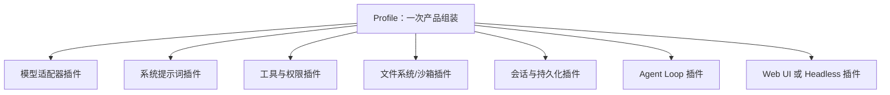
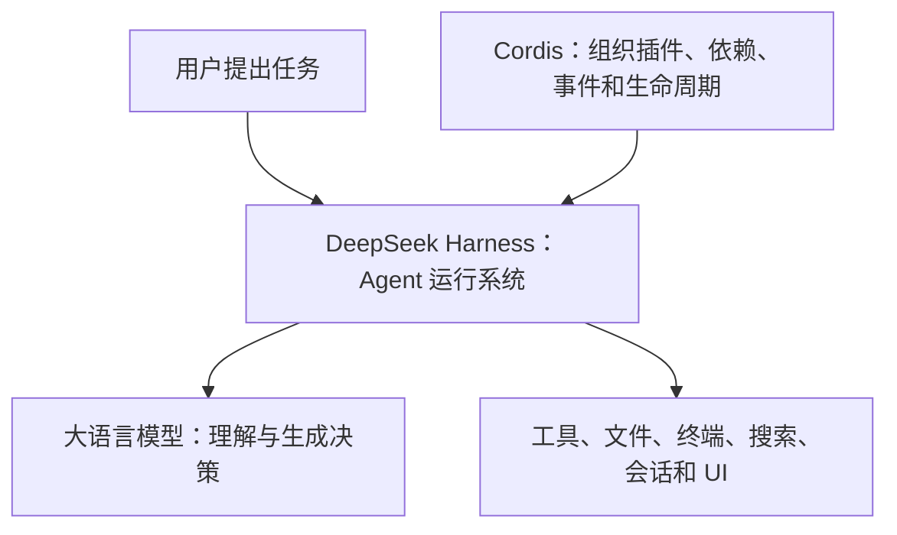

# DeepSeek Harness、Everything is a Plugin 与 Cordis

> [!warning] 很新的项目
> 截至 2026-08-17，DeepSeek Harness 仍是 Developer Preview（开发者预览），官方明确提示会发生破坏兼容性的修改。Cordis API 也尚未稳定；相关论文是 2026-08-13 的活跃修订预印本。本笔记解释当前设计思想，不应当作永久不变的 API 教程。

## 先认识 Harness

大语言模型本身通常只是：

```text
输入消息 → 生成下一段文字或工具调用
```

要让它成为能真正工作的 Agent，还需要模型外部的一整套运行系统：

- 组装 system prompt；
- 维护会话和上下文；
- 注册、描述和执行工具；
- 控制文件、网络和进程权限；
- 提供沙箱；
- 保存状态和日志；
- 驱动“模型 → 工具 → 结果 → 再次模型”的循环；
- 处理取消、错误、审批、UI 和多个 Agent。

这套围绕模型的“外骨骼/马具”通常叫 **Agent Harness**。[[LangChain]] 当前官方文档也使用 Harness 来描述模型循环周围的提示词、工具和中间件。

## DeepSeek Harness 是什么

**DeepSeek Harness（简称 `dsh`）**是 DeepSeek AI 开源的 Agent Harness。它的核心架构主张是：

> Everything is a Plugin —— 一切皆插件。

这里的“一切”包括模型适配器、工具、skills、会话、持久化、文件系统、沙箱、Agent loop、编排和 UI 等。

## 它是产品，还是搭建产品的运行时

两种说法都有一部分正确：

- 它已经提供可以直接运行的 Web 产品入口；
- 也提供 Headless（无 Web 服务器的一次性运行器）Profile；
- 仓库包含 Python SDK、ACP、JSON-RPC 等程序化接入方式；
- 更核心的定位仍是可以重新组合的 Agent Runtime（智能体运行时）。

因此不能只把它理解成“另一个聊天网页”，也不能把所有入口都假定为同等成熟的终端产品。

截至核对日期，官方 README 给出的 Web 启动方式是：

```sh
npx @deepseek-ai/dsh web
```

命令和依赖版本容易变化，真正使用时应重新查看官方 README，而不是永久照抄本笔记。

### Web、Headless、SDK 和协议入口的区别

| 入口 | 主要用途 | 是否需要人类界面 |
|---|---|---|
| Web Profile | 在浏览器中交互、查看会话与轨迹 | 需要 Web UI |
| Headless Profile | 脚本、自动化或一次性运行 | 不需要 Web UI |
| Python SDK | 从 Python 程序创建和驱动会话 | 由调用程序决定 |
| ACP / JSON-RPC | 让编辑器或其他进程通过协议控制 Agent | 由外部客户端决定 |

这里的 **ACP（Agent Client Protocol，智能体客户端协议）**和 JSON-RPC 是接入/控制方式，不等于 Agent 模型本身。

## DeepSeek Harness 是用什么语言写的

> [!summary] 直接答案
> **DeepSeek Harness 的主体使用 TypeScript 编写，主要运行在 Node.js 上，并使用 pnpm 管理 monorepo（多包仓库）的依赖和构建。**仓库中也有 Rust 原生组件和 Python 相关目录，因此整个仓库不是百分之百只有 TypeScript。

### TypeScript 是什么

**[[TypeScript与JavaScript|TypeScript（简称 TS）]]**是“带静态类型系统的 JavaScript 超集”。“超集”表示：JavaScript 的大部分语法也是 TypeScript 的一部分，而 TypeScript 又增加了类型检查等能力。

开发者通常编写 `.ts` 或 `.tsx` 文件，再由 TypeScript 编译器和构建工具检查、转换成 JavaScript，最后交给 Node.js 或浏览器执行。

使用 TypeScript 对大型插件系统很有帮助，因为它可以在开发阶段检查：

- 某个服务有没有这个方法；
- 事件名和事件参数是否匹配；
- 工具输入和返回值是否符合接口；
- 插件依赖的能力是否使用正确类型。

这与 Cordis 强调的“稳定服务接口”和“类型化事件”很契合。

### TypeScript、Node.js 和 pnpm 分别负责什么

| 名称 | 类型 | 在 DeepSeek Harness 中的作用 |
|---|---|---|
| TypeScript | 编程语言/类型系统 | 编写核心包、插件、服务接口和大量应用代码 |
| JavaScript | 实际执行的主要语言 | TypeScript 构建后形成可由运行环境执行的代码 |
| [[Node.js与pnpm|Node.js]] | JavaScript 运行环境 | 运行 dsh 的服务器端、命令行和构建工具 |
| [[Node.js与pnpm|pnpm]] | 包管理器 | 安装依赖、管理多个 workspace 包、运行构建脚本 |

所以“基于 Node.js”和“用 TypeScript 写”并不冲突：

```text
开发者编写 TypeScript
        ↓ 类型检查、编译、打包
生成 JavaScript
        ↓
由 Node.js 执行

pnpm 负责管理这个过程所需的软件包和脚本
```

官方根目录 `package.json` 可以看到几个直接证据：

- 项目声明了 Node.js 版本要求；
- `packageManager` 指向 pnpm；
- 构建命令调用 `tsc`（TypeScript Compiler，TypeScript 编译器）和 `tsdown`；
- 仓库根目录存在多份 `tsconfig`，用于配置 TypeScript；
- 项目使用 ESM（ECMAScript Modules）模块格式。

### 为什么仓库里还会出现 Rust 和 Python

大型工程常按任务选择语言，不需要强迫所有组件使用同一种语言。DeepSeek Harness 仓库当前还包含：

- `native/`：原生辅助组件，例如与 Linux Landlock 沙箱有关的 Rust 工程；
- `python/`：Python 相关的集成或支持代码；
- 文档、YAML、JSON、Shell 脚本等配置和自动化文件。

这不改变“主体是 TypeScript + Node.js”的判断。更准确的说法是：**它是以 TypeScript/Node.js 为核心的多语言工程。**

> [!note] 不要从文件数量判断核心语言
> 仓库可能有大量 Markdown 文档、生成文件或测试数据。判断项目技术栈时，应同时看入口、核心包、构建配置和运行时，而不只是数扩展名。

## “Everything is a Plugin”具体指什么

普通软件常有一个地位特殊、难以替换的核心，其他扩展只能在少数扩展点周围工作。DeepSeek Harness 希望把产品的每一项能力都做成可组合插件，没有一个需要靠修改源码打补丁的“特权内核”。

运行中的 dsh 可以理解为一棵插件树：



“插件”不只是用户后来下载的小扩展；系统自带的基础功能本身也是插件。

### 具体例子

- 模型层可注册 DeepSeek 或其他模型适配器；
- 会话持久化可以使用 JSONL 或 SQLite 提供方；
- 文件系统和进程可以指向本地环境或远程沙箱；
- Web 搜索可以替换为不同服务提供方；
- Headless 运行器可以不带 Web UI；
- Agent loop 本身也是一个具体插件，而不是不可替换的硬编码核心。

## 这并不等于“所有插件想做什么都可以”

插件化要可靠，反而更需要明确边界。否则所有模块直接互相调用、共享任意状态，最终会变成难以拆卸的“大泥球”。

DeepSeek Harness 的当前架构通过 Cordis 上下文、服务 key、依赖声明、类型化事件和 capability seam（能力接缝）来表达边界。

## “明确边界”具体是什么

“明确边界”是通用软件工程原则，不是只有 DeepSeek 才使用的专有名词。它要求说清每个组件：

1. **负责什么**：例如文件系统插件只提供文件能力，不决定业务流程。
2. **不负责什么**：避免功能无限膨胀。
3. **输入和输出**：参数、类型、返回值和错误。
4. **依赖谁**：启动前需要哪些服务。
5. **谁依赖它**：卸载或失败时会影响哪些组件。
6. **拥有哪些状态**：状态的唯一所有者是谁。
7. **生命周期**：何时加载、重载、停止和清理。
8. **权限**：能访问哪些文件、进程、网络和凭据。
9. **持久性**：数据是临时运行状态，还是重启后仍需存在的事实。

边界清楚后，一个实现可以替换，消费者不必跟着全部重写。

## Capability Seam（能力接缝）

官方架构把一项可替换能力拆成三种角色：

- **Service Definition**：声明稳定接口，“这项能力能做什么”。
- **Service Provider**：具体实现，“由谁来做”。
- **Consumer**：使用能力，“谁需要它”。

例如文件系统能力：

```text
定义：读取、写入、列出文件的统一接口
提供方 A：本地文件系统
提供方 B：远程沙箱文件系统
消费者：文件工具、终端、代码分析等
```

消费者依赖接口，而不是直接导入“本地文件系统”的实现。替换提供方后，多项上层能力可以一起迁移到远程沙箱，而无需分别修改。

这和 [[SDK与API|API]] 的思想相通：先约定怎样交流，再允许具体实现变化。

### 文件系统 Seam 的进一步例子

当前官方文件系统接口还把“模型看到的路径”“进程能打开的路径”和“稳定目标身份”分开：

- `FsTarget` 使用不透明 `targetKey` 表示目标身份；
- `displayPath` 用于展示；
- `processPath()` 返回对应执行世界中进程能打开的路径；
- `version` 用于判断文件自上次读取后是否被别人改动。

写入可以携带：

- `createIfAbsent`：只有目标仍不存在才创建；
- `replaceIfVersion`：只有目标仍是已观察版本才替换。

这属于 **Optimistic Concurrency Control（乐观并发控制）**，能降低 Agent 用旧内容覆盖他人新修改的风险。完整过程参见 [[Agent工具运行时：执行流水线、并发调度与Code Mode#Capability Seam 与文件并发控制]]。

## Cordis 是什么

**Cordis** 是 DeepSeek Harness 底层使用的插件元框架，官方称其为：

> A Meta-Framework of Spatiotemporal Composability（时空可组合性的元框架）

“元框架”表示它不是直接替你完成聊天、搜索或写代码，而是提供一套组织其他框架和插件的运行机制。

DeepSeek Harness 官方文档更具体地说：Cordis 是以 **vendor（把依赖源码随项目一起引入）**方式放入 Harness 底层的插件框架。Cordis 自己也是以 TypeScript/Node.js 生态为主的工程，其构建使用 TypeScript 编译器和 esbuild。

Cordis 并不是为了 DeepSeek Harness 才临时发明的名字。它此前已经在 Koishi 等插件生态中实践过运行时插件加载、依赖和重载；DeepSeek Harness 把同一类组件组合思想应用到 Agent 的模型、工具、会话、循环和 UI。

这段历史能说明架构来源，但不能证明“聊天机器人插件经验可以原样解决所有 Agent 安全问题”。Agent 会操作文件、终端、凭据和外部服务，因此权限、审批、沙箱和审计仍需单独设计。

如果想把 Cordis 与传统依赖注入、应用内 Hook 和另一个 Agent Harness Pi 横向比较，参见 [[DI容器、Pi与轻量钩子方案]]。

## Cordis 到底解决什么问题

假设没有统一的插件框架，模型插件、工具插件、会话插件和 UI 可能直接互相引用：

```text
工具直接依赖某个模型实现
UI 直接读取某个会话类的内部变量
插件加载时到处注册监听器
插件删除后旧监听器仍然存在
```

项目小时可能还能工作；项目变大后，换一个实现就可能牵动很多文件，插件重载还容易留下“幽灵状态”。

Cordis 主要把下面几件事变成统一规则：

1. **能力在哪里**：服务挂到稳定的 `ctx.<key>` 上；
2. **插件依赖什么**：使用 `inject` 声明依赖；
3. **什么时候启动**：依赖准备好后再激活插件；
4. **插件怎样通信**：通过类型化事件或服务接口；
5. **卸载时怎样清理**：注册产生的副作用必须能够撤销；
6. **能力在哪个范围生效**：通过上下文和 realm 控制作用域与隔离。

### 生活类比：商场物业系统

把 DeepSeek Harness 想成一座商场：

- 模型、搜索、文件系统、终端和 UI 是不同店铺；
- Cordis 像商场的物业和基础设施规则；
- `ctx.<key>` 像统一的水、电、网络接口；
- `inject` 像店铺开业前申报“我需要电和网络”；
- 事件系统像商场广播；
- 可逆副作用像店铺退租时必须拆掉招牌、注销门禁并归还场地。

Cordis 不替店铺卖商品，但保证店铺可以按规则接入、协作、替换和退出。

## 模型、Harness 与 Cordis 的分层关系



可以用一个不完全精确、但方便记忆的类比：

| 层级 | 类比 | 主要职责 |
|---|---|---|
| 大语言模型 | 大脑 | 理解信息，生成文字或工具调用决定 |
| DeepSeek Harness | 机器人的身体与工作系统 | 提供工具、记忆、权限、循环、沙箱和界面 |
| Cordis | 组织身体部件的装配与生命周期机制 | 管理插件怎样接入、依赖、通信、替换和清理 |

因此：

- Cordis **不是** DeepSeek 大模型；
- Cordis **不负责**直接回答用户问题；
- Cordis **不是**数据库或单个工具；
- DeepSeek Harness 使用 Cordis，但 Harness 还包含大量 Agent 领域的具体插件和产品功能；
- Cordis 是通用元框架，不只在概念上服务于某一个模型。

### “基于 Cordis”准确是什么意思

这里的“基于”不是说 Cordis 完成了整个 DeepSeek Harness，而是说 Harness 的核心组装方式遵循 Cordis 的运行模型：

```text
Cordis 提供插件容器、服务、依赖、事件和清理机制
                         ↓
DeepSeek Harness 把模型、工具、会话、Agent loop、UI 等做成插件
                         ↓
不同 profile/preset 再把这些插件组合成可运行产品
```

类似于：Web 应用可以“基于某个 Web 框架”开发，但登录、订单和商品业务仍由应用自己实现。

## Cordis 的五个核心概念

根据官方入门文档，可先掌握：

### 1. Plugin（插件）

插件是实现某项 Service 的对象，由 Cordis 管理其挂载和生命周期。

### 2. Context（上下文）

Context 是服务容器。服务占据稳定的 key，例如：

- `ctx.tools`
- `ctx.llm`
- `ctx.sessions`

其他插件通过 key 寻找能力，而不是直接绑定具体实现。

### 3. Inject（依赖声明）

插件声明自己需要什么服务。Cordis 等依赖可用后再启动它，不必靠开发者手工猜加载顺序。

### 4. Typed Events（类型化事件）

插件通过有类型约定的事件通信。不同事件可以采用观察、瀑布式包装、并行或串行执行等模式。

### 5. Revertible Effects（可逆副作用）

插件注册工具、监听器、提示词片段或适配器时，同时提供对应的清理方式。插件卸载或重载时，运行时可以撤销这些注册。

## 什么是“时空可组合性”

这里的“时空”不是物理学概念，而是描述动态软件组合的两个方向。

### Spatial Composability（空间可组合性）

关注**同一时刻，不同组件如何并存和依赖**。

- 插件声明自己需要哪些上下文能力；
- 新能力出现时，依赖者可以被激活或更新；
- 具体实现可以替换，消费者仍面向稳定接口。

可以理解为：乐高积木的接口统一，不同积木能在同一个作品里组合。

### Temporal Composability（时间可组合性）

关注**组件随时间加入、移除、重载或失败时，系统能否正确恢复**。

- 插件加载时产生的副作用可追踪；
- 卸载时把自己的注册和影响撤销；
- 系统不必因为一个插件变化而全部重启并丢失所有状态。

可以理解为：不仅能装上积木，还能知道怎样干净地拆下它，不把周围结构留在半坏状态。

## 一个简化插件生命周期例子

假设“天气工具插件”加载时做三件事：

1. 在 `ctx.tools` 注册 `get_weather`；
2. 把工具 schema 加入模型能看到的提示词；
3. 监听工具执行事件，记录调用。

理想的可逆效果是：插件卸载时三项注册全部撤销。否则可能出现：

- UI 说工具已移除，但模型仍能看到旧 schema；
- 工具不存在了，旧监听器仍在运行；
- 重载一次就重复注册一次；
- 其他插件以为服务仍然可用。

Cordis 的目标之一，就是让这类生命周期关系成为框架管理的正式机制。

## “可逆副作用”也有边界

Effect 可以追踪注册项及其 disposer，却不能让现实世界中所有操作自动倒放。

容易撤销的例子：

- 从 Cordis 管理的表中注销工具；
- 移除事件监听器；
- 清除定时器；
- 关闭框架拥有的连接。

通常不能简单撤销的例子：

- 已经发出的邮件或网络消息；
- 已经发生的支付；
- 其他进程同时修改的外部文件；
- 插件绕过 `ctx` 直接修改的未知全局状态。

处理不可逆输出通常要使用：

- **Withholding（延迟发出）**：内部状态确认后才真正发送；
- **Compensation（补偿操作）**：例如退款、冲正或发送更正消息。

框架可以保证按约定调用 disposer，却不能自动证明插件作者写的 inverse（逆操作）一定正确。Fiber 状态、Effect 反向清理、Scope 与安全边界详见 [[Cordis运行时机制：Fiber、Effect与Scope]]。

## 为什么这种设计值得关注

- **可替换**：模型、工具、存储和沙箱都能换实现。
- **可组合**：不同插件按 profile/bundle 组装成不同产品形态。
- **可测试**：可以提供回放或假实现来隔离测试。
- **可重载**：注册有清理机制，降低热更新留下脏状态的风险。
- **适合长时任务**：持续运行的 Agent 更需要处理组件加入、失败和恢复。
- **更容易研究 Harness**：循环、权限、记忆等不再藏在不可替换的核心里。

## 代价和风险

- 抽象层和概念很多，初学成本高；
- 动态插件树比单体程序更难追踪；
- 接口设计错误会影响大量插件；
- “什么都是插件”可能造成过度拆分；
- 可组合不等于天然安全，权限和数据边界仍需单独设计；
- 当前项目和论文都很新，API 和术语可能快速变化。

### 上线前还要考虑的治理问题

真正部署插件化 Agent 时，还应回答：

- 插件来自哪里，是否固定版本、审查源码或验证签名；
- Profile、Bundle、Patch 和用户设置叠加后，最终配置是什么；
- 凭据由谁持有，哪些插件能够读取；
- 会话日志保存多久，谁可以导出和删除；
- 遥测上传前是否脱敏；
- Windows、Linux 和 macOS 上的沙箱能力是否一致；
- 插件失败、热重载失败或外部服务中断时怎样恢复；
- Agent 自己的测试之外，是否还有浏览器、真实接口或人工独立验收。

Profile 的各层会依次叠加 Bundle、Profile Patch、Home Patch 和命令行 `--patch`。排查问题时应查看真正生效的配置树；当前官方提供了 `--dump-config`，但具体命令格式仍应以当前版本为准。

## 它和 Loop Engineering 的关系

[[Prompt Engineering与Loop Engineering|Loop Engineering]] 关注持续任务如何触发、验证、重试和停止。DeepSeek Harness 提供可以构成这类循环的运行部件，而 Cordis 让部件能够动态组合和撤销。

如果把运行前、运行中和运行后连起来看：agent preset 负责预先装配模型、工具与权限，Agent loop 负责逐步推进，trajectory 则用于描述和复盘实际发生的消息、工具调用、结果与状态变化。详见 [[Preset与Agent Trajectory]]。

工具调用并不是 Loop 直接执行一个函数，中间还有审批、Guard、并发调度、结果处理和持久记录；详见 [[Agent工具运行时：执行流水线、并发调度与Code Mode]]。评估循环时也不能只看最终答案，详见 [[Agent评测：上下文成本、轨迹与独立验收]]。

可以粗略理解为：

```text
模型：负责生成和决策
Harness：给模型工具、状态、权限和执行循环
Cordis：组织 Harness 内部插件及其依赖和生命周期
Loop Engineering：设计 Harness 怎样长期推进、验证和停止任务
```

## 初学者现在需要会用吗

不需要立刻安装或阅读源码。建议先依次理解：

1. [[SDK与API]]；
2. 模块、接口和依赖；
3. 事件与监听器；
4. Plugin、Middleware、Dependency Injection；
5. 大模型工具调用和 Agent loop；
6. [[Prompt Engineering与Loop Engineering|Harness 与 Loop Engineering]]；
7. 最后再学习 [[Cordis运行时机制：Fiber、Effect与Scope|Cordis 的 Fiber、Effect、Scope、Realm 和动态插件树]]。

目前先记住一句话即可：**DeepSeek Harness 把 Agent 周围的所有能力都视为可组合插件；Cordis 负责让这些插件按明确接口、依赖和可逆生命周期协同工作。**

## 参考资料

- [DeepSeek Harness 官方 GitHub 仓库](https://github.com/deepseek-ai/deepseek-harness)
- [DeepSeek Harness 根目录 package.json](https://github.com/deepseek-ai/deepseek-harness/blob/master/package.json)
- [DeepSeek Harness 中文架构文档](https://github.com/deepseek-ai/deepseek-harness/blob/master/docs/architecture.zh.md)
- [DeepSeek Harness：Cordis 中文入门](https://github.com/deepseek-ai/deepseek-harness/blob/master/docs/cordis-primer.zh.md)
- [DeepSeek Harness：能力 Seams 与核心服务](https://github.com/deepseek-ai/deepseek-harness/blob/master/docs/capability-seams.zh.md)
- [DeepSeek Harness：工具执行流水线](https://github.com/deepseek-ai/deepseek-harness/blob/master/docs/tool-execution-pipeline.zh.md)
- [DeepSeek Harness：Agent Presets](https://github.com/deepseek-ai/deepseek-harness/blob/master/packages/preset/agent-presets/README.zh.md)
- [DeepSeek Harness：文件系统 Seam](https://github.com/deepseek-ai/deepseek-harness/blob/master/packages/fs/fs/README.zh.md)
- [Cordis 官方仓库](https://github.com/cordiverse/cordis)
- [Cordis 根目录 package.json](https://github.com/cordiverse/cordis/blob/main/package.json)
- [Cordis 论文：A Programming Paradigm for Spatiotemporal Composability](https://github.com/cordiverse/paper)
