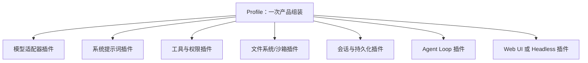

# DeepSeek Harness、Everything is a Plugin 与 Cordis

> [!warning] 很新的项目
> 截至 2026-08-16，DeepSeek Harness 仍是 Developer Preview（开发者预览），官方明确提示会发生破坏兼容性的修改。Cordis API 也尚未稳定；相关论文是 2026-08-13 的活跃修订预印本。本笔记解释当前设计思想，不应当作永久不变的 API 教程。

## 先认识 Harness

大语言模型本身通常只是：

```text
输入消息 → 生成下一段文字或工具调用
```

要让它成为能真正工作的 Agent，还需要模型外部的一整套运行系统：

- 组装 system prompt；
- 维护会话和上下文；
- 注册、描述和执行工具；
- 控制文件、网络和进程权限；
- 提供沙箱；
- 保存状态和日志；
- 驱动“模型 → 工具 → 结果 → 再次模型”的循环；
- 处理取消、错误、审批、UI 和多个 Agent。

这套围绕模型的“外骨骼/马具”通常叫 **Agent Harness**。[[LangChain]] 当前官方文档也使用 Harness 来描述模型循环周围的提示词、工具和中间件。

## DeepSeek Harness 是什么

**DeepSeek Harness（简称 `dsh`）**是 DeepSeek AI 开源的 Agent Harness。它的核心架构主张是：

> Everything is a Plugin —— 一切皆插件。

这里的“一切”包括模型适配器、工具、skills、会话、持久化、文件系统、沙箱、Agent loop、编排和 UI 等。

## “Everything is a Plugin”具体指什么

普通软件常有一个地位特殊、难以替换的核心，其他扩展只能在少数扩展点周围工作。DeepSeek Harness 希望把产品的每一项能力都做成可组合插件，没有一个需要靠修改源码打补丁的“特权内核”。

运行中的 dsh 可以理解为一棵插件树：



“插件”不只是用户后来下载的小扩展；系统自带的基础功能本身也是插件。

### 具体例子

- 模型层可注册 DeepSeek 或其他模型适配器；
- 会话持久化可以使用 JSONL 或 SQLite 提供方；
- 文件系统和进程可以指向本地环境或远程沙箱；
- Web 搜索可以替换为不同服务提供方；
- Headless 运行器可以不带 Web UI；
- Agent loop 本身也是一个具体插件，而不是不可替换的硬编码核心。

## 这并不等于“所有插件想做什么都可以”

插件化要可靠，反而更需要明确边界。否则所有模块直接互相调用、共享任意状态，最终会变成难以拆卸的“大泥球”。

DeepSeek Harness 的当前架构通过 Cordis 上下文、服务 key、依赖声明、类型化事件和 capability seam（能力接缝）来表达边界。

## “明确边界”具体是什么

“明确边界”是通用软件工程原则，不是只有 DeepSeek 才使用的专有名词。它要求说清每个组件：

1. **负责什么**：例如文件系统插件只提供文件能力，不决定业务流程。
2. **不负责什么**：避免功能无限膨胀。
3. **输入和输出**：参数、类型、返回值和错误。
4. **依赖谁**：启动前需要哪些服务。
5. **谁依赖它**：卸载或失败时会影响哪些组件。
6. **拥有哪些状态**：状态的唯一所有者是谁。
7. **生命周期**：何时加载、重载、停止和清理。
8. **权限**：能访问哪些文件、进程、网络和凭据。
9. **持久性**：数据是临时运行状态，还是重启后仍需存在的事实。

边界清楚后，一个实现可以替换，消费者不必跟着全部重写。

## Capability Seam（能力接缝）

官方架构把一项可替换能力拆成三种角色：

- **Service Definition**：声明稳定接口，“这项能力能做什么”。
- **Service Provider**：具体实现，“由谁来做”。
- **Consumer**：使用能力，“谁需要它”。

例如文件系统能力：

```text
定义：读取、写入、列出文件的统一接口
提供方 A：本地文件系统
提供方 B：远程沙箱文件系统
消费者：文件工具、终端、代码分析等
```

消费者依赖接口，而不是直接导入“本地文件系统”的实现。替换提供方后，多项上层能力可以一起迁移到远程沙箱，而无需分别修改。

这和 [[SDK与API|API]] 的思想相通：先约定怎样交流，再允许具体实现变化。

## Cordis 是什么

**Cordis** 是 DeepSeek Harness 底层使用的插件元框架，官方称其为：

> A Meta-Framework of Spatiotemporal Composability（时空可组合性的元框架）

“元框架”表示它不是直接替你完成聊天、搜索或写代码，而是提供一套组织其他框架和插件的运行机制。

## Cordis 的五个核心概念

根据官方入门文档，可先掌握：

### 1. Plugin（插件）

插件是实现某项 Service 的对象，由 Cordis 管理其挂载和生命周期。

### 2. Context（上下文）

Context 是服务容器。服务占据稳定的 key，例如：

- `ctx.tools`
- `ctx.llm`
- `ctx.sessions`

其他插件通过 key 寻找能力，而不是直接绑定具体实现。

### 3. Inject（依赖声明）

插件声明自己需要什么服务。Cordis 等依赖可用后再启动它，不必靠开发者手工猜加载顺序。

### 4. Typed Events（类型化事件）

插件通过有类型约定的事件通信。不同事件可以采用观察、瀑布式包装、并行或串行执行等模式。

### 5. Revertible Effects（可逆副作用）

插件注册工具、监听器、提示词片段或适配器时，同时提供对应的清理方式。插件卸载或重载时，运行时可以撤销这些注册。

## 什么是“时空可组合性”

这里的“时空”不是物理学概念，而是描述动态软件组合的两个方向。

### Spatial Composability（空间可组合性）

关注**同一时刻，不同组件如何并存和依赖**。

- 插件声明自己需要哪些上下文能力；
- 新能力出现时，依赖者可以被激活或更新；
- 具体实现可以替换，消费者仍面向稳定接口。

可以理解为：乐高积木的接口统一，不同积木能在同一个作品里组合。

### Temporal Composability（时间可组合性）

关注**组件随时间加入、移除、重载或失败时，系统能否正确恢复**。

- 插件加载时产生的副作用可追踪；
- 卸载时把自己的注册和影响撤销；
- 系统不必因为一个插件变化而全部重启并丢失所有状态。

可以理解为：不仅能装上积木，还能知道怎样干净地拆下它，不把周围结构留在半坏状态。

## 一个简化插件生命周期例子

假设“天气工具插件”加载时做三件事：

1. 在 `ctx.tools` 注册 `get_weather`；
2. 把工具 schema 加入模型能看到的提示词；
3. 监听工具执行事件，记录调用。

理想的可逆效果是：插件卸载时三项注册全部撤销。否则可能出现：

- UI 说工具已移除，但模型仍能看到旧 schema；
- 工具不存在了，旧监听器仍在运行；
- 重载一次就重复注册一次；
- 其他插件以为服务仍然可用。

Cordis 的目标之一，就是让这类生命周期关系成为框架管理的正式机制。

## 为什么这种设计值得关注

- **可替换**：模型、工具、存储和沙箱都能换实现。
- **可组合**：不同插件按 profile/bundle 组装成不同产品形态。
- **可测试**：可以提供回放或假实现来隔离测试。
- **可重载**：注册有清理机制，降低热更新留下脏状态的风险。
- **适合长时任务**：持续运行的 Agent 更需要处理组件加入、失败和恢复。
- **更容易研究 Harness**：循环、权限、记忆等不再藏在不可替换的核心里。

## 代价和风险

- 抽象层和概念很多，初学成本高；
- 动态插件树比单体程序更难追踪；
- 接口设计错误会影响大量插件；
- “什么都是插件”可能造成过度拆分；
- 可组合不等于天然安全，权限和数据边界仍需单独设计；
- 当前项目和论文都很新，API 和术语可能快速变化。

## 它和 Loop Engineering 的关系

[[Prompt Engineering与Loop Engineering|Loop Engineering]] 关注持续任务如何触发、验证、重试和停止。DeepSeek Harness 提供可以构成这类循环的运行部件，而 Cordis 让部件能够动态组合和撤销。

可以粗略理解为：

```text
模型：负责生成和决策
Harness：给模型工具、状态、权限和执行循环
Cordis：组织 Harness 内部插件及其依赖和生命周期
Loop Engineering：设计 Harness 怎样长期推进、验证和停止任务
```

## 初学者现在需要会用吗

不需要立刻安装或阅读源码。建议先依次理解：

1. [[SDK与API]]；
2. 模块、接口和依赖；
3. 事件与监听器；
4. Plugin、Middleware、Dependency Injection；
5. 大模型工具调用和 Agent loop；
6. [[Prompt Engineering与Loop Engineering|Harness 与 Loop Engineering]]；
7. 最后再学习 Cordis 的 effect、coeffect、realm 和动态插件树。

目前先记住一句话即可：**DeepSeek Harness 把 Agent 周围的所有能力都视为可组合插件；Cordis 负责让这些插件按明确接口、依赖和可逆生命周期协同工作。**

## 参考资料

- [DeepSeek Harness 官方 GitHub 仓库](https://github.com/deepseek-ai/deepseek-harness)
- [DeepSeek Harness 中文架构文档](https://github.com/deepseek-ai/deepseek-harness/blob/master/docs/architecture.zh.md)
- [DeepSeek Harness：Cordis 中文入门](https://github.com/deepseek-ai/deepseek-harness/blob/master/docs/cordis-primer.zh.md)
- [DeepSeek Harness：能力 Seams 与核心服务](https://github.com/deepseek-ai/deepseek-harness/blob/master/docs/capability-seams.zh.md)
- [Cordis 官方仓库](https://github.com/cordiverse/cordis)
- [Cordis 论文：A Programming Paradigm for Spatiotemporal Composability](https://github.com/cordiverse/paper)
