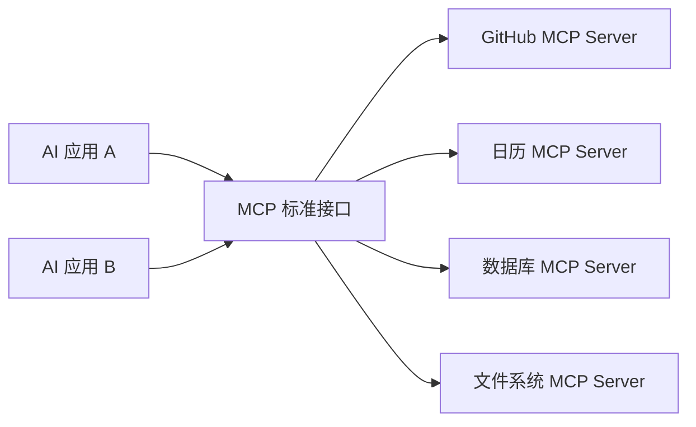
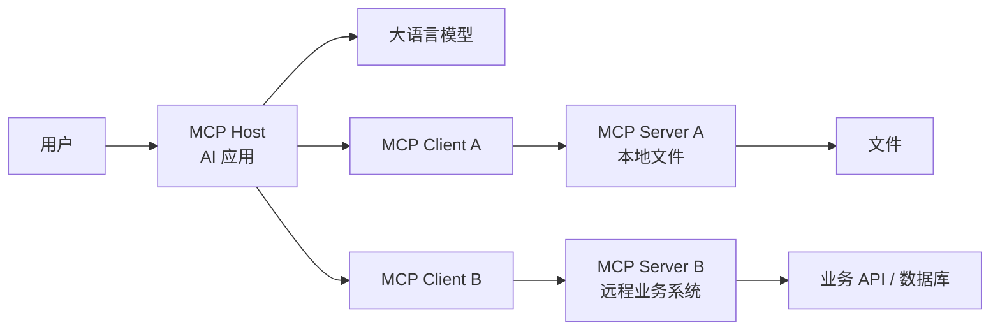
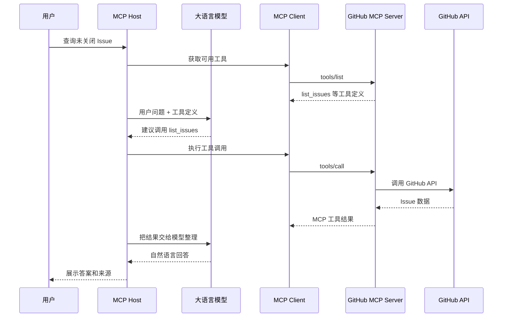

# MCP 模型上下文协议

> [!summary] 一句话解释
> **MCP（Model Context Protocol，模型上下文协议）是一套开放协议，用统一规则让 AI 应用连接外部资料、工具和工作流；它像 AI 应用的“通用连接标准”，但不等于模型、Agent 框架、API、插件或 RAG。**

> [!warning] 版本提示
> 本文于 **2026-08-17** 按当时最新的 **MCP 2026-07-28** 规范核对。MCP 仍在快速发展，很多 2024—2025 年教程描述的是旧版握手、会话和能力模型，阅读时必须先看协议版本。

## MCP 全称、读法和来历

**MCP** 是 **Model Context Protocol** 的缩写：

- **Model**：模型，这里主要指 Large Language Model（LLM，大语言模型）；
- **Context**：上下文，模型完成任务时可使用的资料、工具描述和相关信息；
- **Protocol**：协议，多个程序共同遵守的通信规则。

常见读法是逐字母读 **M-C-P**。中文一般译为“模型上下文协议”。

MCP 最初由 Anthropic 在 2024 年 11 月公开发布，目标是减少 AI 应用连接不同数据源和工具时的重复集成。2025 年 12 月，Anthropic 将 MCP 捐赠给 Linux Foundation（Linux 基金会）旗下的 Agentic AI Foundation（AAIF，智能体 AI 基金会），因此它不是只供 Claude 使用的私有协议。

## 先理解：什么是协议

**协议不是一个具体软件，而是一组通信约定。**

例如 [[TCP、HTTP、HTTPS与WebSocket|HTTP]] 规定浏览器和服务器怎样表达请求与响应，但 HTTP 本身不是某一个网站。类似地：

- MCP 规定 AI 应用和外部能力提供程序怎样互相描述、发现和调用能力；
- MCP Host、Client、Server 是实现并参与协议的软件组件；
- MCP SDK 是帮助开发者实现这些组件的代码工具包。

可以类比交通规则：

```text
交通规则：规定红灯停、绿灯行
汽车与道路：真正参与交通的实体

MCP 协议：规定消息、能力和调用规则
Host / Client / Server：真正交换消息的软件
```

## 为什么会需要 MCP

没有通用协议时，一个 AI 应用想连接多个系统，往往要分别定制：

```text
AI 应用 → GitHub 专用集成
AI 应用 → 日历专用集成
AI 应用 → 数据库专用集成
AI 应用 → 本地文件专用集成
```

另一个 AI 应用也想使用这些系统时，可能又要重新开发一遍。

MCP 尝试把 AI 应用一侧和能力提供方一侧用共同规则分开：



它的价值不是“所有工具都变得一样”，而是让不同工具用相同的发现、描述和调用框架接入支持 MCP 的 AI 应用。

官方文档使用 USB-C 类比：USB-C 统一了设备连接形式，MCP 则试图统一 AI 应用连接外部系统的方式。这个类比只是在说明“通用接口”，MCP 实际上仍是软件通信协议，不是硬件接口。

---

## MCP 的三个核心参与者

最新版架构主要有 **Host、Client、Server** 三类参与者。



### 1. MCP Host：宿主应用

**Host（宿主）**是用户实际使用的 AI 应用，例如支持 MCP 的聊天应用、编程工具或 Agent 系统。

它通常负责：

- 与用户交互；
- 调用大语言模型；
- 创建和管理 MCP Client；
- 决定哪些外部内容进入模型上下文；
- 展示工具调用和结果；
- 执行权限、授权、确认和安全策略；
- 隔离不同 MCP Server。

### 2. MCP Client：宿主中的连接组件

**Client（客户端）**不是这里的“最终用户”，而是 Host 内部负责和某一个 MCP Server 通信的协议组件。

按照官方架构，一个 Host 可以连接多个 Server，并通常为每个 Server 创建对应的 Client。

Client 负责：

- 按 MCP 格式发送请求；
- 查询 Server 支持的版本和能力；
- 获取 Resources、Prompts 和 Tools 列表；
- 调用工具、读取资源并接收返回结果；
- 处理错误、取消、进度和通知等协议行为。

### 3. MCP Server：能力提供程序

**Server（服务器）**是向 MCP Client 提供资料或操作能力的程序。

它可以：

- 读取某个目录中的文件；
- 查询数据库；
- 包装 GitHub、日历或企业系统的 [[SDK与API|API]]；
- 暴露计算器、搜索、创建工单等工具；
- 提供预先编写的提示模板。

> [!important] MCP Server 不一定是远程服务器
> 它可以是网络上的远程服务，也可以是 Host 在用户电脑上启动的本地子进程。“Server”表示它在协议中提供能力，不等于它必须运行在另一台机器上。

---

## MCP Server 主要提供什么

截至 MCP 2026-07-28，最重要的三类 Server Feature（服务器能力）是：

| 能力 | 中文理解 | 典型例子 | 常见控制者 |
|---|---|---|---|
| Resources | 资源、上下文资料 | 文件、数据库结构、项目文档 | 应用主导 |
| Prompts | 提示模板 | 代码审查模板、总结模板 | 用户主导 |
| Tools | 可执行工具 | 搜索、查询数据库、创建 Issue | 模型可选择，Host 负责执行与授权 |

“常见控制者”描述的是设计意图，不代表界面必须长成某种固定样子；协议允许不同 Host 设计不同交互方式。

### Resources：给模型看的资料

**Resource（资源）**是 Server 向 Client 暴露的上下文数据，例如：

- `file:///project/README.md`；
- 数据库 Schema（结构定义）；
- 产品说明；
- 应用状态；
- 某个知识库文档。

资源通常有 URI（Uniform Resource Identifier，统一资源标识符）用于标识。Host 决定如何让用户选择、搜索或自动加入这些资源。

简单记忆：

```text
Resource = 可以读取并放进上下文的资料
```

### Prompts：可复用的提示模板

**Prompt（提示）**是 Server 提供的结构化消息或指令模板，例如：

```text
/code-review
参数：待审查代码
结果：一组适合交给模型的代码审查指令和消息
```

它通常面向用户显式选择，比如菜单项或斜杠命令。模板内容由 Server 定义，Host 负责呈现和使用。

简单记忆：

```text
Prompt = 可以选择并填入参数的任务说明模板
```

### Tools：可以产生操作结果的能力

**Tool（工具）**是模型能够发现并建议调用的函数，例如：

- `search_documents(query)`；
- `get_weather(city)`；
- `list_issues(repo)`；
- `create_issue(repo, title, body)`；
- `execute_sql(query)`。

每个工具通常包括：

- 名称；
- 功能描述；
- 输入参数的 JSON Schema（JSON 结构规则）；
- 可选的输出 Schema；
- 调用结果或错误。

模型可以根据描述和当前任务选择工具，但真正发送请求的是 Host/MCP Client。对于发消息、删文件、花钱、修改数据库等有副作用的操作，Host 应让用户看见并确认。

简单记忆：

```text
Resource = 读什么
Prompt   = 怎样提问或执行某类任务
Tool     = 做什么
```

---

## 一次 MCP 工具调用怎样发生

假设用户对一个编程 Agent 说：

> 帮我看看这个 GitHub 仓库有哪些未关闭的 Issue。

一个简化流程是：



其中需要分清：

- 模型负责根据上下文提出“想调用哪个工具、传什么参数”；
- Host 决定是否允许并真正发起调用；
- MCP Server 实现具体能力，可能继续调用原有 API；
- 外部系统返回真实数据；
- 模型再负责理解和组织结果。

MCP 不会让模型凭空获得权限，也不会替代 GitHub 等服务原本的身份认证。

---

## MCP 消息是怎样传输的

### 数据格式：JSON-RPC 2.0

MCP 使用 **JSON-RPC 2.0** 表达请求、响应和通知。

- **JSON（JavaScript Object Notation）**：常见的结构化文本格式；
- **RPC（Remote Procedure Call，远程过程调用）**：让一个程序像调用函数一样请求另一个程序执行操作。

简化后的工具调用消息可以这样理解：

```json
{
  "jsonrpc": "2.0",
  "id": 1,
  "method": "tools/call",
  "params": {
    "name": "get_weather",
    "arguments": {
      "city": "Shanghai"
    }
  }
}
```

这只是帮助理解的简化示例。2026-07-28 规范还要求请求携带协议版本、Client 能力等 `_meta` 信息，开发时应使用当前 SDK 和规范，不能直接照抄这个省略版投入生产。

### Transport：通信通道

**Transport（传输方式）**解决的是“这些 MCP 消息通过什么通道送过去”。标准方式主要有：

#### stdio：本地进程通信

**stdio（Standard Input/Output，标准输入/输出）**适合本地 MCP Server：

```text
Host 启动一个本地 Server 子进程
Client 写入 Server 的标准输入
Server 从标准输出返回 MCP 消息
```

优点是本地直接通信，不必公开网络端口。风险是这个 Server 本质上仍是在本机执行的程序，可能继承 Host 的文件和系统权限。

#### Streamable HTTP：远程通信

**Streamable HTTP（可流式 HTTP）**适合远程 MCP Server：

- Client 使用 HTTP POST 发送请求；
- Server 返回 JSON，或者使用请求范围内的 SSE 流式返回；
- 可以结合标准 Web 授权方式；
- 适合部署在网络服务和云平台中。

这里的 **SSE** 是 **Server-Sent Events（服务器发送事件）**，用于服务器向客户端持续推送事件数据，不要和 [[TCP、HTTP、HTTPS与WebSocket|WebSocket]] 完全等同。

```text
JSON-RPC：消息“说什么”
Transport：消息“怎样送过去”
```

---

## 2026-07-28 版本为什么值得特别说明

MCP 的协议版本会影响连接和消息行为。

截至本文核对日期，最新正式规范是 **2026-07-28**。这一版的核心协议采用无状态、自包含请求：

- 请求携带当前协议版本和相关 Client 信息；
- Client 可通过 `server/discover` 发现 Server 的版本、身份和能力；
- 不再依赖旧版 `initialize/initialized` 握手和 `Mcp-Session-Id` 协议会话；
- 应用仍可以保存业务状态，但要通过明确的 ID/handle（句柄）传递，而不是依赖隐藏的连接会话；
- Tasks、MCP Apps 等作为可选扩展演进；
- Roots、Sampling 和 Logging 已被标记为弃用，新实现不宜继续依赖。

> [!warning] 旧教程不一定“完全错误”
> 它可能只是对应 2025 年的协议版本。成熟 SDK 可能提供新旧版本协商和兼容路径，但不要把两个版本的握手、消息字段和传输示例混在一起。

---

## MCP、API、SDK 分别是什么

| 概念 | 核心问题 | 示例 |
|---|---|---|
| API | 某个软件允许外界怎样调用自己？ | GitHub API、天气 API |
| MCP | AI 应用怎样用统一协议发现和调用外部资料与工具？ | `tools/list`、`tools/call`、`resources/read` |
| SDK | 开发者怎样更方便地实现或调用某套能力？ | TypeScript MCP SDK、Python MCP SDK |

MCP Server 经常是现有 API 的“AI 适配层”：

```text
AI Host
  ↓ MCP
GitHub MCP Server
  ↓ GitHub API
GitHub 服务
```

因此 MCP 没有消灭 API。它在 API 之上增加适合 AI 应用发现和调用能力的标准层。

MCP 也不是一种编程语言。它与语言无关，可以用 TypeScript、Python、Go、C# 等语言实现；MCP SDK 才是对应语言中的开发工具包。

---

## MCP 与 Function Calling / Tool Calling

**Function Calling（函数调用）**或 **Tool Calling（工具调用）**通常是模型 API 的能力：开发者把工具 Schema 提供给模型，模型输出想调用的工具和参数。

MCP 解决的是更外层的集成问题：

- 去哪里发现工具；
- 工具怎样描述；
- 怎样向 Server 发起调用；
- 怎样读取资源和提示模板；
- Client 与 Server 怎样传输结果和错误。

常见组合是：

```text
MCP Server 暴露工具
        ↓
MCP Host 把工具描述转换/交给模型
        ↓
模型通过 Tool Calling 选择工具
        ↓
Host 使用 MCP 调用 Server
```

所以两者互补，不是二选一。

---

## MCP 与插件有什么区别

[[DeepSeek Harness、Everything is a Plugin与Cordis|Plugin（插件）]]通常是某个应用内部的扩展模块，可能直接加载到应用进程中，并参与应用自身的生命周期。

MCP 更关注应用边界之外的标准通信：

| 对比 | 插件 | MCP Server |
|---|---|---|
| 主要目标 | 扩展某个宿主内部能力 | 让不同 AI Host 用共同协议连接能力 |
| 运行位置 | 常在宿主进程或其插件系统内 | 可以是本地子进程或远程服务 |
| 接口规则 | 由具体插件框架决定 | 由 MCP 规范决定 |
| 生命周期 | 由插件系统管理加载、卸载、依赖 | 由 Host、Transport 和 Server 部署方式管理 |
| 可移植性 | 常绑定特定宿主 | 理论上可供多个兼容 Host 使用 |

两者可以结合：某个内部插件可以启动 MCP Client；某个 MCP Server 内部也可以使用插件架构实现不同工具。

---

## MCP 与 RAG 有什么区别

[[RAG、Naive RAG与GraphRAG|RAG（Retrieval-Augmented Generation，检索增强生成）]]是一种“先检索资料，再让模型依据资料回答”的方法。

MCP 是连接协议：

```text
RAG：决定怎样检索和利用知识
MCP：规定 AI 应用怎样连接提供知识或检索工具的程序
```

例如向量数据库 MCP Server 可以提供：

- Resource：可读取的知识库资料；
- Tool：`search_knowledge_base(query)`；

Host 可以使用这些能力组成 RAG 流程。但仅仅连接 MCP Server，不会自动完成文档切分、Embedding、召回、重排序和答案评估。

---

## MCP 与 LangChain、Harness 和 Cordis

- [[LangChain]]：组织模型、状态、工具和 Agent 流程的应用框架；
- Agent Harness：承载模型、工具、权限、循环和执行环境的运行系统；
- [[DI容器、Pi与轻量钩子方案|DI/Hook/Cordis]]：解决程序内部的依赖、事件、插件生命周期等架构问题；
- MCP：解决 Host 与外部能力程序之间的标准通信问题。

一个 Harness 可以作为 MCP Host，也可以把 MCP Server 暴露的 Tools 接入自身工具系统。Cordis 等插件元框架可以管理内部插件，但这不等于 MCP 协议本身。

---

## MCP 的安全边界

MCP 能让 AI 读取数据、调用 API，甚至执行具有副作用的操作，因此“连接成功”绝不等于“安全”。

### 1. MCP Server 是可执行程序

本地 Server 可能以与 Host 相同的用户权限运行，理论上能够：

- 读取本地文件；
- 访问环境变量和密钥；
- 发起网络请求；
- 修改或删除数据；
- 执行系统命令。

不要把陌生网页给出的一段 `npx`、`uvx` 或 Shell 启动命令当作无害配置。它可能会下载并执行第三方代码。

### 2. 最小权限

只授予完成任务所需的最小范围：

- 只读任务不要给写权限；
- 只需一个项目目录，就不要开放整个硬盘；
- 只需读取 Issue，就不要授予仓库管理权限；
- API Key 不要写进公开配置或笔记；
- 为不同 Server 使用可撤销、可审计的凭证。

### 3. 有副作用的工具需要确认

“查询天气”和“删除数据库”风险完全不同。Host 应明确展示：

- 正在调用哪个 Server；
- 工具名称和参数；
- 要读取或修改什么；
- 是否会发消息、付费、删除或公开数据。

高风险操作应要求人工确认，不能因为模型说“我认为可以”就直接执行。

### 4. 外部内容可能包含 Prompt Injection

MCP Resource、网页和工具结果都是外部输入，可能包含诱导模型泄露秘密或执行危险操作的恶意文字。Host 不应把外部内容自动当作可信系统指令。

### 5. 授权不等于所有请求都可信

远程 Server 需要正确的认证、授权、Token 校验和用户同意。Server 还必须针对每次操作检查调用者是否有权访问对应资源，不能只因为请求带了一个 Token 就盲目信任。

> [!important] 最实用的安全原则
> 只安装可信来源的 MCP Server；看清启动命令；限制目录、网络和账号权限；写操作要求确认；定期撤销不用的 Token；保留操作日志。

---

## MCP 不是什么

- MCP 不是大语言模型；
- MCP 不是 ChatGPT、Claude 或 Codex 的专属功能；
- MCP 不是 Agent 框架；
- MCP 不是数据库或 [[RAG、Naive RAG与GraphRAG|RAG]]；
- MCP 不是所有 API 的替代品；
- MCP 不是插件商店；
- MCP 不会自动给模型权限；
- MCP 不会自动保证数据正确、工具安全或答案可靠；
- MCP 不规定 Host 必须怎样把上下文交给模型，也不规定模型怎样推理。

---

## 常见误区

### 误区 1：大模型直接连接 MCP Server

更准确的说法是：Host 中的 MCP Client 与 Server 通信，Host 再把需要的信息和工具交给模型。模型本身通常不负责网络连接和凭证管理。

### 误区 2：MCP Server 一定在云端

不是。它可以是本机 stdio 子进程，也可以是远程 Streamable HTTP 服务。

### 误区 3：用了 MCP 就不需要写业务代码

不是。Server 仍然要实现权限检查、参数校验、API 调用、错误处理和业务逻辑。

### 误区 4：MCP 工具描述说“只读”就一定只读

工具名称、描述和注解本身不能证明实现安全。只有可信代码、权限限制、审计和运行隔离才能形成真实边界。

### 误区 5：MCP 与 Tool Calling 是同一个东西

不是。Tool Calling 是模型选择工具的接口能力；MCP 是 Host 与外部能力提供程序之间的协议。两者经常组合。

### 误区 6：所有 MCP 教程的配置都能直接混用

不是。协议版本、SDK 主版本、Host 支持能力和 Transport 都可能不同。复制配置前要核对发布日期和版本。

### 误区 7：MCP 让所有工具拥有完全统一的业务参数

不是。MCP 统一的是发现和调用框架；天气、GitHub、数据库工具仍有各自不同的名称、参数、权限和返回数据。

---

## 什么时候适合使用 MCP

比较适合：

- 一个能力希望同时被多个兼容 AI Host 使用；
- AI 应用需要连接多种外部资料和工具；
- 希望工具可以被自动发现并用 Schema 描述；
- 本地工具和远程服务希望使用相近的协议抽象；
- 希望把外部系统集成与 Agent 核心逻辑分离。

可能不必使用：

- 只有一个很小、固定的内部函数；
- 一个简单应用只调用一次固定 Web API；
- 工具完全属于同一进程，内部函数接口已经足够清楚；
- 团队还无法正确处理认证、授权和执行安全。

技术层数越多，调试、版本兼容和安全成本也越高。不要为了“用了新协议”而强行增加 MCP。

---

## 初学者学习顺序

1. 先理解 [[SDK与API|API、SDK、请求与响应]]；
2. 理解 Client/Server（客户端/服务器）关系；
3. 学会阅读 JSON，知道 Schema 是“数据结构规则”；
4. 理解进程、stdio、HTTP 和权限；
5. 用一句话区分 Resource、Prompt、Tool；
6. 在可信 Host 中连接一个只读、低权限的 MCP Server；
7. 观察一次 `tools/list → 模型选择 → tools/call → 结果`；
8. 再用官方 SDK 编写一个只有 `get_current_time` 的小工具；
9. 最后学习 OAuth、远程部署、版本兼容和安全加固。

初学阶段不必背 JSON-RPC 的所有字段。最重要的是先建立这张图：

```text
用户
  ↓
MCP Host（管理模型、权限和界面）
  ↓
MCP Client（协议连接组件）
  ↓
MCP Server（提供 Resources / Prompts / Tools）
  ↓
文件、数据库、API 和真实业务系统
```

## 关联概念

- [[SDK与API]]：MCP 是协议；SDK 帮助实现协议；Server 常继续调用具体业务 API。
- [[TCP、HTTP、HTTPS与WebSocket]]：远程 MCP 可以使用 Streamable HTTP；不要把 SSE 与 WebSocket 混为一谈。
- [[CMD、Bash与PowerShell]]：本地 stdio Server 常由 Host 通过命令启动。
- [[TypeScript与JavaScript]]、[[Node.js与pnpm]]：常用于编写和安装 MCP Client/Server，但 MCP 并不限定语言。
- [[Prompt Engineering与Loop Engineering]]：Prompt 设计模型输入，Loop/Harness 决定工具调用怎样持续推进，MCP 提供外部连接协议。
- [[LangChain]]：AI 应用框架可以作为 Host/Harness 的一部分接入 MCP 能力。
- [[RAG、Naive RAG与GraphRAG]]：MCP 可以提供检索资源和工具，但不等于 RAG 流程。
- [[DeepSeek Harness、Everything is a Plugin与Cordis]]：插件系统解决内部组合，MCP 解决跨程序标准通信。
- [[Preset与Agent Trajectory]]：Preset 可预先配置允许的 MCP Server，Trajectory 可记录实际工具调用过程。

## 参考资料

> [!info] 核对信息
> 核对日期：2026-08-17；最新正式规范：MCP 2026-07-28。MCP 变化较快，实现前应重新查看 `specification/latest` 和所用 SDK 的版本文档。

- [MCP 官方：What is MCP?](https://modelcontextprotocol.io/docs/getting-started/intro)
- [MCP 最新正式规范](https://modelcontextprotocol.io/specification/latest)
- [MCP 官方架构说明](https://modelcontextprotocol.io/docs/learn/architecture)
- [MCP 2026-07-28：Tools](https://modelcontextprotocol.io/specification/2026-07-28/server/tools)
- [MCP 2026-07-28：Resources](https://modelcontextprotocol.io/specification/2026-07-28/server/resources)
- [MCP 2026-07-28：Prompts](https://modelcontextprotocol.io/specification/2026-07-28/server/prompts)
- [MCP 2026-07-28：Transports](https://modelcontextprotocol.io/specification/2026-07-28/basic/transports)
- [MCP 官方安全最佳实践](https://modelcontextprotocol.io/docs/tutorials/security/security_best_practices)
- [MCP 官方博客：2026-07-28 规范](https://blog.modelcontextprotocol.io/posts/2026-07-28/)
- [Anthropic：Introducing the Model Context Protocol](https://www.anthropic.com/news/model-context-protocol)
- [Anthropic：MCP 捐赠给 Agentic AI Foundation](https://www.anthropic.com/news/donating-the-model-context-protocol-and-establishing-of-the-agentic-ai-foundation)
- [MCP 官方 GitHub 组织与 SDK](https://github.com/modelcontextprotocol)
