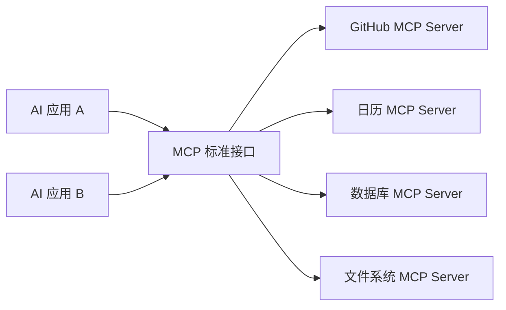
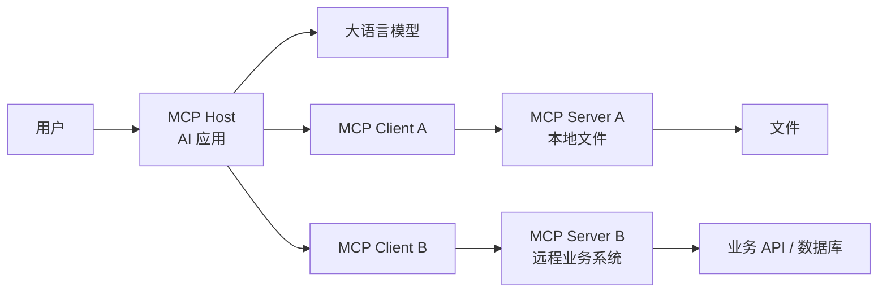
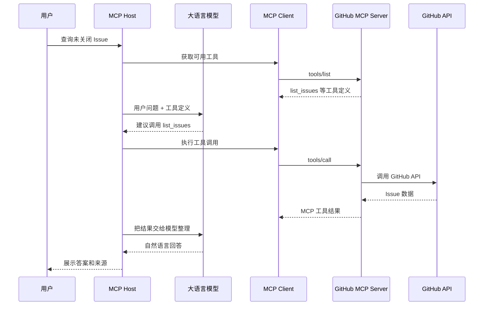
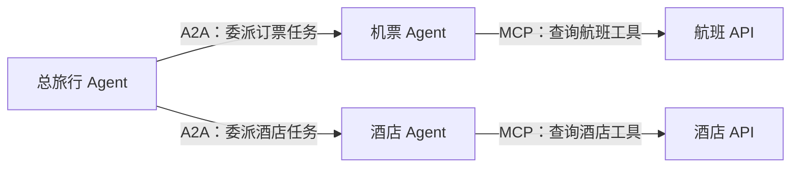
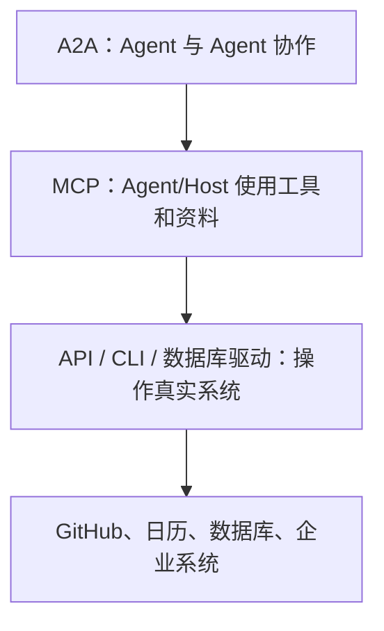

# MCP 模型上下文协议

> [!summary] 一句话解释
> **MCP（Model Context Protocol，模型上下文协议）是一套开放协议，用统一规则让 AI 应用连接外部资料、工具和工作流；它像 AI 应用的“通用连接标准”，但不等于模型、Agent 框架、API、插件或 RAG。**

> [!warning] 版本提示
> 本文于 **2026-08-21** 按当时最新的 **MCP 2026-07-28** 规范核对。MCP 仍在快速发展，很多 2024—2025 年教程描述的是旧版握手、会话和能力模型，阅读时必须先看协议版本。

## MCP 全称、读法和来历

**MCP** 是 **Model Context Protocol** 的缩写：

- **Model**：模型，这里主要指 Large Language Model（LLM，大语言模型）；
- **Context**：上下文，模型完成任务时可使用的资料、工具描述和相关信息；
- **Protocol**：协议，多个程序共同遵守的通信规则。

常见读法是逐字母读 **M-C-P**。中文一般译为“模型上下文协议”。

MCP 最初由 Anthropic 在 2024 年 11 月公开发布，目标是减少 AI 应用连接不同数据源和工具时的重复集成。2025 年 12 月，Anthropic 将 MCP 捐赠给 Linux Foundation（Linux 基金会）旗下的 Agentic AI Foundation（AAIF，智能体 AI 基金会），因此它不是只供 Claude 使用的私有协议。

## 先理解：什么是协议

**协议不是一个具体软件，而是一组通信约定。**

例如 [[TCP、HTTP、HTTPS与WebSocket|HTTP]] 规定浏览器和服务器怎样表达请求与响应，但 HTTP 本身不是某一个网站。类似地：

- MCP 规定 AI 应用和外部能力提供程序怎样互相描述、发现和调用能力；
- MCP Host、Client、Server 是实现并参与协议的软件组件；
- MCP SDK 是帮助开发者实现这些组件的代码工具包。

可以类比交通规则：

```text
交通规则：规定红灯停、绿灯行
汽车与道路：真正参与交通的实体

MCP 协议：规定消息、能力和调用规则
Host / Client / Server：真正交换消息的软件
```

## 为什么会需要 MCP

没有通用协议时，一个 AI 应用想连接多个系统，往往要分别定制：

```text
AI 应用 → GitHub 专用集成
AI 应用 → 日历专用集成
AI 应用 → 数据库专用集成
AI 应用 → 本地文件专用集成
```

另一个 AI 应用也想使用这些系统时，可能又要重新开发一遍。

MCP 尝试把 AI 应用一侧和能力提供方一侧用共同规则分开：



它的价值不是“所有工具都变得一样”，而是让不同工具用相同的发现、描述和调用框架接入支持 MCP 的 AI 应用。

官方文档使用 USB-C 类比：USB-C 统一了设备连接形式，MCP 则试图统一 AI 应用连接外部系统的方式。这个类比只是在说明“通用接口”，MCP 实际上仍是软件通信协议，不是硬件接口。

---

## MCP 的三个核心参与者

最新版架构主要有 **Host、Client、Server** 三类参与者。



### 1. MCP Host：宿主应用

**Host（宿主）**是用户实际使用的 AI 应用，例如支持 MCP 的聊天应用、编程工具或 Agent 系统。

它通常负责：

- 与用户交互；
- 调用大语言模型；
- 创建和管理 MCP Client；
- 决定哪些外部内容进入模型上下文；
- 展示工具调用和结果；
- 执行权限、授权、确认和安全策略；
- 隔离不同 MCP Server。

### 2. MCP Client：宿主中的连接组件

**Client（客户端）**不是这里的“最终用户”，而是 Host 内部负责和某一个 MCP Server 通信的协议组件。

按照官方架构，一个 Host 可以连接多个 Server，并通常为每个 Server 创建对应的 Client。

Client 负责：

- 按 MCP 格式发送请求；
- 查询 Server 支持的版本和能力；
- 获取 Resources、Prompts 和 Tools 列表；
- 调用工具、读取资源并接收返回结果；
- 处理错误、取消、进度和通知等协议行为。

### 3. MCP Server：能力提供程序

**Server（服务器）**是向 MCP Client 提供资料或操作能力的程序。

它可以：

- 读取某个目录中的文件；
- 查询数据库；
- 包装 GitHub、日历或企业系统的 [[SDK与API|API]]；
- 暴露计算器、搜索、创建工单等工具；
- 提供预先编写的提示模板。

> [!important] MCP Server 不一定是远程服务器
> 它可以是网络上的远程服务，也可以是 Host 在用户电脑上启动的本地子进程。“Server”表示它在协议中提供能力，不等于它必须运行在另一台机器上。

---

## MCP Server 主要提供什么

截至 MCP 2026-07-28，最重要的三类 Server Feature（服务器能力）是：

| 能力 | 中文理解 | 典型例子 | 常见控制者 |
|---|---|---|---|
| Resources | 资源、上下文资料 | 文件、数据库结构、项目文档 | 应用主导 |
| Prompts | 提示模板 | 代码审查模板、总结模板 | 用户主导 |
| Tools | 可执行工具 | 搜索、查询数据库、创建 Issue | 模型可选择，Host 负责执行与授权 |

“常见控制者”描述的是设计意图，不代表界面必须长成某种固定样子；协议允许不同 Host 设计不同交互方式。

### Resources：给模型看的资料

**Resource（资源）**是 Server 向 Client 暴露的上下文数据，例如：

- `file:///project/README.md`；
- 数据库 Schema（结构定义）；
- 产品说明；
- 应用状态；
- 某个知识库文档。

资源通常有 URI（Uniform Resource Identifier，统一资源标识符）用于标识。Host 决定如何让用户选择、搜索或自动加入这些资源。

简单记忆：

```text
Resource = 可以读取并放进上下文的资料
```

### Prompts：可复用的提示模板

**Prompt（提示）**是 Server 提供的结构化消息或指令模板，例如：

```text
/code-review
参数：待审查代码
结果：一组适合交给模型的代码审查指令和消息
```

它通常面向用户显式选择，比如菜单项或斜杠命令。模板内容由 Server 定义，Host 负责呈现和使用。

简单记忆：

```text
Prompt = 可以选择并填入参数的任务说明模板
```

### Tools：可以产生操作结果的能力

**Tool（工具）**是模型能够发现并建议调用的函数，例如：

- `search_documents(query)`；
- `get_weather(city)`；
- `list_issues(repo)`；
- `create_issue(repo, title, body)`；
- `execute_sql(query)`。

每个工具通常包括：

- 名称；
- 功能描述；
- 输入参数的 JSON Schema（JSON 结构规则）；
- 可选的输出 Schema；
- 调用结果或错误。

模型可以根据描述和当前任务选择工具，但真正发送请求的是 Host/MCP Client。对于发消息、删文件、花钱、修改数据库等有副作用的操作，Host 应让用户看见并确认。

简单记忆：

```text
Resource = 读什么
Prompt   = 怎样提问或执行某类任务
Tool     = 做什么
```

---

## MCP 到底能做什么

> [!important] 先记住能力来源
> **MCP 只规定“怎样发现和调用能力”，真正能做什么取决于 MCP Server 接入了什么系统、当前账号拥有什么权限，以及 Host 是否允许这次操作。**

例如：

```text
MCP 协议        = 插座规格
MCP Server      = 接在插座上的具体设备
底层 API/程序   = 设备内部真正干活的部分
账号与权限      = 这台设备允许你使用哪些功能
MCP Host        = 管理连接、模型、界面和用户确认
```

### 1. 给 AI 读取资料

MCP Server 可以通过 Resource 或只读 Tool 提供：

- 本地文件和项目文档；
- Obsidian 或企业知识库页面；
- 数据库表结构；
- Git 提交历史；
- 产品手册和内部制度；
- 云盘文件；
- 当前应用状态；
- 图片、音频或其他二进制资源。

例子：

> 用户：“根据我公司的报销制度，判断这张发票能不能报销。”

MCP 连接可以让 Host 读取被授权的报销制度和发票内容，再把必要部分交给模型分析。它不表示模型自动拥有整个公司云盘权限。

相关知识见 [[知识库是什么：个人、团队与AI知识库]]。

### 2. 搜索和查询信息

工具可以连接搜索引擎、企业搜索、数据库或业务 API，例如：

- 搜索网页；
- 搜索知识库；
- 查询天气、地图或航班；
- 查询商品、库存和价格；
- 查询数据库记录；
- 查询日志、监控和错误信息；
- 查询 GitHub Issue、Pull Request 和 CI 状态。

这里的 MCP Server 通常只是统一入口，真正的数据仍来自搜索 API、数据库或业务系统。

### 3. 操作文件和代码仓库

如果 Server 暴露了相应 Tool，AI 可以：

- 列出和读取文件；
- 创建或修改文件；
- 搜索代码；
- 查看 Git diff；
- 创建分支和提交；
- 创建或评论 GitHub Issue/PR；
- 查询构建和测试结果；
- 触发经过授权的 CI 工作流。

但“读取文件”和“删除整个目录”风险完全不同。一个设计良好的 Server 应把工具拆成清楚的动作，Host 也应对写入、删除、推送和发布设置更严格的确认。

### 4. 查询和修改数据库

MCP 可以把数据库能力包装成工具，例如：

```text
get_customer(customer_id)
list_orders(customer_id)
create_refund(order_id, amount)
```

还可以提供通用 SQL 查询工具，但直接让模型生成并执行任意 SQL 风险很高：

- 可能读取不该读取的个人数据；
- 可能执行 `UPDATE` 或 `DELETE`；
- 可能产生慢查询；
- 可能绕过业务层校验；
- 可能在错误环境操作生产数据库。

实际系统更适合提供范围明确的业务工具、只读账号、查询超时、行数限制和审计记录。

### 5. 操作办公与协作软件

连接邮件、日历、云盘、任务和聊天系统后，AI 可能完成：

- 搜索邮件；
- 起草或发送邮件；
- 查询空闲时间；
- 创建或修改日程；
- 创建待办任务；
- 上传、移动或分享文件；
- 查询团队消息；
- 在群聊中发送通知；
- 创建工单或更新项目状态。

这些能力不由 MCP 凭空提供，而由 Gmail、Google Calendar、飞书、Slack、Jira 等具体 Server 和底层 API 提供。

发送消息、邀请参会人、修改日程和分享文件都会影响他人，通常需要用户看到真实对象和内容后再确认。

### 6. 控制浏览器或桌面应用

如果 MCP Server 封装了浏览器自动化、[[RPA、UI Automation与CDP|UI Automation 或 CDP]]，AI 可以：

- 打开网页并读取页面；
- 填写表单；
- 点击按钮；
- 下载文件；
- 截图；
- 操作 Windows 界面；
- 执行多步业务流程。

MCP 只负责让 Host 调用这些自动化工具；元素定位、页面等待、登录状态、结果核验等仍由具体自动化实现负责。

### 7. 调用计算和专业服务

工具可以封装任意允许的计算能力，例如：

- 数学计算；
- 运行代码；
- 数据统计；
- 生成图表；
- 图片处理；
- OCR 文字识别；
- 文档格式转换；
- 翻译；
- 调用内部算法；
- 调用模型、语音或图像服务。

Tool Result 不只可以返回普通文字，还可以返回结构化数据、图片、音频、Resource Link 或嵌入式 Resource。Host 决定怎样显示以及哪些内容进入模型上下文。

### 8. 提供标准任务模板

Prompts 可以把常用工作方式做成带参数的模板，例如：

- “根据团队规范审查这段代码”；
- “按固定格式总结会议”；
- “根据工单信息生成排查步骤”；
- “用初学者语言解释选中的代码”；
- “根据公司模板起草项目周报”。

Prompt 本身通常不执行外部动作，但可以组织模型消息，并引导后续使用 Resources 和 Tools。

### 9. 在任务中继续询问用户

有些工具执行到一半会发现信息不足，例如：

- 缺少收件人；
- 需要用户在两个账号之间选择；
- 删除前需要确认文件列表；
- 需要跳转到授权页面登录；
- 需要补充一个表单字段。

MCP 可以承载这种“还需要输入”的交互。2026-07-28 规范使用 **MRTR（Multi Round-Trip Requests，多轮往返请求）**：Server 返回 `input_required`，Client 收集用户输入后，重新提交原请求。

这不表示 Server 可以随时弹窗骚扰用户；输入请求必须与用户或 Agent 已经发起的操作相关。密码、API Key、支付凭据等敏感信息也不应该通过普通表单方式随意收集。

### 10. 处理较长时间的任务

对于导出大型报告、批量处理文件或长时间查询，生态可以使用 Tasks 扩展和订阅机制支持：

- 返回任务标识；
- 查询进度和状态；
- 获取最终结果；
- 取消任务；
- 接收相关状态更新。

需要注意：截至 2026-07-28，Tasks 已移出核心协议，成为扩展能力。Host 和 Server 都支持相应扩展时才能使用，不能假设所有 MCP 实现都有长任务功能。

### 11. 让同一个能力服务多个 AI Host

假设团队开发了一个“查询公司订单”的 MCP Server。理论上，不同兼容 Host 可以按照相同协议发现它的工具和参数，而不必为每个 AI 应用重新设计一套完全不同的连接格式。

这正是 MCP 的核心价值：

```text
不是增加一种新的业务能力
而是降低已有资料、API 和工具接入不同 AI 应用的重复成本
```

## 典型场景速查表

| 用户目标 | MCP Server 可能提供什么 | 真正工作的底层系统 | 风险提示 |
|---|---|---|---|
| “查一下北京天气” | `get_weather` Tool | 天气 API | 相对低风险，但要防伪造结果 |
| “根据我的笔记回答 DNS” | 笔记 Resource 或 `search_notes` | 本地文件/知识库索引 | 注意隐私和发送给哪个模型 |
| “看看仓库有哪些 Issue” | `list_issues` | GitHub API | 通常只读 |
| “创建一个 Issue” | `create_issue` | GitHub API | 会产生外部副作用，应核对仓库和正文 |
| “查询本月销售额” | `sales_summary` | 数据库/BI 系统 | 需要部门和行级权限 |
| “给客户发邮件” | `send_email` | 邮件 API | 核对收件人、正文和附件 |
| “安排下周会议” | `find_free_time`、`create_event` | 日历 API | 创建前确认时间、时区和参会人 |
| “整理下载目录” | 文件 Tools | 本地文件系统 | 移动、覆盖和删除需要确认 |
| “在网页里提交报销” | 浏览器自动化 Tools | 浏览器/业务网站 | 提交前复核金额、账号和最终按钮 |
| “生成并上传报告” | 文档、云盘 Tools | 文档库和云存储 API | 检查数据脱敏和分享权限 |

## MCP 做不到或不能保证什么

### 1. 不能凭空获得能力

没有对应 Server 或底层 API，它就不能查询或操作那个系统。

### 2. 不能绕过账号权限

MCP 不应该帮助模型绕过登录、ACL、RBAC 或企业审批。它最多使用用户明确授予的权限。

### 3. 不能保证工具安全

工具描述、注解和返回内容都可能来自不可信 Server。Host 必须做权限隔离、参数校验、用户确认和审计。

### 4. 不能保证模型一定选对工具

模型可能选错工具、填错参数或误解返回结果。关键操作仍需要验证和人工确认。

### 5. 不能自动解决业务正确性

协议调用成功只说明消息交换成功，不代表订单、付款、删除或发布结果符合业务要求。

### 6. 不能自动成为 Agent

MCP 提供连接能力；目标分解、循环、记忆、重试、预算、审批和最终验收通常由 Host、Harness 或 Agent 框架负责。

### 7. 不能让所有 Host 支持所有能力

不同 Host 支持的协议版本、传输方式、认证机制、扩展和界面不同。Server 暴露某项能力，不代表当前 Host 一定能够使用。

---
## 一次 MCP 工具调用怎样发生

假设用户对一个编程 Agent 说：

> 帮我看看这个 GitHub 仓库有哪些未关闭的 Issue。

一个简化流程是：



其中需要分清：

- 模型负责根据上下文提出“想调用哪个工具、传什么参数”；
- Host 决定是否允许并真正发起调用；
- MCP Server 实现具体能力，可能继续调用原有 API；
- 外部系统返回真实数据；
- 模型再负责理解和组织结果。

MCP 不会让模型凭空获得权限，也不会替代 GitHub 等服务原本的身份认证。

---

## MCP 消息是怎样传输的

### 数据格式：JSON-RPC 2.0

MCP 使用 **JSON-RPC 2.0** 表达请求、响应和通知。

- **JSON（JavaScript Object Notation）**：常见的结构化文本格式；
- **RPC（Remote Procedure Call，远程过程调用）**：让一个程序像调用函数一样请求另一个程序执行操作。

简化后的工具调用消息可以这样理解：

```json
{
  "jsonrpc": "2.0",
  "id": 1,
  "method": "tools/call",
  "params": {
    "name": "get_weather",
    "arguments": {
      "city": "Shanghai"
    }
  }
}
```

这只是帮助理解的简化示例。2026-07-28 规范还要求请求携带协议版本、Client 能力等 `_meta` 信息，开发时应使用当前 SDK 和规范，不能直接照抄这个省略版投入生产。

### Transport：通信通道

**Transport（传输方式）**解决的是“这些 MCP 消息通过什么通道送过去”。标准方式主要有：

#### stdio：本地进程通信

**stdio（Standard Input/Output，标准输入/输出）**适合本地 MCP Server：

```text
Host 启动一个本地 Server 子进程
Client 写入 Server 的标准输入
Server 从标准输出返回 MCP 消息
```

优点是本地直接通信，不必公开网络端口。风险是这个 Server 本质上仍是在本机执行的程序，可能继承 Host 的文件和系统权限。

#### Streamable HTTP：远程通信

**Streamable HTTP（可流式 HTTP）**适合远程 MCP Server：

- Client 使用 HTTP POST 发送请求；
- Server 返回 JSON，或者使用请求范围内的 SSE 流式返回；
- 可以结合标准 Web 授权方式；
- 适合部署在网络服务和云平台中。

这里的 **SSE** 是 **Server-Sent Events（服务器发送事件）**，用于服务器向客户端持续推送事件数据，不要和 [[TCP、HTTP、HTTPS与WebSocket|WebSocket]] 完全等同。

```text
JSON-RPC：消息“说什么”
Transport：消息“怎样送过去”
```

---

## 2026-07-28 版本为什么值得特别说明

MCP 的协议版本会影响连接和消息行为。

截至本文核对日期，最新正式规范是 **2026-07-28**。这一版的核心协议采用无状态、自包含请求：

- 请求携带当前协议版本和相关 Client 信息；
- Client 可通过 `server/discover` 发现 Server 的版本、身份和能力；
- 不再依赖旧版 `initialize/initialized` 握手和 `Mcp-Session-Id` 协议会话；
- 应用仍可以保存业务状态，但要通过明确的 ID/handle（句柄）传递，而不是依赖隐藏的连接会话；
- Tasks、MCP Apps 等作为可选扩展演进；
- Roots、Sampling 和 Logging 已被标记为弃用，新实现不宜继续依赖。

> [!warning] 旧教程不一定“完全错误”
> 它可能只是对应 2025 年的协议版本。成熟 SDK 可能提供新旧版本协商和兼容路径，但不要把两个版本的握手、消息字段和传输示例混在一起。

---

## 近期 MCP 会被取代吗

> [!summary] 先给结论
> **截至 2026-08-21，没有可靠证据表明 MCP 整体近期要被某一个协议取代。更准确的说法是：MCP 正在快速升级，旧版内部机制被新机制替换，同时 A2A、Agent Skills、直接 API/CLI 等技术在不同层次与它分工或竞争。**

### 为什么会出现“MCP 要被取代”的说法

这类说法通常把几件不同的事混在了一起。

#### 原因 1：新版 MCP 对旧版做了较大改动

2026-07-28 规范对核心通信方式进行了明显调整：

| 旧机制或特性 | 当前变化 | 是否代表 MCP 整体消失 |
|---|---|---|
| `initialize/initialized` 握手 | 被无状态、自包含请求和 `server/discover` 取代 | 否 |
| `Mcp-Session-Id` 协议会话 | 新核心不再依赖它 | 否 |
| Roots、Sampling、Logging | 已进入弃用周期 | 否 |
| 旧 HTTP+SSE Transport | 已弃用，迁移到 Streamable HTTP | 否 |
| 部分长任务能力 | 移到 Tasks 扩展继续演进 | 否 |

所以准确表述应是：

```text
旧版 MCP 的部分机制正在被替换
                    ≠
MCP 协议整体正在被替换
```

官方不仅在 2026 年发布了新规范，也公布了 Transport Scalability（传输可扩展性）、Agent Communication（Agent 通信）、治理成熟和企业可用性等路线图。这更像一个仍在积极演进的协议，而不是已宣布停止的项目。

#### 原因 2：A2A 发展很快

**A2A（Agent2Agent Protocol，智能体到智能体协议）**负责不同 Agent 之间的发现、委派、协作和长任务交流。

它和 MCP 的主要边界是：

```text
MCP：Agent / Host ↔ 工具、API、数据和资源
A2A：Agent ↔ 另一个相对独立的 Agent
```

例如旅行规划系统可能这样组合：



A2A 官方文档明确将两者描述为互补协议，而不是竞争替代关系：一个 Agent 内部可以用 MCP 操作工具，对外再用 A2A 与其他 Agent 协作。

#### 原因 3：Agent Skills 越来越流行

**Agent Skill（Agent 技能）**通常是一组可复用的任务说明、脚本和参考资料，用来教 Agent“怎样完成某类工作”。

```text
Skill：教 Agent 怎样做
MCP：让 Agent 在运行时怎样连接资料和工具
```

例如“制作财务报告”Skill 可以规定分析步骤，同时调用数据库 MCP Tool 获取真实数据。二者可以组合，并不是必须二选一。

#### 原因 4：有些项目更适合直接 API 或 CLI

如果一个应用只有一个固定工具，直接调用函数、[[SDK与API|API]] 或 **CLI（Command-Line Interface，命令行界面）**可能更简单：

- 依赖层更少；
- 调试路径更直接；
- 不需要协议发现和版本兼容；
- 可以完全按照内部需求设计类型与错误处理。

这说明 MCP 不是所有项目的最佳答案，但不能据此推导“MCP 将被全面取代”。HTTP、数据库驱动和插件系统也都长期与直接函数调用共存。

### MCP、A2A 和底层 API 怎样分层

可以先用三层结构理解：



不是所有系统都必须同时有三层，但它能说明它们解决的不是同一个问题。

### 哪些变化才可能真正威胁 MCP

下面属于未来可能性，而不是已经发生的事实：

- 主要 AI Host 不再支持 MCP，改为另一套互不兼容的协议；
- 另一标准在工具发现、授权、安全、性能和生态上形成明显统一优势；
- 各厂商只保留自己的私有 Connector 接口；
- MCP 长期无法解决安全、工具质量、版本兼容和部署成本问题；
- 开发者普遍发现直接 API、CLI 或代码执行比 MCP Server 更可靠、简单。

截至核对日期，观察到的事实反而是：MCP 刚发布 2026-07-28 新规范，官方路线图仍在推进，MCP Apps 和 Tasks 等扩展继续增加能力，GitHub MCP Server 等实现也在跟进新版本。

### 我的判断

> [!note] 基于当前资料的推断
> **短期内更可能发生的是“MCP 从热点概念变成底层基础设施”，而不是突然消失。** 用户以后可能只看到“连接器”“工具”“App”或“数据源”，看不到 MCP 这个名称，但底层仍可能使用 MCP。

中长期不能断言任何协议永远不会被替代。MCP 仍有真实问题：

- 安装第三方 Server 有供应链和本机执行风险；
- 不同 Server 的工具质量差异很大；
- 工具过多会增加模型选择成本和上下文负担；
- Host 对版本、授权和扩展的支持不完全一致；
- 简单集成使用 MCP 可能比直接 API 更复杂。

因此合理态度不是“全部押注 MCP”，也不是“马上抛弃 MCP”，而是根据边界选择：

| 需求 | 优先考虑 |
|---|---|
| 调用数据库、文件、GitHub 等明确工具 | MCP 或直接 API |
| 多个独立 Agent 需要委派、协商、持续任务 | A2A |
| 教 Agent 一套可复用工作方法 | Agent Skills |
| 单个程序里的简单固定函数 | 直接函数/库 |
| 一个固定外部服务，且没有跨 Host 复用需求 | SDK/API/CLI 可能更简单 |

初学者目前不用因为“可能被取代”而停止学习 MCP。应重点学习它背后的稳定概念：协议、Client/Server、Tool Schema、能力发现、权限边界和外部输入安全。即使未来换协议，这些知识仍然适用。

---

## MCP、API、SDK 分别是什么

| 概念 | 核心问题 | 示例 |
|---|---|---|
| API | 某个软件允许外界怎样调用自己？ | GitHub API、天气 API |
| MCP | AI 应用怎样用统一协议发现和调用外部资料与工具？ | `tools/list`、`tools/call`、`resources/read` |
| SDK | 开发者怎样更方便地实现或调用某套能力？ | TypeScript MCP SDK、Python MCP SDK |

MCP Server 经常是现有 API 的“AI 适配层”：

```text
AI Host
  ↓ MCP
GitHub MCP Server
  ↓ GitHub API
GitHub 服务
```

因此 MCP 没有消灭 API。它在 API 之上增加适合 AI 应用发现和调用能力的标准层。

MCP 也不是一种编程语言。它与语言无关，可以用 TypeScript、Python、Go、C# 等语言实现；MCP SDK 才是对应语言中的开发工具包。

---

## MCP 与 Function Calling / Tool Calling

**Function Calling（函数调用）**或 **Tool Calling（工具调用）**通常是模型 API 的能力：开发者把工具 Schema 提供给模型，模型输出想调用的工具和参数。

MCP 解决的是更外层的集成问题：

- 去哪里发现工具；
- 工具怎样描述；
- 怎样向 Server 发起调用；
- 怎样读取资源和提示模板；
- Client 与 Server 怎样传输结果和错误。

常见组合是：

```text
MCP Server 暴露工具
        ↓
MCP Host 把工具描述转换/交给模型
        ↓
模型通过 Tool Calling 选择工具
        ↓
Host 使用 MCP 调用 Server
```

所以两者互补，不是二选一。

---

## MCP 与插件有什么区别

[[DeepSeek Harness、Everything is a Plugin与Cordis|Plugin（插件）]]通常是某个应用内部的扩展模块，可能直接加载到应用进程中，并参与应用自身的生命周期。

MCP 更关注应用边界之外的标准通信：

| 对比 | 插件 | MCP Server |
|---|---|---|
| 主要目标 | 扩展某个宿主内部能力 | 让不同 AI Host 用共同协议连接能力 |
| 运行位置 | 常在宿主进程或其插件系统内 | 可以是本地子进程或远程服务 |
| 接口规则 | 由具体插件框架决定 | 由 MCP 规范决定 |
| 生命周期 | 由插件系统管理加载、卸载、依赖 | 由 Host、Transport 和 Server 部署方式管理 |
| 可移植性 | 常绑定特定宿主 | 理论上可供多个兼容 Host 使用 |

两者可以结合：某个内部插件可以启动 MCP Client；某个 MCP Server 内部也可以使用插件架构实现不同工具。

---

## MCP 与 RAG 有什么区别

[[RAG、Naive RAG与GraphRAG|RAG（Retrieval-Augmented Generation，检索增强生成）]]是一种“先检索资料，再让模型依据资料回答”的方法。

MCP 是连接协议：

```text
RAG：决定怎样检索和利用知识
MCP：规定 AI 应用怎样连接提供知识或检索工具的程序
```

例如向量数据库 MCP Server 可以提供：

- Resource：可读取的知识库资料；
- Tool：`search_knowledge_base(query)`；

Host 可以使用这些能力组成 RAG 流程。但仅仅连接 MCP Server，不会自动完成文档切分、Embedding、召回、重排序和答案评估。

---

## MCP 与 LangChain、Harness 和 Cordis

- [[LangChain]]：组织模型、状态、工具和 Agent 流程的应用框架；
- Agent Harness：承载模型、工具、权限、循环和执行环境的运行系统；
- [[DI容器、Pi与轻量钩子方案|DI/Hook/Cordis]]：解决程序内部的依赖、事件、插件生命周期等架构问题；
- MCP：解决 Host 与外部能力程序之间的标准通信问题。

一个 Harness 可以作为 MCP Host，也可以把 MCP Server 暴露的 Tools 接入自身工具系统。Cordis 等插件元框架可以管理内部插件，但这不等于 MCP 协议本身。

---

## MCP 的安全边界

MCP 能让 AI 读取数据、调用 API，甚至执行具有副作用的操作，因此“连接成功”绝不等于“安全”。

### 1. MCP Server 是可执行程序

本地 Server 可能以与 Host 相同的用户权限运行，理论上能够：

- 读取本地文件；
- 访问环境变量和密钥；
- 发起网络请求；
- 修改或删除数据；
- 执行系统命令。

不要把陌生网页给出的一段 `npx`、`uvx` 或 Shell 启动命令当作无害配置。它可能会下载并执行第三方代码。

### 2. 最小权限

只授予完成任务所需的最小范围：

- 只读任务不要给写权限；
- 只需一个项目目录，就不要开放整个硬盘；
- 只需读取 Issue，就不要授予仓库管理权限；
- API Key 不要写进公开配置或笔记；
- 为不同 Server 使用可撤销、可审计的凭证。

### 3. 有副作用的工具需要确认

“查询天气”和“删除数据库”风险完全不同。Host 应明确展示：

- 正在调用哪个 Server；
- 工具名称和参数；
- 要读取或修改什么；
- 是否会发消息、付费、删除或公开数据。

高风险操作应要求人工确认，不能因为模型说“我认为可以”就直接执行。

### 4. 外部内容可能包含 Prompt Injection

MCP Resource、网页和工具结果都是外部输入，可能包含诱导模型泄露秘密或执行危险操作的恶意文字。Host 不应把外部内容自动当作可信系统指令。

### 5. 授权不等于所有请求都可信

远程 Server 需要正确的认证、授权、Token 校验和用户同意。Server 还必须针对每次操作检查调用者是否有权访问对应资源，不能只因为请求带了一个 Token 就盲目信任。

> [!important] 最实用的安全原则
> 只安装可信来源的 MCP Server；看清启动命令；限制目录、网络和账号权限；写操作要求确认；定期撤销不用的 Token；保留操作日志。

---

## MCP 不是什么

- MCP 不是大语言模型；
- MCP 不是 ChatGPT、Claude 或 Codex 的专属功能；
- MCP 不是 Agent 框架；
- MCP 不是数据库或 [[RAG、Naive RAG与GraphRAG|RAG]]；
- MCP 不是所有 API 的替代品；
- MCP 不是插件商店；
- MCP 不会自动给模型权限；
- MCP 不会自动保证数据正确、工具安全或答案可靠；
- MCP 不规定 Host 必须怎样把上下文交给模型，也不规定模型怎样推理。

---

## 常见误区

### 误区 1：大模型直接连接 MCP Server

更准确的说法是：Host 中的 MCP Client 与 Server 通信，Host 再把需要的信息和工具交给模型。模型本身通常不负责网络连接和凭证管理。

### 误区 2：MCP Server 一定在云端

不是。它可以是本机 stdio 子进程，也可以是远程 Streamable HTTP 服务。

### 误区 3：用了 MCP 就不需要写业务代码

不是。Server 仍然要实现权限检查、参数校验、API 调用、错误处理和业务逻辑。

### 误区 4：MCP 工具描述说“只读”就一定只读

工具名称、描述和注解本身不能证明实现安全。只有可信代码、权限限制、审计和运行隔离才能形成真实边界。

### 误区 5：MCP 与 Tool Calling 是同一个东西

不是。Tool Calling 是模型选择工具的接口能力；MCP 是 Host 与外部能力提供程序之间的协议。两者经常组合。

### 误区 6：所有 MCP 教程的配置都能直接混用

不是。协议版本、SDK 主版本、Host 支持能力和 Transport 都可能不同。复制配置前要核对发布日期和版本。

### 误区 7：MCP 让所有工具拥有完全统一的业务参数

不是。MCP 统一的是发现和调用框架；天气、GitHub、数据库工具仍有各自不同的名称、参数、权限和返回数据。

---

## 什么时候适合使用 MCP

比较适合：

- 一个能力希望同时被多个兼容 AI Host 使用；
- AI 应用需要连接多种外部资料和工具；
- 希望工具可以被自动发现并用 Schema 描述；
- 本地工具和远程服务希望使用相近的协议抽象；
- 希望把外部系统集成与 Agent 核心逻辑分离。

可能不必使用：

- 只有一个很小、固定的内部函数；
- 一个简单应用只调用一次固定 Web API；
- 工具完全属于同一进程，内部函数接口已经足够清楚；
- 团队还无法正确处理认证、授权和执行安全。

技术层数越多，调试、版本兼容和安全成本也越高。不要为了“用了新协议”而强行增加 MCP。

---

## 初学者学习顺序

1. 先理解 [[SDK与API|API、SDK、请求与响应]]；
2. 理解 Client/Server（客户端/服务器）关系；
3. 学会阅读 JSON，知道 Schema 是“数据结构规则”；
4. 理解进程、stdio、HTTP 和权限；
5. 用一句话区分 Resource、Prompt、Tool；
6. 在可信 Host 中连接一个只读、低权限的 MCP Server；
7. 观察一次 `tools/list → 模型选择 → tools/call → 结果`；
8. 再用官方 SDK 编写一个只有 `get_current_time` 的小工具；
9. 最后学习 OAuth、远程部署、版本兼容和安全加固。

初学阶段不必背 JSON-RPC 的所有字段。最重要的是先建立这张图：

```text
用户
  ↓
MCP Host（管理模型、权限和界面）
  ↓
MCP Client（协议连接组件）
  ↓
MCP Server（提供 Resources / Prompts / Tools）
  ↓
文件、数据库、API 和真实业务系统
```

## 关联概念

- [[SDK与API]]：MCP 是协议；SDK 帮助实现协议；Server 常继续调用具体业务 API。
- [[TCP、HTTP、HTTPS与WebSocket]]：远程 MCP 可以使用 Streamable HTTP；不要把 SSE 与 WebSocket 混为一谈。
- [[TLS与数字证书]]：远程 MCP 通常由 HTTPS/TLS 保护传输，但 TLS 不能代替 OAuth、工具权限和用户审批。
- [[CMD、Bash与PowerShell]]：本地 stdio Server 常由 Host 通过命令启动。
- [[TypeScript与JavaScript]]、[[Node.js与pnpm]]：常用于编写和安装 MCP Client/Server，但 MCP 并不限定语言。
- [[Prompt Engineering与Loop Engineering]]：Prompt 设计模型输入，Loop/Harness 决定工具调用怎样持续推进，MCP 提供外部连接协议。
- [[LangChain]]：AI 应用框架可以作为 Host/Harness 的一部分接入 MCP 能力。
- [[RAG、Naive RAG与GraphRAG]]：MCP 可以提供检索资源和工具，但不等于 RAG 流程。
- [[DeepSeek Harness、Everything is a Plugin与Cordis]]：插件系统解决内部组合，MCP 解决跨程序标准通信。
- [[Preset与Agent Trajectory]]：Preset 可预先配置允许的 MCP Server，Trajectory 可记录实际工具调用过程。

## 参考资料

> [!info] 核对信息
> 核对日期：2026-08-21；最新正式规范：MCP 2026-07-28。MCP 变化较快，实现前应重新查看 `specification/latest` 和所用 SDK 的版本文档。

- [MCP 官方：What is MCP?](https://modelcontextprotocol.io/docs/getting-started/intro)
- [MCP 最新正式规范](https://modelcontextprotocol.io/specification/latest)
- [MCP 官方架构说明](https://modelcontextprotocol.io/docs/learn/architecture)
- [MCP 2026-07-28：Tools](https://modelcontextprotocol.io/specification/2026-07-28/server/tools)
- [MCP 2026-07-28：Resources](https://modelcontextprotocol.io/specification/2026-07-28/server/resources)
- [MCP 2026-07-28：Prompts](https://modelcontextprotocol.io/specification/2026-07-28/server/prompts)
- [MCP 2026-07-28：Transports](https://modelcontextprotocol.io/specification/2026-07-28/basic/transports)
- [MCP 官方安全最佳实践](https://modelcontextprotocol.io/docs/tutorials/security/security_best_practices)
- [MCP 官方博客：2026-07-28 规范](https://blog.modelcontextprotocol.io/posts/2026-07-28/)
- [MCP 官方：2026 Roadmap](https://blog.modelcontextprotocol.io/posts/2026-mcp-roadmap/)
- [MCP SEP-2577：弃用 Roots、Sampling 和 Logging](https://modelcontextprotocol.io/seps/2577-deprecate-roots-sampling-and-logging)
- [MCP 官方：Extensions Overview](https://modelcontextprotocol.io/extensions/overview)
- [A2A 官方：A2A and MCP](https://github.com/a2aproject/A2A/blob/main/docs/topics/a2a-and-mcp.md)
- [A2A 官方：A2A v1.0，Complementary to MCP](https://a2a-protocol.org/latest/announcing-1.0/)
- [GitHub Changelog：GitHub MCP Server 支持 2026-07-28 规范](https://github.blog/changelog/2026-07-23-github-mcp-server-supports-the-next-mcp-specification/)
- [Anthropic：Introducing the Model Context Protocol](https://www.anthropic.com/news/model-context-protocol)
- [Anthropic：MCP 捐赠给 Agentic AI Foundation](https://www.anthropic.com/news/donating-the-model-context-protocol-and-establishing-of-the-agentic-ai-foundation)
- [MCP 官方 GitHub 组织与 SDK](https://github.com/modelcontextprotocol)
