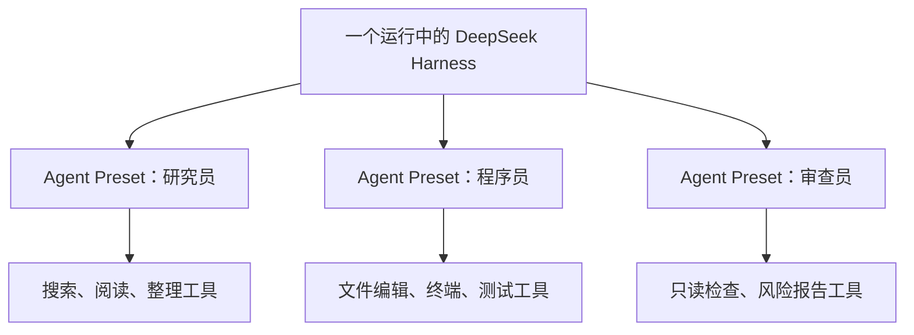

# Preset 与 Agent Trajectory

> [!summary] 一句话解释
> **Preset（预设）是一套提前保存、可重复选用的配置；Agent Trajectory（智能体执行轨迹）是 Agent 从收到任务到结束，按时间发生的一连串输入、动作、工具结果和状态变化。**

这两个词都不是 DeepSeek 独创的，但在 [[DeepSeek Harness、Everything is a Plugin与Cordis|DeepSeek Harness]] 里有很具体的 Agent 工程含义。

> [!warning] 术语核对范围
> 截至 2026-08-16，DeepSeek Harness 仍在快速变化。官方架构明确使用 **agent preset**；而对执行历史主要使用 `SessionEvent` 日志、turn、step 和 transcript 等术语。本笔记把这些事件按时间组成的完整路径解释为通用的 **trajectory**，这是概念对应，不表示当前版本一定把某个文件或 API 正式命名为 `trajectory`。

## Preset 是什么

**Preset** 读作“普里塞特”，中文常译为“预设”。它表示：**把一组经常一起使用的选项提前保存并命名，以后一次选择整组配置。**

### 生活类比

相机的“人像模式”就是 preset：你不必每次重新调整光圈、颜色、人脸优化和背景虚化，只要选“人像”，相机就载入预先组合好的一组设置。

软件里的 preset 也类似：

```text
预设名称：代码审查员
模型：适合代码的模型
工具：只读文件、搜索、运行测试
系统提示词：关注缺陷和风险
权限：不允许直接发布
```

选择“代码审查员”后，这一组设置一起生效。

## 在 Agent 系统里，Preset 可能包含什么

不同项目定义不同，但 Agent preset 常会组合：

- 使用哪个模型和参数；
- system prompt（系统提示词）；
- 可以使用哪些工具；
- 文件、网络、进程等权限；
- 是否使用沙箱；
- memory/context（记忆和上下文）策略；
- skills、插件或中间件；
- 最大步骤数、超时和预算；
- 输出格式与验证规则。

Preset 解决的是**重复配置和角色一致性**：研究 Agent、编程 Agent、审查 Agent 可以使用不同预设，而不必每次手工拼装。

## DeepSeek Harness 中的 Agent Preset

DeepSeek Harness 当前官方架构说明：如果要让**某个会话拥有不同的能力集合**，应组装一个 **agent preset**；需要隔离的服务要使用 `isolate` realm（隔离作用域）。

可先这样理解：



每个会话可以得到适合自己角色的能力，而不是所有 Agent 都共享完全相同的工具和权限。

## Preset、Profile 和 Prompt 不一样

| 概念 | 主要范围 | 回答的问题 |
|---|---|---|
| Prompt | 一段给模型看的指令或上下文 | “告诉模型做什么、怎样回答？” |
| Agent Preset | 某类 Agent/会话的装配 | “这个 Agent 用什么模型、工具、权限和提示词？” |
| Profile | DeepSeek Harness 整个运行产品的具名组装 | “这次启动的是 Web 产品、Headless 产品，还是另一套完整组合？” |

根据 DeepSeek Harness 当前架构，Profile 位于 Harness home，描述启动时叠加哪些 bundle 和 patch；Agent preset 则更靠近具体会话的能力集合。

Prompt 可能是 preset 的一部分，但 preset 通常不只有 prompt。

## Preset 的优点和风险

### 优点

- 减少重复配置；
- 让团队使用一致设置；
- 方便切换角色或工作模式；
- 更容易测试和复现；
- 可以把最小权限固化进不同角色。

### 风险

- 名称看起来简单，内部可能藏着很多默认值；
- preset 更新后，同名配置的行为可能改变；
- 给 Agent 过多工具和权限会扩大风险；
- 多个配置层覆盖时，最终生效值不一定直观；
- preset 不能代替对具体配置的理解。

因此调试时要能回答：**最终实际加载了什么，而不只是“我选了哪个名字”。**

---

## Trajectory 是什么

**Trajectory** 读作“特拉杰克托里”，本义是“轨迹、路径”。在 AI Agent 中，**Agent Trajectory** 指一次任务随时间展开的完整执行路径。

一个简化轨迹可能是：


轨迹关心的不只是最后答案，还关心 Agent **中间做过什么、看到了什么结果、状态怎样变化**。

## 一条轨迹通常包含什么

视系统实现而定，常见内容包括：

- 初始任务和后续用户消息；
- 每个 turn（轮次）和 step（步骤）的开始、结束；
- 发给模型的可见消息；
- 模型输出的普通消息和工具调用；
- 工具名、公开参数、结果、错误与耗时；
- 文件或环境状态变化的摘要；
- 重试、取消、审批和恢复事件；
- token、费用、延迟、评分等指标；
- 最终答案和成功/失败状态。

具体系统未必保存全部项目，也不应无节制记录密码、令牌等秘密。

## DeepSeek Harness 中怎样对应

DeepSeek Harness 当前使用**仅追加的 `SessionEvent` 会话日志**保存持久事实。官方描述的一个 step 是“一次模型请求加上它调用的工具”，一个 turn 可以包含零个或多个 step。

当前官方轮次流程可以简化为：

```text
turn/start
  → step/start
  → user/message
  → agent/request
  → assistant/message
  → tool/call
  → tool/result
  → step/end
→ turn/end
```

如果工具结果表明还需要继续，便会进入下一个 step。把这些持久事件按时间顺序连起来，就能重建这次 Agent 工作的**可观察轨迹**。

官方还强调“模型可见即已记录”：到达模型请求的内容必须能从会话日志重建。这样 fork（分叉会话）、恢复、transcript、遥测和持久化可以从同一事件流派生。

## Trajectory 不等于 Transcript

**Transcript** 是“文本记录/对话转录”，通常偏重用户和助手说了什么。

**Trajectory** 更宽，可能还包含：

- 工具调用与结果；
- 状态变化；
- 错误和重试；
- 时间、费用和评分；
- 环境中的动作。

```text
Transcript ⊆ Trajectory（在很多系统里，对话记录只是完整轨迹的一部分）
```

但不同项目的数据格式不统一，看到字段名时仍要以该项目文档为准。

## Trajectory 不等于 Plan

- **Plan（计划）**：Agent 打算接下来怎么做，面向未来；
- **Trajectory（轨迹）**：Agent 实际已经怎样走过，面向事实历史。

计划说“先搜索，再修改，再测试”，实际轨迹可能是“搜索失败 → 换方法 → 修改 → 测试失败 → 修复 → 再测试”。调试时，实际轨迹通常比最初计划更有证据价值。

## Trajectory 不一定包含模型隐藏思维

这是很重要的边界：

- 工具调用、工具结果、消息和状态是可观察事件；
- 模型内部如何计算，不等于系统一定能记录的内容；
- 有些研究数据会保存显式 reasoning trace（推理文本），但不能假定所有 trajectory 都包含它；
- 为了隐私、安全和产品设计，系统也可能只保存动作摘要而不保存详细推理。

所以更稳妥的理解是：**trajectory 首先是可观察的执行历史，不是“读取模型大脑”。**

## 为什么要保存 Trajectory

### 1. 调试

最终只看到“失败”并不知道原因。轨迹可以显示是模型选错工具、参数错误、权限不足，还是测试失败。

### 2. 评估

两个 Agent 都得到正确答案，但一个调用 3 次工具，另一个调用 50 次并产生高额费用。只看最终答案无法比较过程质量。

### 3. 恢复和回放

长任务中断后，可以从已记录状态继续；UI 也可以重放发生过的事件。

### 4. 审计和安全

可以检查谁要求了什么、Agent 调用了哪些高风险工具、审批是否发生。

### 5. 训练和改进

经过脱敏和筛选的成功/失败轨迹可用于研究 Agent 决策、训练评分器或改进工具使用策略。

## 轨迹质量不等于最终答案质量

一个 Agent 可能碰巧答对，但过程危险或浪费：

```text
答对了 + 泄露密钥 + 执行大量无关命令 = 不是好轨迹
```

评估轨迹时可观察：

- 任务是否完成；
- 是否遵守权限和审批；
- 工具选择是否合理；
- 是否根据工具结果调整；
- 是否产生不必要副作用；
- 步骤、耗时、token 和费用是否合理；
- 结论能否由轨迹中的证据支持。

## 与 Loop Engineering 的关系

[[Prompt Engineering与Loop Engineering|Loop Engineering]] 设计 Agent 怎样持续推进、验证、重试和停止；trajectory 是这个循环实际运行后留下的历史证据。

```text
Preset：开始前装配“让谁来做、能用什么”
Loop：运行中决定“怎样一步步推进”
Trajectory：运行后记录“实际上走过了哪些步骤”
```

这三个概念连起来，就能从“配什么 Agent”一直理解到“Agent 如何工作”以及“怎样复盘它的工作”。

## 常见误区

### 误区 1：Preset 就是 Prompt 模板

Prompt 可以属于 preset，但 preset 还可能包含模型、工具、权限、沙箱和预算。

### 误区 2：选择 preset 后就不需要看最终配置

配置可能由多层覆盖。排查问题时，应查看真正生效的配置和能力集合。

### 误区 3：Trajectory 只是聊天记录

聊天记录通常只包含文字；完整轨迹还可能包含工具、状态、错误和指标。

### 误区 4：Trajectory 就是模型的完整思维链

不是。它通常至少指外部可观察的消息、动作和结果；内部计算或隐藏推理不一定可见或保存。

### 误区 5：最终成功就代表轨迹优秀

还要评价安全性、效率、可复现性和是否遵守边界。

## 学习建议

1. 先理解 [[Prompt Engineering与Loop Engineering|Prompt、Loop 和 Agent Harness]]；
2. 用纸写一个三步任务的“计划”；
3. 实际执行后，把每个工具调用和结果写成“轨迹”；
4. 对比计划与轨迹哪里不同；
5. 再尝试给“研究员”和“代码审查员”设计两个不同 preset；
6. 最后阅读 DeepSeek Harness 的 profile、agent preset、realm 和会话事件源码。

## 参考资料

- [DeepSeek Harness 官方仓库](https://github.com/deepseek-ai/deepseek-harness)
- [DeepSeek Harness 中文架构文档](https://github.com/deepseek-ai/deepseek-harness/blob/master/docs/architecture.zh.md)
- [ReAct 论文：Synergizing Reasoning and Acting in Language Models](https://arxiv.org/abs/2210.03629)
- [SWE-agent 论文：Agent-Computer Interfaces Enable Automated Software Engineering](https://arxiv.org/abs/2405.15793)

