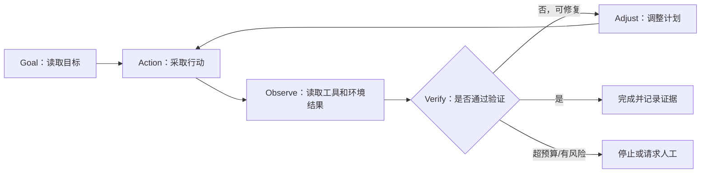

# Prompt Engineering 与 Loop Engineering

> [!note] 术语状态
> Prompt Engineering 已经广泛使用；Loop Engineering 是 2026 年快速流行的较新 Agent 工程术语，不同作者的边界仍可能略有差异。本笔记采用“设计 Agent 外部反复工作与验证的循环”这一含义。

## 一句话区分

- **Prompt Engineering（提示词工程）**：设计一次或一组模型输入，让模型更可能产生符合要求的输出。
- **Loop Engineering（循环工程）**：设计一个可以反复让 Agent 获取目标、采取行动、观察结果、验证和调整，并在正确时机停止的工作系统。

简单说：Prompt Engineering 关注“**这次该怎样问**”；Loop Engineering 关注“**谁来不断提出下一步、检查结果，以及何时结束**”。

## Prompt Engineering 详细解释

Prompt 不只是用户输入的一句话。一个完整模型输入可能包含：

- system prompt：系统角色和长期规则；
- 用户的具体任务；
- 背景资料与上下文；
- 示例；
- 可调用工具的说明；
- 输出格式；
- 安全和权限约束；
- 历史对话。

提示词工程常关注：

1. **目标清楚**：明确要完成什么。
2. **上下文充分**：提供必要资料，但不塞入大量无关内容。
3. **约束明确**：范围、格式、语气、长度和禁止事项。
4. **示例恰当**：展示输入与期望输出。
5. **可验证**：定义什么算正确，而不是只说“写得好一点”。
6. **处理不确定性**：要求模型说明不知道的部分或先查资料。

### 一个含糊 Prompt

```text
帮我写个登录功能。
```

问题是：语言、框架、身份认证方式、安全要求、现有项目和验收标准都不清楚。

### 一个更清楚的 Prompt

```text
在现有 Django 项目中增加邮箱密码登录。
沿用当前 User 模型，不增加第三方登录。
登录失败时返回统一错误文案，避免暴露邮箱是否存在。
完成后运行现有测试，并补充成功、密码错误和停用账户三类测试。
不要修改无关页面。
```

它仍不保证模型一定正确，但减少了猜测空间，并提供可检查的完成条件。

## Loop Engineering 详细解释

一次模型回答结束后，模型不会自动知道代码是否运行成功。Agent Harness 可以执行工具并把结果送回模型，而 Loop Engineering 进一步设计整个持续工作过程。

一个基础循环是：



一个可靠的 loop 通常需要：

- **Trigger**：什么时候启动，例如定时、代码提交或人工请求。
- **Goal**：明确目标和范围。
- **State/Memory**：记住已完成内容和失败原因。
- **Context**：每轮需要哪些信息。
- **Tools**：允许读取和改变哪些系统。
- **Verification**：测试、规则检查、评审或事实核对。
- **Feedback**：把真实结果反馈给下一轮，而不是让模型自我想象。
- **Budget**：时间、费用、调用次数和修改范围。
- **Stop condition**：成功、失败、阻塞或需要人工时如何停止。
- **Human gate**：付款、删除、发布等高风险动作前由人确认。

## Prompt、Context、Harness、Loop 四层区别

| 层次 | 主要优化对象 | 关键问题 |
|---|---|---|
| Prompt Engineering | 一次模型交互 | 这一次如何表达任务？ |
| Context Engineering | 模型当前看到的信息 | 此刻应该给模型哪些资料？ |
| Harness Engineering | 一次 Agent 运行环境 | 模型有哪些工具、权限、状态和执行机制？ |
| Loop Engineering | 多次、持续的 Agent 工作 | 如何触发、推进、验证、恢复并停止？ |

这些层次不是互相替代。一个 loop 的每一轮仍然需要合适的 prompt、context 和 harness。

## 一个现实例子：自动修复测试

### 只有 Prompt

```text
请修复这个失败的测试。
```

人要手工给错误信息、运行模型、运行测试，再把结果发回去。

### 设计成 Loop

1. CI 失败时自动触发。
2. 读取失败日志和相关代码。
3. Agent 提出最小修改。
4. 在隔离分支执行修改。
5. 运行失败测试和完整必要测试。
6. 不通过则把真实错误反馈给下一轮。
7. 达到尝试次数或修改范围上限就停止。
8. 通过后生成变更说明，等待人工 review，而不是自动上线。

Loop 的价值不是“让模型无限尝试”，而是让每次尝试都有真实反馈、边界和停止规则。

## “明确边界”为什么重要

边界至少包括：

- **任务边界**：允许修改哪些文件和功能。
- **权限边界**：能读什么、写什么、能否联网和执行命令。
- **责任边界**：模型提出方案，工具执行动作，人审批高风险决定。
- **数据边界**：哪些信息可进入模型，哪些是秘密或个人数据。
- **时间和成本边界**：最多运行多久、调用多少次、花费多少。
- **完成边界**：用哪些证据判断完成。
- **失败边界**：哪些错误可以重试，哪些必须停止并升级给人。

没有边界的自主循环容易反复尝试、扩大修改范围、消耗预算，甚至把“看起来完成”误认为真正完成。

## 常见误区

### “Loop Engineering 已经替代 Prompt Engineering”

不准确。Loop 中的每一轮仍需要提示词；两者解决的问题层级不同。

### “循环次数越多，结果越好”

错误反馈、错误评价标准或缺少停止条件时，多循环只会重复错误和浪费资源。

### “让模型自己评价自己就够了”

模型可能对自己的答案过度自信。代码应尽量用测试、类型检查、静态分析和真实运行验证；重要事实应核对来源；高风险操作应有人审查。

## 和其他笔记的关系

- [[LangChain]] 提供构建 Agent Harness 的高层能力。
- [[DeepSeek Harness、Everything is a Plugin与Cordis]] 把模型、工具、循环和权限等都设计为可组合插件。
- [[RAG、Naive RAG与GraphRAG]] 是给模型提供外部知识的一类上下文与检索方案。

## 参考资料

- [IBM：What is loop engineering?](https://www.ibm.com/think/topics/loop-engineering)
- [arXiv：Stop Hand-Holding Your Coding Agent—Engineering the Loops that Replace Step-by-Step Prompting](https://arxiv.org/abs/2607.00038)
