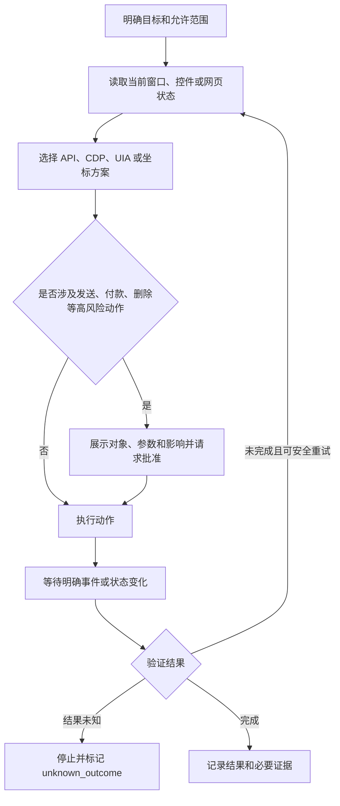

# RPA、UI Automation 与 CDP

> [!summary] 一句话结论
> **RPA 是让软件模仿人的操作流程；UI Automation 是 Windows 提供的语义化界面控制能力；CDP 是程序与 Chromium 浏览器内部功能通信的调试协议，它们都能做自动化，但控制对象和可靠性不同。**

## 一、RPA 是什么

**RPA（Robotic Process Automation，机器人流程自动化，读作“阿尔-披-诶”）**不是实体机器人，而是让程序代替人完成重复的电脑操作。

例如财务每天要：

1. 打开网站并登录；
2. 下载报表；
3. 打开 Excel；
4. 复制指定数据；
5. 填入内部系统；
6. 保存结果并通知负责人。

把这套固定流程交给程序，就是典型 RPA。RPA 是一个较大的业务概念，底层可以使用 UI Automation、浏览器协议、应用 API、键盘鼠标模拟、OCR 等多种手段。

## 二、三种控制方式的区别

| 方式 | 控制对象 | 像什么 | 优点 | 主要问题 |
|---|---|---|---|---|
| 坐标/图像点击 | 屏幕像素位置 | “点击屏幕第 500×300 点” | 最直观，几乎什么界面都能尝试 | 分辨率、缩放、窗口移动后容易失效 |
| UI Automation | Windows 控件树 | “点击名字为保存的按钮” | 更语义化，可读取控件状态 | 应用必须正确暴露可访问性信息 |
| CDP | Chromium 浏览器内部 | “找到这个 DOM 元素并调用浏览器能力” | 浏览器信息丰富，可监听网络和页面事件 | 主要面向 Chromium，权限很强且版本会变化 |
| 官方 API | 应用提供的正式接口 | “直接提交保存请求” | 通常最稳定、效率最高 | 应用不一定提供所需 API |

一般优先级可以理解为：**能用正式 API，就优先用 API；浏览器内优先使用 DOM/CDP；Windows 原生程序使用 UI Automation；最后才大量依赖屏幕坐标。** 但最终还要看授权范围、安全要求和实际稳定性。

## 三、UI Automation 是什么

**UI Automation（User Interface Automation，用户界面自动化）**是 Windows 的无障碍与自动化框架。

Windows 应用可以把界面暴露成一棵“控件树”：

```text
窗口：记事本
├─ 菜单栏
│  └─ 菜单项：文件
├─ 编辑区
└─ 按钮：保存
```

自动化程序不必只猜像素坐标，而可以询问：

- 这个控件是什么类型；
- 它叫什么名字；
- 当前能否点击；
- 文本框里有什么；
- 是否处于选中、展开或禁用状态；
- 它支持 Invoke、Value、Selection 等哪种操作模式。

### 为什么语义控件更稳定

按钮从屏幕左边移动到右边时，“点击坐标”会失效；但如果按钮仍叫“保存”，按控件名称和属性寻找可能继续有效。

不过 UI Automation 也不是万能的：某些游戏、自绘界面、远程桌面画面或实现不完整的应用，可能没有可用的控件树。

## 四、CDP 是什么

**CDP（Chrome DevTools Protocol，Chrome 开发者工具协议，读作“西-迪-披”）**是程序控制和检查 Chromium 浏览器内部能力的协议。

你在 Chrome 中按 F12 看到的开发者工具，许多能力都由 CDP 支撑。它可以：

- 检查页面 DOM 与 CSS；
- 执行 JavaScript；
- 监听网络请求和响应；
- 读取 Console 日志；
- 截图、打印为 PDF；
- 模拟设备或网络状态；
- 控制页面导航和调试目标。

CDP 更像“通过浏览器内部的控制台操作页面”，不是简单模拟鼠标。它权限很强，暴露调试端口时必须限制监听地址和访问者，不能把一个无认证的远程调试端口直接开放给不可信网络。

## 五、一个可靠自动化任务怎样运行



重点不是“点击成功”，而是**业务结果已经被验证**。例如点击“发送邮件”后，还要检查发送成功提示或已发送列表。

## 六、为什么自动化经常不稳定

常见原因包括：

- 页面或窗口还没加载完成就开始点击；
- 只写固定等待 3 秒，没有等待真实状态；
- 元素名称、DOM 或控件层级更新；
- 弹窗、权限提示或登录过期改变流程；
- Windows 显示缩放、分辨率或语言不同；
- 动作成功了，但回执丢失，程序误以为失败；
- 重试一个非幂等动作，导致重复提交或重复付款。

因此可靠自动化需要状态机、超时、取消、重试边界和结果核验，详见 [[状态机与幂等性]]。

## 七、Agent 使用自动化时还要增加什么

传统 RPA 的流程通常由人提前写死；Agent 可能根据模型判断下一步，因此还需要更严格的护栏：

- 只允许访问授权应用、网站和文件范围；
- 模型提出动作，受控运行时决定能否执行；
- 高风险动作执行前再次读取最新界面，防止“看到的”和“点到的”不一致；
- 审批卡显示真实目标、参数和影响，而不是模糊地写“执行操作”；
- 网页导航防范 [[SSRF、DNS Rebinding与浏览器来源安全|SSRF、DNS Rebinding]] 和恶意跳转；
- 密码、Cookie、Token 和页面敏感内容不得随意进入日志或模型上下文；
- 每一步记录必要证据，但对截图和日志做脱敏。

工具审批、Guard 和执行流水线详见 [[Agent工具运行时：执行流水线、并发调度与Code Mode]]。

## 八、在 Otto 中有什么用

Otto 可以用这些能力处理受控的桌面和网页任务：

- UI Automation 操作 Windows 原生应用；
- CDP 或浏览器自动化操作 Chromium 页面；
- OCR 辅助识别没有语义控件的画面；
- RPA 把多步操作组合成一个业务流程；
- Agent 根据当前状态选择下一步，但仍受权限、审批和审计约束。

对于 [[Otto USB便携智能体|Otto USB]]，这类能力尤其要受限制：便携不代表可以在陌生电脑上获得无限权限；高风险动作仍应逐次确认。

## 九、常见误区

### 误区 1：RPA 就是 AI

传统 RPA 可以完全不使用 AI，只按预设规则操作。加入模型后，它可能更灵活，但也带来不确定性。

### 误区 2：自动化看到按钮就一定能点

按钮可能被遮挡、禁用、属于另一个窗口，或者名称相同但对象不同。执行前要确认目标身份和当前状态。

### 误区 3：CDP 就是 Selenium

CDP 是 Chromium 的底层调试协议；Selenium、Playwright 等是更上层的自动化工具，它们可能使用 CDP，也可能使用 WebDriver 或其他协议。

### 误区 4：失败就多重试几次

发送、付款、创建、删除等动作可能已经成功，只是回执没回来。盲目重试会造成重复副作用。

## 十、学习建议

1. 先理解 [[HTML]]、DOM、[[CSS]] 和浏览器渲染。
2. 再了解 API 与“模拟操作界面”的区别。
3. 练习读取 Windows 控件树或网页 DOM。
4. 最后学习等待条件、状态机、幂等、审批和安全隔离。

## 参考资料

- Microsoft Learn：UI Automation Overview，<https://learn.microsoft.com/en-us/windows/win32/winauto/uiauto-uiautomationoverview>
- Chrome DevTools Protocol 官方站点，<https://chromedevtools.github.io/devtools-protocol/>
- W3C：WebDriver，<https://www.w3.org/TR/webdriver2/>
- 核对日期：2026-08-21。
