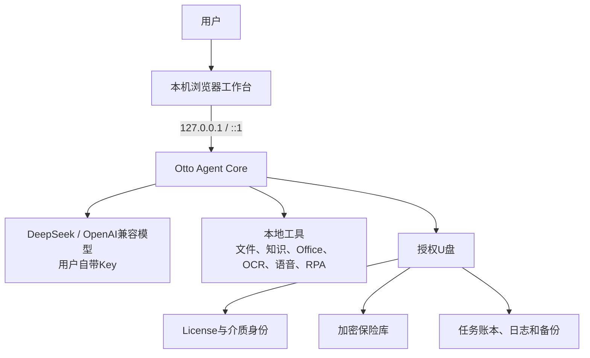
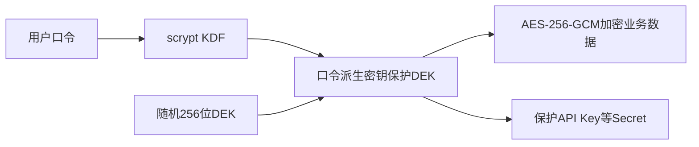
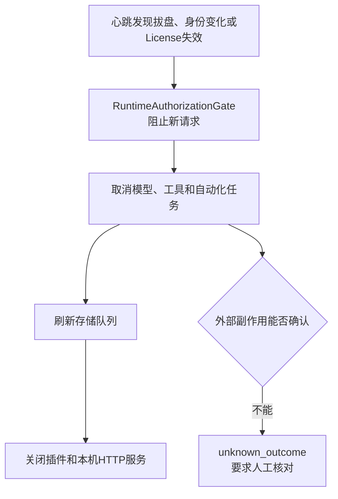

# Otto USB 便携智能体

> [!summary] 一句话结论
> **Otto USB 是一个随授权 U 盘携带、在 Windows 电脑本地运行的个人 AI Agent：程序、插件和加密数据主要在 U 盘中，界面通过本机浏览器打开，通用大模型则使用用户自己的 API Key 联网调用。**

> [!warning] 版本与证据口径
> 本笔记根据《Otto USB技术说明手册（非技术同事版）_2026-08-21》整理。手册标注的当前状态为 **`1.0.0-rc.1` 预验收候选版**，不等于正式销售版。测试数字、代码能力和未完成事项均为手册截至 2026-08-21 的项目声明，我没有独立复核源码、正式证书、实体 U 盘或 GitHub Release。

## 生活类比

可以把 Otto USB 想象成一个随身携带的小型办公室：

| Otto USB 组成 | 生活类比 | 作用 |
|---|---|---|
| 便携运行时 | 随身办公室 | 带着 Node.js、程序、插件和启动器 |
| Agent Core | 会拆任务的助理 | 组织模型、工具、审批和结果 |
| 工具与插件 | 办公工具箱 | 文件、知识、Office、OCR、语音和自动化 |
| 加密保险库 | 带密码的保险箱 | 保存 Key、聊天、记忆、知识和任务 |
| U 盘许可证 | 实体钥匙 | 只有授权介质持续在场时允许运行 |

它不是把一个普通聊天网页复制到 U 盘。真正的产品价值来自这五部分一起工作。

## 当前产品定位

| 项目 | 手册中的当前结论 |
|---|---|
| 平台 | Windows x64 便携运行 |
| 界面 | 由本机浏览器打开 |
| 版本 | `1.0.0-rc.1` 预验收候选 |
| 主要场景 | 课程演示、培训、销售工具、轻量个人业务、少量受控用户 |
| 模型 | 用户自带 API Key，支持 DeepSeek 和 OpenAI 兼容接口 |
| 数据 | 业务数据、模型 Key、知识和历史默认进入 U 盘加密存储 |
| 企业服务 | 可以带离线业务插件，但不提供 Otto 在线企业 Server |

最准确的商业描述是：

> **以实体 U 盘为载体的便携个人 Agent，支持联网模型和本地加密数据；企业在线服务不在这个产品范围内。**

## 它不是什么

Otto USB 不是：

- Otto 企业服务器；
- 自研基础大模型；
- 完全离线的通用 AI；
- 绝对无法复制的硬件加密狗；
- 可以无人值守控制整台电脑的机器人；
- 已完成正式销售验收的 v1.0.0 制品。

固定课程示例可以离线运行，但使用 DeepSeek 等通用模型仍然需要网络和 API Key。

普通 U 盘的介质检查可以防普通复制和误用，但不能抵抗专业硬件克隆、本机管理员替换运行时或高强度物理攻击。

## 适合哪些场景

- 老师在没有安装开发环境的电脑上演示 Agent；
- 销售人员携带自己的资料和工作流到客户现场；
- 个人用户在多台 Windows 电脑间携带聊天、记忆、知识和任务；
- 小团队演示园区、库存、控价、溯源和巡店等离线业务案例。

它当前不适合直接承担：

- 大规模企业在线协作；
- 无人值守高风险自动化；
- 需要硬件级不可克隆保证的授权；
- 尚未完成正式签名和实体盘验收的客户生产交付。

## 总体架构



### 浏览器界面不等于云服务

页面访问的 `127.0.0.1` 或 `::1` 是 **Loopback（回环地址）**，表示当前电脑自己。

所以：

- 界面显示在浏览器里；
- Otto 后端仍运行在本机；
- 业务数据不会因为用了浏览器就自动上传到 Otto 服务器；
- 只有用户选择的联网模型或第三方动作会把必要数据发出本机。

相关基础概念：[[TCP、HTTP、HTTPS与WebSocket]]、[[TLS与数字证书]]、[[WebView]]。

## 一次普通聊天怎样流动

1. 浏览器把用户输入发送给本机 Otto。
2. Otto 读取当前会话、模型配置和用户明确启用的记忆。
3. Otto 使用 HTTPS 请求用户选择的模型供应商。
4. 模型通过流式协议返回文字，界面边接收边显示。
5. 完成后，聊天记录写入 U 盘加密存储。

## 一次工具任务怎样流动

1. 模型提出结构化 Tool Call，例如读取 PDF 或生成表格。
2. Otto 判断模型是否有权看见该工具。
3. 使用 JSON Schema 检查参数类型、必填项和范围。
4. 对读取、写入、外发、凭据或自动化操作显示批准卡。
5. 用户只批准或拒绝当前这一次调用。
6. 执行前再次检查 U 盘在场、任务未取消、授权仍有效。
7. 保存任务结果、费用、工具状态和错误。

> [!important] 核心原则
> **模型只能建议动作；用户批准、本地策略和工具运行时才决定是否执行。**

## 为什么新电脑不需要安装 Node.js

正式便携包会包含固定版本的 Node.js 运行时。Node.js 是执行 Otto JavaScript 核心和插件的环境。

| 机制 | 做法 | 价值 |
|---|---|---|
| 固定 Node 版本 | 使用受控 Windows x64 官方归档并校验 SHA-256 | 减少电脑环境差异 |
| 尽量零生产依赖 | 不在客户现场临时下载 npm 包 | 断网也能启动，降低供应链风险 |
| 启动入口 | 预验收可用 BAT，正式版需要签名启动器 | 普通用户双击使用 |
| 单实例 | 同一介质只运行一个正式实例 | 避免端口冲突和数据并发写坏 |
| 本机浏览器 | 本地服务启动后打开工作台 | 不需要安装单独网页服务器 |

相关概念见 [[Node.js与pnpm]]、[[TypeScript与JavaScript]]、[[CMD、Bash与PowerShell]]。

## Agent 的关键控制点

| 控制点 | 做法 | 解决的问题 |
|---|---|---|
| 工具可见性 | 工具声明允许哪些模型或来源使用 | 模型不能猜名称调用隐藏工具 |
| 参数校验 | JSON Schema 检查类型、长度和范围 | 阻止错误参数直接进入执行层 |
| 逐次批准 | 每次高影响调用单独批准 | 避免一次授权永久有效 |
| 两阶段执行 | 批准绑定任务、会话、调用和原始参数 | 防止换参数或重放批准 |
| 执行前复核 | 提交前再检查授权、取消和 U 盘状态 | 缩小竞态窗口 |
| 任务状态机 | running、approval_required、completed 等 | 让失败和取消可解释 |
| 结构化错误 | 稳定错误码和安全摘要 | 便于诊断且不暴露内部堆栈 |

一次“读取本地文件”可能随后把文件片段回填给联网模型，所以 Otto 还要区分数据流向：

- 只留在本地；
- 发送给模型供应商；
- 发送给其他第三方。

相关概念：[[状态机与幂等性]]、[[Agent工具运行时：执行流水线、并发调度与Code Mode]]。

## BYOK、模型接入和费用

**BYOK（Bring Your Own Key，用户自带密钥）**表示用户使用自己的模型账号和 API Key。

Otto USB 的设计目标是：

- 不把老师、公司或产品方的统一模型 Key 预装进 U 盘；
- 不要求请求先经过 Otto 中央服务器；
- DeepSeek 和其他 OpenAI 兼容供应商分别保存配置；
- API Key 进入本地便携 SecretStore；
- Key 不进入 URL、浏览器历史、日志和明文配置。

### OpenAI-Compatible

**OpenAI-Compatible（OpenAI 兼容接口）**表示其他模型供应商采用与 OpenAI API 相近的请求和响应结构。相近不代表完全相同，仍要测试：

- 请求路径；
- `Authorization`；
- 消息角色；
- Tool Call 格式；
- 流式事件；
- 错误码；
- 用量字段。

### SSE 流式输出

**SSE（Server-Sent Events，服务器发送事件）**让模型回复可以边生成边显示。

Otto 需要处理：

- 中文分片；
- 工具调用分片；
- 用量汇总；
- 取消连接；
- 响应上限；
- 429、5xx 和超时；
- 长度截断和内容过滤。

一旦已经向用户显示部分内容，就不能盲目重放整个请求，否则可能重复计费或产生重复动作。

### 费用估算的边界

Otto 可以根据供应商返回的 Token 用量和用户填写的单价估算费用，也可以设置观察停止线；但它不是供应商余额查询，更不是银行式硬额度系统。

第一轮请求已经发出以后，本地程序无法绝对阻止供应商产生费用。

## 多会话、摘要与个人记忆

### 多会话

每个模型供应商可以建立多个会话。用户可以新建、重命名、搜索、删除和导出预览。

### 上下文摘要

长对话全部发送给模型会提高 Token 费用并占用上下文窗口。Otto 允许用户显式生成摘要，并记录来源消息数量、覆盖位置和哈希。

安全原则包括：

- 摘要被当作不可信历史资料；
- 摘要不能覆盖系统安全规则；
- 摘要失败不能删除原消息；
- 来源变化时防止旧摘要覆盖新历史；
- 摘要过期时明确提醒。

### 个人记忆

个人记忆默认关闭。模型只能提出记忆候选，用户确认后才保存。

用户应该能够：

- 查看来源；
- 启用或停用；
- 编辑；
- 搜索；
- 彻底删除。

这样可以减少把模型幻觉、错误事实或敏感内容自动保存成长期记忆的风险。

## 文件问答与个人知识库

手册列出的材料包括：

| 类型 | 主要处理方式 | 引用信息 |
|---|---|---|
| TXT/Markdown | 文本分段和索引 | 文件名、段落、摘录 |
| CSV/JSON | 结构化解析 | 记录位置和字段 |
| PDF | 文本提取，扫描件可走 Windows OCR | 页码、摘录和警告 |
| DOCX | 段落和表格文字 | 文档位置和摘录 |
| XLSX | 工作表、单元格和安全公式文本 | 工作表和行列位置 |
| PPTX | 幻灯片文字 | 页序和摘录 |
| 图片 | 本地识别或确认后发送视觉模型 | 文件来源和识别结果 |

### 当前检索不是大型神经网络 RAG

Otto USB 手册描述的个人检索结合：

- 词法匹配；
- 同词、短语和同义词；
- 确定性哈希向量；
- 覆盖度、位置、文档状态和冲突重排。

这里的向量不是专用 Embedding 模型生成的神经网络向量。优点是便携、低成本、可离线；缺点是复杂同义表达、专业术语和大规模语料的召回质量有限。

所以它更像“轻量本地混合检索”，不能直接等同于成熟的大型 RAG 平台。详见 [[RAG、Naive RAG与GraphRAG]]。

### 文件安全边界

- 文件必须由用户明确选择；
- 限制目录深度、文件数、总容量和扩展名；
- 拒绝符号链接、特殊文件和路径穿越；
- 检索结果保留来源；
- 发送联网模型前仍按数据外发处理。

## 文档、表格、OCR、图片和语音

Otto USB 手册声称可以读取或生成基础 PDF、DOCX、XLSX、PPTX、Markdown、TXT 和安全 CSV。

### 边界

- CSV 要防止以 `=`、`+`、`-`、`@` 开头的公式注入；
- 基础 Office/PDF 生成不等于完整 Microsoft Office 排版引擎；
- 复杂页眉页脚、宏、高级图表和精细版式需要人工复核；
- OCR 对低清、手写、复杂表格和多栏材料可能不准确；
- 图片发送视觉模型前要限制类型、大小、像素和数量；
- 浏览器语音识别可能调用浏览器厂商服务，不能笼统宣传“完全本地”。

## RPA 与 Windows/网页自动化

| 能力 | 技术基础 | 主要控制 |
|---|---|---|
| CMD、PowerShell、程序 | 受控进程执行器 | 逐次批准、命令清单、超时和输出上限 |
| Windows 界面 | UI Automation 控件树 | 只操作用户批准的窗口和动作 |
| 网页浏览 | 隔离 Edge 和 CDP | 域名白名单、步骤上限和网络边界 |
| 截图/OCR | 受控截图和 Windows OCR | 尺寸限制、确认和禁止自动外发 |

### 进程隔离的边界

手册描述了低完整性受限令牌、Job Object、清理环境变量、固定工具路径和资源限制。这能降低风险，但不等于 Windows AppContainer 或完整虚拟机沙箱。

### 网页自动化为什么要防私网访问

Agent 控制的浏览器可能被滥用为访问本机或内网设备的跳板，因此手册要求拒绝：

- 回环地址；
- 私网 IPv4/IPv6；
- 链路本地；
- ULA、组播和其他非公网地址；
- WebSocket、WebTransport、WebRTC、QUIC 等可能的旁路。

解析后的 IP 还需要固定，并保留 HTTPS 的 SNI 和证书校验。这类风险与 SSRF、DNS rebinding 有关。

### 刻意不做的动作

- 不自动绕过密码、验证码和 MFA；
- 不承诺稳定控制任意 iframe、Shadow DOM 或浏览器扩展；
- 不保存无人值守高风险定时任务；
- 重启后不盲目继续可能产生外部副作用的动作。

## 插件系统

插件通过 manifest 声明名称、版本、工具、面板和权限，例如：

- 自己的存储；
- 模型调用；
- Secret；
- 网络；
- 系统自动化。

手册列出的内置插件包括：

| 插件 | 作用 |
|---|---|
| `model-deepseek` | DeepSeek 和 OpenAI 兼容模型接入 |
| `model-demo-local` | 固定离线课程案例 |
| `personal-workspace` | 文件、知识、Office、OCR、图片和语音 |
| `personal-automation` | 命令、Windows UI 和 Edge 自动化 |
| `ui-workspace` | 工作台、会话、任务和诊断界面 |
| `license-usb` | License 状态展示；核心校验不依赖可删除插件 |

离线课程业务插件包括控价、溯源、库存和巡店。

官方插件可经签名和版本白名单在主进程运行；第三方插件使用 Worker 和能力代理。但是这仍不是操作系统级强沙箱。开放插件市场前还需要更强隔离、撤销、升级和安全审核。

## 加密保险库

Otto USB 不直接用用户密码加密每一条数据，而是采用“密码保护密钥、密钥保护数据”的两层结构。



### 关键算法

| 算法或机制 | 用途 |
|---|---|
| AES-256-GCM | 加密业务数据和 Secret，同时检测篡改 |
| scrypt | 从用户口令派生密钥，提高离线猜密码成本 |
| 随机 DEK | 真正加密大量数据 |
| 版本化信封 | 保存 provider、keyId、scope 和密文结构 |

手册记录的 scrypt v2 参数为 `N=65536、r=8、p=1`，这是项目版本细节，未来可能变化。

### 为什么默认不用 Windows DPAPI

DPAPI 往往绑定当前 Windows 用户或设备，适合固定电脑，却会破坏“同一个 U 盘换电脑使用”的目标。因此 Otto USB 默认使用用户口令便携保险库；DPAPI 只保留为旧数据显式迁移工具，不允许静默降级。

### 写入可靠性

手册描述的流程是：

```text
同目录临时文件 → 刷新文件 → 原子替换 → 保留上一版本
```

如果主文件和备份都损坏或认证失败，系统应该 fail-closed，而不是返回空数据让用户误以为内容被清除。

## U 盘许可证和在场检查

### License 信任链

产品内置受信许可证公钥，使用 Ed25519 验证 `license.bin`。许可证包含：

- 产品版本；
- 有效期；
- 介质策略；
- 允许的发布签名公钥指纹。

### 为什么不是绑定某一台电脑

设计不使用 MachineGuid、主板、CPU 或首块硬盘作为主要授权绑定。同一只正式 U 盘可以在多台兼容 Windows 电脑使用。

授权绑定的是：

- U 盘介质身份；
- 许可证；
- U 盘持续在场。

### 介质身份

Windows 探测会组合 USB/可移动特征、设备序列、卷序列和文件系统信息，并形成脱敏哈希。程序、许可证、数据和运行时要属于同一受支持介质。

### 运行中拔盘



`unknown_outcome` 表示动作可能已经影响外部系统，但 Otto 无法确认最终结果。此时不应该立即重试，否则可能重复发消息、重复写入或重复扣费。

### 防复制的真实边界

| 场景 | 预期效果 | 边界 |
|---|---|---|
| 复制到硬盘 | 正式运行时拒绝 | 依赖官方运行时和签名链未被替换 |
| 复制到另一只普通 U 盘 | 介质身份不符 | 高级工具可能伪造设备序列 |
| 删除许可证插件 | 核心启动器仍校验 | 管理员可能替换整个程序 |
| 替换发布公钥 | 许可证钉住指纹后应拒绝 | JavaScript 自校验不是硬件信任根 |
| 专业硬件克隆 | 无法作密码学保证 | 需要安全芯片和不可导出私钥 |

正确宣传是“防普通复制和误用”，不能说“绝对不可复制”。

## 本机 HTTP 为什么也要防护

恶意网页可能尝试请求用户电脑上的 `127.0.0.1` 服务，因此本地服务也要鉴权。

手册描述的措施包括：

- 只监听回环地址；
- 检查 Host、Origin 和 `Sec-Fetch-Site`；
- 短期一次性 nonce 换取 `HttpOnly`、`SameSite=Strict` Cookie；
- 跳转到不含 Token 的干净 URL；
- Token 不进入查询参数、HTML、浏览器历史和截图；
- 静态资源路径 canonicalize、realpath 并检查目录边界；
- 拒绝 `..`、绝对路径、NTFS ADS、符号链接和特殊文件；
- 插件 HTML 使用受限 iframe 和工具白名单；
- 限制请求体、并发和超时。

## 发布供应链

```text
许可证公钥
  ↓ 验证 license.bin
许可证钉住发布公钥指纹
  ↓ 验证 Ed25519 发布清单
清单逐文件 SHA-256 + CycloneDX SBOM
  ↓ 验证固定 Node 与便携 ZIP
Windows Authenticode + RFC3161 时间戳
```

### 这些技术分别做什么

- **Ed25519**：验证许可证和发布清单数字签名；
- **SHA-256**：检查文件字节是否变化；
- **SBOM（Software Bill of Materials，软件物料清单）**：列出运行时、插件和依赖；
- **Authenticode**：让 Windows 验证软件发行者；
- **RFC3161 时间戳**：证明签名发生在证书有效期内。

### 截至手册日期仍缺什么

- 企业 Authenticode 证书；
- 正式许可证私钥和发布私钥托管；
- 针对最终介质签发的 `license.bin`；
- 签名 ZIP、正式 SBOM 和 GitHub Release；
- 两台以上真实 Windows 电脑和实体 U 盘验收；
- 正式版本号和完整发布流程。

## 备份、恢复与忘记密码

### 加密备份

备份包含加密业务数据和受恢复密钥保护的 DEK，但不包含：

- `license.bin`；
- 模型 API Key；
- Webhook；
- 保险库口令。

恢复前要验证清单、哈希、HMAC、信封结构和每条 AES-GCM 密文。只有全部记录都能认证解密并解析，才写入恢复目标。

### 为什么恢复密钥要分开

如果备份和恢复密钥都放在同一只 U 盘，丢盘时会一起丢失。它们应该放在不同的受控介质或保险柜，并定期做真实恢复演练。

### 忘记保险库口令

- 有合格恢复包和恢复密钥：可以验证后创建新保险库并恢复业务数据；
- 模型 API Key 和 Webhook：需要重新录入；
- 没有恢复包：原数据无法解密。

这是加密系统的正常结果，不应该存在一个产品方万能后门。

## 诊断中心

诊断中心可以汇总：

- 版本和介质状态；
- 模型配置和连接测试；
- HTTP 错误码和延迟；
- Token 和费用估算；
- 工具成功率和最近任务。

导出前要脱敏 Token、Authorization、URL userinfo、路径、提示词、回复、工具参数和 Secret。诊断默认不包含明文业务内容。

## 测试体系和证据边界

手册列出的测试类型包括：

- 正向、反向和边界测试；
- 异常和故障测试；
- 渗透和变异测试；
- 构建验证；
- 真实 U 盘和 Windows 硬件验收。

### 手册记录的自动化结果

| 门禁 | 手册中的结果 |
|---|---|
| Node 全量测试 | 697/697 通过 |
| 代码覆盖率 | 语句/行 90.33%，函数 93.08%，分支 77.88% |
| 变异测试 | 多个关键模块约 92.49%–100% |
| Rust 启动器 | 5/5 通过 |
| GitHub Checks | 手册称当前代码门禁通过 |

这些数字不能代替：

- 多台 Windows 10/11 真实电脑；
- 未安装 Node 的机器；
- 盘符变化；
- 拔盘、Hub 重连和睡眠恢复；
- 磁盘满、只读、慢盘和断电；
- Defender 和杀毒软件兼容；
- 正式证书、License、ZIP、SBOM 和 Release。

## 技术含量在哪里

Otto USB 的技术含量不在于训练了一个更大的模型，而在于把外部模型变成一个：

- 可以携带；
- 可以授权；
- 可以审计；
- 可以恢复；
- 能安全调用工具；
- 尽量减少数据暴露；
- 能形成正式发布证据的本地产品。

它同时涉及：

- 便携运行时；
- Agent 工程；
- 文件与 Office 处理；
- 本机和网络安全；
- 密码学与密钥管理；
- U 盘授权；
- RPA；
- 软件供应链；
- 测试和实体硬件验收。

## 商业许可边界

手册指出当前仓库标记为 Apache-2.0。Apache-2.0 允许接收者复制、修改和再分发代码，因此不能只依赖“法律上不允许修改 JavaScript”来构建 License 的核心安全承诺。

未来可能需要由律师确认：

- 专有商业许可；
- 双许可证；
- 开源核心与专有内容、品牌、升级和服务分离；
- 历史已发布版本和贡献者授权。

## 普通同事怎样使用

1. 确认是兼容的 Windows x64 电脑。
2. 插入原始授权 U 盘。
3. 从 U 盘根目录启动 Otto，不要先复制到硬盘。
4. 遇到 Windows/Defender 提示时检查发布者和签名，不要绕过未知来源警告。
5. 浏览器打开本机工作台后，首次设置保险库强口令。
6. 使用联网模型时填写自己的 API Key，并先做连接测试。
7. 仔细阅读文件、网络、命令、网页和写入操作的批准卡。
8. 结束时先在 Otto 中安全退出，等待存储刷新，再安全弹出 U 盘。

每次使用要记住：

- API Key 不要发给别人；
- 不理解影响时不要批准高风险动作；
- 定期创建加密备份；
- 恢复密钥和 U 盘分开保存；
- 遇到 `unknown_outcome` 先核对外部结果；
- 带 `PREACCEPTANCE` 或 `NOT FOR RELEASE` 的包只能内部测试。

## 一分钟对外介绍

> Otto USB 是一款装在授权 U 盘里的个人 AI Agent。用户不需要部署 Otto 企业服务器，也不需要预先安装开发环境；插入 U 盘后，可以在本机浏览器工作台使用。它支持用户自己的 DeepSeek 或 OpenAI 兼容模型，也能处理会话、记忆、文件、知识检索、基础 Office/OCR 和受控自动化。聊天、知识、任务和模型 Key 主要保存在 U 盘加密保险库中。高影响工具逐次请求批准。它不提供企业在线协作，也不承诺普通 U 盘具备硬件级绝对防复制。当前 RC 版本仍要完成正式签名、密钥、实体盘多机验收和 Release 才能销售交付。

## 常见误区

### 误区一：浏览器打开就是云端网页

本机浏览器可以只连接 `127.0.0.1`，核心后端仍在当前电脑。

### 误区二：数据在 U 盘就绝对不会联网

联网模型需要把用户明确提交的提示、附件或检索片段发送给模型供应商。

### 误区三：加密后忘记密码还能找回

只有提前准备恢复包和恢复密钥才能恢复；没有后门才是可信加密系统的正常设计。

### 误区四：防普通复制就是硬件不可克隆

普通介质身份可以防低成本复制和误用，但无法替代安全芯片和不可导出私钥。

### 误区五：697 个测试通过就能正式销售

自动测试不能替代正式证书、签名密钥、真实制品、实体盘、多机、断电和恢复验收。

## 与 Otto 主产品的关系

Otto USB 是独立便携个人/课程产品；[[Otto产品总体技术架构|Otto 主产品]]还包括企业 Server、PostgreSQL、Redis、S3、Control、Edge 和 Federation 等企业体系。详细对照见 [[Otto与Otto USB对比及重点摘要]]。

## 建议学习路线

1. 先看 [[Otto与Otto USB对比及重点摘要]]。
2. 理解 [[Node.js与pnpm]] 和本机 HTTP。
3. 学习 [[Prompt Engineering与Loop Engineering]] 和 Agent 循环。
4. 学习 [[状态机与幂等性]]，理解取消、重试和 `unknown_outcome`。
5. 学习 [[RAG、Naive RAG与GraphRAG]] 和 [[MCP模型上下文协议]]。
6. 最后再深入加密、许可证和供应链。

## 资料来源

- `C:\Users\14975\Desktop\Otto USB技术说明手册（非技术同事版）_2026-08-21.docx`
- 文档日期：2026-08-21。
- 核对范围：完整标题、正文和表格；原文档无内嵌图片。
- 未独立核对：源代码、自动化测试结果、正式证书、实体 U 盘、GitHub Release 和商业许可法律意见。
