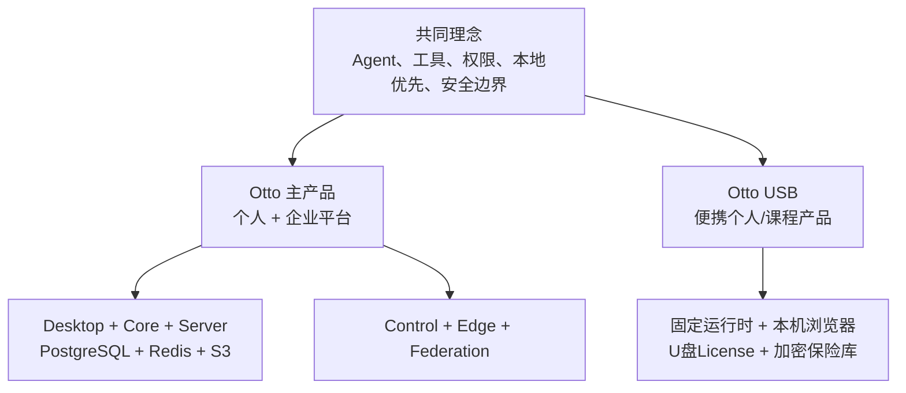
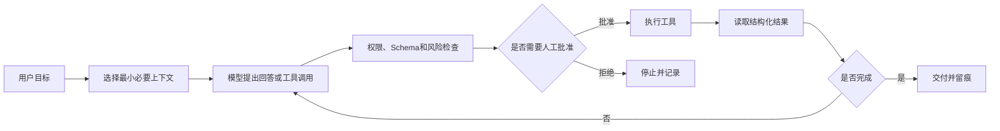

# Otto 与 Otto USB 对比及重点摘要

> [!summary] 一句话结论
> **Otto 主产品是一套面向个人与企业的完整 Agent 平台；Otto USB 是其中理念相近但产品边界独立的便携个人/课程 Agent，主要把程序和加密数据带在授权 U 盘上，不提供在线企业 Server。**

> [!warning] 阅读口径
> 本摘要依据两份 2026-08-21 内部技术说明手册整理。它总结的是手册陈述，不是对源码、生产环境、外部审计或正式 Release 的独立认证。

## 最重要的十个结论

1. **Otto 的重点不只是模型。** 真正的产品由 Agent Core、工具、Skills、权限、数据、审计、部署和发布治理共同组成。
2. **模型不等于 Agent。** 模型负责理解和生成候选计划；Otto 负责身份、权限、工具执行、存储、取消和恢复。
3. **Otto 主产品与 Otto USB 是两个产品边界。** 主产品包含企业 Server、Control、Edge、Federation 等体系；USB 版不提供在线企业服务。
4. **两者都强调本地优先和最小数据。** 能留在本机或客户数据平面的信息，不应无差别上传 Control 或模型供应商。
5. **工具调用必须受控。** 高风险工具需要参数校验、逐次批准、执行前复核、状态记录和取消机制。
6. **数据要按用途分层。** 企业关系数据用 PostgreSQL，短期协调用 Redis，附件用 S3/MinIO，桌面离线数据用 SQLite/SQLCipher。
7. **安全能力必须区分候选与正式。** Otto 的 MLS/E2EE 在手册中仍是候选状态；Otto USB 也仍是 `1.0.0-rc.1` 预验收版。
8. **有代码不等于已交付。** 还需要真实制品、签名、CI、硬件/环境验收、灾备、长稳和外部审计。
9. **Otto USB 防的是普通复制和误用。** 普通 U 盘不能提供硬件级绝对不可克隆保证。
10. **对外表达要诚实说明数据去向和边界。** 哪些在本机、哪些在客户服务器、哪些会发送给模型供应商，都要清楚告诉用户。

## 两个产品的关系

它们共享许多技术思想，但不能把主产品的企业能力自动算到 USB 版，也不能把 USB 版的介质授权当作主产品的主要部署方式。

## 核心差异对照

| 项目 | Otto 主产品 | Otto USB |
|---|---|---|
| 定位 | 个人与企业商业 Agent 平台 | 便携个人/课程 Agent |
| 主要入口 | 桌面应用、企业服务和未来网页能力 | 授权 U 盘 + 本机浏览器工作台 |
| 企业 Server | 支持私有化 Server、组织、审计和协作 | 不提供在线企业 Server |
| 企业身份 | 组织、角色、设备，未来补齐 OIDC/SAML/SCIM | 主要是个人使用和 U 盘介质授权 |
| 数据位置 | 本机 + 客户企业数据平面 + 可选 Control/Edge | 聊天、知识、任务和 Key 主要随 U 盘携带 |
| 数据库 | 桌面 SQLite/SQLCipher，服务端 PostgreSQL | 便携加密存储和 SecretStore |
| 附件 | 客户 S3/MinIO，PostgreSQL 管权限和状态 | U 盘或用户明确选择的本地文件 |
| 模型接入 | BYOK 或企业 Edge Gateway | BYOK，DeepSeek/OpenAI 兼容接口 |
| 协作 | 企业组织、私聊候选、跨部署 Federation | 无在线企业协作 |
| License | Control 管企业部署、席位和版本 | 签名 `license.bin` + U 盘介质身份和在场检查 |
| 离线能力 | 桌面缓存和部分本机工具 | 固定课程案例可离线；通用模型仍需联网 |
| 自动化 | 桌面/服务端受控工具和企业流程 | 受限 CMD、PowerShell、Windows UI 和 Edge 自动化 |
| 当前成熟度 | 企业工程基础较深，但多个生产门禁未闭环 | `1.0.0-rc.1` 预验收候选，尚非正式销售版 |

## 共同的 Agent 工作方式

两份手册都强调下面的循环：

这就是为什么 Otto 不只是 Prompt。相关知识：[[Prompt Engineering与Loop Engineering]]、[[Agent工具运行时：执行流水线、并发调度与Code Mode]]。

## 两者共同的安全原则

### 1. 模型不是权限主体

模型可以输出工具调用意图，但不能因为“模型这样说”就直接执行。

真正决定执行的是：

- 当前用户身份；
- 允许的工具；
- 参数 Schema；
- 风险策略；
- 用户批准；
- 执行时的最新状态。

### 2. 发送给模型也属于数据外发

工具在本地读取文件后，如果结果被放回联网模型的下一轮输入，数据实际上已经离开本机。因此不能只检查“工具有没有修改文件”，还要检查结果会发给谁。

### 3. 失败时不要偷偷降低安全

两份手册都强调 **Fail-closed**：验证、密钥、License 或安全依赖失败时拒绝继续，而不是回退到明文、默认密钥或无授权模式。

### 4. 重试前要考虑副作用

如果网络断开时无法确认外部动作是否成功，任务应进入类似 `unknown_outcome` 的状态，由人核对，而不是盲目再次执行。相关概念见 [[状态机与幂等性]]。

### 5. 安全宣称需要证据

“使用了加密算法”不等于“整个产品已经安全”。还需要：

- 威胁模型；
- 密钥生命周期；
- 真实制品；
- 外部审计；
- 发布批准；
- 备份恢复；
- 故障和攻击场景验收。

## 数据去向快速回答

### Otto 主产品

| 数据 | 默认或目标位置 |
|---|---|
| 本机离线会话和缓存 | Desktop 的 SQLite/SQLCipher |
| 企业账号、组织和审计 | 客户 PostgreSQL |
| 企业附件 | 客户 S3/MinIO，通常保存密文 |
| 短期会话、限流和租约 | Redis |
| 私聊正文 | 客户端明文，Server 保存密文；正式能力仍受 E2EE 门禁 |
| 模型提示和回复 | 用户选择的模型供应商，可能经 Edge 流式转发 |
| License、版本和运营状态 | Otto Control，不应含聊天和文件正文 |

### Otto USB

| 数据 | 默认或目标位置 |
|---|---|
| 聊天、记忆、知识和任务 | U 盘加密保险库 |
| 模型 API Key | U 盘便携 SecretStore |
| 许可证 | U 盘 `license.bin` |
| 联网模型提示、附件片段和回复 | 用户选择的模型供应商 |
| 本机浏览器页面 | 当前电脑的回环地址 |
| 业务备份 | 用户创建的加密备份；恢复密钥应分开保存 |

## 技术栈重点

### Otto 主产品

- Electron 主进程、Preload 和 Renderer 分层；
- Otto Core Agent 运行时；
- PostgreSQL 企业权威数据；
- Redis 短期协调；
- S3/MinIO 对象存储；
- SQLCipher 桌面整库加密；
- Control、Edge Gateway 和 Federation；
- MLS/E2EE 候选协议；
- MCP、Skills、Tool 和 RPA。

### Otto USB

- 固定 Node.js 便携运行时；
- 本机浏览器和回环 HTTP；
- DeepSeek/OpenAI-Compatible BYOK；
- SSE 流式响应；
- 本地文件、知识、Office、OCR 和 RPA；
- AES-256-GCM、scrypt 和便携 DEK；
- Ed25519 License 和发布清单；
- U 盘介质身份和运行时在场检查；
- Authenticode、SHA-256 和 SBOM 发布门禁。

## 当前状态怎样理解

### Otto 主产品

手册认为较扎实的是 Agent 内核、桌面分层、PostgreSQL/S3/Redis 数据平面、Control、Edge 和 MLS 候选实现。

但最重要的未完成项包括：

- E2EE 第三方审计和生产批准；
- 来自正式发布源的签名制品；
- 真实规模数据迁移、PITR 和多副本故障演练；
- 企业统一身份；
- 耐久工作流；
- 知识/Skill 治理；
- 24/72 小时长稳与成本对账；
- 合规、合同和第三方验收。

### Otto USB

手册将其定义为 `1.0.0-rc.1` 预验收候选。自动化测试结果较完整，但正式销售仍缺：

- 企业 Authenticode 证书；
- 正式许可证和发布私钥；
- 针对最终介质签发的 License；
- 正式 ZIP、签名、SBOM 和 Release；
- 多台真实 Windows 电脑和实体 U 盘验收；
- 断电、只读、慢盘、拔盘和 Defender 等现实环境证据。

## “有代码”到“正式交付”的六层证据

| 层级 | 应有证据 |
|---|---|
| 设计完成 | 威胁模型、接口、状态机和安全不变量 |
| 代码完成 | 主路径接入，类型和单元测试通过 |
| 集成完成 | 桌面、Server、数据库、存储和控制面契约通过 |
| 制品完成 | 从干净 commit 构建，签名、哈希和 SBOM 齐全 |
| 生产验收 | 真实环境、容量、故障、恢复和安全审计完成 |
| 正式发布 | 发布源、CI Checks、Release 和部署证据可追溯 |

这是两份手册中最值得保留的产品工程思想：**不要把任何较低层级说成较高层级。**

## 面向客户怎样介绍

### Otto 主产品

> Otto 是面向个人与企业的桌面优先 AI coworker。它把多模型、文件和代码工具、Skills、知识、工作流和企业协作放入同一套可审计运行时。企业可以私有化部署，把权威业务数据放在自己的 PostgreSQL、对象存储和缓存中，并通过 Edge Gateway 控制模型访问和费用。正式能力以实际 Release、签名制品、部署和验收证据为准。

### Otto USB

> Otto USB 是随授权 U 盘携带的个人 AI Agent。用户不需要部署企业 Server，也不需要预装开发环境；插入 U 盘后可以在本机浏览器中使用。程序和核心数据主要留在 U 盘，联网模型使用用户自己的 API Key。高影响工具逐次批准。它能防普通复制和误用，但不承诺硬件级绝对不可克隆。当前 RC 版本完成正式签名和实体盘验收后才能销售交付。

## 不应使用的宣传语

- “绝对安全”；
- “服务器永远不可能看到任何数据”；
- “已达到 Signal 等级”；
- “E2EE 已经过独立外部审计”，除非真实门禁已经完成；
- “Otto USB 完全离线”，因为通用模型需要联网；
- “普通 U 盘绝对不可复制”；
- “所有平台和高可用都已经正式验证”；
- “有测试通过就已经可以正式销售”。

## 初学者最容易混淆的词

| 词 | 在 Otto 中的含义 |
|---|---|
| Model | 负责语言理解和生成的模型 |
| Agent | 围绕目标反复调用模型和工具的执行系统 |
| Tool | Agent 能调用的受控动作 |
| Skill | 可复用的方法、模板、脚本和质量约束 |
| MCP | 连接第三方工具和资料的标准协议 |
| Control Plane | 管理策略、License、发布和运营的控制面 |
| Data Plane | 真正处理客户业务数据的数据面 |
| BYOK | 用户提供自己的模型 API Key |
| E2EE | 发送端加密、接收端解密，服务器保存密文 |
| SQLCipher | 带整库加密能力的 SQLite |
| S3/MinIO | 保存附件和备份对象的对象存储 |
| Fail-closed | 安全依赖失败时拒绝服务，不降低安全级别 |
| SBOM | 说明软件制品包含哪些组件的清单 |

## 阅读建议

如果你只是想快速理解产品，按下面顺序：

1. 先读本摘要的“核心差异对照”；想把技术逐项学明白，打开 [[Otto使用技术学习地图]]。
2. 想理解企业产品，再读 [[Otto产品总体技术架构]]。
3. 想理解 U 盘版，再读 [[Otto USB便携智能体]]。
4. 不理解 Agent 循环，看 [[Prompt Engineering与Loop Engineering]]。
5. 不理解工具安全，看 [[Agent工具运行时：执行流水线、并发调度与Code Mode]]。
6. 不理解知识检索，看 [[RAG、Naive RAG与GraphRAG]]。
7. 不理解 MCP，看 [[MCP模型上下文协议]]。
8. 不理解重复执行和任务状态，看 [[状态机与幂等性]]。

## 资料来源

- `C:\Users\14975\Desktop\Otto USB技术说明手册（非技术同事版）_2026-08-21.docx`
- `C:\Users\14975\Desktop\Otto总体技术说明手册（非技术同事版）_2026-08-21.docx`
- 文档日期：2026-08-21。
- 核对范围：两份文档的完整标题、正文和表格；文档均无内嵌图片。
- 未独立核对：源码、真实制品、CI、实体硬件、外部审计、生产部署和法律意见。
