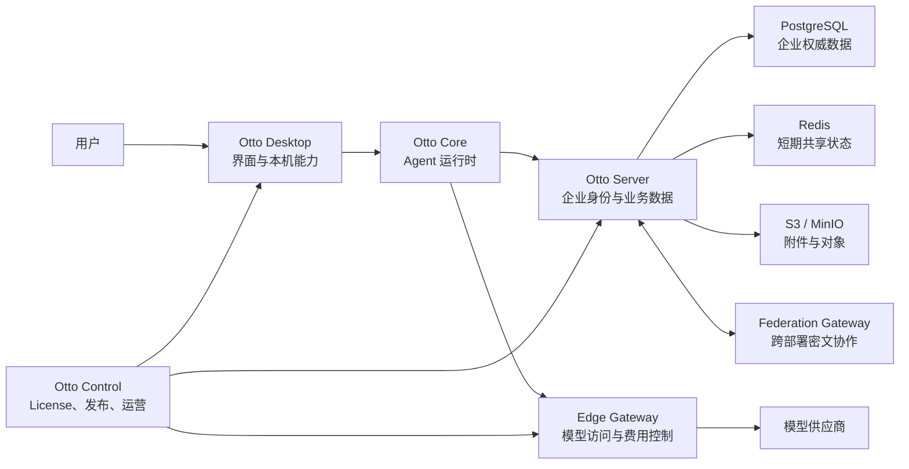
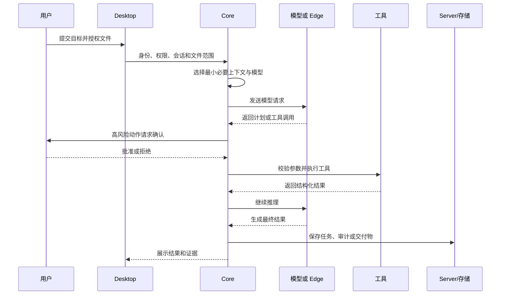

# Otto 产品总体技术架构

> [!summary] 一句话结论
> **Otto 不是单纯的聊天机器人，而是一套“桌面优先、可以调用工具、受权限和审计约束”的 AI Agent 产品架构；它把模型、工具、文件、企业数据、加密、部署和商业控制连接在一起。**

> [!warning] 核对口径
> 本笔记根据《Otto总体技术说明手册（非技术同事版）_2026-08-21》整理。这里的“已实现”“候选”“未完成”等状态是**手册在 2026-08-21 的项目说明**，并不等于我已经独立检查全部源代码、真实制品、生产环境或外部审计报告。正式对外承诺仍应回到对应 Release、commit、CI、签名制品和验收证据逐项确认。

## 先理解：Otto 要解决什么问题

大模型本身擅长理解和生成文字，但它通常不知道：

- 当前用户是谁；
- 用户有权访问哪些文件和企业数据；
- 哪些动作需要人工批准；
- 工具失败后应该怎样恢复；
- 数据应该保存在本机、企业服务器还是第三方模型供应商；
- 怎样记录操作证据；
- 软件怎样签名、升级、回滚和正式交付。

Otto 的目标，就是在模型外面增加一套可靠的运行系统。

可以把它理解成：

| 组成 | 公司类比 | 作用 |
|---|---|---|
| 大模型 | 会思考和写作的员工 | 理解问题、推理、生成计划和内容 |
| Agent Core | 工作调度员 | 组织任务循环、选择模型、调用工具、处理状态 |
| Tool | 员工能够使用的工具 | 搜索、文件、代码、Shell、业务 API 等 |
| Skill | 标准作业指导书 | 规定完成某类任务的方法、模板和检查标准 |
| 权限与审批 | 门禁和授权制度 | 阻止越权或高风险动作 |
| 审计 | 操作记录 | 说明谁在何时做了什么 |
| 数据系统 | 档案室和仓库 | 保存账号、组织、附件、任务和业务记录 |
| Control | 总部运营控制台 | 管 License、版本、签名、用量和商业策略 |

相关基础概念可以先看：[[Otto使用技术学习地图]]、[[Prompt Engineering与Loop Engineering]]、[[Agent工具运行时：执行流水线、并发调度与Code Mode]]、[[SDK与API]]。

## Otto 面向哪些角色

### 对个人用户

Otto 是桌面工作助手，可以在用户授权后：

- 读取和生成文件；
- 搜索资料；
- 编写或修改代码；
- 调用不同模型；
- 使用工具和 Skills；
- 保存会话、个人记忆和任务结果。

### 对企业员工

Otto 可以作为带企业身份和权限的工作入口，连接：

- 企业知识；
- 部门权限；
- 审批流程；
- 企业业务模块；
- 私聊与协作；
- 受控工作流。

### 对企业管理员

管理员需要管理：

- 企业、部门、账号和角色；
- 登录和设备；
- 权限与审计；
- 数据保存位置；
- 数据库、对象存储和备份状态；
- 版本、更新与安全策略。

### 对 Otto 运营方

运营方使用 Control 和 Edge Gateway 管理商业与模型接入，但原则上不应该把 Control 变成客户聊天和文件的集中数据库。

## Otto 不是什么

Otto 不应该被宣传成：

- 只有一个聊天窗口的“大模型套壳”；
- 自己训练的基础大模型；
- 默认拥有电脑最高权限的无人值守机器人；
- 把客户所有上下文统一上传到 Otto Control 的云盘；
- 已经完成全部企业级安全审计和生产验收的最终产品；
- “绝对安全”或“服务器永远不可能看到任何数据”的系统。

**正确说法应该区分设计目标、代码候选能力、真实制品和生产验收。**

## 总体组件



### Otto Desktop

桌面端是用户实际操作的客户端，负责：

- 用户界面；
- 经过授权的本机文件访问；
- 本机工具和离线能力；
- 本地会话与缓存；
- 设备凭据和客户端加密密钥；
- 企业登录和设备状态；
- 与 Server、Control、Edge 等组件通信。

### Otto Core

Core 是 Agent 核心运行时，负责：

- 一次 Agent 回合的生命周期；
- 模型选择和路由；
- 上下文预算；
- 工具注册、参数校验和调度；
- 用户确认策略；
- 取消、超时和错误处理；
- 子 Agent 生命周期和资源预算；
- 审计事件和检查点协调。

Core 不应该直接塞入所有企业页面、供应商私有逻辑和客户定制功能，否则会变成难以维护的“大泥球”。

### Otto Server

Server 是企业数据平面的核心服务，承担：

- 企业账号、组织、部门和角色；
- 登录、邀请和设备管理；
- 企业知识、Skills、工单和业务 API；
- 企业审计；
- 私聊密文、MLS 状态和附件元数据；
- 企业工作流和共享数据。

### Otto Control

**Control Plane（控制面）**管理系统怎样运行，而不负责承载主要客户业务数据。

Otto Control 主要管理：

- 客户、企业、部署和机器登记；
- License 签发、续租和撤销；
- 签名密钥 Keyring；
- 版本、Canary、Stable、Required 更新和回滚；
- 企业额度、计费、预留和对账；
- 不含业务正文的健康遥测与审计证据。

Control 原则上不应保存客户聊天、附件、提示词和模型 API Key。

### Otto Edge Gateway

Edge Gateway 位于 Otto 和模型供应商之间，负责：

- 验证短期授权；
- 把模型名映射到允许的上游；
- 限流和并发控制；
- 流式转发；
- 有界故障切换；
- 用量预留、结算和成本证据；
- 取消时中止上游请求。

它不应该成为聊天历史、知识库、附件或工作流状态的长期存储。

### Federation Gateway

**Federation（联邦或跨部署协作）**让不同私有部署之间传递授权任务或密文消息。

可以把 Federation Gateway 类比成“核对封条、转送密封信的中转站”：

- 它验证部署身份和签名；
- 防止重放；
- 管理有界离线收件箱；
- 中继端到端加密密文；
- 不应该获得拆信所需的客户端密钥。

## 一次 Agent 请求怎样流动

假设用户说：“分析这份合同并生成风险清单。”



最重要的思想是：

> **模型可以提出动作，但模型不是权限主体；真正的执行权属于 Otto 的身份、策略、用户确认和工具运行时。**

## Desktop 为什么采用 Electron 三层结构

**Electron** 可以用 Web 技术创建桌面应用。Otto Desktop 将它分成三层：

| 层 | 通俗理解 | 主要职责 |
|---|---|---|
| Main 主进程 | 后台管理员 | 窗口、文件、更新、系统密钥库、IPC 和本机高权限能力 |
| Preload 预加载 | 受控传达室 | 通过最小接口把允许的能力提供给界面 |
| Renderer 渲染层 | 用户看到的前台 | React 页面、聊天、设置和状态展示 |

这相当于“前台页面不能直接拿到整台电脑的总钥匙”。详细原理见 [[Electron桌面应用架构]]；前置知识见 [[渲染逻辑]]、[[WebView]]、[[TypeScript与JavaScript]]。

## 模型不等于 Agent

| 模型主要负责 | Otto 主要负责 |
|---|---|
| 理解语言和推理 | 身份、权限与数据边界 |
| 生成计划和内容 | 工具参数校验和真实执行 |
| 提出 Tool Call | 用户确认、取消和失败处理 |
| 根据输入产生回答 | 上下文选择、存储、审计和恢复 |

因此更换模型不等于更换整套 Otto。模型像“发动机”，Otto 是包含方向盘、刹车、车身、仪表和交通规则的整辆车。

## Tool、Skill、MCP 与 RPA

### Tool：Agent 的手和脚

一个合格工具至少需要声明：

- 名称和用途；
- 参数 Schema；
- 返回结构；
- 所需权限；
- 风险等级；
- 超时与取消行为；
- 错误类型；
- 是否产生外部副作用。

不要把模型生成的字符串直接拼成 Shell 命令。文件工具还要检查真实路径、符号链接和授权根。详见 [[Agent工具运行时：执行流水线、并发调度与Code Mode]]。

### Skill：可复用的工作方法

Skill 不只是 Prompt。它可以包含：

- 专业说明；
- 模板；
- 脚本；
- 工具调用顺序；
- 质量检查；
- 权限和适用边界。

企业 Skill 还需要签名、哈希、依赖检查、审核、版本兼容、灰度、回滚和恶意扫描。

### MCP：标准连接协议

**MCP（Model Context Protocol，模型上下文协议）**像一种连接外部工具和资料的标准插座。插座统一，不代表接入的每个服务都可信；仍需要审核身份、权限、OAuth Token、数据去向和维护者。详见 [[MCP模型上下文协议]]。

### RPA：操作网页和桌面软件

**RPA（Robotic Process Automation，机器人流程自动化）**适合固定、可验证、有人监督的办公流程。

它不适合直接无人值守执行：

- 转账；
- 批量删除；
- 权限变更；
- 绕过验证码或 MFA；
- 无法确认结果的高风险动作。

可靠 RPA 需要控件树、状态识别、重试、[[状态机与幂等性|幂等]]、人工接管和操作证据，而不应只依赖坐标点击。

## 会话、记忆、知识和任务状态要分开

| 类型 | 例子 | 保存原则 |
|---|---|---|
| 会话上下文 | 当前对话和工具结果 | 短期保存，按 Token 预算裁剪 |
| 个人记忆 | 用户偏好、长期项目事实 | 来源可见，可修订、可删除 |
| 企业知识 | 制度、SOP、合同模板 | 需要版本、ACL、租户隔离和审核 |
| 任务状态 | 步骤、审批、检查点、失败原因 | 用于恢复和审计，不混进长期记忆 |

把所有上下文无差别上传到云端会增加费用、延迟、隐私风险和噪声。Otto 的目标原则是：

1. 能在本机保存的尽量本机保存；
2. 企业权威数据保存在客户数据平面；
3. 发送模型前做相关性选择、摘要、脱敏和 Token 预算；
4. Control 与 Edge 只保存完成职责所需的最小数据。

企业知识检索最终还需要关键词、向量、结构化过滤、混合召回、重排、引用、版本和文档 ACL。相关概念见 [[RAG、Naive RAG与GraphRAG]]。

## 普通任务与耐久工作流

| 普通任务 | 耐久工作流 |
|---|---|
| 通常几秒到几分钟 | 可能持续数小时或数天 |
| 用户通常保持在线 | 可能跨重启、审批和人工接管 |
| 失败后重新发起可能足够 | 每一步必须可恢复和可补偿 |
| 状态可主要存在当前进程 | 状态必须进入可靠队列或数据库 |

生产级耐久工作流需要：

- 明确的步骤状态机；
- 幂等键；
- 多实例租约；
- 死信队列；
- 审批超时；
- 补偿事务；
- 人工查看、暂停、恢复、取消和接管。

服务器续跑也不代表服务器可以获得客户端端到端加密私钥或本机任意文件权限。

## 企业数据分别放在哪里

| 数据 | 权威位置 | 原因 |
|---|---|---|
| 桌面离线会话和缓存 | 本机 SQLite/SQLCipher | 适合单机、断网和低维护 |
| 企业账号、组织、审计和业务关系 | PostgreSQL | 适合服务器并发、事务和权威数据 |
| 会话、限流、Presence、锁和短期租约 | Redis | 多实例共享的短期协调状态 |
| 附件密文、备份和发布对象 | S3/MinIO | 适合大对象、分片和生命周期管理 |
| License、版本和运营状态 | Otto Control | 商业控制数据 |
| 模型提示与回复 | 所选模型供应商，可能经 Edge 流式经过 | 具体地域取决于路由和供应商 |

### 为什么不能让多台服务器共同写一个 SQLite 文件

SQLite 适合单机文件数据库，但不适合把同一个数据库文件放到 NFS、SMB/CIFS 等共享网络盘，由多个服务实例共同写入。这会带来锁、WAL、数据损坏和恢复问题。

正确分工是：

- 桌面端继续使用本机 SQLite/SQLCipher；
- 企业服务器使用 PostgreSQL；
- Redis 管共享短期状态；
- S3/MinIO 管附件对象。

## 附件对象存储

Otto 手册中的附件安全原则包括：

- 对象 Key 使用不可预测随机 ID，不带企业名、账号或原文件名；
- Bucket 默认私有；
- 下载前重新校验租户、账号、会话和对象 ACL；
- 预签名 URL 只在很短时间内有效，并限制对象和操作；
- E2EE 文件密钥不进入 URL、标签、对象元数据或日志；
- PostgreSQL 保存所有权、权限、配额和上传状态；
- S3 只负责保存对象字节，不负责最终权限判断。

本地附件迁移到 S3 的正确顺序是：

```text
复制 → 下载校验 → 切换权威位置 → 双读宽限 → 删除旧副本
```

不能先删除本地源再上传。

## E2EE、MLS 和设备信任

**E2EE（End-to-End Encryption，端到端加密）**的目标是让消息和附件只在发送端和接收端以明文存在，服务器只保存或中继密文。

手册说明 Otto 已有基于 OpenMLS 1.0 的候选实现，包括多设备、崩溃恢复、安全号码、密钥透明检查点和附件 Profile；但截至 2026-08-21：

- `candidateOnly=true`；
- `productionCapabilityAdvertised=false`；
- `externalAuditCompleted=false`；
- `releaseApproved=false`。

因此可以说“已经实现 MLS 候选协议并设置发布门禁”，不能说“已经通过外部审计”或“达到 Signal 等级”。

正式开放还需要：

- 独立第三方协议与实现审计；
- 恶意设备目录、回滚、分叉、密钥替换、重放等攻击场景；
- 带摘要和有效期的签名审计证明；
- 安全批准人与发布批准人分别签署；
- 跨平台安全存储和附件生命周期验证。

## SQLCipher、DEK、KEK 与信封加密

**SQLCipher** 是带整库加密能力的 SQLite，用于保护桌面端离线数据库。

| 术语 | 全称 | 通俗解释 |
|---|---|---|
| DEK | Data Encryption Key | 真正加密数据库或对象的数据密钥 |
| KEK | Key Encryption Key | 用来包裹和保护 DEK 的主密钥 |
| KMS | Key Management Service | 管理 KEK、版本、权限和审计的服务 |
| HSM | Hardware Security Module | 在受保护硬件中保存和使用密钥 |
| 信封加密 | Envelope Encryption | 用 KEK 保护 DEK，再由 DEK 加密大量数据 |

如果 KMS 无法解封 DEK，正式路径应该拒绝启动，而不是回退到默认密钥或明文。

KEK 轮换通常只重新封装 DEK；DEK 轮换会让 SQLCipher 重新加密整个数据库，成本和风险完全不同。

## Fail-closed

**Fail-closed（失败时关闭）**表示关键安全依赖失败时宁可暂时不可用，也不偷偷降低安全等级。

例如：

- KMS 无法解封密钥时拒绝启动；
- PostgreSQL 模式缺少必要 S3/Redis 时拒绝启动；
- E2EE 状态异常时拒绝明文降级；
- Edge 策略或签名密钥失效时拒绝转发模型请求。

它会影响可用性，因此生产环境还需要高可用、缓存有效期、备用路由和告警，但不能简单通过关闭安全检查解决。

## License、代码签名与发布签名不要混淆

| 类型 | 保护对象 | 作用 |
|---|---|---|
| Ed25519 License 签名 | License 内容 | 防止简单修改到期时间、席位和模块 |
| Windows Authenticode | EXE/MSI | 验证 Windows 软件发布者和安装包完整性 |
| Release 制品签名 | 服务器包、原生库、更新清单 | 把版本、commit、哈希和批准证据绑定到制品 |

有 License 签名不代表 Windows 安装包已经可信；有 Authenticode 也不代表业务 License、数据安全和生产验收都完成。

## 部署与高可用

### 当前单服务器私有化

即使所有服务暂时部署在同一台服务器，也要分清：

- Otto Server；
- PostgreSQL；
- Redis；
- S3/MinIO；
- HTTPS 反向代理；
- Secret 管理；
- 健康检查；
- 备份和恢复。

Secret 不能写进镜像和 Git 仓库。每个服务都需要 liveness、readiness、日志轮换和容量告警。

### 未来多实例和高可用

- Otto Server 作为无状态多实例；
- PostgreSQL 使用托管 HA 或主备集群；
- Redis 承担共享协调；
- S3/MinIO 使用多副本、版本和生命周期；
- Control、Edge、Federation 使用独立多实例和共享权威存储。

Otto Server 不应该自己发明 PostgreSQL 故障转移；数据库高可用由数据库平台和运维体系负责，Otto 负责检测、拒绝错误连接和安全恢复。

## 测试与正式发布证据链

测试应覆盖：

- 正向、反向和边界测试；
- 异常和故障注入；
- 渗透与变异测试；
- 组件集成和端到端流程；
- 性能、P95/P99、24/72 小时长稳；
- 真实制品、签名、哈希和 SBOM；
- 数据库、对象存储、KMS 和供应商故障。

**GitHub Actions 没有真正执行 steps，不能把空检查当成通过。**

正式发布至少要形成：

```text
设计证据
  ↓
代码与测试
  ↓
组件集成
  ↓
同一 commit 构建的真实制品
  ↓
平台签名、SHA-256、SBOM
  ↓
生产容量、灾备与安全验收
  ↓
可追溯 Release 与部署证据
```

## 截至手册日期的成熟度

### 手册认为比较扎实的部分

- 桌面优先 Agent Core、模型路由、工具、Skills、记忆和子 Agent 预算；
- Electron 主进程、预加载和渲染层分离；
- PostgreSQL 权威模型和 fail-closed 拓扑校验；
- S3 附件接口、分片状态机、配额、校验和和迁移；
- MLS 1.0 候选会话和附件 Profile；
- Control 的 License、签名、双人审批、更新和额度；
- Edge 的短期授权、路由白名单、Redis 限流和计费链路；
- 发布前置检查和测试脚本。

### P0：正式交付前最关键

1. E2EE 外部审计和生产批准；
2. 来自正式发布源的真实签名制品；
3. 真实规模 SQLite → PostgreSQL、附件 S3、回滚和 PITR 验收。

### P1：企业生产化仍需补齐

- OIDC/SAML/SCIM、统一 MFA、服务账号和离职撤权；
- PostgreSQL 队列、租约、死信、审批超时和人工接管；
- 知识检索、ACL 和 Skill 治理；
- 24/72 小时长稳、故障注入和成本对账；
- 渗透、密码学审计、合同和合规路线。

## 常见业务场景

| 场景 | Otto 做什么 | 关键技术 |
|---|---|---|
| 合同审阅 | 读取授权文件、引用条款、生成风险清单 | 文件工具、RAG、模型、文档生成 |
| 员工知识问答 | 在部门 ACL 内检索制度并给出处 | 混合检索、版本、权限和重排 |
| 代码任务 | 搜索、补丁、测试、诊断和提交候选 | Shell、代码工具、子 Agent、审批 |
| 企业私聊 | 客户端加密消息和附件 | MLS 候选、设备信任、对象存储 |
| 跨企业协作 | 在私有部署之间传递授权密文任务 | Federation、签名和重放防护 |
| 模型成本控制 | 路由、限流、预留、结算和对账 | Control、Edge、Redis 和签名策略 |

## 常见误区

### 误区一：模型越强，Agent 就越可靠

模型能力很重要，但权限、工具、状态、验证、数据和恢复同样决定可靠性。

### 误区二：服务器用了 E2EE 代码，就能宣传绝对安全

密码协议实现还需要威胁模型、第三方审计、真实制品、设备核验、发布批准和运维证据。

### 误区三：有数据库就可以存所有东西

关系数据、短期协调状态和大附件的访问模式不同，应该分别使用 PostgreSQL、Redis 和 S3/MinIO。

### 误区四：有代码就等于已经交付

设计完成、代码完成、集成完成、制品完成、生产验收和正式发布是六个不同层级。

### 误区五：Control 就是客户业务云端

Control 的正确定位是商业控制面，而不是客户聊天、文件和提示词的数据仓库。

## 最小记忆模型

```text
Desktop：用户看到和本机执行
Core：组织 Agent 工作循环
Server：管理企业身份和权威业务数据
PostgreSQL：企业关系数据
Redis：短期共享协调
S3/MinIO：附件和对象
Control：License、发布与运营
Edge：模型访问、限流和成本
Federation：跨部署密文协作
```

## 与 Otto USB 的关系

Otto 主产品面向个人与企业平台，包含 Desktop、Server、Control、Edge 和 Federation 等完整体系；[[Otto USB便携智能体]]是独立的便携个人/课程产品，不提供在线企业 Server。详细对照见 [[Otto与Otto USB对比及重点摘要]]。

## 建议学习顺序

1. 先看 [[Otto与Otto USB对比及重点摘要]]，建立产品地图。
2. 理解 [[Prompt Engineering与Loop Engineering]] 和 Agent 工作循环。
3. 学习 [[Agent工具运行时：执行流水线、并发调度与Code Mode]]。
4. 学习 [[MCP模型上下文协议]] 和 [[RAG、Naive RAG与GraphRAG]]。
5. 学习 [[状态机与幂等性]]，理解耐久任务和重试。
6. 再回来看本笔记中的数据平面、加密和发布治理。

## 资料来源

- `C:\Users\14975\Desktop\Otto总体技术说明手册（非技术同事版）_2026-08-21.docx`
- 文档日期：2026-08-21。
- 核对范围：完整标题、正文和表格；原文档无内嵌图片。
- 未独立核对：源代码、GitHub Checks、实际 Release、外部安全审计和生产部署。
