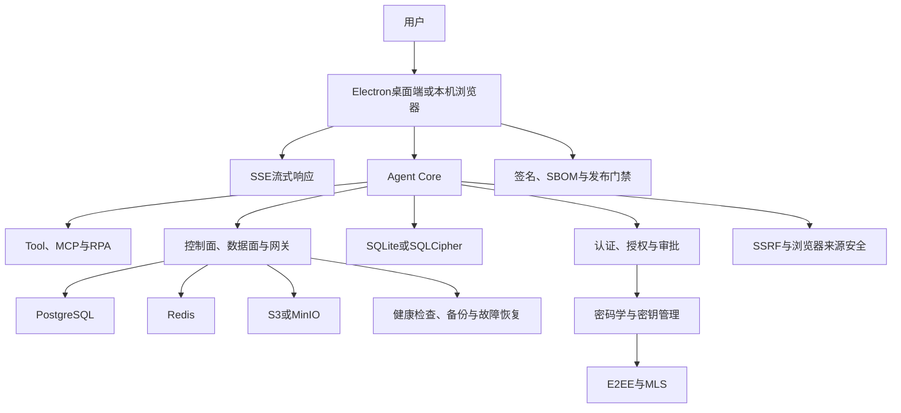

# Otto 使用技术学习地图

> [!summary] 一句话结论
> **Otto 涉及的技术已经拆成独立笔记；初学者不必一次学完，可以按“界面与通信 → Agent 执行 → 数据存储 → 安全身份 → 部署交付”的顺序逐层学习。**

> [!warning] 阅读边界
> 这张地图说明“某项技术是什么，以及它在 Otto 设计中承担什么职责”。一项技术有独立笔记，不等于 Otto 的相关实现已经通过正式制品、生产部署、外部审计或硬件验收。项目状态仍以 [[Otto与Otto USB对比及重点摘要]] 和实际发布证据为准。

## 一、先看全景图

## 二、界面、运行时与通信

| 独立笔记 | 一句话作用 | 在 Otto 中的位置 |
|---|---|---|
| [[Electron桌面应用架构]] | 用 Web 技术制作跨平台桌面应用 | Otto Desktop 的 Main、Preload、Renderer 分层 |
| [[SSE与流式响应]] | 服务器沿一条 HTTP 连接持续向客户端发送事件 | 模型回答逐字出现、进度和状态事件 |
| [[Node.js与pnpm]] | 运行 JavaScript/TypeScript，并管理项目依赖 | Otto USB 固定运行时及部分开发工具链 |
| [[TCP、HTTP、HTTPS与WebSocket]] | 解释网络连接和应用协议怎样传输数据 | Desktop、Server、Edge 与模型服务通信的基础 |

### 初学者要抓住的重点

- Electron 是桌面应用外壳，不是数据库或模型。
- Renderer 负责画界面，不应该直接拥有全部本机权限。
- SSE 主要是服务器到浏览器的单向流；双向长期通信常考虑 WebSocket。
- `127.0.0.1` 是本机回环地址，但“只在本机监听”仍要检查来源、Token 和端口安全。

## 三、Agent、工具与自动化

| 独立笔记 | 一句话作用 | 在 Otto 中的位置 |
|---|---|---|
| [[Prompt Engineering与Loop Engineering]] | 区分设计一次模型输入与设计完整工作循环 | Otto Agent 的循环基础 |
| [[MCP模型上下文协议]] | 用统一协议连接资料、提示和工具 | 外部能力接入方式之一 |
| [[Agent工具运行时：执行流水线、并发调度与Code Mode]] | 管理参数校验、审批、执行、取消和记录 | 模型提出工具调用后的真正执行层 |
| [[RPA、UI Automation与CDP]] | 控制 Windows 界面和 Chromium 页面 | 桌面和网页任务自动化 |
| [[Control Plane、Data Plane、Edge Gateway与Federation]] | 划分管理、业务、模型入口和跨部署协作职责 | Otto 企业架构的关键边界 |
| [[状态机与幂等性]] | 管理合法状态，并避免重试造成重复副作用 | 任务、工具、费用和跨部署消息处理 |

### 初学者要抓住的重点

- 模型只提出候选动作，真正执行由工具运行时、权限和用户批准决定。
- MCP 是连接协议，不会自动解决权限、重试、审计和业务正确性。
- RPA 是业务自动化的大概念，底层可以使用 API、UI Automation、CDP、OCR 或坐标点击。
- 控制面管规则，数据面处理客户业务；两者分开是为了明确权限和数据边界。

## 四、数据库、缓存与对象存储

| 独立笔记 | 一句话作用 | 在 Otto 中的位置 |
|---|---|---|
| [[SQLite、SQLCipher与PostgreSQL]] | 比较本地嵌入式数据库、整库加密和企业数据库 | Desktop 本地数据与 Server 权威数据 |
| [[Redis缓存与分布式协调]] | 保存短期高速状态，并协助限流、租约和队列 | 多实例之间的临时共享状态 |
| [[S3与MinIO对象存储]] | 通过对象方式保存大文件和附件 | 企业附件、备份与导出制品 |

### 为什么不能只用一个数据库

| 数据类型 | 更合适的系统 | 原因 |
|---|---|---|
| 本机离线会话和设置 | SQLite/SQLCipher | 单文件、嵌入应用、可加密 |
| 企业账号、权限、任务和审计 | PostgreSQL | 事务、关系、查询和并发能力更强 |
| 短期会话、限流和租约 | Redis | 内存访问快，适合有过期时间的协调状态 |
| 附件、备份和大型导出 | S3/MinIO | 适合用对象 Key 管理大量二进制文件 |

Redis 不应被误当成所有权威数据的永久数据库；S3 也不擅长像 PostgreSQL 一样做复杂关系查询。

## 五、密码学、密钥、身份与数据外发

| 独立笔记 | 一句话作用 | 在 Otto 中的位置 |
|---|---|---|
| [[密码学基础：AES-GCM、scrypt、Ed25519与SHA-256]] | 区分加密、口令派生、数字签名和哈希 | 保险库、License、清单与完整性验证 |
| [[密钥管理：DEK、KEK、KMS、HSM与信封加密]] | 解释数据密钥怎样生成、包裹、保存、轮换和恢复 | Desktop、Server、备份与发布密钥治理 |
| [[端到端加密E2EE与MLS]] | 让发送端加密、接收端解密，并管理群组密钥 | 私聊和跨部署密文协作候选能力 |
| [[身份认证与授权：ACL、RBAC、MFA、OAuth、OIDC、SAML与SCIM]] | 区分“你是谁”和“你能做什么” | 企业登录、组织角色、设备和权限 |
| [[SSRF、DNS Rebinding与浏览器来源安全]] | 防止服务器或本机服务被诱导访问错误目标 | URL 工具、Edge 上游、本机浏览器工作台 |

### 四个最容易混淆的动作

| 动作 | 回答的问题 | 典型技术 |
|---|---|---|
| 哈希 | 内容有没有变化 | SHA-256 |
| 加密 | 没钥匙的人能不能读正文 | AES-GCM |
| 签名 | 内容是谁签的、有没有被改 | Ed25519、Authenticode |
| 身份认证 | 当前操作者是谁 | 密码、MFA、OIDC、SAML |

> [!important] 加密算法不等于完整安全
> 系统还必须处理密钥存放、轮换、吊销、备份、恢复、权限、日志脱敏和真实攻击面。只写“使用 AES-256”不能证明整个产品已经安全。

## 六、发布、运行与故障恢复

| 独立笔记 | 一句话作用 | 在 Otto 中的位置 |
|---|---|---|
| [[软件供应链：代码签名、SBOM与发布门禁]] | 证明软件来自谁、包含什么、是否满足发布条件 | Windows 签名、制品哈希、组件清单与 Release |
| [[高可用、健康检查与故障恢复]] | 判断服务能否接流量，并在故障后恢复 | Server、数据库、网关、备份和灾难演练 |
| [[Agent评测：上下文成本、轨迹与独立验收]] | 用证据评价正确性、安全、成本和可复现性 | 自动化测试、Agent 轨迹和交付验收 |

### 初学者要抓住的重点

- “代码能运行”与“可正式交付”之间还有构建、签名、SBOM、测试、验收和回滚。
- Liveness、Readiness、Startup 检查回答的问题不同；检查接口返回 200 不代表整个系统业务可用。
- 有备份不等于能恢复，必须定期做真实恢复演练。
- 自动化测试通过不等于已经完成真实 Windows、U 盘、网络、断电和安全审计验收。

## 七、推荐学习顺序

### 第一阶段：先能看懂产品怎样跑起来

1. [[Node.js与pnpm]]
2. [[TCP、HTTP、HTTPS与WebSocket]]
3. [[Electron桌面应用架构]]
4. [[SSE与流式响应]]

### 第二阶段：理解 Agent 为什么不只是聊天

1. [[Prompt Engineering与Loop Engineering]]
2. [[MCP模型上下文协议]]
3. [[Agent工具运行时：执行流水线、并发调度与Code Mode]]
4. [[RPA、UI Automation与CDP]]
5. [[状态机与幂等性]]

### 第三阶段：理解数据放在哪里

1. [[SQLite、SQLCipher与PostgreSQL]]
2. [[Redis缓存与分布式协调]]
3. [[S3与MinIO对象存储]]

### 第四阶段：理解安全边界

1. [[身份认证与授权：ACL、RBAC、MFA、OAuth、OIDC、SAML与SCIM]]
2. [[密码学基础：AES-GCM、scrypt、Ed25519与SHA-256]]
3. [[密钥管理：DEK、KEK、KMS、HSM与信封加密]]
4. [[端到端加密E2EE与MLS]]
5. [[SSRF、DNS Rebinding与浏览器来源安全]]

### 第五阶段：回到完整产品和交付

1. [[Control Plane、Data Plane、Edge Gateway与Federation]]
2. [[软件供应链：代码签名、SBOM与发布门禁]]
3. [[高可用、健康检查与故障恢复]]
4. [[Otto与Otto USB对比及重点摘要]]
5. [[Otto产品总体技术架构]] 或 [[Otto USB便携智能体]]

## 八、怎样使用这张地图

- 只想知道一个术语：直接打开对应独立笔记。
- 想理解 Otto 主产品：从本页依次看 Agent、数据、安全和控制面。
- 想理解 Otto USB：重点看 Node.js、SSE、RPA、密码学、密钥管理和软件供应链。
- 想判断产品是否成熟：重点看高可用、恢复、评测和发布门禁，不要只看技术名词数量。

## 资料来源与核对范围

- 《Otto总体技术说明手册（非技术同事版）_2026-08-21》
- 《Otto USB技术说明手册（非技术同事版）_2026-08-21》
- 各独立概念笔记中的官方规范与官方文档。
- 核对日期：2026-08-21。
- 本地图是学习分类，不是对源码、制品、生产部署或外部审计的独立认证。
